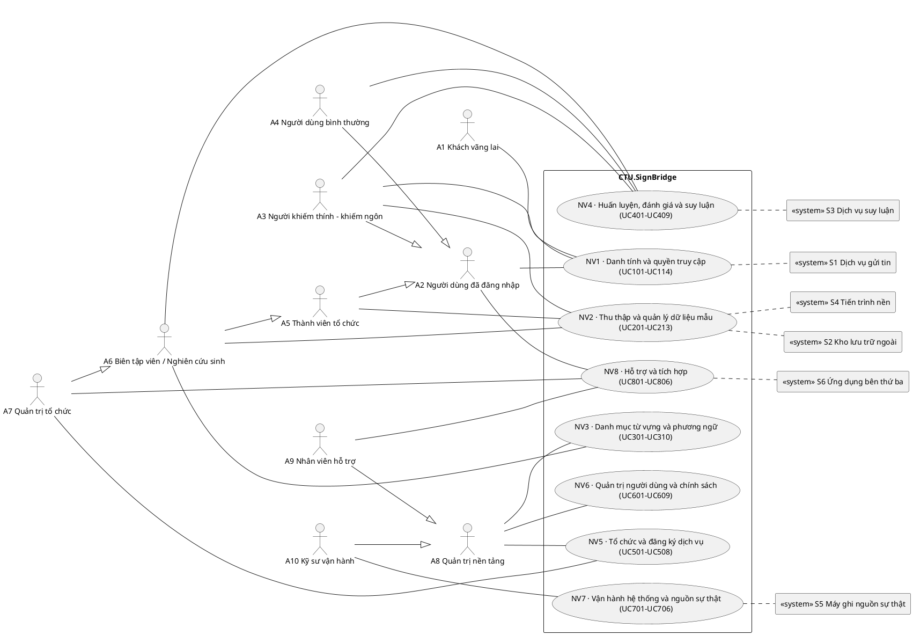
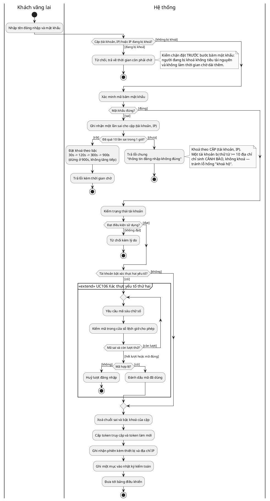
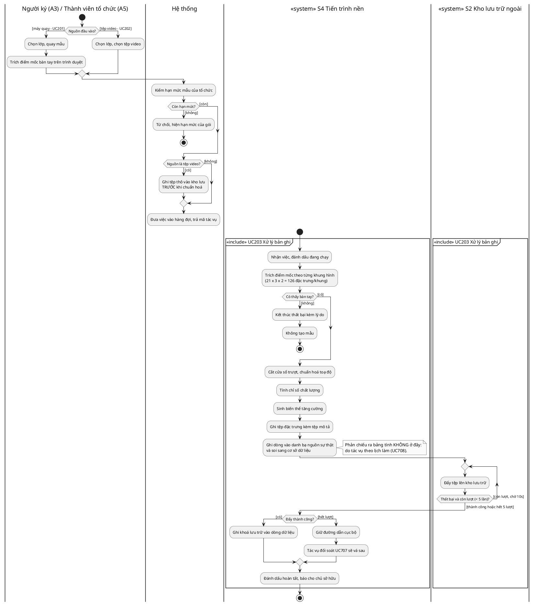

# SƠ ĐỒ UML — ĐẶC TẢ ĐỂ VẼ

*Tệp này là **bản đặc tả để vẽ hình**, không phải một chương của quyển. Mỗi hình
có: mục đích, danh sách bắt buộc phải thể hiện, mô tả chi tiết từng nhánh, bảng
điều kiện canh và giới hạn số lần, mã nguồn PlantUML dựng sẵn, và câu chú thích
đặt dưới hình khi chèn vào quyển.*

**Nguồn số liệu:** `backend/app/rate_limit.py`, `backend/app/worker.py`,
`backend/app/export_tasks.py`, `backend/app/tasks.py`,
`docs/09-specs/USE_CASE_SPECIFICATION.md`. Mọi con số trong tệp này đều đọc từ mã
nguồn đang chạy; không có con số nào là ước lượng.

---

## 1. Quy ước chung — đọc trước khi vẽ

### 1.1 Chuẩn và công cụ

Toàn bộ hình theo **UML 2.5.1**. Hai loại sơ đồ được dùng, và **chỉ hai loại**:

| Loại | Dùng cho | Số hình |
|---|---|---|
| **Use case diagram** | Quan hệ giữa tác nhân và chức năng | 1 (G-1) |
| **Activity diagram** | Diễn tiến xử lý bên trong một hoặc vài use case | 3 (G-2, G-3, G-4) |

Không trộn thêm loại thứ ba. Một quyển dùng ba bốn loại sơ đồ cho cùng một mức
trừu tượng là một quyển bắt người đọc học lại ký hiệu ở mỗi hình.

Công cụ: **draw.io** (vẽ tay theo đặc tả) hoặc **PlantUML** (biên dịch mã nguồn
kèm theo). Nếu nhờ một phiên trò chuyện khác vẽ, hãy đưa nguyên phần "Phải thể
hiện" + "Mô tả chi tiết" + mã PlantUML của hình đó.

### 1.2 Quy ước trắng đen — **bắt buộc**

Hình in trong quyển là **trắng đen**. Vì vậy **không được** dùng màu để phân biệt
bất cứ thứ gì. Phân biệt chỉ bằng **hình dạng**, **kiểu nét** và **nhãn chữ**:

| Cần phân biệt | Cách làm ĐÚNG | Cách làm SAI |
|---|---|---|
| Luồng chính vs luồng ngoại lệ | nét liền vs **nét đứt** | đen vs đỏ |
| Tác nhân người vs tác nhân hệ thống | người que vs **hình chữ nhật có `<<system>>`** | xanh vs xám |
| Hành động tự động | thêm khuôn chữ `<<internal>>` | tô nền |
| Vùng trách nhiệm | **phân làn (swimlane)** có tên | nền màu khác nhau |

Nếu dùng PlantUML, dòng `skinparam monochrome true` đã có sẵn trong mọi mã nguồn
dưới đây — giữ nguyên, đừng gỡ.

### 1.3 Bảng ký hiệu activity diagram

| Ký hiệu | Tên UML | Nghĩa | Vẽ trắng đen |
|---|---|---|---|
| ● | Initial node | Điểm bắt đầu | chấm tròn đặc |
| ◉ | Activity final | Kết thúc **toàn bộ** luồng | tròn đặc trong vòng tròn |
| ⊗ | Flow final | Kết thúc **một nhánh**, luồng khác chạy tiếp | tròn có dấu nhân |
| ▭ (bo góc) | Action | Một bước xử lý | chữ nhật bo góc, nét liền |
| ◇ | Decision / Merge | Rẽ nhánh / nhập nhánh | thoi rỗng |
| ▬ | Fork / Join | Tách / gộp luồng song song | thanh đậm nằm ngang |
| `[điều kiện]` | Guard | Điều kiện trên cung | chữ trong ngoặc vuông |
| ▯ | Object node | Dữ liệu đi qua | chữ nhật vuông góc |
| 📎 | Note | Ghi chú | khung gấp góc, nối nét đứt |

**Mỗi nhánh rẽ phải ghi guard.** Một hình thoi mà cung ra không có `[...]` là một
hình sai, không phải một hình gọn.

### 1.4 Luật vòng lặp — **không có vòng lặp vô hạn**

Đây là luật cứng của toàn bộ tệp này:

> **Mọi vòng lặp phải có một bộ đếm, một giới hạn ghi rõ bằng số, và một nhánh
> thoát dẫn tới nút kết thúc.** Không có ngoại lệ. Một vòng lặp vẽ mũi tên quay
> lại mà không ghi số lần là một sơ đồ nói rằng hệ thống có thể chạy mãi mãi —
> và nếu hệ thống thật đúng như vậy thì đó là lỗi phải sửa trong mã, không phải
> chi tiết được phép giấu trong hình.

Cách vẽ chuẩn cho một vòng lặp có chặn:

```
◇ [còn lượt: lần < N]  ──→ hành động thử lại ──→ (quay về ◇)
◇ [hết lượt: lần = N]  ──→ hành động kết thúc ──→ ◉
```

Ba vòng lặp xuất hiện trong tài liệu này, và cả ba đều có giới hạn thật trong mã:

| Vòng lặp | Giới hạn | Khi hết lượt thì đi đâu | Nguồn |
|---|---|---|---|
| Nhập lại mật khẩu sai | 10 lần miễn phí, sau đó khoá theo bậc 30s → 120s → 300s → **900s và dừng ở đó** | Màn hình báo thời gian còn phải chờ; phiên kết thúc | `rate_limit.py` |
| Nhập lại mã xác thực | hết ngân sách lần thử của mã đó thì mã bị vô hiệu | Buộc yêu cầu mã mới, có thời gian chờ giữa hai lần gửi | `verification.py` |
| Đẩy tệp lên kho ngoài | **tối đa 5 lần**, cách nhau 10 giây | Dòng dữ liệu giữ đường dẫn cục bộ; tác vụ đối soát vá sau (UC707) | `export_tasks.py` |

### 1.5 Quy ước đặt tên trong hình

* Hành động viết ở **thể chủ động, động từ trước**: "Xác minh mã băm mật khẩu",
  không phải "Việc xác minh mật khẩu".
* Tên use case trong hình phải **trùng từng chữ** với tên trong Bảng danh sách
  use case ở Chương 1 §2. Lệch một chữ là người đọc phải tra ngược.
* Mã use case luôn đi kèm tên: `UC105 Đăng nhập`.

---

## 2. HÌNH G-1 — Sơ đồ use case tổng quát

**Tương ứng:** ▣ HÌNH 1-1 của Chương 1.
**Loại:** use case diagram · **Mục đích:** cho thấy toàn cảnh 10 tác nhân người,
6 tác nhân hệ thống và 8 nhóm nghiệp vụ trong **một** khung hệ thống.

### Phải thể hiện

1. **Khung ranh giới hệ thống** (system boundary) bao quanh 8 khối nghiệp vụ, có
   nhãn `CTU.SignBridge`. Tác nhân **nằm ngoài** khung — đây là chỗ hay vẽ sai.
2. **Bên trái:** 10 tác nhân người, xếp theo bốn nhóm từ trên xuống: chưa có danh
   tính (A1) → người dùng cuối (A2, A3, A4) → bên tổ chức (A5, A6, A7) → bên vận
   hành nền tảng (A8, A9, A10).
3. **Bên phải:** 6 tác nhân hệ thống, vẽ bằng **hình chữ nhật** có khuôn chữ
   `<<system>>`, không vẽ người que.
4. **Ba chuỗi kế thừa tác nhân**, mũi tên **tam giác rỗng, nét liền**, hướng từ
   con lên cha:
   * `A3 → A2`, `A4 → A2`, `A5 → A2`, `A6 → A5`, `A7 → A6`
   * `A9 → A8`, `A10 → A8`
   * A1 **không** nối vào chuỗi nào.
5. **A8 phải nằm tách hẳn khỏi nhánh tổ chức** — không có bất kỳ đường nào nối
   A8 với A7. Đây là điểm người đọc phải nhìn ra được từ hình, vì nó là ranh giới
   quyền của cả hệ thống.
6. Mỗi khối nghiệp vụ ghi **tên nghiệp vụ + dải mã**, ví dụ
   `NV1 · Danh tính và quyền truy cập (UC101–UC114)`.

### Sai lầm phải tránh

* Vẽ mũi tên kế thừa từ A7 lên A8 (hoặc ngược lại) — **sai về nghiệp vụ**, xem
  Chương 1 §2.0.
* Vẽ tác nhân hệ thống bằng người que — người đọc sẽ hiểu là có người ngồi đó.
* Nối tác nhân thẳng vào từng use case con ở mức tổng quát — hình sẽ thành một
  búi chỉ. Ở hình tổng quát chỉ nối **tác nhân → khối nghiệp vụ**.

### Mã nguồn PlantUML



**Chú thích dưới hình:** *Hình 1-1: Sơ đồ use case tổng quát — 10 tác nhân người,
6 tác nhân hệ thống và 8 nhóm nghiệp vụ. Quản trị nền tảng (A8) không kế thừa
quản trị tổ chức (A7): hai vòng quyền tách rời nhau.*

---

## 3. HÌNH G-2 — Activity: Đăng nhập và cơ chế chặn leo thang

**Bao phủ:** UC105 Đăng nhập, UC106 Xác thực yếu tố thứ hai (quan hệ «extend»).
**Mục đích:** đây là hình **quan trọng nhất** của quyển về mặt an toàn thông tin.
Nó cho thấy hệ thống chống dò mật khẩu bằng một cơ chế **có giới hạn và tự dừng**,
chứ không phải bằng một vòng lặp "thử lại đến khi được".

### Vì sao hình này đáng vẽ

Ba tính chất của cơ chế, cả ba đều nhìn thấy được từ hình:

1. **Kiểm chặn chạy TRƯỚC khi xác minh mật khẩu.** Người đang bị khoá không bao
   giờ chạy tới bước băm mật khẩu, và cũng không bao giờ chạm vào bước ghi nhận
   lần sai. Hệ quả: **chờ không bao giờ làm thời gian chờ dài thêm** — người dùng
   thật gõ nhầm rồi chờ hết khoá là vào được, không bị phạt chồng.
2. **Khoá theo cặp (tài khoản, địa chỉ IP), không theo tài khoản.** Nếu khoá theo
   tài khoản, kẻ tấn công chỉ cần gõ sai vài lần là **khoá hộ** tài khoản của
   người khác. Đây là lý do nhánh "một tài khoản bị đánh từ nhiều địa chỉ" chỉ
   **cảnh báo**, không khoá.
3. **Bậc chờ có trần.** 30s → 120s → 300s → 900s rồi **dừng ở 900s**, không tăng
   tiếp. Vòng lặp bị chặn cả về số bậc lẫn về thời gian.

### Bảng điều kiện canh và giới hạn

| Điều kiện | Ngưỡng | Hành vi | Ghi trong hình |
|---|---|---|---|
| Cặp (tài khoản, IP) đang trong thời gian khoá | — | Từ chối ngay, báo thời gian còn lại | guard `[đang bị khoá]` |
| Số lần sai của cặp trong 1 giờ | ≤ 10 | Không phạt | `[lần sai ≤ 10]` |
| Số lần sai của cặp, từ lần 11 | bậc 1→4 | Khoá 30s, 120s, 300s, **900s (trần)** | `[lần sai > 10]` |
| Số lần sai của một IP trong 10 phút | ≥ 1000 | **Khoá IP 600 giây** | `[≥ 1000 lần / 10 phút]` |
| Một IP thử ≥ 50 tài khoản khác nhau | ≥ 50 | **Chỉ cảnh báo** (dò rải mật khẩu) | ghi chú, không phải nhánh chặn |
| Một tài khoản bị thử từ ≥ 10 IP | ≥ 10 | **Chỉ cảnh báo** (tấn công phân tán) | ghi chú, không phải nhánh chặn |
| Đăng nhập thành công | — | **Xoá sạch** chuỗi sai và bậc khoá của cặp | hành động `Xoá chuỗi sai` |

### Mô tả chi tiết luồng

**Phân làn:** `Khách vãng lai` | `Hệ thống` | `<<system>> Dịch vụ gửi tin`.

1. **Bắt đầu** ở làn Khách: *Nhập tên đăng nhập và mật khẩu*.
2. Làn Hệ thống, quyết định đầu tiên: *Cặp (tài khoản, IP) hoặc IP đang bị khoá?*
   * `[đang bị khoá]` → *Từ chối, trả về thời gian còn phải chờ* → **kết thúc**.
     Nhánh này **không** ghi nhận thêm lần sai — đó chính là tính chất (1).
   * `[không bị khoá]` → đi tiếp.
3. *Xác minh mã băm mật khẩu.*
4. Quyết định: *Mật khẩu đúng?*
   * `[sai]` → *Ghi nhận một lần sai cho cặp* → quyết định *Đã quá 10 lần sai
     trong 1 giờ?*
     * `[chưa]` → *Trả lỗi chung "thông tin đăng nhập không đúng"* → **kết thúc
       nhánh**. Người dùng có thể thử lại — và đây là chỗ vòng lặp bị chặn bởi
       chính bộ đếm, không phải bởi thiện chí.
     * `[rồi]` → *Đặt khoá theo bậc (30s → 120s → 300s → 900s, dừng ở 900s)* →
       *Trả lỗi kèm thời gian chờ* → **kết thúc**.
   * `[đúng]` → đi tiếp.
5. *Kiểm trạng thái tài khoản* (đang hoạt động, không bị khoá quản trị, đã chấp
   thuận văn bản đang hiệu lực, gói dịch vụ không khoá cứng).
   * `[không đạt]` → *Từ chối kèm lý do* → **kết thúc**.
6. Quyết định: *Tài khoản có bật xác thực hai yếu tố?*
   * `[có]` → **vào vùng UC106** (vẽ bằng khung nét đứt có nhãn
     `<<extend>> UC106`): *Yêu cầu mã sáu chữ số* → *Kiểm mã trong cửa sổ lệch
     giờ cho phép* → *Đánh dấu mã đã dùng để không dùng lại được trong chính cửa
     sổ của nó*.
     * `[mã sai và còn lượt]` → quay lại *Yêu cầu mã sáu chữ số* — **vòng lặp có
       chặn**, ghi rõ `[còn lượt thử]` trên cung quay lại.
     * `[hết lượt]` → *Huỷ lượt đăng nhập* → **kết thúc**.
     * `[dùng mã khôi phục]` → *Tiêu vĩnh viễn mã khôi phục đó, báo số còn lại*.
   * `[không]` → đi thẳng.
7. *Xoá chuỗi sai và bậc khoá của cặp* — tính chất (3): thành công đưa về trạng
   thái sạch.
8. *Cấp token truy cập và token làm mới, ghi nhận phiên kèm thiết bị và IP*.
9. *Ghi một mục vào nhật ký kiểm toán*.
10. *Đưa tới bảng điều khiển* → **kết thúc toàn bộ**.

**Hai ghi chú (note) phải có trong hình**, nối nét đứt vào hình thoi tương ứng:

> 📎 *Kiểm chặn đặt trước bước băm mật khẩu, nên người đang bị khoá không tiêu
> tài nguyên máy chủ và không làm thời gian chờ của chính mình dài thêm.*

> 📎 *Khoá theo cặp (tài khoản, IP). Một tài khoản bị thử từ nhiều địa chỉ chỉ
> sinh cảnh báo, không bị khoá — khoá ở đó chính là lỗ hổng "khoá hộ" mà cơ chế
> theo cặp tồn tại để bịt.*

### Mã nguồn PlantUML



**Chú thích dưới hình:** *Hình 1-x: Sơ đồ hoạt động của chức năng Đăng nhập
(UC105) và phần mở rộng Xác thực yếu tố thứ hai (UC106). Cơ chế chặn dò mật khẩu
có bậc chờ tăng dần và có trần: 30s, 120s, 300s, 900s; kiểm chặn đặt trước bước
xác minh mật khẩu.*

---

## 4. HÌNH G-3 — Activity: Thu mẫu và xử lý bất đồng bộ

**Bao phủ:** UC201 Thu mẫu bằng máy quay, UC202 Tải tệp video, UC203 Xử lý bản
ghi (quan hệ «include»), UC204 Theo dõi trạng thái tác vụ.
**Mục đích:** cho thấy **quan hệ «include» hoạt động thế nào trong thực tế**, và
cho thấy đường ranh giới giữa việc người dùng làm và việc hệ thống tự làm.

### Vì sao hình này đáng vẽ

Nó trả lời câu hỏi mà bảng đặc tả không trả lời được: *vì sao mẫu vừa quay xong
lại chưa dùng huấn luyện được ngay?* Câu trả lời nằm ở chỗ hai use case người
dùng (UC201, UC202) đều **gọi vào** một use case do hệ thống khởi phát (UC203),
và use case đó chạy **bất đồng bộ** trong một làn khác.

### Phải thể hiện

1. **Bốn làn:** `Người ký (A3)` | `Hệ thống` | `<<system>> S4 Tiến trình nền` |
   `<<system>> S2 Kho lưu trữ ngoài`.
2. **Hai điểm vào hợp lưu:** nhánh máy quay và nhánh tải video gặp nhau tại một
   **hình thoi nhập nhánh (merge)** trước khi vào UC203. Đây là hình ảnh trực
   quan của khái quát hoá *Thu nhận mẫu*.
3. **Khung nét đứt** bao phần chạy trong làn S4, nhãn `<<include>> UC203 Xử lý
   bản ghi`.
4. **Ranh giới bất đồng bộ:** sau khi hệ thống nhận việc, nó **trả ngay** mã tác
   vụ cho người dùng (nhánh này kết thúc bằng **flow final ⊗**, không phải
   activity final), trong khi làn S4 chạy tiếp. Vẽ sai chỗ này là mô tả hệ thống
   thành đồng bộ.
5. **Vòng lặp đẩy tệp có chặn:** tối đa **5 lần**, cách nhau **10 giây**; hết
   lượt thì đi tới hành động *Giữ đường dẫn cục bộ, chờ tác vụ đối soát vá* rồi
   kết thúc. **Không** vẽ mũi tên quay lại vô hạn.
6. **Nhánh thất bại có lý do:** `[không thấy bàn tay trong toàn bộ cửa sổ]` →
   *Kết thúc tác vụ ở trạng thái thất bại kèm lý do; không tạo mẫu*.

### Bảng điều kiện canh và giới hạn

| Bước | Điều kiện | Giới hạn | Khi vượt |
|---|---|---|---|
| Kiểm hạn mức | `[còn hạn mức mẫu]` | theo gói dịch vụ | Từ chối, hiện hạn mức đã chạm |
| Trích điểm mốc | `[thấy bàn tay]` | — | Thất bại kèm lý do, không tạo mẫu |
| Cửa sổ trượt | độ dài cố định | — | Ngắn hơn thì đệm thêm và **ghi vào chỉ số chất lượng**, không âm thầm bỏ |
| Đẩy tệp lên kho | `[còn lượt]` | **≤ 5 lần, cách 10s** | Giữ đường dẫn cục bộ; UC707 đối soát vá sau |

### Mô tả chi tiết luồng

1. Làn Người ký, **hai điểm bắt đầu song song** (vẽ hai initial node riêng, đây
   là hai use case khác nhau):
   * *Chọn lớp, quay mẫu trước máy quay* (UC201) — điểm mốc bàn tay được trích
     **ngay trên trình duyệt**.
   * *Chọn lớp, chọn tệp video và tải lên* (UC202).
2. Làn Hệ thống: *Kiểm hạn mức mẫu của tổ chức*.
   * `[hết hạn mức]` → *Từ chối kèm hạn mức của gói* → kết thúc.
3. Với nhánh tải video: *Ghi tệp thô vào kho lưu trước khi chuẩn hoá bất cứ thứ
   gì* — thứ tự này phải nhìn thấy được trong hình, vì nó là điều kiện để không
   mất bản gốc khi bước xử lý có lỗi.
4. **Merge** hai nhánh → *Đưa việc vào hàng đợi, trả mã tác vụ* → nhánh người
   dùng kết thúc bằng **⊗**; người dùng theo dõi tiến độ qua UC204.
5. Làn S4, trong khung `<<include>> UC203`:
   1. *Nhận việc, đánh dấu đang chạy.*
   2. *Trích điểm mốc bàn tay theo từng khung hình* — 21 điểm × 3 toạ độ × 2 bàn
      tay = **126 đặc trưng mỗi khung**.
      * `[không thấy bàn tay]` → *Thất bại kèm lý do; không tạo mẫu* → kết thúc.
   3. *Cắt cửa sổ trượt độ dài cố định và chuẩn hoá không gian toạ độ.*
   4. *Tính chỉ số chất lượng (độ đầy đủ, độ rung).*
   5. *Sinh các biến thể tăng cường.*
   6. *Ghi tệp đặc trưng kèm tệp mô tả đi kèm* — để dựng lại được dòng dữ liệu từ
      chính tệp.
   7. *Ghi một dòng vào danh bạ nguồn sự thật và soi sang cơ sở dữ liệu.*
      📎 *Bản phản chiếu ra bảng tính không nằm ở đây: nó do một tác vụ theo lịch
      làm, nên mẫu được ghi nhận trước khi xuất hiện trên bảng tính.*
   8. **Vòng lặp có chặn:** *Đẩy tệp sang kho lưu trữ ngoài*
      * `[thành công]` → *Ghi khoá lưu trữ vào dòng dữ liệu*.
      * `[thất bại và còn lượt (< 5)]` → *Chờ 10 giây* → quay lại bước đẩy.
      * `[hết 5 lượt]` → *Giữ đường dẫn cục bộ; tác vụ đối soát sẽ vá* (UC707).
   9. *Đánh dấu tác vụ hoàn tất và báo cho chủ sở hữu* → **kết thúc toàn bộ**.

### Mã nguồn PlantUML



**Chú thích dưới hình:** *Hình 1-y: Sơ đồ hoạt động của đường thu mẫu — hai use
case người dùng (UC201, UC202) cùng gọi use case xử lý bất đồng bộ UC203. Vòng
lặp đẩy tệp lên kho lưu trữ giới hạn 5 lần, hết lượt thì chuyển sang cơ chế đối
soát.*

---

## 5. HÌNH G-4 — Activity: Vòng đời đăng ký dịch vụ *(tuỳ chọn)*

**Bao phủ:** UC506 Quản lý đăng ký dịch vụ, và tác vụ quét theo lịch.
**Vẽ nếu:** quyển cần một hình cho phần SaaS ở Chương 3. Nếu thời gian gấp, bỏ
hình này trước tiên — hai hình G-2 và G-3 đã đủ để nói hết về ký hiệu và quan hệ.

### Phải thể hiện

Chuỗi trạng thái **có mốc thời gian rõ ràng**, không có vòng lặp:

`Đang hoạt động` → `[còn N ngày]` *Gửi thư nhắc* → `[đến hạn]` → nhánh:
* `[bật tự động gia hạn]` → *Mở kỳ mới* → quay về Đang hoạt động (**vòng lặp
  hợp lệ vì mỗi vòng là một kỳ hạn, và mỗi vòng đều có mốc thời gian dừng**);
* `[không gia hạn]` → `Quá hạn` → *Vẫn cho ghi trong thời gian ân hạn* →
  `[hết ân hạn]` → `Khoá mềm: chặn ghi, vẫn cho đọc và xuất dữ liệu` → kết thúc.

**Điểm phải nhấn:** khoá mềm **không** chặn đọc và **không** chặn xuất dữ liệu —
tổ chức luôn lấy lại được dữ liệu của mình. Nếu hình vẽ thành chặn hết thì đó là
mô tả sai một quyết định thiết kế có chủ ý.

---

## 6. Bảng ánh xạ hình ↔ use case ↔ vị trí trong quyển

| Hình | Loại | Bao phủ use case | Đặt ở |
|---|---|---|---|
| G-1 | Use case diagram | Toàn bộ 75 UC (mức nhóm) | Chương 1 §2, thay ▣ HÌNH 1-1 |
| G-2 | Activity diagram | UC105, UC106 | Chương 1 §2.1 hoặc Chương 3 phần an toàn |
| G-3 | Activity diagram | UC201, UC202, UC203, UC204 | Chương 1 §2.2 hoặc Chương 3 phần đường thu |
| G-4 | Activity diagram | UC506 | Chương 3 phần SaaS *(tuỳ chọn)* |

---

## 7. Danh sách kiểm trước khi nộp hình

- [ ] Hình in ra **trắng đen** vẫn đọc được: không có thông tin nào chỉ nằm ở màu.
- [ ] **Mọi** cung ra khỏi hình thoi đều có guard `[...]`.
- [ ] **Mọi** vòng lặp đều ghi số lần giới hạn và có nhánh thoát tới nút kết thúc.
- [ ] Tác nhân nằm **ngoài** khung ranh giới hệ thống.
- [ ] Tác nhân hệ thống vẽ bằng hình chữ nhật `<<system>>`, không phải người que.
- [ ] Mũi tên kế thừa là **tam giác rỗng nét liền**, hướng từ con lên cha.
- [ ] Không có đường nào nối A8 với A7.
- [ ] Tên use case trong hình trùng từng chữ với bảng danh sách ở Chương 1 §2.
- [ ] Mỗi hình có đúng một câu chú thích, đánh số theo chương.
- [ ] Nhánh bất đồng bộ kết thúc bằng **flow final ⊗**, nhánh cuối cùng của cả
      hoạt động mới dùng **activity final ◉**.
