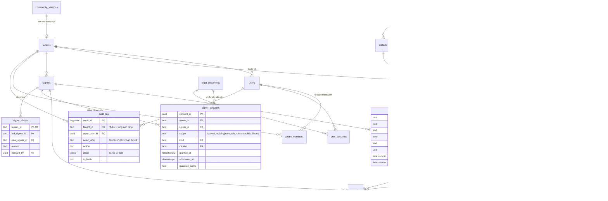

# Lược đồ SaaS đa tenant — thiết kế, kèm mã backend phải đổi theo

**Ngày:** 2026-08-07 · **Đọc từ:** lược đồ thật của `signdb` (26 bảng, 13 bảng có RLS
thực thi, 3.860 mẫu, 10 tài khoản, 1 tenant).

Mỗi mục dưới đây có ba phần: **DDL**, **vì sao**, và **backend phải đổi**. Phần thứ ba là
phần hay bị bỏ sót — một thay đổi lược đồ không kèm danh sách mã bị ảnh hưởng là một thay
đổi sẽ hỏng lúc chạy chứ không hỏng lúc review.

Ký hiệu: 🔴 chặn (không có thì không thể có tenant thứ hai) · 🟡 nền tảng · ⚪ thiết kế cho
sách, chưa xây.

---

## 0. Ba ràng buộc đang chặn tenant thứ hai

Đây không phải ý kiến kiến trúc — là ba thứ đang nằm trong cơ sở dữ liệu đang chạy.

### 0.1 🔴 Email duy nhất TOÀN CỤC, không phải theo tenant

```
"users_email_key"        UNIQUE, btree (email)            ← toàn cục, đang thắng
"uq_users_tenant_email"  UNIQUE, btree (tenant_id, email) ← theo tenant, vô tác dụng
```

Hai ràng buộc cùng tồn tại. Cái toàn cục nghiêm ngặt hơn nên cái theo tenant không bao giờ
có cơ hội cho phép thêm gì. Hệ quả: một giảng viên cộng tác với hai trường **không thể** có
mặt ở cả hai.

Sự tồn tại của `uq_users_tenant_email` cho thấy ý định đúng đã có; ràng buộc cũ chỉ chưa bị
gỡ.

### 0.2 🔴 Ba thẩm quyền vai trò song song

| Nơi | Kiểu | Thực tế | Ai đọc |
|---|---|---|---|
| `users.is_admin` | boolean | 10 dòng | `require_admin` |
| `users.role_id` → `roles` | FK | 5/10 dòng có giá trị | gần như không ai |
| `tenant_members.role` | text tự do | **0 dòng** | `tenant_role()` |

Bảng được đọc để phân quyền tenant thì rỗng. Mọi thứ rơi về `is_admin` — một cờ nhị phân
không biết tenant là gì.

### 0.3 🔴 `tenant_members` rỗng; `users.tenant_id` mới là sự thật

Bảng nối có khoá chính hợp, có chỉ mục bộ phận cho quản trị viên, và không có dòng nào.
Thành viên thật nằm ở `users.tenant_id NOT NULL` — quan hệ **một-nhiều**: một tài khoản,
đúng một tenant, vĩnh viễn.

Đây là lý do `tenant_role()` trả `NULL` cho mọi người. Lỗi 403 mà suite bắt được hôm nay chỉ
lộ ra khi bật RLS; trước đó nó trả "không phải thành viên" vì bảng rỗng, chứ không phải vì
policy.

---

## 1. Quyết định nền tảng: tài khoản thuộc về người, không thuộc về trường

Hai mô hình, và hệ thống đang nằm lưng chừng — đó là nguồn gốc cả ba khiếm khuyết trên.

**Chọn A — tài khoản toàn cục, thành viên nhiều-nhiều.** Một email = một tài khoản; gia nhập
nhiều tenant qua `tenant_members`; phiên mang theo *tenant đang hoạt động*, đổi được mà không
đăng nhập lại.

Vì sao không chọn B (tài khoản riêng từng tenant, chỉ cần `DROP CONSTRAINT`): đặt lại mật
khẩu trở nên mơ hồ (email nào, tenant nào?), một người nhớ nhiều mật khẩu cho cùng địa chỉ,
và **không bao giờ trả lời được "người này đóng góp bao nhiêu mẫu" xuyên trường** — vốn là
câu hỏi nghiên cứu của chính luận văn.

**Điều A không giải quyết:** nó không làm RLS mạnh hơn, nó *dịch chuyển* ranh giới. Cái được
bảo vệ chuyển từ `users` sang `tenant_members`. Sau khi đổi, một truy vấn quên đặt scope sẽ
thấy **mọi tài khoản trên nền tảng**. Nên mọi đường liệt kê người dùng phải đi qua
`tenant_members`, và điều đó cần một test ghim, không phải một quy ước.

### DDL

```sql
BEGIN;

-- Gỡ ràng buộc toàn cục. Cái theo tenant đã tồn tại và sẽ tự có hiệu lực.
ALTER TABLE users DROP CONSTRAINT IF EXISTS users_email_key;
ALTER TABLE users DROP CONSTRAINT IF EXISTS users_phone_number_key;

-- Số điện thoại: duy nhất theo tenant, và chỉ khi có giá trị.
CREATE UNIQUE INDEX IF NOT EXISTS uq_users_tenant_phone
  ON users (tenant_id, phone_number) WHERE phone_number IS NOT NULL;

-- tenant_id trở thành "tenant nhà" — một TUỲ CHỌN hiển thị, không phải quyền.
-- Giữ tên cột để không phải sửa 40 chỗ; đổi ý nghĩa và nới NOT NULL.
ALTER TABLE users ALTER COLUMN tenant_id DROP NOT NULL;
COMMENT ON COLUMN users.tenant_id IS
  'Tenant nhà: tenant mở mặc định khi đăng nhập. KHÔNG phải quyền — '
  'quyền đến từ tenant_members. NULL = hỏi người dùng chọn.';

-- Đổ dữ liệu hiện có vào bảng nối. Idempotent.
INSERT INTO tenant_members (tenant_id, user_id, role)
SELECT u.tenant_id, u.id,
       CASE WHEN u.is_admin THEN 'admin' ELSE 'contributor' END
FROM users u
WHERE u.tenant_id IS NOT NULL
ON CONFLICT (tenant_id, user_id) DO NOTHING;

COMMIT;
```

### Backend phải đổi

| File | Hàm | Đổi gì |
|---|---|---|
| `app/auth.py` | `_fetch_user_by_login` | `WHERE lower(email)=%s` giờ có thể trả **nhiều dòng** nếu B; với A vẫn một dòng — nhưng bỏ `LIMIT 1` ngầm định là sai, phải khẳng định duy nhất |
| `app/auth.py` | `create_user` | `tenant_id` không còn quyết định quyền; phải `INSERT INTO tenant_members` trong **cùng giao dịch**, nếu không tài khoản mới không có quyền gì |
| `app/tenant_middleware.py` | `_tenant_of_user` | Hiện đọc `users.tenant_id`. Phải đổi sang: tenant từ phiên (`sessions.active_tenant_id`), rơi về `home_tenant`, rồi rơi về "tenant duy nhất mà người này là thành viên" |
| `app/vocabulary_registry.py` | `tenant_role` | Không đổi mã — nhưng giờ mới thật sự trả về giá trị. Test hiện có sẽ đổi hành vi |
| `app/routers/tenants.py` | `require_tenant_admin` | Không đổi mã; hiệu lực đổi hoàn toàn vì `tenant_role` hết rỗng |
| `app/tenant_admin.py` | `_assert_not_last_admin` | Hiện đếm trên bảng rỗng nên **không bao giờ chặn**. Sau khi đổ dữ liệu nó mới thật sự bảo vệ |
| `backend/tests/` | `test_tenant_lifecycle.py` | Các test dựa vào `tenant_members` rỗng sẽ đỏ — đó là tín hiệu đúng |

> **Bẫy:** `_assert_not_last_admin` đang xanh vì lý do sai. Sau khi đổ dữ liệu, thao tác gỡ
> quản trị viên cuối cùng sẽ bắt đầu bị từ chối — với người vận hành, điều đó trông như một
> hồi quy chứ không như một biện pháp bảo vệ vừa bắt đầu hoạt động.

---

## 2. 🟡 Phiên đăng nhập, cookie, thiết bị

Bạn hỏi về cookie. `refresh_tokens` hiện có đúng 5 cột và không cột nào cho biết *ai*, *ở
đâu*, *lần cuối khi nào*. Nghĩa là không có "các thiết bị đang đăng nhập", không có "đăng
xuất mọi nơi khác", và **không phát hiện được token bị đánh cắp đem dùng lại** — đúng ba
khoảng trống đã ghi trong `docs/03-security/AUTH_TOKEN_LIFECYCLE.md`.

```sql
CREATE TABLE IF NOT EXISTS sessions (
    session_id        uuid PRIMARY KEY DEFAULT gen_random_uuid(),
    user_id           uuid NOT NULL REFERENCES users(id) ON DELETE CASCADE,

    -- Tenant đang mở. Đổi tenant = UPDATE cột này, KHÔNG cần đăng nhập lại.
    active_tenant_id  text REFERENCES tenants(tenant_id) ON DELETE SET NULL,

    -- Một họ = một chuỗi làm mới nối tiếp nhau. Xem ghi chú bên dưới.
    family_id         uuid NOT NULL,

    refresh_hash      text NOT NULL UNIQUE,
    issued_at         timestamptz NOT NULL DEFAULT now(),
    expires_at        timestamptz NOT NULL,
    last_seen_at      timestamptz,
    revoked_at        timestamptz,
    revoked_reason    text,          -- logout | rotated | reuse_detected | admin | expired

    ip_hash           text,          -- BĂM kèm muối, không phải IP thô
    user_agent        text,
    device_label      text           -- "Chrome trên Windows"
);

CREATE INDEX IF NOT EXISTS idx_sessions_user_live
  ON sessions (user_id) WHERE revoked_at IS NULL;
CREATE INDEX IF NOT EXISTS idx_sessions_family ON sessions (family_id);
```

**`family_id` là thứ khiến phát hiện dùng lại khả thi.** Mỗi lần làm mới sinh một dòng mới
cùng `family_id` và thu hồi dòng cũ (`revoked_reason='rotated'`). Nếu một token **đã thu
hồi** quay lại, nghĩa là hai bên cùng giữ nó — bản gốc và kẻ sao chép. Phản ứng đúng là giết
**cả họ**, không chỉ dòng đó: không biết bên nào là kẻ trộm.

**`ip_hash` chứ không phải `ip`.** IP là dữ liệu cá nhân. Bạn cần nó để trả lời "phiên này có
bất thường không" — câu hỏi đó chỉ cần *so sánh*, không cần đọc lại giá trị gốc. Băm kèm muối
theo tài khoản giữ khả năng so sánh, bỏ khả năng truy ngược.

### Điều bảng này KHÔNG sửa được

Access token là JWT tự chứng thực, nên đăng xuất **không giết được nó** cho tới khi hết hạn.
Bảng phiên chỉ chặn việc *làm mới*. Muốn thu hồi tức thì: hoặc giảm tuổi thọ access token
xuống ~5 phút và chịu nhiều lượt làm mới hơn, hoặc kiểm danh sách thu hồi mỗi request và mất
tính tự chứng thực. Đây là đánh đổi phải chọn có ý thức, không phải lỗi.

`ACCESS_TOKEN_EXPIRE_MINUTES` hiện là **60**. Với thu hồi qua bảng phiên, 60 phút nghĩa là
một phiên bị đánh cắp còn sống tối đa một tiếng sau khi nạn nhân bấm đăng xuất.

### Backend phải đổi

| File | Đổi gì |
|---|---|
| `app/auth.py` | `create_refresh_token` → tạo dòng `sessions` với `family_id` mới; `verify_refresh_token` → tra `refresh_hash`, kiểm `revoked_at`, nếu đã thu hồi thì **giết cả `family_id`** |
| `app/cookie_auth.py` | `set_auth_cookies` nhận thêm `session_id` để client hiển thị được thiết bị hiện tại |
| `app/routers/auth.py` | `/refresh` xoay vòng: chèn dòng mới, đánh dấu dòng cũ `rotated`, trả cookie mới. `/logout` đặt `revoked_reason='logout'` |
| `app/routers/auth.py` | **Endpoint mới** `GET /auth/sessions`, `DELETE /auth/sessions/{id}`, `DELETE /auth/sessions` (mọi nơi khác) |
| `app/auth.py` | `set_password_and_revoke_sessions` → chuyển sang `UPDATE sessions SET revoked_at=now(), revoked_reason='password_reset'` |
| `app/rate_limit.py` | `client_ip` đã có; thêm `hash_ip(ip, user_id)` để không lưu IP thô |
| **Di trú** | Chạy song song: đọc cả `refresh_tokens` lẫn `sessions` trong một giai đoạn, chỉ ghi vào `sessions`. Bỏ bảng cũ sau khi mọi phiên cũ hết hạn (90 phút) |

> **Bẫy đua nhiều tab** (đã ghi trong `AUTH_TOKEN_LIFECYCLE.md`): hai tab cùng làm mới trong
> vài mili giây sẽ khiến tab thứ hai trình một token vừa bị xoay vòng — và bị coi là *dùng
> lại*, đá oan cả họ. Cách chữa: cho token vừa xoay vòng một **thời gian ân hạn** (10–30
> giây) trong đó việc trình lại chỉ trả về token mới nhất của họ thay vì giết họ. Điều kiện:
> `revoked_reason='rotated'` **và** `revoked_at > now() - interval '30 seconds'`.

---

## 3. 🟡 Phân quyền: một thẩm quyền duy nhất, cộng nhóm người dùng

```sql
-- Vai trò: tenant_id NULL = vai trò dựng sẵn dùng chung; có giá trị = vai trò riêng của trường
CREATE TABLE IF NOT EXISTS roles_v2 (
    role_id      uuid PRIMARY KEY DEFAULT gen_random_uuid(),
    tenant_id    text REFERENCES tenants(tenant_id) ON DELETE CASCADE,
    code         text NOT NULL,
    display_name text NOT NULL,
    is_builtin   boolean NOT NULL DEFAULT false
);
-- Hai trường đặt trùng tên vai trò không được đụng nhau; coalesce vì NULL không so sánh được
CREATE UNIQUE INDEX IF NOT EXISTS uq_roles_scope_code
  ON roles_v2 (coalesce(tenant_id, ''), code);

CREATE TABLE IF NOT EXISTS permissions (
    code        text PRIMARY KEY,          -- 'sample.create', 'class.delete', 'member.invite'
    description text NOT NULL
);

CREATE TABLE IF NOT EXISTS role_permissions (
    role_id         uuid REFERENCES roles_v2(role_id) ON DELETE CASCADE,
    permission_code text REFERENCES permissions(code) ON DELETE CASCADE,
    PRIMARY KEY (role_id, permission_code)
);

-- tenant_members: role text -> role_id FK
ALTER TABLE tenant_members ADD COLUMN IF NOT EXISTS role_id uuid REFERENCES roles_v2(role_id);
ALTER TABLE tenant_members ADD COLUMN IF NOT EXISTS status text NOT NULL DEFAULT 'active';
ALTER TABLE tenant_members ADD COLUMN IF NOT EXISTS invited_by uuid REFERENCES users(id) ON DELETE SET NULL;

-- Nhóm người dùng — thứ bạn hỏi, hiện chưa có gì tương đương
CREATE TABLE IF NOT EXISTS teams (
    team_id   uuid PRIMARY KEY DEFAULT gen_random_uuid(),
    tenant_id text NOT NULL REFERENCES tenants(tenant_id) ON DELETE RESTRICT,
    name      text NOT NULL,
    purpose   text,                        -- lớp học | nhóm thu thập | ca trực | đợt khảo sát
    created_at timestamptz NOT NULL DEFAULT now(),
    deleted_at timestamptz
);
CREATE UNIQUE INDEX IF NOT EXISTS uq_teams_tenant_name
  ON teams (tenant_id, lower(name)) WHERE deleted_at IS NULL;

CREATE TABLE IF NOT EXISTS team_members (
    team_id   uuid REFERENCES teams(team_id) ON DELETE CASCADE,
    user_id   uuid REFERENCES users(id) ON DELETE CASCADE,
    tenant_id text NOT NULL,               -- lặp lại để RLS lọc được mà không phải join
    PRIMARY KEY (team_id, user_id)
);
```

**Nhóm KHÔNG cấp quyền.** Quyền đến từ vai trò; nhóm dùng để *phân công* và *báo cáo*. Trộn
hai thứ này là cách RBAC biến thành mê cung sau sáu tháng — khi đó câu hỏi "vì sao người này
xoá được lớp kia" không còn trả lời được bằng một truy vấn.

`team_members.tenant_id` lặp lại có chủ ý: policy RLS phải lọc được bằng một cột của chính
bảng, không phải bằng một phép join tới `teams` — nếu không, policy trên `team_members` sẽ
phụ thuộc vào policy trên `teams` và thứ tự đánh giá trở nên khó lập luận.

### Vai trò dựng sẵn đề xuất

| Vai trò | Làm được | Không làm được |
|---|---|---|
| `owner` | Mọi thứ trong tenant, kể cả xoá tenant | Chạm tenant khác |
| `admin` | Mời người, sửa danh mục, huấn luyện | Xoá tenant, đổi gói |
| `editor` | Thu mẫu, sửa nhãn của mình | Mời người, xoá lớp |
| `contributor` | Thu mẫu | Sửa danh mục |
| `viewer` | Xem, xuất dữ liệu | Ghi bất cứ thứ gì |

### Backend phải đổi

| File | Đổi gì |
|---|---|
| `app/vocabulary_registry.py` | `tenant_role` → trả `role_id` + tập quyền; thêm `has_permission(tenant, user, code)` |
| `app/vocabulary_registry.py` | `can_edit_registry` / `EDITOR_ROLES` → thay so-sánh-chuỗi bằng tra quyền |
| `app/routers/tenants.py` | `require_tenant_admin` → `require_permission('member.invite')` |
| `app/auth.py` | `require_admin` giữ nguyên nhưng đổi nghĩa: **chỉ** là người vận hành nền tảng, không còn là "quản trị mọi tenant" |
| `app/tenant_admin.py` | `TENANT_ADMIN_ROLES` (tập chuỗi) → tra `role_permissions` |
| `app/storage/rls.py` | `RLS_TABLES` += `teams`, `team_members`, `roles_v2` (chỉ dòng có `tenant_id`) |
| `app/storage/metadata_db.py` | `TENANT_SCOPED_TABLES` += ba bảng trên — **hai danh sách này đã có test khẳng định bằng nhau** |

> **`roles_v2.tenant_id` có thể NULL nhưng bảng lại nằm trong `RLS_TABLES`.** Policy hiện tại
> so `tenant_id = current_setting(...)`, và `NULL = 'x'` là NULL, không phải TRUE — nên vai
> trò dựng sẵn sẽ **vô hình với mọi tenant**. Phải nới vị từ cho riêng bảng này:
> `tenant_id IS NULL OR tenant_id = current_setting(...)`. Đây là ngoại lệ đầu tiên của
> `_policy_predicate()` dùng chung, và nó cần một hàm riêng chứ không phải một tham số —
> tham số hoá sẽ khiến người sau vô tình nới cho bảng dữ liệu thật.

---

## 4. 🟡 Vòng đời tenant và gói dịch vụ

`is_active boolean` hiện tại không đủ. Một tenant có ít nhất năm trạng thái khác nhau về hành
vi; gộp vào một cờ nghĩa là không phân biệt được "hết hạn dùng thử" với "bị đình chỉ" — hai
thứ cần thông báo khác nhau và quyền khôi phục khác nhau.

```sql
CREATE TABLE IF NOT EXISTS plans (
    plan_code    text PRIMARY KEY,        -- free | school | research
    display_name text NOT NULL,
    -- Hạn mức trong JSONB: thêm loại hạn mức mới không cần migration.
    -- {"samples": 5000, "storage_gb": 20, "members": 25, "gpu_minutes_month": 120}
    limits       jsonb NOT NULL DEFAULT '{}'::jsonb,
    is_public    boolean NOT NULL DEFAULT true
);

ALTER TABLE tenants ADD COLUMN IF NOT EXISTS status text NOT NULL DEFAULT 'active';
ALTER TABLE tenants ADD COLUMN IF NOT EXISTS plan_code text REFERENCES plans(plan_code);
ALTER TABLE tenants ADD COLUMN IF NOT EXISTS owner_user_id uuid REFERENCES users(id) ON DELETE SET NULL;
ALTER TABLE tenants ADD COLUMN IF NOT EXISTS trial_ends_at timestamptz;
ALTER TABLE tenants ADD COLUMN IF NOT EXISTS settings jsonb NOT NULL DEFAULT '{}'::jsonb;
ALTER TABLE tenants ADD COLUMN IF NOT EXISTS locale text NOT NULL DEFAULT 'vi';

ALTER TABLE tenants ADD CONSTRAINT tenants_status_known CHECK (
    status IN ('trial','active','past_due','suspended','archived')
);

-- Lịch sử gói: CHỈ THÊM. Ghi đè gói hiện tại là xoá bằng chứng cho một hoá đơn tranh chấp.
CREATE TABLE IF NOT EXISTS tenant_subscriptions (
    subscription_id uuid PRIMARY KEY DEFAULT gen_random_uuid(),
    tenant_id  text NOT NULL REFERENCES tenants(tenant_id) ON DELETE RESTRICT,
    plan_code  text NOT NULL REFERENCES plans(plan_code),
    started_at timestamptz NOT NULL DEFAULT now(),
    ended_at   timestamptz,
    changed_by uuid REFERENCES users(id) ON DELETE SET NULL,
    note       text
);
-- Một tenant chỉ có MỘT gói đang hiệu lực
CREATE UNIQUE INDEX IF NOT EXISTS uq_subscription_live
  ON tenant_subscriptions (tenant_id) WHERE ended_at IS NULL;
```

### Ý nghĩa từng trạng thái

```
trial      → ghi được, hạn mức thấp, có ngày hết hạn
active     → bình thường
past_due   → ĐỌC được, KHÔNG ghi thêm
suspended  → không truy cập; chỉ người vận hành mở lại được
archived   → chỉ xuất dữ liệu, chờ hết hạn lưu trữ rồi xoá
```

Ranh giới `past_due` đáng dừng lại: khoá **ghi** chứ không khoá **đọc**. Một trường chậm gia
hạn vẫn phải lấy được dữ liệu họ đã thu thập. Với dữ liệu của người khiếm thính trong chương
trình giáo dục đặc biệt, giữ nó làm đòn bẩy thanh toán là điều không nên có trong lược đồ —
và một khi cột `status` cho phép, ai đó sẽ dùng.

### Backend phải đổi

| File | Đổi gì |
|---|---|
| `app/tenant_middleware.py` | Chặn theo `status` **trước** khi bind scope: `suspended` → 403, `past_due` + method ghi → 402/403 |
| `app/tenant_admin.py` | `create_tenant` → tạo `tenant_subscriptions` dòng đầu; `is_active` giữ lại như view của `status <> 'suspended'` để không vỡ mã cũ |
| `app/routers/tenants.py` | Endpoint mới: đổi gói, xem hạn mức |
| **Mới** `app/quota.py` | `assert_within_quota(tenant, metric, delta)` gọi từ đường upload và đường tạo lớp |

---

## 5. ⚪ Mở rộng theo tenant — "hình sao": lõi chung, mỗi tenant mọc nhánh riêng

Đây là câu hỏi bạn quan tâm nhất. Trả lời thẳng: **đăng ký trường tuỳ biến + lưu giá trị
trong JSONB, có kiểm định lúc ghi.** Không phải EAV, và tuyệt đối không phải schema riêng cho
từng tenant.

```sql
CREATE TABLE IF NOT EXISTS tenant_field_defs (
    field_id   uuid PRIMARY KEY DEFAULT gen_random_uuid(),
    tenant_id  text NOT NULL REFERENCES tenants(tenant_id) ON DELETE CASCADE,
    entity     text NOT NULL,              -- sample | class | signer | session
    field_key  text NOT NULL,              -- snake_case
    data_type  text NOT NULL,              -- text|number|bool|date|enum|ref
    label_vi   text NOT NULL,
    required   boolean NOT NULL DEFAULT false,
    validation jsonb NOT NULL DEFAULT '{}'::jsonb,  -- {min,max,enum,regex}
    sort_order int NOT NULL DEFAULT 0,
    created_at timestamptz NOT NULL DEFAULT now(),
    retired_at timestamptz                 -- ngừng dùng, KHÔNG xoá
);
CREATE UNIQUE INDEX IF NOT EXISTS uq_field_def
  ON tenant_field_defs (tenant_id, entity, field_key);

CREATE TABLE IF NOT EXISTS sample_custom (
    sample_uid text PRIMARY KEY REFERENCES samples(sample_uid) ON DELETE CASCADE,
    tenant_id  text NOT NULL REFERENCES tenants(tenant_id) ON DELETE RESTRICT,
    data       jsonb NOT NULL DEFAULT '{}'::jsonb
);
```

Tenant khai báo trường; ứng dụng dựng bộ kiểm định từ khai báo và **từ chối lúc ghi** nếu
không khớp. Khi một trường thật sự được dùng để lọc, người vận hành thêm chỉ mục biểu thức
cho riêng trường đó:

```sql
CREATE INDEX idx_sample_custom_lop
  ON sample_custom ((data->>'lop_hoc'))
  WHERE tenant_id = 'truong-b';
```

Chỉ mục **bộ phận theo tenant**, nên chi phí chỉ rơi vào tenant cần nó — đúng tinh thần hình
sao: lõi không phình ra vì một nhánh.

`retired_at` thay vì `DELETE`: xoá định nghĩa trường biến dữ liệu đã thu thập thành khoá JSON
không ai đọc được nghĩa. Ngừng dùng thì ẩn khỏi biểu mẫu mà vẫn giải thích được dữ liệu cũ.

### Vì sao không phải hai lựa chọn kia

**EAV (thực thể–thuộc tính–giá trị):** truy vấn năm thuộc tính thành phép tự-join năm lần, và
kiểu dữ liệu biến mất hoàn toàn — mọi thứ là `text`. Đó chính xác là hạng lỗi "trông thì
đúng, dữ liệu thì sai" mà hệ thống này đã mất nhiều công để chống.

**Một schema Postgres cho mỗi tenant:** cô lập mạnh nhất, và đó là điểm hấp dẫn duy nhất. Đổi
lại: 26 bảng nhân N, mỗi migration phải chạy N lần và *thành công N lần*, và toàn bộ RLS đã
dựng trở thành thừa. Trên máy 12 GB với một tenant thật, đây là chi phí trả trước cho một quy
mô chưa tồn tại.

### Backend phải đổi

| File | Đổi gì |
|---|---|
| **Mới** `app/custom_fields.py` | Nạp định nghĩa theo `(tenant, entity)`, dựng validator, `validate_and_normalise(payload)` |
| `app/routers/upload.py` | Nhận `custom` trong payload, kiểm định, ghi `sample_custom` **cùng giao dịch** với `samples` |
| `app/dataset_samples.py` | Trả `custom` kèm mẫu; hỗ trợ lọc `?custom.lop_hoc=6A` |
| `app/storage/rls.py` | `RLS_TABLES` += `tenant_field_defs`, `sample_custom` |
| **Xuất dữ liệu** | `samples.csv` có cột cố định. Trường tuỳ biến phải xuất thành **file phụ theo tenant**, không nhét thêm cột vào SOT dùng chung — nếu không, mỗi tenant thêm một trường là một lần đổi lược đồ CSV cho tất cả |

> Điểm cuối cùng là quan trọng nhất và dễ bỏ sót: `dataset/samples.csv` là SOT dùng chung
> giữa hai máy (xem `sot-two-machine-merge`). Trường tuỳ biến **không được** chạm vào nó.

---

## 6. ⚪ Kiểm toán, đo lường, quyền riêng tư

```sql
-- Chỉ thêm. Khác với bảng activity hiện có: cái đó phục vụ giao diện,
-- cái này phục vụ trách nhiệm giải trình.
CREATE TABLE IF NOT EXISTS audit_log (
    audit_id      bigserial PRIMARY KEY,
    tenant_id     text NOT NULL,
    actor_user_id uuid,
    action        text NOT NULL,          -- 'sample.delete', 'member.role_change'
    entity_type   text,
    entity_id     text,
    before        jsonb,
    after         jsonb,
    ip_hash       text,
    at            timestamptz NOT NULL DEFAULT now()
);
CREATE INDEX IF NOT EXISTS idx_audit_tenant_at ON audit_log (tenant_id, at DESC);

CREATE TABLE IF NOT EXISTS usage_counters (
    tenant_id text NOT NULL REFERENCES tenants(tenant_id) ON DELETE CASCADE,
    period    date NOT NULL,              -- ngày đầu tháng
    metric    text NOT NULL,              -- samples | storage_bytes | gpu_minutes | api_calls
    value     bigint NOT NULL DEFAULT 0,
    PRIMARY KEY (tenant_id, period, metric)
);

CREATE TABLE IF NOT EXISTS api_keys (
    key_id     uuid PRIMARY KEY DEFAULT gen_random_uuid(),
    tenant_id  text NOT NULL REFERENCES tenants(tenant_id) ON DELETE CASCADE,
    key_hash   text NOT NULL UNIQUE,      -- băm, KHÔNG lưu khoá
    name       text NOT NULL,
    scopes     text[] NOT NULL DEFAULT '{}',
    created_by uuid REFERENCES users(id) ON DELETE SET NULL,
    last_used_at timestamptz,
    expires_at timestamptz,
    revoked_at timestamptz
);

-- Rút lại đồng ý phải là một ĐƯỜNG, không chỉ một lời hứa
CREATE TABLE IF NOT EXISTS data_requests (
    request_id uuid PRIMARY KEY DEFAULT gen_random_uuid(),
    tenant_id  text NOT NULL,
    subject_signer_id text,               -- người ký muốn rút dữ liệu
    kind       text NOT NULL,             -- export | erase
    status     text NOT NULL DEFAULT 'pending',
    requested_at timestamptz NOT NULL DEFAULT now(),
    completed_at timestamptz
);
```

### Đồng ý là dữ liệu, không phải một tờ giấy

Đây là điều tôi cho là quan trọng nhất ở mục này và dễ bỏ sót nhất:

```sql
ALTER TABLE signers ADD COLUMN IF NOT EXISTS consent_version text;
ALTER TABLE signers ADD COLUMN IF NOT EXISTS consent_at timestamptz;
```

Khi văn bản đồng ý thay đổi, bạn phải biết ai đã đồng ý với **bản nào**. Không có nó, một lần
sửa điều khoản khiến toàn bộ 3.860 mẫu trở nên mơ hồ về pháp lý — và với một tập dữ liệu sẽ
công bố kèm luận văn, đó là rủi ro thật, không phải rủi ro giả định.

### Backend phải đổi

| File | Đổi gì |
|---|---|
| **Mới** `app/audit.py` | `record(action, entity, before, after)` — gọi từ mọi đường xoá/sửa quyền |
| `app/activity.py` | Giữ nguyên. Hai bảng, hai mục đích; gộp lại sẽ khiến nhật ký giao diện bị xoá theo lịch cùng nhật ký kiểm toán |
| `app/dataset_manager.py` | Tăng `usage_counters` khi ghi mẫu |
| `app/auth.py` | Chấp nhận `X-API-Key` như một cách xác thực thứ hai, phân giải ra `(tenant, scopes)` không qua `users` |
| `app/storage/rls.py` | `RLS_TABLES` += `audit_log`, `usage_counters`, `api_keys`, `data_requests` |

---

## 7. Nợ kỹ thuật đã nhận diện: `samples` có 41 cột

`slug`, `label_original`, `language`, `dialect`, `username` đều là bản sao của bảng khác.

Bản sao dữ liệu chiều không phải lúc nào cũng sai — trong kho phân tích đó là kỹ thuật tiêu
chuẩn. Sai ở chỗ đây là bảng **giao dịch**: đổi tên một lớp thì 3.860 dòng mang tên cũ, và
không có gì đồng bộ chúng. Đúng lỗi đã gặp với `storage_url`.

**Khuyến nghị: đừng chuẩn hoá lại lúc này.** Sáu ngày trước hạn nộp sách, chuyển 3.860 dòng
sang khoá ngoại là rủi ro không tương xứng. Thay vào đó: thêm `VIEW` đọc dữ liệu chiều qua
join, chuyển mã đọc sang view, để việc bỏ cột lại sau khi bảo vệ xong.

```sql
CREATE OR REPLACE VIEW v_samples AS
SELECT s.sample_uid, s.tenant_id, s.class_uid, s.signer_id, s.created_at,
       c.slug, c.label_original, c.language, c.dialect,   -- từ nguồn, không phải bản sao
       u.username
FROM samples s
LEFT JOIN classes c ON c.class_uid = s.class_uid AND c.tenant_id = s.tenant_id
LEFT JOIN users   u ON u.id = s.auth_user_id;
```

> RLS áp lên bảng nền, không lên view — nên `v_samples` tự động được lọc. Nhưng view mặc định
> chạy quyền của **người tạo**; phải tạo với `security_invoker = true` (Postgres 15+, bạn đang
> chạy 17) nếu không nó sẽ bỏ qua RLS của người gọi.

---

## 8. Thứ tự triển khai, đối chiếu hạn 13/08

| Đợt | Nội dung | Vì sao vị trí này | Rủi ro |
|---|---|---|---|
| **Ngay** 🔴 | Mục 1: gỡ 2 ràng buộc, đổ `tenant_members`, `tenant_role` thành thẩm quyền duy nhất | Không có bước này thì mọi khẳng định "đa tenant" trong sách đều không kiểm chứng được bằng dữ liệu thật | Thấp — 10 dòng người dùng, 1 tenant |
| **Kế** 🟡 | Mục 2 (`sessions`) + `audit_log` | Đóng 3 khoảng trống vòng đời token đã ghi tài liệu; cho sách một chương bảo mật có bằng chứng | Vừa — chạm đường đăng nhập, cần chạy song song |
| **Sau** 🟡 | `plans` + `usage_counters` tối thiểu. **Một tenant thứ hai thật, có dữ liệu thật** | Phép thử quan trọng nhất: tạo tenant B, ghi dữ liệu, xác nhận A không thấy gì. Không cần hoá đơn để chứng minh điều đó | Thấp — bảng mới |
| **Ghi vào sách, chưa xây** ⚪ | `teams`, `tenant_field_defs`, `api_keys`, `data_requests`, chuẩn hoá `samples` | Một chương kiến trúc mô tả thiết kế chưa xây là bình thường và trung thực — miễn là **nói rõ** nó chưa xây | Không |

### Khuyên đừng làm bây giờ

- **Đừng chuyển sang schema-per-tenant.** Vứt toàn bộ RLS đã dựng để đổi lấy một dạng cô lập chưa cần.
- **Đừng chuẩn hoá lại `samples`.** Bản chuẩn hoá dở dang tệ hơn bản dư thừa nhất quán.
- **Đừng thêm bảng hoá đơn/thanh toán.** Hạn mức chứng minh được luận điểm đa tenant; cổng thanh toán không.
- **Đừng bật `REQUIRE_EMAIL_VERIFICATION` trước khi chạy `verify_existing_emails --apply`.** Nó khoá cả 10 tài khoản, kể cả bạn.

---

## 9. Quy tắc đọc lược đồ sau khi xong

Một quy tắc, để người sau không phải đọc hết tài liệu này:

> **Mọi bảng có khoá ngoại tới `tenants` đều phải có RLS. Mọi bảng có khoá ngoại tới `users`
> mà KHÔNG có `tenant_id` đều thuộc mặt phẳng danh tính, không có RLS, và phải có một dòng
> trong allowlist ranh giới kèm lý do.**

Không có trường hợp thứ ba. Nếu một bảng mới không rơi gọn vào một trong hai nhóm, đó là dấu
hiệu bảng đó đang gánh hai việc.

Test `test_every_tenant_scoped_table_has_a_policy` đã khẳng định
`RLS_TABLES == TENANT_SCOPED_TABLES`; giữ nó xanh là đủ để quy tắc trên tự thực thi.

---

## 9bis. Cộng đồng + tenant riêng: một request, hai phạm vi

Yêu cầu: mọi người đọc được tenant **cộng đồng**, đồng thời đọc/ghi tenant **của mình**.
Thiết kế hiện tại không làm được, và lý do đáng nói trước khi bàn giải pháp.

### 9bis.1 Hiện trạng: "cộng đồng" và "dữ liệu thật của CTU" là CÙNG một tenant

`PUBLIC_TENANT_ID=default`, và `default` cũng là nơi chứa toàn bộ 3.860 mẫu, 63 lớp, 10 tài
khoản. `tenant_middleware` gán khách vãng lai vào `default`. Nghĩa là:

> **Một request ẩn danh chạy với đúng cùng phạm vi cơ sở dữ liệu như một thành viên CTU đã
> đăng nhập.**

Đo được, 2026-08-07:

| Đường | Ẩn danh | Ai đang chặn |
|---|---|---|
| `/dataset/samples` | 401 | `Depends(get_current_user)` trên router |
| `/dataset/labels` | 200, 63 lớp | không ai |
| `/classes/list` | 200, 32 KB | không ai |

RLS **không đóng góp gì** vào việc chặn `/dataset/samples`. Nó cho phép, vì scope là `default`
và mẫu cũng ở `default`. Thứ duy nhất chặn là một dependency trên router. Một endpoint mới
quên dependency đó sẽ lộ dữ liệu thật, và tầng phòng thủ thứ hai — vốn là toàn bộ lý do RLS
tồn tại — sẽ không cứu.

**Việc đầu tiên phải làm không phải viết policy mới, mà là tách hai thứ đang bị gộp.**

### 9bis.2 Tách `community` khỏi `default` — không đổi tên `default`

```sql
BEGIN;
INSERT INTO tenants (tenant_id, display_name, slug, status)
VALUES ('community', 'Kho cộng đồng', 'community', 'active')
ON CONFLICT (tenant_id) DO NOTHING;

-- Danh mục dùng chung được SAO CHÉP sang community, không di chuyển:
-- CTU vẫn phải giữ danh mục của mình để không vỡ 3.860 mẫu đang tham chiếu.
INSERT INTO dialects (tenant_id, dialect_id, display_name, language, is_alphabet,
                      display_order, is_active)
SELECT 'community', dialect_id, display_name, language, is_alphabet,
       display_order, is_active
FROM dialects WHERE tenant_id = 'default'
ON CONFLICT DO NOTHING;
COMMIT;
```

Rồi `PUBLIC_TENANT_ID=community`.

**Vì sao không đổi tên `default` thành `ctu`:** khoá ngoại là
`ON UPDATE RESTRICT` (kiểm được ở `\d tenants`), nên Postgres sẽ từ chối. Đổi tên đòi hỏi
`UPDATE` thủ công 13 bảng theo đúng thứ tự — rủi ro không tương xứng. Cứ để `default` là
tenant của CTU và tạo `community` mới; cái tên xấu là chi phí rẻ nhất trong ba lựa chọn.

### 9bis.3 Cơ chế: policy TÁCH THEO LỆNH, không phải một vị từ nới rộng

Ý tưởng đầu tiên ai cũng nghĩ tới — nới `USING` để đọc được cộng đồng, giữ `WITH CHECK` hẹp —
**có một lỗ thật**:

```sql
-- Nếu USING = (của tôi HOẶC cộng đồng) và WITH CHECK = (của tôi):
UPDATE dialects SET tenant_id = 'truong-b' WHERE tenant_id = 'community';
--  qua USING      (dòng nhìn thấy được)
--  qua WITH CHECK (kết quả thuộc về tôi)
--  → tenant B vừa CƯỚP dòng cộng đồng; nó biến mất với mọi người khác
```

Đây chính là điều ghi chú trong `_policy_predicate()` cảnh báo, và nó đúng.

**Cách chữa là bốn policy theo bốn lệnh**, không phải một policy với vị từ rộng hơn:

```sql
-- ĐỌC: trải sang cộng đồng
CREATE POLICY tenant_read ON dialects FOR SELECT
  USING ( system_scope()
          OR tenant_id = current_setting('app.tenant_id', true)
          OR tenant_id = current_setting('app.community_tenant', true) );

-- GHI MỚI: chỉ vào tenant của mình
CREATE POLICY tenant_insert ON dialects FOR INSERT
  WITH CHECK ( system_scope()
               OR tenant_id = current_setting('app.tenant_id', true) );

-- SỬA: chỉ dòng của mình, và kết quả vẫn phải của mình
CREATE POLICY tenant_update ON dialects FOR UPDATE
  USING      ( system_scope() OR tenant_id = current_setting('app.tenant_id', true) )
  WITH CHECK ( system_scope() OR tenant_id = current_setting('app.tenant_id', true) );

-- XOÁ: chỉ dòng của mình
CREATE POLICY tenant_delete ON dialects FOR DELETE
  USING ( system_scope() OR tenant_id = current_setting('app.tenant_id', true) );
```

Vì sao điều này đóng được lỗ: Postgres **AND** các policy khác loại lệnh với nhau. Một
`UPDATE` phải qua policy `FOR UPDATE` (chỉ dòng của mình) *và*, khi câu lệnh có `WHERE` đọc
dòng, qua cả policy `FOR SELECT`. Dòng cộng đồng nhìn thấy được nhưng **không nằm trong tập
`USING` của UPDATE**, nên không tồn tại đường nào chạm tới nó. Policy cùng loại thì OR; khác
loại thì AND — đó là toàn bộ cơ chế.

**Đã đo, không phải suy luận.** Dựng bảng nháp với đúng bốn policy trên, chạy bằng vai trò
`voya_app` thật trên Postgres 17 của deploy này, `app.tenant_id='truong-b'`:

| Thao tác | Kết quả |
|---|---|
| `SELECT` | thấy **cả hai** dòng (của mình + cộng đồng) |
| `UPDATE ... SET tenant_id='truong-b' WHERE id=<dòng cộng đồng>` | `UPDATE 0` |
| `UPDATE ... SET note=... WHERE id=<dòng cộng đồng>` | `UPDATE 0` |
| `DELETE WHERE id=<dòng cộng đồng>` | `DELETE 0` |
| `UPDATE` dòng của mình | `UPDATE 1` |
| `INSERT ... VALUES (..., 'community', ...)` | `ERROR: new row violates row-level security policy` |

Kiểm lại bằng superuser sau đó: dòng cộng đồng nguyên vẹn — tức là nó thật sự không bị sửa,
không phải chỉ bị policy che khỏi tầm nhìn.

Bảng bất biến, viết lại cho chính xác hơn ghi chú cũ:

| Quan hệ | Hệ quả | Đánh giá |
|---|---|---|
| `WITH CHECK` rộng hơn `USING` | Ghi được dòng rồi không đọc lại được | **Cấm** — dữ liệu biến mất |
| `USING` rộng hơn `WITH CHECK`, **cùng một policy** | Cướp được dòng bằng `UPDATE SET tenant_id` | **Cấm** |
| `USING` rộng hơn ở policy `FOR SELECT`, hẹp ở `FOR UPDATE/DELETE` | Đọc chung, ghi riêng | **Đúng** |

### 9bis.4 Bảng nào được đọc chung — danh sách trắng, mặc định TẮT

Không phải bảng nào cũng nên chia sẻ. Mặc định là chặt; chia sẻ phải khai báo.

```python
# app/storage/rls.py
COMMUNITY_READABLE: tuple[str, ...] = (
    "dialects", "recognition_profiles", "vocabulary_registry_meta",
    "classes",          # danh mục nhãn — xem cảnh báo bên dưới
)
# Mọi bảng khác trong RLS_TABLES giữ policy chặt: samples, raw_uploads,
# training_jobs, users, tenant_members, tenant_invitations, sessions, audit_log,
# api_keys, usage_counters, dialect_aliases, signers.
```

`signers` **không** được vào danh sách này dù nghe có vẻ là dữ liệu tham chiếu: nó định danh
người ký, tức là người thật trong chương trình giáo dục đặc biệt.

`classes` là ca cần cân nhắc: chia sẻ danh mục nhãn cho phép một trường mới thấy được từ vựng
sẵn có để áp dụng — tiện thật. Nhưng tên lớp của một trường có thể tiết lộ họ đang nghiên cứu
gì. Nếu không chắc, **để ngoài danh sách** và chỉ mở khi có yêu cầu cụ thể; nới sau dễ hơn
thu hẹp sau.

### 9bis.5 Cơ chế thuận tiện: fork khi sửa (copy-on-write)

Vấn đề trải nghiệm nảy sinh ngay: người dùng thấy một phương ngữ của cộng đồng, bấm Sửa, và
nhận `0 dòng bị ảnh hưởng` — hoặc tệ hơn, một lỗi 500 từ policy.

**Không để Postgres là nơi trả lời câu hỏi đó.** Tầng ứng dụng kiểm trước:

```python
if row["tenant_id"] != current_tenant():
    raise HTTPException(409, detail={
        "code": "community_row_readonly",
        "message": "Mục này thuộc kho cộng đồng. Tạo bản riêng cho đơn vị của bạn để sửa.",
        "action": "fork",
    })
```

Kèm một hành động `POST /vocabulary/dialects/{id}/fork` sao chép dòng cộng đồng vào tenant
người gọi. Từ đó bản của tenant **che** bản cộng đồng:

```sql
CREATE OR REPLACE VIEW v_dialects_effective
WITH (security_invoker = true) AS         -- BẮT BUỘC: xem ghi chú
SELECT DISTINCT ON (dialect_id) *
FROM dialects
WHERE tenant_id IN (current_setting('app.tenant_id', true),
                    current_setting('app.community_tenant', true))
ORDER BY dialect_id,
         (tenant_id = current_setting('app.tenant_id', true)) DESC;
--       ↑ bản của tenant thắng bản cộng đồng khi cả hai cùng tồn tại
```

> `security_invoker = true` là bắt buộc, không phải tuỳ chọn. View mặc định chạy quyền của
> **người tạo** (vai trò migration, vốn `BYPASSRLS` được), nên một view thiếu cờ này sẽ đọc
> vòng qua toàn bộ RLS. Postgres của bạn là 17 nên cờ này có sẵn.

### 9bis.6 Ẩn danh: chặt hơn hiện tại, không phải lỏng hơn

```
ẩn danh          →  app.tenant_id = ''          (không ghi được gì)
                    app.community_tenant = 'community'
đã đăng nhập     →  app.tenant_id = <tenant đang hoạt động>
                    app.community_tenant = 'community'
việc nền tảng    →  app.system_scope = 'on'
```

Điểm mấu chốt: khách vãng lai **không còn** được gán vào một tenant thật. `app.tenant_id`
rỗng nghĩa là mọi policy ghi từ chối, và policy đọc chỉ khớp `community`. Từ đó, một endpoint
quên `Depends(get_current_user)` sẽ trả về rỗng thay vì trả về dữ liệu CTU — RLS mới thật sự
trở thành tầng phòng thủ thứ hai như thiết kế ban đầu hứa hẹn.

Đó là nửa cơ sở dữ liệu. Nửa còn lại — HTTP — đang hở, và mục sau đo cụ thể.

---

## 9ter. Khách vãng lai: chỉ xem thư viện và dùng mô hình nhận diện

### 9ter.1 Đo bề mặt hiện tại

Gọi mọi endpoint không kèm chứng danh (2026-08-07, bản đang chạy). **46 endpoint có cổng
gác**; dưới đây là phần không có.

**Dữ liệu cá nhân đang lộ cho bất kỳ ai:**

| Đường | Trả về |
|---|---|
| `GET /classes/collectors` | **10 tên thật**: Hoàng Anh, Huy, Khang, Khoa, Minh, Ngan, Nhung, Thu Ngân, Thungan, Thư |
| `GET /dataset/sessions` | Từng phiên: **ai** thu, **nhãn nào**, **bao nhiêu mẫu**, **lúc nào**. 9,2 KB |

`/dataset/sessions` là hồ sơ hoạt động của những người có tên. Ví dụ nguyên văn:
`{"user":"Minh","labels":[...36 nhãn...],"samples_count":997,"created_at":"2026-05-14..."}`.
Đây là người thật trong một chương trình giáo dục đặc biệt, và không cần đăng nhập để đọc.

**Rò rỉ cấu hình hạ tầng:**

| Đường | Trả về |
|---|---|
| `GET /health/config` | `"errors":["Database URL does not match POSTGRES_USER: admin"]` — lộ tên vai trò DB **và** một cấu hình sai |
| `GET /health/deps` | Trạng thái + thời gian đáp của Postgres/Redis |

**Đường GHI không có cổng gác:**

| Đường | Thực tế |
|---|---|
| `POST /classes/register` | Chỉ có `Depends(limit_catalog)` — **tạo được lớp mới, ẩn danh** |
| `POST /dataset/labels` | Gọi `get_or_register_class` — **cũng tạo lớp**, qua đường khác |
| `POST /test/trigger-hardware-error` | 204. Một móc thử nghiệm đang sống trong production |
| `POST /tts/prewarm` | 200. Ai cũng kích được tính toán |
| `POST /presence` | 204 |

Các đường phá hoại (`PUT /classes/{ref}`, `DELETE /classes/{ref}`, `purge`) **có**
`require_admin` — tôi đã đọc từng chữ ký để chắc, không suy từ mã trạng thái.

### 9ter.2 `ALLOW_GUEST_UPLOAD` là một công tắc không nối vào đâu cả

Có trong `config.py`, có trong `.env.example`, **không dòng mã nào đọc nó**. Người vận hành
đặt `ALLOW_GUEST_UPLOAD=0` tin rằng đã đóng đường tải lên của khách — và không có gì thay đổi.

Nó còn gây hiểu lầm gấp đôi: đường tải lên **vốn đã** đóng (cả ba endpoint trong `upload.py`
đều có `Depends(get_current_user)`). Nên công tắc này hứa hẹn quyền kiểm soát với một thứ đã
đúng sẵn, đồng thời không kiểm soát được gì.

**Xoá nó khỏi cả hai nơi.** Một công tắc không làm gì tệ hơn không có công tắc: nó tiêu thụ
sự tin tưởng.

### 9ter.3 Cơ chế: mặc định TỪ CHỐI ở tầng router

Hôm nay mỗi endpoint **tự chọn** bật xác thực bằng cách thêm `Depends(get_current_user)`.
Kiểu thất bại là **bỏ sót**, và ta vừa tìm được năm chỗ bỏ sót. Thêm cổng gác cho từng chỗ
sẽ sửa hôm nay và hở lại vào lần thêm endpoint tiếp theo.

Lật ngược lại — đúng cách bạn đã làm với RLS (fail-closed) và với `system_scope` (allowlist +
test):

```python
# app/public_routes.py
#
# Khoá là TEMPLATE của route (`request.scope["route"].path`), không phải URL thô.
# Khớp URL thô sẽ khiến "/api/v1/classes/list" vô tình mở luôn
# "/api/v1/classes/list/bat-cu-gi" nếu ai đó thêm route đó sau.
PUBLIC_ROUTES: frozenset[tuple[str, str]] = frozenset({
    # --- Thư viện: xem, không sửa ---
    ("GET",  "/api/v1/classes/list"),
    ("GET",  "/api/v1/dataset/labels"),
    ("GET",  "/api/v1/vocabulary/registry"),

    # --- Mô hình nhận diện ---
    ("POST", "/api/v1/realtime/predict"),
    ("GET",  "/api/v1/realtime/models"),
    ("GET",  "/api/v1/inference/classes"),
    ("GET",  "/api/v1/tts/voices"),

    # --- Khởi tạo phiên (không thể yêu cầu đăng nhập để đăng nhập) ---
    ("POST", "/api/v1/auth/login"),
    ("POST", "/api/v1/auth/register"),
    ("POST", "/api/v1/auth/refresh"),
    ("POST", "/api/v1/auth/logout"),
    ("POST", "/api/v1/auth/forgot-password"),
    ("POST", "/api/v1/auth/reset-password"),
    ("POST", "/api/v1/auth/recover/start"),
    ("POST", "/api/v1/auth/recover/confirm"),
    ("POST", "/api/v1/tenants/invitations/inspect"),

    # --- Healthcheck của container (gọi từ 127.0.0.1 bên trong) ---
    ("GET",  "/api/v1/health/live"),
    ("GET",  "/api/v1/health/ready"),
})
```

```python
# app/main.py
def require_auth_unless_public(request: Request):
    route = request.scope.get("route")
    key = (request.method, getattr(route, "path", ""))
    if key in PUBLIC_ROUTES:
        return
    if get_current_user_optional(request, None) is None:
        raise HTTPException(401, "Not authenticated")

app.include_router(api_v1, dependencies=[Depends(require_auth_unless_public)])
```

Từ đó, một endpoint mới **đóng theo mặc định**. Mở nó là một hành động phải viết ra, và dòng
viết ra đó nằm trong một file mà reviewer nhìn thấy.

**Test bắt buộc đi kèm** — cùng dạng với allowlist ranh giới `system_scope` đã có:

```python
def test_public_surface_is_exactly_this_list():
    """Danh sách này LÀ phép khẳng định. Một endpoint mới lọt vào bề mặt công
    khai mà không ai để ý sẽ đỏ ở đây, chứ không đỏ ở một bản kiểm bảo mật."""
    reachable = {(m, p) for m, p in _probe_every_route_anonymously()}
    assert reachable == PUBLIC_ROUTES
```

### 9ter.4 Những thứ nên XOÁ, không phải gác lại

| Đường | Vì sao xoá |
|---|---|
| `POST /test/trigger-hardware-error` | Móc thử nghiệm trong production. Gác lại vẫn để nó tồn tại; thứ đúng là không tồn tại |
| `POST /dataset/labels` | "Compatibility endpoint" tạo lớp qua cửa sau, trùng chức năng `POST /classes/register`. Hai đường tạo cùng một thứ nghĩa là hai đường phải nhớ gác |
| `POST /dataset/labels/merge` | Luôn ném 400 "deprecated". Mã chết trông như tính năng |
| `ALLOW_GUEST_UPLOAD` | Xem 9ter.2 |
| `POST /tts/prewarm` | Là thao tác vận hành, chuyển sang `require_admin` chứ không xoá |

### 9ter.5 Những đường phải chuyển sang riêng tư

| Đường | Đi đâu | Vì sao |
|---|---|---|
| `GET /classes/collectors` | thành viên tenant | Tên thật của người đóng góp |
| `GET /dataset/sessions` | thành viên tenant | Hồ sơ hoạt động gắn tên |
| `GET /dataset/dataset/sessions` | **xoá** | Đường trùng do lỗi tiền tố, cùng dữ liệu |
| `GET /health/config` `deps` `status` | `require_admin` | Lộ vai trò DB và cấu hình sai |
| `GET /classes/balance` `stats` `suggest` | thành viên tenant | Phân bố mẫu là thông tin nội bộ |
| `GET /classes/community-stats` | **giữ công khai** | Chỉ số tổng hợp, không định danh ai |
| `GET /jobs/` | `require_admin` | Hiện trả "not implemented" nhưng là đường liệt kê job |

`community-stats` là ví dụ tốt về ranh giới đúng: `{"labels_count":63,"total_samples":3860,
"contributors_count":15,"regions_count":8}` — nói được quy mô dự án mà không nói ai.

### 9ter.6 Chi phí tính toán: khách vãng lai dùng GPU miễn phí

`POST /realtime/predict` phải mở, vì đó là yêu cầu của bạn. Nhưng nó là đường tốn nhất trong
hệ thống, và hiện `limit_realtime` cho **600 lượt/phút mỗi actor**. Với khách vãng lai, actor
là địa chỉ IP.

Đề xuất tách hạn mức theo danh tính, không dùng chung một con số:

```
ẩn danh        →  60 lượt/phút mỗi IP,  +  trần TOÀN CỤC cho toàn bộ lưu lượng ẩn danh
đã đăng nhập   →  600 lượt/phút mỗi tài khoản (như hiện tại)
```

Trần toàn cục là phần quan trọng và hay bị quên: giới hạn theo IP không cản được một mạng
botnet, mà chỉ cần vài chục IP là đủ chiếm hết GPU của một máy 12 GB — lúc đó việc huấn luyện
thật của bạn xếp hàng sau lưu lượng ẩn danh.

### 9ter.7 Quyết định bạn phải tự đưa ra: thư viện công khai gồm những gì

Sau khi tách `community`, khách vãng lai chỉ đọc tenant `community`. Nhưng cả 63 lớp hiện
thuộc `default` (CTU). **Lớp nào trở thành thư viện công khai là quyết định biên tập, không
phải quyết định kỹ thuật**, và tôi không nên chọn thay bạn.

Cơ chế đề xuất: xuất bản = `INSERT` một bản sao vào tenant `community`. Rõ ràng, có kiểm
duyệt, đảo ngược được, và giữ RLS đơn giản vì `tenant_id` vẫn là khoá phân vùng duy nhất.

Một câu hỏi kèm theo, nặng hơn: **thư viện công khai có kèm video mẫu không?** Nếu có, đó là
hình ảnh khuôn mặt và bàn tay của người thật. Điều đó cần `signers.consent_version` ở mục 6
**trước**, không phải sau — và cần một cờ riêng cho "đồng ý công bố công khai", vì đồng ý
tham gia thu thập không đồng nghĩa đồng ý phát hành.

### 9bis.7 Đóng góp ngược lên cộng đồng

Bạn đã có gần đủ: `community_versions` (snapshot + content_hash), `dialects.approved_by`,
`dialect_aliases`, và endpoint `/vocabulary/dialects/pending`. Cần thêm một bảng để đề xuất
trở thành đối tượng có vòng đời:

```sql
CREATE TABLE IF NOT EXISTS community_proposals (
    proposal_id  uuid PRIMARY KEY DEFAULT gen_random_uuid(),
    from_tenant  text NOT NULL REFERENCES tenants(tenant_id) ON DELETE CASCADE,
    entity       text NOT NULL,            -- dialect | recognition_profile
    payload      jsonb NOT NULL,
    status       text NOT NULL DEFAULT 'pending',  -- pending|accepted|rejected
    proposed_by  uuid REFERENCES users(id) ON DELETE SET NULL,
    reviewed_by  uuid REFERENCES users(id) ON DELETE SET NULL,
    review_note  text,
    created_at   timestamptz NOT NULL DEFAULT now(),
    reviewed_at  timestamptz
);
```

**Chấp nhận một đề xuất KHÔNG được tự động sửa danh mục của các tenant đã clone.** Đó không
phải hạn chế mà là yêu cầu: luận văn của bạn nói về đánh giá có ý thức về artifact, và một
tập nhãn tự đổi giữa chừng làm hỏng đúng tính chất đó. Chấp nhận thì tăng
`community_versions.version`; mỗi tenant thấy "có bản mới" và **tự chọn** lúc kéo về. Cột
`tenants.cloned_from_community_version` bạn đã có chính là chỗ ghi lại họ đang ở bản nào.

### 9bis.8 Backend phải đổi

| File | Đổi gì |
|---|---|
| `app/storage/rls.py` | `_policy_predicate()` → tách thành `policy_statements(table, community_readable: bool)` sinh 4 policy. Thêm hằng `COMMUNITY_GUC = "app.community_tenant"` và danh sách `COMMUNITY_READABLE` |
| `app/storage/rls.py` | `scope_parameters()` → trả 6 tham số (thêm cặp cho GUC cộng đồng); `_APPLY_SCOPE_SQL` thêm một `set_config` |
| `app/tenant_context.py` | Thêm `community_tenant()`; `apply_scope` đọc nó |
| `app/tenant_middleware.py` | Ẩn danh **không còn** rơi về một tenant thật — `tenant_id` để rỗng, chỉ đặt GUC cộng đồng |
| `app/config.py` | `public_tenant_id` đổi tên ý nghĩa thành `community_tenant_id`; giữ biến cũ như bí danh một thời gian |
| `app/routers/vocabulary.py` | Endpoint `fork`; kiểm `row.tenant_id != current_tenant()` trả 409 có `action:"fork"` |
| `app/vocabulary_registry.py` | Đọc qua `v_dialects_effective` thay vì `dialects` trực tiếp |
| `backend/tests/` | Test mới: (1) tenant B **không** `UPDATE SET tenant_id` cướp được dòng cộng đồng; (2) ẩn danh đọc `samples` ra 0 dòng **ở tầng SQL**, không chỉ 401 ở router; (3) bảng ngoài `COMMUNITY_READABLE` không lộ dòng cộng đồng |

Test số (2) là test đáng giá nhất trong ba cái: nó khẳng định điều hôm nay **không đúng**.

---

## 9quater. Dùng thử ẩn danh 60 phút, và chấp nhận điều khoản

### 9quater.1 Nghiệp vụ: năm trạng thái của một người dùng

Viết ra thành máy trạng thái trước, vì mọi bảng bên dưới chỉ là hệ quả của nó.

```
KHÁCH               chưa bấm "Thử nhận diện"
  │                 → xem thư viện. Không chạm mô hình. Không có cookie nào được cấp.
  │  bấm Thử
  ▼
DÙNG THỬ            cấp phiếu dùng thử, đồng hồ bắt đầu
  │                 → thư viện + mô hình. 60 phút HOẶC hết ngân sách lượt gọi.
  │                 → KHÔNG lưu lại gì từ webcam.
  ├── hết giờ ─────▶ HẾT LƯỢT   thư viện vẫn mở, mô hình khoá, mời tạo tài khoản
  │  đăng ký
  ▼
ĐÃ ĐĂNG KÝ          chấp nhận Điều khoản + Quyền riêng tư (bắt buộc, lúc đăng ký)
  │                 → thư viện + mô hình, hạn mức cao hơn. CHƯA đóng góp dữ liệu được.
  │  bấm Đóng góp lần đầu
  ▼
NGƯỜI ĐÓNG GÓP      chấp nhận Đồng ý đóng góp dữ liệu (riêng, đúng lúc hành động)
                    → thu mẫu vào tenant của mình.
```

Hai ranh giới trong đó là quyết định nghiệp vụ, không phải kỹ thuật:

**Phiếu dùng thử cấp khi bấm "Thử nhận diện", không phải khi mở trang.** Cấp lúc mở trang
nghĩa là một người đọc thư viện mười phút rồi mới thử sẽ mất mười phút. Đồng hồ phải đo thứ
họ nhận được.

**Đồng ý đóng góp dữ liệu tách khỏi Điều khoản, và hỏi lúc đóng góp lần đầu.** Gộp vào lúc
đăng ký thì bạn thu được một chữ ký cho một việc người ta chưa hình dung. Ở đây "đóng góp"
nghĩa là quay video bàn tay và khuôn mặt của một người vào một tập dữ liệu nghiên cứu sẽ công
bố — đó là thứ phải hỏi khi họ đang đứng trước webcam, không phải khi đang điền email.

### 9quater.2 "60 phút" là hai giới hạn, chỉ hiện một

Đo trên mã hiện tại: `realtimeInferenceScheduler` có `debounceMs = 200`, tức **5 lượt gọi mỗi
giây** khi đang ký liên tục. Vậy 60 phút ký liên tục = **18.000 lượt suy luận**. Trên một máy
12 GB một GPU, vài phiên dùng thử song song là đủ đẩy việc huấn luyện thật của bạn ra sau hàng
đợi.

Nên cần hai giới hạn, và chúng phục vụ hai mục đích khác nhau:

| Giới hạn | Giá trị đề xuất | Bảo vệ ai | Có hiện cho người dùng |
|---|---|---|---|
| Cửa sổ thời gian | 60 phút từ lượt gọi ĐẦU TIÊN | trải nghiệm — con số dễ hiểu | **Có** ("còn 42 phút") |
| Ngân sách lượt gọi | 3.000 lượt | GPU | Không |

Vì sao 3.000: ở nhịp thực tế, người dùng ký từng đợt rồi dừng đọc kết quả — chu kỳ hoạt động
khoảng 20%. 3.000 lượt ở 20% của 5 lượt/giây ≈ **50 phút đồng hồ**, tức là hai giới hạn chạm
đích gần như cùng lúc với người dùng thật.

Đó là tính chất quan trọng nhất của cặp số này: **ngân sách chỉ cắn khi ai đó gọi liên tục
không nghỉ** — nghĩa là đang rút mô hình (MITRE ATLAS AML.T0024, đúng thứ comment trong
`rate_limit_deps.py` đã nêu), chứ không phải đang thử. Người dùng trung thực không bao giờ
nhìn thấy giới hạn thứ hai tồn tại.

**Không cắt giữa chừng một câu.** Khi hết hạn, để phiên hiện tại chạy nốt tới lúc mô hình trả
về nhãn ổn định rồi mới khoá. Cắt giữa một dấu hiệu đang ký, với người khiếm thính, là hành vi
thô lỗ — và nó không mua thêm được gì cho hệ thống.

### 9quater.3 Nhận diện khách vãng lai: phiếu có chữ ký, không phải IP

| Cách | Vì sao không |
|---|---|
| Địa chỉ IP | Cả trường CTU đi qua một NAT — một người xài hết là cả trường mất lượt. Đổi sang 4G là reset |
| Vân tay trình duyệt | Xâm phạm, và với nền tảng phục vụ giáo dục đặc biệt thì đó là hình ảnh sai. Cũng là dữ liệu cá nhân |
| **Phiếu ký, lưu ở cookie + bản ghi phía máy chủ** | **Chọn cái này** |

Phiếu reset được bằng cách xoá cookie hoặc mở cửa sổ ẩn danh, và **điều đó chấp nhận được**.
Mục tiêu không phải chặn một người quyết tâm — mục tiêu là tạo một thời điểm chuyển đổi tự
nhiên cho người bình thường. Chống lạm dụng có hệ thống là việc của trần toàn cục ở 9ter.6,
không phải việc của phiếu.

IP vẫn được lưu **dưới dạng băm**, nhưng chỉ để phát hiện bất thường (một IP cấp 400 phiếu
trong một giờ), không dùng làm danh tính.

```sql
CREATE TABLE IF NOT EXISTS trial_grants (
    grant_id     uuid PRIMARY KEY DEFAULT gen_random_uuid(),
    token_hash   text NOT NULL UNIQUE,      -- băm giá trị trong cookie
    issued_at    timestamptz NOT NULL DEFAULT now(),
    started_at   timestamptz,               -- NULL cho tới lượt gọi ĐẦU TIÊN
    expires_at   timestamptz,               -- started_at + 60 phút
    calls_used   integer NOT NULL DEFAULT 0,
    calls_limit  integer NOT NULL DEFAULT 3000,
    ended_reason text,                      -- time | budget | converted | revoked
    ip_hash      text,
    user_agent   text,
    -- Cột đáng giá nhất của cả bảng: nó đo được gói dùng thử có hiệu quả không
    converted_user_id uuid REFERENCES users(id) ON DELETE SET NULL,
    converted_at timestamptz
);
CREATE INDEX IF NOT EXISTS idx_trial_live
  ON trial_grants (expires_at) WHERE ended_reason IS NULL;
```

`expires_at` để NULL cho tới lượt gọi đầu tiên là cách bảng này thể hiện quy tắc nghiệp vụ
"đồng hồ bắt đầu khi thử, không phải khi mở trang" — thay vì để quy tắc đó nằm trong một
hàm nào đó và trôi mất.

### 9quater.4 Chấp nhận điều khoản: một phiên bản, không phải một cờ boolean

Một cột `accepted_terms boolean` trả lời được câu hỏi "người này có bấm không". Nó **không**
trả lời được câu hỏi thật sự quan trọng: *bấm vào cái gì*. Ngày bạn sửa điều khoản, cả 10 chữ
ký trở nên vô nghĩa và không có cách nào biết ai cần hỏi lại.

Đây đúng cùng lập luận với `signers.consent_version` ở mục 6 — và cùng một lỗi ở hai chỗ khác
nhau thì đáng giải quyết bằng cùng một hình dạng.

```sql
CREATE TABLE IF NOT EXISTS legal_documents (
    doc_id        uuid PRIMARY KEY DEFAULT gen_random_uuid(),
    kind          text NOT NULL,     -- terms | privacy | data_contribution | guardian
    version       text NOT NULL,     -- '2026-08-07' hoặc '1.2'
    effective_from timestamptz NOT NULL,
    content_hash  text NOT NULL,     -- băm bản văn ĐÃ hiển thị
    url           text NOT NULL,
    requires_reconsent boolean NOT NULL DEFAULT false
);
CREATE UNIQUE INDEX IF NOT EXISTS uq_legal_kind_version
  ON legal_documents (kind, version);

CREATE TABLE IF NOT EXISTS user_consents (
    consent_id  uuid PRIMARY KEY DEFAULT gen_random_uuid(),
    user_id     uuid NOT NULL REFERENCES users(id) ON DELETE CASCADE,
    kind        text NOT NULL,
    version     text NOT NULL,
    accepted_at timestamptz NOT NULL DEFAULT now(),
    ip_hash     text,
    user_agent  text,
    withdrawn_at timestamptz,
    FOREIGN KEY (kind, version) REFERENCES legal_documents (kind, version)
);
-- Một người chỉ có MỘT chấp thuận còn hiệu lực cho mỗi loại
CREATE UNIQUE INDEX IF NOT EXISTS uq_consent_live
  ON user_consents (user_id, kind) WHERE withdrawn_at IS NULL;
```

`content_hash` là thứ biến bản ghi này thành bằng chứng: nó chứng minh **bản văn nào** đã hiện
trên màn hình, không chỉ số hiệu phiên bản. Sửa một câu trong file mà quên tăng phiên bản sẽ
lộ ra ở hash.

`requires_reconsent` tách hai loại thay đổi: sửa lỗi chính tả thì không nên đá 10 người ra
màn hình đồng ý; đổi phạm vi sử dụng dữ liệu thì phải.

### 9quater.5 Bốn văn bản, không phải một

| Loại | Hỏi khi nào | Bắt buộc | Vì sao tách riêng |
|---|---|---|---|
| `terms` | Đăng ký | Có | Quy tắc sử dụng dịch vụ |
| `privacy` | Đăng ký | Có | Xử lý dữ liệu cá nhân của **người dùng** |
| `data_contribution` | Lần đóng góp đầu tiên | Có, để đóng góp | Dữ liệu sinh trắc của **người ký** vào tập nghiên cứu sẽ công bố |
| `guardian` | Khi người ký dưới 18 tuổi | Có, trong trường hợp đó | Xem bên dưới |

**Ô tích phải mặc định BỎ TRỐNG.** Ô tích sẵn không phải là chấp thuận ở phần lớn khung pháp
lý, và ở mọi khung pháp lý thì nó là bằng chứng yếu.

**Người ký chưa thành niên.** Đây là chương trình giáo dục đặc biệt; nhiều người học ký hiệu
là trẻ em. Đồng ý của người giám hộ không phải chi tiết pháp lý bên lề — nó quyết định tập dữ
liệu của bạn có công bố được hay không. Tối thiểu cần `signers.is_minor` và một dòng
`user_consents` loại `guardian` gắn với người thu thập đã xác nhận có văn bản. Tôi **không**
đề xuất lưu ngày sinh của trẻ: cờ `is_minor` trả lời đủ câu hỏi mà không thu thêm dữ liệu.

**Rút lại đồng ý phải làm ra việc.** Đặt `withdrawn_at` mà không làm gì tiếp là một lời hứa
suông. Nó phải sinh một dòng `data_requests(kind='erase')` ở mục 6, và dòng đó phải có người
xử lý.

### 9quater.6 Quy tắc cứng: không lưu lại gì từ suy luận ẩn danh

Một phiên dùng thử nghĩa là webcam của ai đó gửi **toạ độ bàn tay và khuôn mặt** lên máy chủ
của bạn. Đó là dữ liệu sinh trắc, từ một người **chưa đồng ý gì cả** và bạn **không có cách
nào liên hệ để xoá**.

Đã kiểm `realtime_service/app/predict.py`: hiện chỉ log thông điệp ngoại lệ, **không log
frames**. Đúng hôm nay. Nhưng không có gì ghim nó lại — và đây đúng hạng lỗi vừa tìm thấy ở
`email_service`, nơi một docstring khẳng định mã OTP không bao giờ vào log trong khi dòng bên
dưới ghi cả thân thư.

Cần một test cùng dạng với `TestUnconfiguredEmailNeverLeaksTheCode`:

```python
def test_landmarks_never_reach_a_log(caplog):
    """Frame gửi lên là toạ độ bàn tay của một người thật, và với phiên dùng
    thử thì người đó chưa đồng ý gì. Một dòng log chẩn đoán thêm vào sau này
    sẽ biến Loki thành kho dữ liệu sinh trắc."""
    frames = [[0.123456, 0.654321] * 63]
    with caplog.at_level(logging.DEBUG):
        client.post("/predict", json={"frames": frames, "dialect": "..."})
    assert "0.123456" not in caplog.text
```

Kèm hai quy tắc vận hành: **không bật `body` capture** trong access log cho đường này, và lỗi
422 của FastAPI (vốn dội lại giá trị đầu vào) không được ghi vào log tập trung.

### 9quater.7 Đo hiệu quả: gói dùng thử có tác dụng không?

Đây là phần nghiệp vụ mà lược đồ phải phục vụ, nếu không `trial_grants` chỉ là một bộ đếm.

| Câu hỏi | Truy vấn từ | Quyết định nó dẫn tới |
|---|---|---|
| Bao nhiêu người bấm Thử? | `count(*) WHERE started_at IS NOT NULL` | Nút Thử có dễ thấy không |
| Bao nhiêu % chuyển đổi? | `count(converted_user_id) / count(started_at)` | Gói dùng thử có đáng duy trì |
| Hết **giờ** hay hết **lượt** trước? | `group by ended_reason` | **60 phút có phải con số đúng** |
| Bỏ giữa chừng lúc nào? | `calls_used` của phiếu chưa chuyển đổi | Chỗ nào trong trải nghiệm làm người ta bỏ |

Hàng thứ ba là hàng đáng giá nhất. Nếu đa số kết thúc bằng `budget`, 60 phút là con số trang
trí và giới hạn thật là ngân sách — lúc đó phải nói thật với người dùng thay vì hiện một đồng
hồ không phản ánh điều gì. Nếu đa số kết thúc bằng `time` với `calls_used` thấp, gói dùng thử
đang rộng rãi hơn cần thiết và có thể rút ngắn mà không ai để ý.

Không ghi `ended_reason` thì không câu hỏi nào ở trên trả lời được — và đó là lý do cột đó tồn
tại chứ không phải để hiển thị.

### 9quater.8 Đổi lại bề mặt công khai ở 9ter

Yêu cầu mới làm hẹp danh sách: mô hình **không còn** công khai vô điều kiện.

```python
PUBLIC_ROUTES = frozenset({
    # Thư viện — mở, không điều kiện
    ("GET",  "/api/v1/classes/list"),
    ("GET",  "/api/v1/dataset/labels"),
    ("GET",  "/api/v1/vocabulary/registry"),
    ("GET",  "/api/v1/classes/community-stats"),

    # Cấp phiếu dùng thử — mở, vì phải mở để xin phiếu
    ("POST", "/api/v1/trial/start"),

    # ... auth bootstrap + health/live + health/ready như 9ter.3
})

# Mô hình: KHÔNG còn trong PUBLIC_ROUTES. Chuyển sang một cổng riêng
# chấp nhận HOẶC một phiên đăng nhập HOẶC một phiếu dùng thử còn hiệu lực.
TRIAL_OR_SESSION_ROUTES = frozenset({
    ("POST", "/api/v1/realtime/predict"),
    ("GET",  "/api/v1/realtime/models"),
    ("GET",  "/api/v1/inference/classes"),
    ("GET",  "/api/v1/tts/voices"),
})
```

Ba cổng, ba mức, và mỗi endpoint thuộc đúng một cổng. Endpoint mới không khai báo thì rơi vào
mức chặt nhất.

### 9quater.9 Backend phải đổi

| File | Đổi gì |
|---|---|
| **Mới** `app/trial.py` | `issue_grant()`, `consume(grant, n=1)` → trả `(còn_lại, lý_do_hết)`. Bộ đếm ở Redis, đối chiếu về `trial_grants` mỗi phút để không ghi DB 5 lần/giây |
| **Mới** `app/routers/trial.py` | `POST /trial/start` cấp cookie; `GET /trial/status` trả số phút còn lại cho thanh đếm ngược |
| `app/main.py` | Cổng thứ ba: `require_session_or_trial` |
| `app/rate_limit_deps.py` | `limit_predict` tách hai: ẩn danh 60/phút, đăng nhập 600/phút. Thêm trần toàn cục cho lưu lượng ẩn danh (9ter.6) |
| `app/routers/auth.py` | `register` nhận `accepted_terms_version` + `accepted_privacy_version`, **từ chối nếu thiếu**; ghi `user_consents` trong cùng giao dịch với `users` |
| `app/routers/auth.py` | Nếu request mang phiếu dùng thử còn sống → ghi `converted_user_id` |
| `app/routers/upload.py` | Chặn nếu chưa có `user_consents(kind='data_contribution')` còn hiệu lực; trả 409 kèm `action:"consent_required"` |
| **Mới** `app/routers/legal.py` | `GET /legal/{kind}` trả bản hiện hành; `POST /legal/accept` |
| `app/cookie_auth.py` | Cookie phiếu: `HttpOnly`, `SameSite=Lax`, cùng `cookie_path_prefix` với các cookie khác |
| **Frontend** | Thanh đếm ngược; màn hình hết lượt; ô tích **bỏ trống sẵn** ở form đăng ký, link mở được bản văn |

### 9quater.10 Quyết định nghiệp vụ tôi không nên chọn thay bạn

1. **Người đã đăng ký nhưng chưa xác minh email có dùng mô hình được không?** Tôi nghiêng về
   *có* — chặn ở đó chỉ trừng phạt người dùng thật, còn kẻ lạm dụng thì dùng phiếu dùng thử.
2. **Hết lượt rồi, hôm sau có được phiếu mới không?** Nếu có, "60 phút" thực chất là "60 phút
   mỗi ngày". Đó là một sản phẩm khác, và cần nói rõ trên màn hình.
3. **Thư viện công khai có kèm video mẫu không** (đã nêu ở 9ter.7) — nếu có thì
   `data_contribution` phải tách thêm một mức "đồng ý công bố công khai".
4. **Ai là bên kiểm soát dữ liệu:** CTU, hay từng trường tenant? Câu trả lời quyết định
   `data_requests` gửi cho ai xử lý, và nó phải nằm trong `privacy` bản đầu tiên chứ không
   sửa sau.

---

## 9quinquies. ĐÃ XÂY — 2026-08-08

Phần trên là thiết kế. Phần này là những gì thật sự nằm trong mã, cùng các lỗi
tìm được trong lúc xây.

### Bảng đo quyết định "30 hay 60 phút"

Bạn đặt điều kiện: nếu mô hình không ngốn GPU thì 60 phút. Đo trên chính bản
triển khai này:

| Phép đo | Kết quả |
|---|---|
| Thiết bị | **CPU** — `torch.cuda.is_available()` là `False`, container không có `DeviceRequests` |
| Một lượt `/realtime/predict` | **p50 40 ms**, p95 111 ms |
| Thông lượng một luồng | 25 lượt/giây |
| Một khách ký liên tục (client debounce 200 ms → 5 lượt/giây) | ~20% một lõi |
| 60 phút liên tục | 18.000 lượt ≈ 12 phút CPU |

Không dùng GPU chút nào → **60 phút/ngày**, đặt ở `TRIAL_MINUTES_PER_DAY`.

### Đếm phút, không đếm lượt

"Liên tục hay ngắt quãng đều được" không diễn đạt được bằng số lượt gọi: ký liên
tục tốn 300 lượt/phút, ký từng đợt tốn ít hơn nhiều, mà cả hai đều là "một phút
trải nghiệm".

Nên đơn vị là **phút có hoạt động**, cài bằng bitmap Redis:

```
SETBIT   trial:<băm phiếu>:<YYYYMMDD>  <phút 0..1439>  1
BITCOUNT trial:<băm phiếu>:<YYYYMMDD>              -> số phút đã dùng
```

1440 bit = 180 byte mỗi khách mỗi ngày, một lệnh mỗi request, khoá tự hết hạn
sau 48 giờ nên không cần tác vụ dọn.

Danh tính khách là **phiếu ký trong cookie HttpOnly**, không phải IP: cả CTU đi
qua một NAT, nên đếm theo IP là một sinh viên dùng hết thì cả trường mất lượt.
Xoá cookie được phiếu mới, và điều đó chấp nhận được — mục tiêu là tạo thời
điểm mời đăng ký, không phải chặn người quyết tâm.

### Cổng truy cập: mặc định TỪ CHỐI

`app/access_gate.py`. Ba mức, mỗi endpoint thuộc đúng một:

| Mức | Nội dung |
|---|---|
| `PUBLIC_ROUTES` (22) | thư viện, xin phiếu, đọc văn bản pháp lý, khởi tạo phiên, healthcheck + `/metrics` |
| `TRIAL_OR_SESSION_ROUTES` (6) | mô hình nhận diện — phiên đăng nhập **hoặc** phiếu còn hạn |
| còn lại | phải đăng nhập |

Đặt ở middleware chứ không phải `dependencies=` trên router: `main.py` mount mỗi
router **hai lần** (gốc + `/api/v1`), tổng 18 lời gọi `include_router`, cộng vài
route khai báo thẳng trên `app`. Middleware phủ hết, kể cả route thêm sau.

**Tám chỗ hở bị đóng cùng lúc**, mỗi chỗ một dòng test riêng:
`/classes/collectors` (10 tên thật), `/dataset/sessions` (hồ sơ hoạt động gắn
tên), `/health/config` + `/health/deps` (lộ vai trò DB), `POST /classes/register`
và `POST /dataset/labels` (tạo lớp ẩn danh), `/test/trigger-hardware-error`,
`POST /tts/prewarm`.

### Ba lỗi tìm được khi xây, không cái nào nằm trong kế hoạch

**1. Cổng bỏ qua Bearer token.** `get_current_user_optional(request, credentials)`
lấy cookie từ `request` nhưng lấy Bearer từ tham số thứ hai — thứ FastAPI bơm
qua hệ dependency. Middleware nằm ngoài hệ đó, nên truyền `None` khiến **mọi
client API bị 401** trong khi trình duyệt vẫn chạy bình thường.

**2. Middleware không thấy `app.dependency_overrides`.** Đó là điểm mở rộng
chính thức của FastAPI và là cách 28 test giả lập đăng nhập. Cổng phải tra tay.

**3. Cắt tiền tố kiểu `startswith` trần.** `canonical("/api/v10/x")` cho ra
`"0/x"`. Hướng hỏng hiện tại an toàn (đường méo không khớp gì → 401), nhưng một
tiền tố khác trong tương lai có thể không may như vậy. Test bắt được.

Cộng một lỗi thứ tư ở **gương chiếu trong conftest**: bản ghi đè `require_admin`
cho người KHÔNG phải admin là một hàm ném 403, và chiếu thẳng nó sang
`get_current_user_optional` khiến cổng kết luận "chưa đăng nhập" rồi trả 401 —
test khi đó tưởng đang kiểm phân quyền, thực ra đang kiểm xác thực.

### Lỗi thứ năm, tìm được nhờ một test đỏ ở chỗ không liên quan

`rate_limit._client()` đặt `_client_failed = True` khi không kết nối được Redis,
và **không bao giờ gỡ cờ đó**. Hệ quả: MỘT cú chớp — một `socket_timeout` 3 giây
lúc redis bận, một lần recreate container khi triển khai — tắt **toàn bộ** giới
hạn tần suất cho tới khi tiến trình khởi động lại:

* chống dò mật khẩu đăng nhập
* trần số tài khoản tạo mỗi ngày mỗi IP
* trần lượt suy luận
* và, sau đợt này, cả hạn ngạch dùng thử

Im lặng, sau đúng một dòng log ở lần đầu. Bản triển khai này **đã có** những cú
chớp như vậy (xem `stack-missing-prod-override`: các lỗi redis lẻ tẻ lúc
dispatch), nên đây không phải rủi ro lý thuyết.

**Cách nó lộ ra đáng kể hơn bản thân lỗi.** Suite đầy đủ đỏ ở
`test_a_rejected_attempt_costs_a_request_but_not_an_account`: bộ đếm tài khoản
bằng 0 sau một lần đăng ký thành công. Chạy riêng test đó — xanh. Chạy cả file —
xanh. Nó chỉ đỏ trong 1.250 test, vì một cú chớp Redis ở đâu đó giữa chừng đã
chốt cờ, và từ đó **mọi** bộ đếm im lặng không tăng. Test hỏng ở một chỗ không
liên quan gì tới nguyên nhân — đó chính là hình dạng của một lỗi fail-open chốt
cứng.

Đã đổi sang **thử lại sau 30 giây** thay vì chốt vĩnh viễn. Vẫn fail-open trong
lúc chờ (chặn mọi request vì Redis chết là biến sự cố phụ thành mất dịch vụ),
nhưng nó tự lành.

### Fail-open cạnh fail-closed, cố ý

| Module | Redis chết | Vì sao |
|---|---|---|
| `trial.py` | **mở** | Mất hạn ngạch không nguy hiểm cho ai; tắt tính năng dùng thử vì sự cố hạ tầng thì có |
| `sudo_mode.py` | **đóng** (503) | Cấp nâng quyền vì hạ tầng hỏng là biến sự cố thành lỗ bảo mật |

Ranh giới THẬT — ai đọc được dữ liệu nào — nằm ở RLS và `access_gate`, không nằm
ở hạn ngạch.

### Admin đổi hạn ngạch: sudo mode

`app/sudo_mode.py` + `app/platform_settings.py`. Nhập lại mật khẩu → nâng quyền
5 phút → đổi được thiết lập. Đây là mẫu **sudo mode của GitHub**, cũng là cách
AWS Console và Stripe Dashboard bảo vệ thao tác nhạy cảm.

Chọn nó thay vì một mã PIN quản trị vì ba lý do: PIN dùng chung là một bí mật
thứ hai phải cất và xoay vòng, nó không gắn với ai (nhật ký chỉ ghi được "ai đó
biết PIN"), và mật khẩu thì đã có đường xử lý khi lộ. Nó chống đúng thứ cần
chống — một phiên bỏ quên trên máy chung, hoặc bị chiếm qua XSS: kẻ chiếm có
cookie nhưng không có mật khẩu.

`platform_settings` có **danh sách trắng khoá** chứ không phải bảng khoá-giá trị
tự do, và đệm 30 giây vì `trial_minutes_per_day` được đọc 5 lần/giây mỗi khách.
Thứ tự: bảng → biến môi trường. `0` = tắt hẳn dùng thử, và đó là cách đóng nhanh
khi máy chủ quá tải mà không phải triển khai lại.

### Điều khoản: phiên bản, không phải cờ boolean

`legal_documents` + `user_consents`. `content_hash` là thứ biến bản ghi thành
**bằng chứng**: nó chứng minh bản văn nào đã hiện trên màn hình. Công bố lại
cùng số hiệu với nội dung khác bị **từ chối** — mọi chấp thuận đã thu trỏ tới số
hiệu đó.

**Cưỡng chế bật bằng cách CÔNG BỐ.** Bản đầu tôi viết chặn đăng ký (503) khi
chưa có văn bản nào; đó là sai ở hai đầu — một bản triển khai mới không onboard
được ai, và "chưa dùng tính năng" bị đối xử như một sự cố. Rủi ro còn lại (quên
công bố rồi tưởng đang thu chấp thuận) được bịt ở `verify_deployment`, nay báo
**ĐỎ** khi thiếu văn bản bắt buộc.

Đăng ký xong **gửi mã xác minh ngay**. Không có bước này thì
`REQUIRE_EMAIL_VERIFICATION` là một cái bẫy: người dùng đăng ký, đăng nhập, bị
từ chối, và trong hộp thư không có gì để xác minh bằng. Nhánh lỗi chỉ ghi **tên
loại ngoại lệ** — thông điệp của một lỗi SMTP có thể mang theo cả nội dung thư,
và nội dung thư ở đây chính là mã.

### Chưa bật `REQUIRE_EMAIL_VERIFICATION` trên máy thật

`--check` cho ra: bật ngay khoá **cả 10 tài khoản**, trong đó
`superadmin@admin.local` là địa chỉ **không nhận được thư** — tài khoản đó sẽ
chết vĩnh viễn. Trình tự bắt buộc:

```
docker exec voya_backend python -m app.cli.verify_existing_emails --check
docker exec voya_backend python -m app.cli.verify_existing_emails --apply
# rồi mới REQUIRE_EMAIL_VERIFICATION=1 + force-recreate
```

Tôi không tự chạy `--apply`: nó ghi vào dữ liệu thật và là quyết định vận hành.

---

## 9sexies. Schema v3 — bảng mồ côi, liên kết mồ côi, bảng trung gian (2026-08-08)

Phần này khác mọi phần trên ở một điểm: nó **đã chạy**. Mọi con số dưới đây đo
trên `signdb` thật rồi đối chiếu trước/sau trên một bản sao đầy đủ.

### 9sexies.1 Ba loại hỏng, đo được chứ không phỏng đoán

Bước đầu tiên không phải vẽ, mà là đếm. Việc đó lập tức sửa hai điều tôi tưởng
là đúng: `pg_stat_user_tables.n_live_tup` — con số mà mọi bảng điều khiển hay
dùng — **nói sai ở bốn bảng**. Nó báo `training_metrics` 0 dòng (thật ra 393),
`roles` 0 dòng (thật ra 3), `languages` 0 dòng (thật ra 2). Nếu tin nó, tôi đã
bỏ hai bảng đang mang dữ liệu.

| Loại | Tìm thấy | Bằng chứng cụ thể |
|---|---|---|
| Bảng mồ côi | `user_profiles`, `languages` | 0 khoá ngoại vào/ra; `grep -rn` không ra dòng Python nào cho `user_profiles`, không câu SQL nào cho `languages` |
| Liên kết mồ côi | 8 cột | `signers.external_user_id` là TEXT không ràng buộc → **20 dòng rác test sống sót** qua đợt xoá tài khoản, vì không có gì nối hai bảng |
| Thực thể thiếu | phiên thu | 6 endpoint trong `routers/label_sessions.py` thao tác trên thứ không có dòng nào ở đâu |

Ba con số đắt nhất tìm được:

- **899 mẫu** trỏ tới `signer_id` không tồn tại trong `signers` (S010, S011).
- **997 mẫu** có `session_id` là **chuỗi rỗng**, không phải NULL.
- **`signer_id` không định danh được người ký.** "Minh" (1.535 mẫu) mang cả
  S010 lẫn S011; S010 trải trên 5 người khác nhau. Cột này không tin được, và
  đó là phát hiện quan trọng hơn cả việc thiếu khoá ngoại.

### 9sexies.2 ERD phần thêm mới



### 9sexies.3 Sáu bảng thêm, mỗi bảng một người dùng có tên

Nguyên tắc tự đặt: **một bảng không có người đọc lẫn người ghi thì chính nó là
bảng mồ côi.** Nên mỗi bảng dưới đây phải kèm tên người dùng cụ thể, nếu không
thì không xây.

| Bảng | Người dùng | Vì sao không phải cột |
|---|---|---|
| `capture_sessions` | 6 endpoint `label_sessions.py` | phiên là thực thể có vòng đời riêng: bắt đầu, kết thúc, người ký, preview |
| `vocabulary_groups` | router từ vựng, dropdown | cần tên hiển thị + thứ tự, chữ tự do không mang được |
| `signer_consents` | thư viện video công khai | ba mức đồng ý tăng dần; một cột boolean không diễn đạt được "đồng ý huấn luyện nhưng không đồng ý công bố" |
| `signer_aliases` | công cụ gộp trùng | quan hệ nhiều-một có lịch sử, theo đúng khuôn `dialect_aliases` đã có |
| `training_job_classes` | registry hiện vật | **trung gian N-N** job ↔ lớp; là hợp đồng đầu ra của model |
| `audit_log` | sudo, đổi thiết lập | `activity.py` ghi vào Redis `volatile-lru` — dấu vết bị đuổi khi hết chỗ |

### 9sexies.4 Những gì tôi đã **cắt**, và vì sao

Đây là phần phản biện, và nó cắt nhiều hơn giữ:

- **`plans` / `subscriptions`.** Không có thanh toán trong sản phẩm này. Thêm
  hai bảng 0 dòng là tạo ra đúng thứ đề bài yêu cầu loại bỏ.
- **`tenant_settings`.** Hấp dẫn về mặt SaaS, nhưng không mã nào đọc. Một bảng
  không người đọc là bảng mồ côi, bất kể nó "đúng chuẩn" thế nào.
- **`usage_counters`.** Hạn mức dùng thử đang đếm bằng bitmap Redis, hết 48 giờ
  là bay. Muốn có lịch sử thì cần người đọc trước; chưa có.
- **`training_job_signers`.** Suy ra được bằng join job → lớp → mẫu → người ký.
  Một bảng chỉ để lưu thứ join ra được là phi chuẩn hoá, không phải trung gian.
  *(Ngoại lệ đáng bàn: nó sẽ CẦN khi phải trả lời "model nào dùng dữ liệu của
  người vừa rút đồng ý" sau khi mẫu đã bị xoá. Đó là bài toán ảnh chụp tập dữ
  liệu, xứng đáng một thiết kế riêng chứ không phải nửa vời ở đây.)*
- **`collection_campaigns`.** Chỉ có một giá trị `isds2026_v1`, đến từ biến môi
  trường. Bảng tra cứu một dòng không ai join tới.
- **Bỏ `roles`.** Định bỏ, rồi đếm lại thấy 3 dòng thật và 5 tài khoản đang
  trỏ. Đổi quyết định: chuyển thông tin sang `tenant_members.role`, giữ bảng
  nguồn làm đường đối chiếu. Bỏ bảng có dữ liệu vì "không ai đọc" là mất dữ liệu.

### 9sexies.5 Ba chỗ chọn *không* sửa dữ liệu, và lý do

Đây là phần quyết định "migration không mất dữ liệu" thành công hay không:

1. **`samples.session_uid` giữ nguyên từng byte.** Nó NULL ở 2.869/3.860 dòng,
   và 28 nhóm `(class, session_id)` mang nhiều `session_uid` khác nhau. Tái
   dùng nó làm khoá ngoại buộc phải ghi đè. Phiên thu được cấp **cột mới**
   `capture_session_id`; hai cột cũ không bị đụng.
2. **997 mẫu `session_id = ''` để `capture_session_id` NULL.** Gom chúng thành
   phiên sẽ đẻ ra hàng trăm phiên chưa từng diễn ra. "Không biết" là câu trả
   lời trung thực, và một khoá ngoại cho phép NULL diễn đạt được đúng nó.
3. **90 job cũ không được backfill `training_job_classes`.** Giải bộ lọc
   `config` bằng danh mục hôm nay cho ra tập lớp của hôm nay, không phải của
   lúc train. Một xuất xứ bịa còn tệ hơn một ô trống.

Chỗ thứ tư, ngược lại, **phải** sửa: 20 giá trị `external_user_id` treo buộc
phải gỡ mới thêm được khoá ngoại. Giá trị cũ được **chép vào `note`** trước khi
gỡ, nên dấu vết không mất.

### 9sexies.6 Kết quả đo trước/sau

Chạy trên bản sao đầy đủ của `signdb`, đối chiếu từng bảng:

| Bảng | Trước | Sau | |
|---|---|---|---|
| `samples` | 3.860 | 3.860 | không đổi |
| `classes` | 63 | 63 | không đổi |
| `training_metrics` | 393 | 393 | không đổi |
| `refresh_tokens` | 102 | 102 | không đổi |
| `registry_versions` | 87 | 87 | không đổi |
| `roles` | 3 | 3 | không đổi |
| `capture_sessions` | — | **250** | phủ 2.863 mẫu |
| `tenant_members` | 0 | **10** | 4 admin, 6 editor |
| `signers` | 22 | **24** | thêm S010, S011 |
| `vocabulary_groups` | — | **5** | |

**Không một bảng nào mất dòng.** 26 bảng không đổi, 4 bảng tăng đúng con số dự
đoán trước khi chạy.

### 9sexies.7 Hai lỗi mà bản sao thử nghiệm bắt được

Lý do phải dựng bản sao thay vì chạy thẳng lên `signdb`:

1. **Sáu bảng mới ra đời không có khoá ngoại tenant.** Vòng lặp gắn khoá ngoại
   `tenant_id` nằm ở giữa `MIGRATION_STATEMENTS`, còn `CREATE TABLE` của các
   bảng v3 nằm ở cuối — nên lượt chạy đầu tiên đi qua chỗ chúng chưa tồn tại.
   Trên máy này lỗi tự lành ở lần khởi động thứ hai, nghĩa là **nó sẽ không bao
   giờ lộ ra trong lúc phát triển** và chỉ hiện hình ở một lần cài mới. Sửa
   bằng cách phát lại chính hằng số `TENANT_FK_LOOP_SQL` ở cuối danh sách.
2. **Một báo động giả tự tạo.** Đổi `samples_class_uid_fkey` thành khoá ghép
   khiến bộ kiểm tra `_INTEGRITY_CONSTRAINTS` mãi báo thiếu một ràng buộc đã cố
   ý gỡ. Báo động giả thì người ta tắt đi, nên phải sửa tên trong bộ kiểm tra
   chứ không phải sống chung.

### 9sexies.8 Còn nợ

- `training_job_classes` **trống** cho tới khi trainer được sửa để ghi tập lớp
  lúc bắt đầu job. Bảng có quan hệ đầy đủ nhưng chưa có người ghi.
- `signer_consents` **trống** cho tới khi có văn bản `guardian` được publish.
  Đây là thứ chặn thư viện video công khai, và bây giờ nó chặn bằng một câu SQL
  kiểm tra được thay vì bằng một ghi chú trong đầu tôi.
- `signers.signer_id` vẫn là khoá chính **một cột**, nên hai tenant không thể
  cùng có "S001". Khoá ngoại đã ghép `tenant_id` (phần quan trọng), nhưng chuyển
  khoá chính sang khoá ghép là một migration riêng.
- 20 dòng `signers` rác (`pipe_*`) vẫn nằm đó. **Cố ý không xoá trong đường
  khởi động**: một câu `DELETE` chạy lúc boot là thứ sẽ ăn dữ liệu thật trên một
  máy khác. Xoá phải là hành động có người xem xét.

---

## 10. Điều tài liệu này *không* khẳng định

- **Không khẳng định thiết kế đã kiểm chứng ở quy mô nhiều tenant.** Chưa có tenant thứ hai mang dữ liệu thật.
- **Không khẳng định các DDL trên đã chạy.** Chúng là đề xuất; chưa cái nào được áp lên `signdb`.
- **Không khẳng định danh sách "backend phải đổi" là đầy đủ.** Nó đến từ việc đọc mã hiện tại; một lần chạy suite sau mỗi đợt là cách duy nhất biết còn thiếu gì — cách này đã tìm ra 4 lỗi trong đợt trước mà tôi không đoán trước được.
- **Không thay thế** `docs/01-architecture/MULTITENANT_ARCHITECTURE.md`, vốn mô tả phần **đã** xây.
