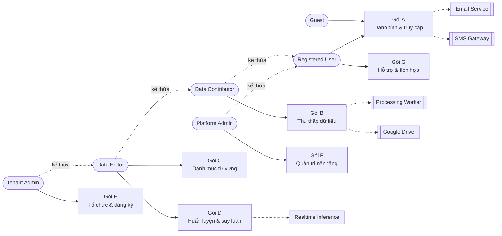

# Use Case Specification — CTU.SignBridge / VOYA-Collector

*Dựng 2026-08-12. Đặc tả use case cho hệ thống thu thập, quản lý và huấn luyện dữ liệu
Ngôn ngữ Ký hiệu Việt Nam theo mô hình SaaS đa tổ chức (multi-tenant).*

Tài liệu này bóc use case **từ mã nguồn đang chạy** (26 router backend, 30+ trang
frontend), không phải từ bản thiết kế mong muốn. Mỗi use case đều có ít nhất một
endpoint hoặc một màn hình thật đứng sau.

Khuôn trình bày theo mẫu chuẩn: mỗi use case gồm khối thuộc tính (Use Case / ID /
Main actor / Priority / Brief description / Trigger / Type / Relationship) rồi tới
**Normal flow** và **Exceptional flow**.

---

## 1. Actors

### 1.1 Tác nhân người dùng

| ID | Actor | Mô tả | Kiểu |
|---|---|---|---|
| A01 | **Guest** | Khách chưa đăng nhập. Xem được văn bản pháp lý đã công bố, đăng ký tài khoản, đăng nhập, khôi phục tài khoản, và dùng thử nhận dạng thời gian thực trong hạn mức ngày. | Chính, ngoài |
| A02 | **Registered User** | Tài khoản đã đăng nhập bất kỳ. Tác nhân **trừu tượng** — không ai "chỉ là" Registered User; nó gom các use case mà mọi tài khoản đều có (hồ sơ, thông báo, 2FA, đồng thuận, hỗ trợ). | Trừu tượng |
| A03 | **Data Contributor** | Người đóng góp dữ liệu: quay mẫu bằng camera, tải video, quản lý mẫu và phiên thu **của chính mình**. Đây là vai mặc định của thành viên một tổ chức. | Chính, ngoài |
| A04 | **Data Editor** | `tenant_members.role = 'editor'` → role dựng sẵn `tenant_editor`. Thêm được vào **danh mục lớp** của tổ chức, sửa nhãn, đề xuất phương ngữ, chạy huấn luyện. | Chính, ngoài |
| A05 | **Tenant Admin** | `tenant_members.role = 'admin'` → role dựng sẵn `tenant_administrator`. Điều hành **một** tổ chức: mời thành viên, đổi vai, xem đăng ký dịch vụ, yêu cầu xuất dữ liệu của tổ chức mình. | Chính, ngoài |
| A05b | **Tenant Owner** | Role dựng sẵn `tenant_owner`, lấy từ `tenants.owner_user_id` chứ không từ cột vai — không có giá trị `'owner'` nào trong `tenant_members.role`. Khác Tenant Admin **đúng hai quyền**: `tenant.purge` và `tenant.billing.manage`. Ranh giới là "định đoạt tổ chức" chứ không phải "nhạy cảm". | Chính, ngoài |
| A06 | **Platform Administrator** | `users.is_admin`. Vận hành **nền tảng**: tạo/xoá tổ chức, gắn tài khoản vào tổ chức, công bố văn bản pháp lý, quản trị máy ghi SOT, kiểm toán, cấu hình, xoá sạch dữ liệu. | Chính, ngoài |
| A07 | **Support Staff** | Người trực hàng đợi hỗ trợ. Trong hiện thực hiện tại kiểm bằng `require_admin`, nên là **chuyên biệt hoá** của Platform Administrator. | Chính, ngoài |
| A08 | **Third-party Client Application** | Ứng dụng ngoài gọi API bằng **khoá API** (mặt phẳng danh tính riêng, không có dòng trong `tenant_members`). Quyền nằm ở scope của chính khoá. | Phụ, ngoài |

> **Ranh giới quan trọng:** Platform Administrator **không** là chuyên biệt hoá của
> Tenant Admin. Hai vòng quyền này tách rành mạch ở backend (`require_admin` vs
> `tenant_members.role`). Quản trị viên tổ chức **không** gắn được tài khoản theo id —
> nếu làm được, họ kéo được bất kỳ ai trên hệ thống vào tổ chức của mình. Đường đưa
> người vào của họ là **lời mời**, thứ đòi hỏi chính người kia hành động.

> **Danh mục role dựng sẵn (PDM v5) — 13 role, do nền tảng quản lý.**
> Tenant **dùng** được nhưng không sửa/xoá được (`roles.is_builtin = TRUE`,
> `roles.tenant_id IS NULL`).
>
> | Phạm vi | Role |
> |---|---|
> | SYSTEM | `platform_administrator`, `platform_auditor` |
> | COMMUNITY | `community_member`, `community_curator` |
> | TENANT | `tenant_owner`, `tenant_administrator`, `tenant_editor` |
> | WORKSPACE | `workspace_administrator`, `workspace_viewer` |
> | PROJECT | `project_administrator`, `project_contributor`, `project_reviewer`, `project_viewer` |
>
> **`tenant_viewer` KHÔNG có trong danh mục**, và đó là quyết định chứ không
> phải thiếu sót. Với thống trị phạm vi `TENANT > WORKSPACE > PROJECT`, một vai
> chỉ-đọc ở cấp TENANT nghĩa là **đọc được toàn bộ tài nguyên con của tổ chức** —
> quyền rộng đáng kể, không phải "một viewer cho đủ bộ". Chừng nào chưa có
> nghiệp vụ thật đòi hỏi *"xem toàn tổ chức, mọi Workspace và Project, không sửa
> gì"*, bỏ nó đúng với least privilege hơn. Ai cần chỉ-đọc thì nhận
> `workspace_viewer` hoặc `project_viewer` ở đúng nhánh.
>
> Tenant Owner/Administrator tạo được **Custom Role** cho tổ chức mình
> (`is_builtin = FALSE`, `tenant_id` = tổ chức đó), nhưng chỉ từ những quyền mà
> nền tảng cho phép: quyền phạm vi SYSTEM và `tenant.role.manage` không bao giờ
> vào được — cái sau vì ai gói được nó vào một vai tự tạo thì **uỷ quyền đi được
> chính khả năng kiểm soát tổ chức**.

### 1.2 Tác nhân hệ thống (phụ)

| ID | Actor | Vai trò |
|---|---|---|
| S01 | **Email Service (SMTP)** | Gửi mã xác thực, lời mời, nhắc hạn đăng ký, thư phiếu hỗ trợ, cảnh báo Grafana. |
| S02 | **SMS/OTP Gateway** | Gửi mã xác thực tới số điện thoại (kênh thứ hai của OTP). |
| S03 | **Object Storage (Google Drive)** | Lưu tệp đặc trưng `.npz`, video thô, bản xem trước. |
| S04 | **Spreadsheet Mirror (Google Sheets)** | Bản phản chiếu `samples.csv` để đối soát ngoài hệ thống. |
| S05 | **Realtime Inference Service** | Dịch vụ suy luận GPU phục vụ nhận dạng thời gian thực. |
| S06 | **TTS Service** | Chuyển câu đã nhận dạng thành giọng nói. |
| S07 | **Processing Worker / Scheduler** | Celery worker + Celery beat: trích xuất đặc trưng MediaPipe, tăng cường dữ liệu, đồng bộ CSV↔DB, sao lưu, nhắc hạn. Kích hoạt **internal**. |
| S08 | **SOT Writer Machine** | Máy được cấp khoá ký, có quyền ghi vào nguồn sự thật (`samples.csv`) và publish. |

### 1.3 Quan hệ generalization giữa các actor

```
Registered User (abstract)
   ├── Data Contributor
   │        └── Data Editor
   │                 └── Tenant Admin
   └── Platform Administrator
                └── Support Staff

Guest ── (không kế thừa; tách riêng vì chưa có danh tính)
```

---

## 2. Danh sách use case

Hệ thống có **7 nhóm nghiệp vụ chính**, tổng **75 use case**. Ranh giới giữa các
nhóm không phải là màn hình mà là **thứ đang bị quản lý**: danh tính, dữ liệu
thô, danh mục từ vựng, mô hình, tổ chức, nền tảng, và dịch vụ quanh nó.

| Gói | Nhóm nghiệp vụ | Câu hỏi nhóm đó trả lời | Số UC | Actor chính |
|---|---|---|---|---|
| **A** | Danh tính và truy cập | Anh là ai, và anh đã đồng ý những gì? | 14 | Guest, Registered User |
| **B** | Thu thập dữ liệu | Mẫu vào hệ thống bằng đường nào, và mất đi bằng đường nào? | 13 | Data Contributor |
| **C** | Danh mục từ vựng | Được phép thu **lớp** nào, theo phương ngữ nào? | 10 | Data Editor, Platform Admin |
| **D** | Huấn luyện và suy luận | Từ dữ liệu ra mô hình, rồi mô hình phục vụ ai? | 9 | Data Editor |
| **E** | Tổ chức và đăng ký dịch vụ | Ai thuộc về tổ chức nào, trong hạn mức nào? | 8 | Tenant Admin |
| **F** | Quản trị nền tảng | Ai vận hành cả hệ thống, và lấy gì làm bằng chứng? | 15 | Platform Administrator |
| **G** | Hỗ trợ và tích hợp | Khi hỏng thì kêu ai, và máy khác nối vào thế nào? | 6 | Registered User, Tenant Admin |

Ba nhóm A/B/C là **vòng đời của một mẫu dữ liệu**; D là chỗ dữ liệu thành sản
phẩm; E/F là hai vòng quản trị **không** lồng nhau (xem §1.1); G là vành ngoài.

### Gói A — Danh tính và truy cập (Access & Identity)

| ID | Use case | Main actor | Priority |
|---|---|---|---|
| UC001 | Register account | Guest | Essential |
| UC002 | Register by invitation | Guest | Essential |
| UC003 | Send verification code | Registered User | Essential |
| UC004 | Verify contact address | Registered User | Essential |
| UC005 | Log in | Guest | Essential |
| UC006 | Verify two-factor code | Registered User | Important |
| UC007 | Log out | Registered User | Essential |
| UC008 | Recover account | Guest | Essential |
| UC009 | Manage two-factor authentication | Registered User | Important |
| UC010 | Manage profile | Registered User | Important |
| UC011 | Accept legal document | Registered User | Essential |
| UC012 | Withdraw consent | Registered User | Essential |
| UC013 | Use trial recognition | Guest | Optional |
| UC064 | View legal document | Guest | Essential |

### Gói B — Thu thập dữ liệu (Data Collection)

| ID | Use case | Main actor | Priority |
|---|---|---|---|
| UC014 | Record sample from camera | Data Contributor | Essential |
| UC015 | Upload video file | Data Contributor | Essential |
| UC016 | Process recording | Processing Worker (S07) | Essential |
| UC017 | Monitor job status | Data Contributor | Important |
| UC018 | Browse label catalog | Data Contributor | Essential |
| UC019 | View label detail | Data Contributor | Essential |
| UC020 | Preview session video | Data Contributor | Important |
| UC021 | Delete capture session | Data Contributor | Important |
| UC022 | Reassign session signer | Data Editor | Optional |
| UC023 | Delete sample | Data Contributor | Essential |
| UC024 | Manage trash | Data Contributor | Important |
| UC025 | Export dataset snapshot | Platform Administrator | Important |
| UC065 | Set capture preferences | Data Contributor | Optional |

### Gói C — Danh mục từ vựng (Vocabulary Catalog)

| ID | Use case | Main actor | Priority |
|---|---|---|---|
| UC026 | Register class | Data Editor | Essential |
| UC027 | Update class | Data Editor | Important |
| UC028 | Remove class | Data Editor | Important |
| UC029 | Propose dialect | Data Editor | Optional |
| UC030 | Moderate dialect proposal | Platform Administrator | Optional |
| UC031 | View collection statistics | Data Contributor | Important |
| UC066 | Merge classes | Data Editor | Important |
| UC067 | Maintain community catalog template | Platform Administrator | Important |
| UC068 | Publish community catalog version | Platform Administrator | Important |
| UC069 | Clone catalog into an organisation | Platform Administrator | Important |

### Gói D — Huấn luyện và suy luận (Training & Inference)

| ID | Use case | Main actor | Priority |
|---|---|---|---|
| UC032 | Start training job | Data Editor | Essential |
| UC033 | Monitor training progress | Data Editor | Essential |
| UC034 | Cancel training job | Data Editor | Important |
| UC035 | Review evaluation and provenance | Data Editor | Important |
| UC036 | Promote model version | Platform Administrator | Important |
| UC037 | Recognize sign in realtime | Data Contributor | Essential |
| UC038 | Speak recognized text | Data Contributor | Optional |
| UC070 | Test trained model | Data Editor | Important |
| UC071 | Prepare research release | Data Editor | Important |

### Gói E — Tổ chức và đăng ký dịch vụ (Organization & Subscription)

| ID | Use case | Main actor | Priority |
|---|---|---|---|
| UC039 | Manage tenants | Platform Administrator | Essential |
| UC040 | Invite member | Tenant Admin | Essential |
| UC041 | Accept invitation | Guest | Essential |
| UC042 | Manage member role | Tenant Admin | Important |
| UC043 | Remove member | Tenant Admin | Important |
| UC044 | Manage subscription | Tenant Admin | Important |
| UC045 | Request tenant data export | Tenant Admin | Important |
| UC046 | Purge tenant data | Platform Administrator | Optional |

### Gói F — Quản trị nền tảng (Platform Administration)

| ID | Use case | Main actor | Priority |
|---|---|---|---|
| UC047 | Elevate privileges | Platform Administrator | Important |
| UC048 | Manage user account | Platform Administrator | Essential |
| UC049 | Apply security action | Platform Administrator | Important |
| UC050 | Review audit log | Platform Administrator | Important |
| UC051 | Configure platform settings | Platform Administrator | Important |
| UC052 | Publish legal document | Platform Administrator | Essential |
| UC053 | Manage SOT writer machines | Platform Administrator | Important |
| UC054 | Verify source-of-truth integrity | Platform Administrator | Important |
| UC055 | Monitor system health | Platform Administrator | Important |
| UC056 | Synchronize storage and database | Platform Administrator | Important |
| UC057 | Manage billing plans | Platform Administrator | Optional |
| UC072 | Draft and review legal document | Platform Administrator | Important |
| UC073 | Review consent records | Platform Administrator | Important |
| UC074 | Back up and restore data | Platform Administrator | Essential |
| UC075 | Verify deployment freshness | Platform Administrator | Important |

### Gói G — Hỗ trợ và tích hợp (Support & Integration)

| ID | Use case | Main actor | Priority |
|---|---|---|---|
| UC058 | Create support ticket | Registered User | Important |
| UC059 | Reply to support ticket | Registered User | Important |
| UC060 | Handle support queue | Support Staff | Important |
| UC061 | View notifications | Registered User | Important |
| UC062 | Manage API keys | Tenant Admin | Optional |
| UC063 | Manage webhook endpoints | Tenant Admin | Optional |

---

## 3. Tổng hợp quan hệ (Relationships)

> **Quy ước đọc, đúng như mẫu:** ô `Extend:` của một use case ghi **use case cơ
> sở mà nó mở rộng** (mẫu UC004 ghi `Extend: Register Account`). Vì vậy quan hệ
> extend chỉ được khai **một phía** — phía use case mở rộng. Use case cơ sở để
> `None`; bảng dưới đây là nơi duy nhất nhìn thấy cả hai đầu.

### 3.1 Include

| Base use case | «include» | Lý do |
|---|---|---|
| UC001 Register account | UC011 Accept legal document | Cưỡng chế đồng thuận đang BẬT: không chấp thuận thì không tạo được tài khoản. |
| UC002 Register by invitation | UC003 Send verification code | Địa chỉ của tài khoản mới vẫn phải được chứng minh. |
| UC004 Verify contact address | UC003 Send verification code | Không có mã thì không xác thực được. |
| UC008 Recover account | UC003 Send verification code | Bước một của khôi phục là gửi mã. |
| UC014 Record sample from camera | UC016 Process recording | Mẫu chỉ tồn tại sau khi trích xuất đặc trưng. |
| UC015 Upload video file | UC016 Process recording | Cùng lý do, khác nguồn đầu vào. |
| UC041 Accept invitation | UC002 Register by invitation | Lời mời chỉ được tiêu thụ ở đúng một chỗ: lúc tạo tài khoản. |
| UC046 Purge tenant data | UC047 Elevate privileges | `require_sudo` — thao tác không hoàn tác được. |
| UC052 Publish legal document | UC047 Elevate privileges | `require_sudo` — bản đã công bố là bất biến. |
| UC057 Manage billing plans | UC047 Elevate privileges | `require_sudo` — hạ gói hay treo một tổ chức là thao tác gây hậu quả. |
| UC056 Synchronize storage and database | UC054 Verify source-of-truth integrity | Muốn sửa thì trước hết phải biết ba nơi lệch nhau ở đâu. |
| UC060 Handle support queue | UC059 Reply to support ticket | Trực hàng đợi luôn kết thúc bằng một lượt trả lời. |
| UC011 Accept legal document | UC064 View legal document | Phải đọc được văn bản thì mới ký được nó. |

**Ba chỗ CỐ Ý không phải include** — dễ ghi nhầm, nên nói rõ:

- **Ghi vết kiểm toán ≠ UC050.** Mọi use case quản trị đều ghi một dòng kiểm
  toán, nhưng UC050 là việc *một con người đọc* nhật ký. Ghi và đọc là hai hành
  vi khác nhau; khai include ở đây là biến một trách nhiệm hệ thống thành một
  use case do người khởi phát.
- **UC053 không đòi `require_sudo`.** Chỉ ba đường ở trên có; trang máy ghi SOT
  chỉ kiểm `require_admin`. Bản trước ghi thừa quan hệ này.
- **UC032 không include UC031.** Màn hình huấn luyện tự đọc thông tin bộ dữ liệu
  của nó; đó không phải là use case thống kê thu thập.

### 3.2 Extend

| Extension use case | «extend» | Điều kiện mở rộng |
|---|---|---|
| UC002 Register by invitation | UC001 Register account | Khi Guest tới bằng liên kết lời mời có token. |
| UC006 Verify two-factor code | UC005 Log in | Khi tài khoản đã bật 2FA. |
| UC009 Manage two-factor authentication | UC010 Manage profile | Khi người dùng vào phần Bảo mật. |
| UC012 Withdraw consent | UC011 Accept legal document | Khi người dùng rút lại đồng thuận đã ký. |
| UC013 Use trial recognition | UC037 Recognize sign in realtime | Khi người dùng chưa đăng nhập; giới hạn phút/ngày. |
| UC020 Preview session video | UC019 View label detail | Khi người dùng muốn xem lại bản dựng của phiên thu. |
| UC022 Reassign session signer | UC019 View label detail | Khi phát hiện phiên thu gán sai người ký. |
| UC024 Manage trash | UC023 Delete sample, UC028 Remove class | Khi cần hoàn tác hoặc xoá vĩnh viễn: xoá mềm tạo ra điểm mở rộng. |
| UC038 Speak recognized text | UC037 Recognize sign in realtime | Khi người dùng bật đầu ra giọng nói. |
| UC066 Merge classes | UC027 Update class | Khi việc cần làm là gộp hai lớp trùng, không phải đổi tên một lớp. |
| UC069 Clone catalog into an organisation | UC039 Manage tenants | Khi tổ chức vừa tạo cần danh mục mồi để bắt đầu thu. |
| UC070 Test trained model | UC035 Review evaluation and provenance | Khi muốn thử một mẫu thật trước khi quyết định thăng hạng. |

### 3.3 Generalization

| Use case cha | Use case con |
|---|---|
| Capture sample (trừu tượng) | UC014 Record sample from camera, UC015 Upload video file |
| Remove data (trừu tượng) | UC021 Delete capture session, UC023 Delete sample, UC028 Remove class |
| UC003 Send verification code | Gửi qua email (S01), gửi qua SMS (S02) |

---

## 4. Sơ đồ tổng quan



---

## 5. Đặc tả chi tiết — Gói A: Danh tính và truy cập

### UC001 — Register account

| **Use Case** | Register account | **ID** | UC001 |
|---|---|---|---|
| **Main actor** | Guest | **Priority** | Essential |
| **Trigger** | Guest | **Type** | external |

**Brief description:** *The Guest creates a platform account with a username, an email address and a password. The account is created inside a tenant and cannot be used until the legal documents in force have been accepted.*

**Relationship:**
- **Association:** Guest – Register account
- **Include:** UC011 Accept legal document
- **Extend:** None *(UC002 mở rộng use case này)*
- **Generalization:** None

**Normal flow:**
1. System displays the registration form and the list of legal documents currently in force.
2. The Guest enters username, email address, password and password confirmation.
3. The Guest ticks the acceptance box for each document in force (UC011).
4. The Guest clicks the "Create account" button.
5. System checks the per-minute attempt limit and the per-day account-creation limit for the caller IP.
6. System checks that self-serve signup is enabled, that the username and the email are not already taken, and that the password meets the strength policy.
7. System creates the account in the tenant, stores one consent record per accepted document together with the document content hash, and writes an audit entry.
8. System sends a verification code to the email address (UC003) and signs the Guest in as a Registered User.

**Exceptional flow:**
1. **Signup closed:** In step 6, if self-serve signup is disabled and no invitation token is present, System refuses with "the platform only accepts members by invitation". The Guest must obtain an invitation (UC002).
2. **Duplicate identity:** In step 6, if the username or the email already exists, an error message is displayed on the offending field. The Guest then edits it and resubmits.
3. **Weak password:** In step 6, if the password fails the strength policy, System displays the unmet requirements and the account is not created.
4. **Rate limit reached:** In step 5, if the IP exceeded the attempt limit, System refuses and displays the time remaining before the next attempt.
5. **Consent not given:** In step 3, if any document in force is left unticked, the "Create account" button stays disabled — enforcement is on, so an account without consent cannot exist.

---

### UC002 — Register by invitation

| **Use Case** | Register by invitation | **ID** | UC002 |
|---|---|---|---|
| **Main actor** | Guest | **Priority** | Essential |
| **Trigger** | Guest opens an invitation link | **Type** | external |

**Brief description:** *The Guest registers by using an invitation token issued by a Tenant Admin. The token decides which tenant the account lands in and which role it starts with, so registration is possible even when self-serve signup is closed.*

**Relationship:**
- **Association:** Guest – Register by invitation
- **Include:** UC003 Send verification code
- **Extend:** UC001 Register account
- **Generalization:** None

**Normal flow:**
1. The Guest opens the invitation link received by email.
2. System inspects the token and displays the inviting organisation name, the invited email address and the offered role.
3. The Guest enters username and password; the email field is pre-filled from the invitation and is read-only.
4. The Guest accepts the legal documents in force and clicks "Join".
5. System validates the token **before** creating the account: not expired, not revoked, not already consumed.
6. System creates the account, attaches it to the inviting tenant with the invited role, marks the invitation consumed and writes an audit entry.
7. System signs the Guest in and lands them on the organisation dashboard.

**Exceptional flow:**
1. **Stale token:** In step 5, if the invitation is expired, revoked or already used, System refuses and no account is created — the check runs before creation precisely so that a real account is never stranded in the wrong tenant.
2. **Email mismatch:** In step 3, if the Guest edits the invited address, System ignores the edit and keeps the invited address; an invitation is bound to one address.
3. **Account already exists:** In step 5, if the invited address already has an account, System redirects to the sign-in screen and applies the membership after sign-in (UC041).

---

### UC003 — Send verification code

| **Use Case** | Send verification code | **ID** | UC003 |
|---|---|---|---|
| **Main actor** | Registered User | **Priority** | Essential |
| **Trigger** | Registered User requests a code | **Type** | external |

**Brief description:** *System issues a one-time code to an address (email or phone number) so that the holder can prove control of it. The code is used by contact verification, by account recovery and by the invitation flow.*

**Relationship:**
- **Association:** Registered User – Send verification code; Email Service (S01); SMS Gateway (S02)
- **Include:** None
- **Extend:** None
- **Generalization:** Send by email, Send by SMS

**Normal flow:**
1. The user asks System to send a code to an email address or a mobile number.
2. System checks the per-IP hourly cap and the per-address resend cooldown.
3. System generates a one-time code, stores its hash with a time-to-live, and discards any previous unused code for the same address.
4. System hands the code to the Email Service (S01) or the SMS Gateway (S02) according to the chosen channel.
5. System returns the remaining cooldown and the code lifetime so the screen can run the countdown.

**Exceptional flow:**
1. **Cooldown not elapsed:** In step 2, if the previous code was sent less than the cooldown ago, System refuses and displays the seconds remaining.
2. **Hourly cap reached:** In step 2, if the caller IP exceeded the hourly cap, System refuses; the cap counts sends, not successes.
3. **SMS channel unavailable:** In step 4, if no SMS provider is configured, System hides the SMS option and offers the email channel only.
4. **Delivery failure:** In step 4, if the provider rejects the message, System reports a send failure and does not consume the cooldown.

---

### UC004 — Verify contact address

| **Use Case** | Verify contact address | **ID** | UC004 |
|---|---|---|---|
| **Main actor** | Registered User | **Priority** | Essential |
| **Trigger** | Registered User | **Type** | external |

**Brief description:** *The Registered User proves control of the email address or the mobile number attached to the account by entering the one-time code received on that channel.*

**Relationship:**
- **Association:** Registered User – Verify contact address
- **Include:** UC003 Send verification code
- **Extend:** None
- **Generalization:** None

**Normal flow:**
1. System displays the verification status of the account: which address is on file and whether it has already been proven.
2. The user picks the address to verify and clicks "Send code" (UC003).
3. System asks the user for the code sent to that address.
4. The user enters the verification code.
5. System verifies the code against the stored hash and its lifetime. It is ok.
6. System stamps the verification time on the account, consumes the code, and refreshes the status display.

**Exceptional flow:**
1. **Wrong code:** In step 5, if the code does not match, System displays "wrong code" and lets the user retry until the attempt budget for that code is exhausted; the code is then invalidated and a new one must be requested.
2. **Expired code:** In step 5, if the code lifetime has elapsed, System refuses and offers to resend after the cooldown.
3. **Address changed meanwhile:** In step 5, if the address on the account changed after the code was issued, System invalidates the code — a code proves control of the address it was sent to, not of the account.

---

### UC005 — Log in

| **Use Case** | Log in | **ID** | UC005 |
|---|---|---|---|
| **Main actor** | Guest | **Priority** | Essential |
| **Trigger** | Guest | **Type** | external |

**Brief description:** *The Guest signs in with a username (or email) and a password and receives a session. If two-factor authentication is enabled on the account, the session is only issued after the second factor.*

**Relationship:**
- **Association:** Guest – Log in
- **Include:** None
- **Extend:** None *(UC006 mở rộng use case này)*
- **Generalization:** None

**Normal flow:**
1. System displays the sign-in form.
2. The Guest enters the username (or email) and the password, then clicks "Sign in".
3. System checks the per-IP and per-account attempt limits.
4. System verifies the password hash. It is ok.
5. System checks the account state: active, not locked, consents in force accepted, subscription not hard-blocked.
6. System issues an access token and a refresh token, records the session with its device and IP, and writes an audit entry.
7. System lands the user on the dashboard and displays any pending administrative notice.

**Exceptional flow:**
1. **Wrong credentials:** In step 4, System returns one generic error for both an unknown account and a wrong password, so the form cannot be used to enumerate accounts.
2. **Two-factor required:** In step 6, if 2FA is enabled, System issues no session yet and asks for the second factor (UC006).
3. **Account locked or suspended:** In step 5, System refuses and displays the reason recorded by the administrator, with the support channel.
4. **Consent outstanding:** In step 5, if a document in force has not been accepted, System signs the user in but routes them to the consent screen and blocks every write until accepted (UC011).
5. **Attempt limit reached:** In step 3, System refuses further attempts from that IP or account for the lockout window.

---

### UC006 — Verify two-factor code

| **Use Case** | Verify two-factor code | **ID** | UC006 |
|---|---|---|---|
| **Main actor** | Registered User | **Priority** | Important |
| **Trigger** | Account has 2FA enabled | **Type** | external |

**Brief description:** *The user completes sign-in by entering the six-digit code produced by their authenticator application, or one of their recovery codes.*

**Relationship:**
- **Association:** Registered User – Verify two-factor code
- **Include:** None
- **Extend:** UC005 Log in
- **Generalization:** None

**Normal flow:**
1. System asks the user for the six-digit code from the authenticator application.
2. The user enters the code.
3. System validates the code against the account secret within the accepted time drift window. It is ok.
4. System marks the code as spent so the same code cannot be replayed inside its own window.
5. System issues the session and completes the sign-in started in UC005.

**Exceptional flow:**
1. **Wrong or expired code:** In step 3, System displays an error and lets the user retry; repeated failures consume the attempt budget and abort the sign-in.
2. **Lost device:** In step 2, the user enters a recovery code instead. System consumes that recovery code permanently and warns how many remain.
3. **No recovery code left:** In step 2, the user must use account recovery (UC008) or contact support (UC058).

---

### UC007 — Log out

| **Use Case** | Log out | **ID** | UC007 |
|---|---|---|---|
| **Main actor** | Registered User | **Priority** | Essential |
| **Trigger** | Registered User | **Type** | external |

**Brief description:** *The Registered User ends the current session. The refresh token is revoked and the access token is added to the deny list so that it stops working immediately rather than at its natural expiry.*

**Relationship:**
- **Association:** Registered User – Log out
- **Include:** None
- **Extend:** None
- **Generalization:** None

**Normal flow:**
1. The user clicks "Sign out".
2. System revokes the refresh token of the current session and marks the session closed.
3. System adds the presented access token to the deny list until its natural expiry.
4. System clears the session cookies and writes an audit entry.
5. System redirects the user to the sign-in screen, staying under the deployment base path.

**Exceptional flow:**
1. **Session already gone:** In step 2, if the session was revoked from another device, System still clears the local state and reports a successful sign-out.
2. **Sign out everywhere:** In step 1, if the user chooses "sign out of all devices", System revokes every session of the account, not only the current one.

---

### UC008 — Recover account

| **Use Case** | Recover account | **ID** | UC008 |
|---|---|---|---|
| **Main actor** | Guest | **Priority** | Essential |
| **Trigger** | Guest | **Type** | external |

**Brief description:** *The Guest who cannot sign in recovers access through one door: identify the account, prove control of the address on file with a one-time code, then set a new password.*

**Relationship:**
- **Association:** Guest – Recover account
- **Include:** UC003 Send verification code
- **Extend:** None
- **Generalization:** None

**Normal flow:**
1. The Guest enters the email address or username of the account and clicks "Continue".
2. System sends a one-time code to the address on file (UC003).
3. System asks the Guest for the code.
4. The Guest enters the code; System verifies it and issues a short-lived recovery grant. The code is consumed at this step.
5. System asks for a new password and its confirmation.
6. The Guest enters the new password and confirms.
7. System stores the new password hash, revokes every existing session of the account, writes an audit entry and notifies the account owner by email.

**Exceptional flow:**
1. **Unknown account:** In step 2, System reports the same "if the address exists, a code has been sent" message either way, so the form cannot be used to test which addresses are registered.
2. **Wrong code:** In step 4, System displays an error; verify and confirm share one rate-limit bucket, so guessing the code exhausts the same budget as restarting the flow.
3. **Grant expired:** In step 6, if the recovery grant has expired, System refuses the new password and the Guest restarts from step 1.
4. **Two-factor enabled:** In step 4, if the account has 2FA, System additionally asks for a second factor before issuing the grant.

---

### UC009 — Manage two-factor authentication

| **Use Case** | Manage two-factor authentication | **ID** | UC009 |
|---|---|---|---|
| **Main actor** | Registered User | **Priority** | Important |
| **Trigger** | Registered User | **Type** | external |

**Brief description:** *The Registered User enables, confirms or disables time-based one-time password authentication on the account and regenerates the recovery codes.*

**Relationship:**
- **Association:** Registered User – Manage two-factor authentication
- **Include:** None
- **Extend:** UC010 Manage profile
- **Generalization:** None

**Normal flow:**
1. The user opens the Security settings page; System displays whether 2FA is on and how many recovery codes remain.
2. The user clicks "Enable"; System generates a secret and displays it as a QR code and as text.
3. The user scans the code with an authenticator application and enters the six-digit code it produces.
4. System validates the code, activates 2FA on the account and displays the recovery codes exactly once.
5. The user stores the recovery codes and confirms.

**Exceptional flow:**
1. **Confirmation code wrong:** In step 4, 2FA is not activated and the pending secret is discarded; the user restarts from step 2.
2. **Disable:** The user clicks "Disable" and must re-enter the account password. System verifies it, removes the secret and the recovery codes, and writes an audit entry.
3. **Regenerate recovery codes:** The user re-enters the account password; System invalidates every previous recovery code and displays the new set once.
4. **Wrong password:** In the disable or regenerate branch, if the password is wrong, System refuses and the existing 2FA state is untouched.

---

### UC010 — Manage profile

| **Use Case** | Manage profile | **ID** | UC010 |
|---|---|---|---|
| **Main actor** | Registered User | **Priority** | Important |
| **Trigger** | Registered User | **Type** | external |

**Brief description:** *The Registered User views and updates their own account information: display name, username, contact address, interface language and signer profile fields.*

**Relationship:**
- **Association:** Registered User – Manage profile
- **Include:** None
- **Extend:** None *(UC009 mở rộng use case này)*
- **Generalization:** None

**Normal flow:**
1. The user opens the Account page; System displays the profile, the verification status and the consent history.
2. The user edits the fields to change and clicks "Save".
3. System validates the new values and checks that a new username or contact address is not already taken.
4. System stores the change and propagates the new username to every place that copied it, including the sample registry.
5. System displays the updated profile.

**Exceptional flow:**
1. **Username taken:** In step 3, System refuses and the previous username stays in force.
2. **Contact address changed:** In step 4, System clears the verification stamp of that address and asks the user to prove the new one (UC004).
3. **Historical records:** In step 4, the actor label already written into audit entries is **not** rewritten — it is historical evidence of who acted under that name at that time.

---

### UC011 — Accept legal document

| **Use Case** | Accept legal document | **ID** | UC011 |
|---|---|---|---|
| **Main actor** | Registered User | **Priority** | Essential |
| **Trigger** | Registered User | **Type** | external |

**Brief description:** *The Registered User reads and accepts the legal documents in force — terms of service, privacy policy, and the data-collection consent that decides how far the samples they contribute may be released.*

**Relationship:**
- **Association:** Registered User – Accept legal document
- **Include:** UC064 View legal document
- **Extend:** None *(UC012 mở rộng use case này)*
- **Generalization:** None

**Normal flow:**
1. System displays the documents in force that the account has not yet accepted, with the effective date of each.
2. The user opens a document and reads its body, rendered from the stored version content.
3. For the data-collection consent, the user selects one of the three release levels offered.
4. The user ticks the acceptance box and clicks "Accept".
5. System records one consent row per document, storing the document version and its content hash, and writes an audit entry.
6. System lifts the consent block and returns the user to the page they were heading for.

**Exceptional flow:**
1. **New version published:** In step 1, when a new version of an accepted document is published, System asks again — a consent is bound to the exact version and hash it was given for.
2. **Refusal:** In step 4, if the user declines, System keeps the account read-only: no capture, no upload, no export.
3. **Anonymous sample:** In step 3, if the account never gave a release level, the samples it contributed cannot be published in any release; the consent scale is enforced at export time, not only at collection time.

---

### UC012 — Withdraw consent

| **Use Case** | Withdraw consent | **ID** | UC012 |
|---|---|---|---|
| **Main actor** | Registered User | **Priority** | Essential |
| **Trigger** | Registered User | **Type** | external |

**Brief description:** *The Registered User withdraws a consent previously given. Withdrawal is real: from that moment the samples covered by it are excluded from every new release.*

**Relationship:**
- **Association:** Registered User – Withdraw consent
- **Include:** None
- **Extend:** UC011 Accept legal document
- **Generalization:** None

**Normal flow:**
1. The user opens the Account page and reads the consent history: which document, which version, when accepted.
2. The user clicks "Withdraw" on a consent and reads the consequence displayed.
3. The user confirms.
4. System stamps the withdrawal time on the consent row, keeping the original acceptance as history.
5. System excludes the samples covered by that consent from every subsequent export and release build.
6. System writes an audit entry and notifies the tenant administrators.

**Exceptional flow:**
1. **Mandatory document:** In step 3, if the withdrawn document is one whose acceptance is required to use the platform, System warns that the account becomes read-only and asks for a second confirmation.
2. **Already published release:** In step 5, System states plainly that releases already built and distributed cannot be recalled; the withdrawal applies to future releases.
3. **Re-consent:** After a withdrawal, the user may accept the same document again (UC011); this creates a new consent row and does not erase the withdrawal.

---

### UC013 — Use trial recognition

| **Use Case** | Use trial recognition | **ID** | UC013 |
|---|---|---|---|
| **Main actor** | Guest | **Priority** | Optional |
| **Trigger** | Guest | **Type** | external |

**Brief description:** *The Guest tries realtime sign recognition without an account, within a daily time budget counted per browser and per IP.*

**Relationship:**
- **Association:** Guest – Use trial recognition; Realtime Inference Service (S05)
- **Include:** None
- **Extend:** UC037 Recognize sign in realtime
- **Generalization:** None

**Normal flow:**
1. The Guest opens the public recognition page and clicks "Try it".
2. System issues a trial ticket bound to the browser and starts counting the minutes used today.
3. System asks for camera permission and starts client-side hand tracking.
4. System streams the landmark windows to the Realtime Inference Service and displays the predicted label with its confidence.
5. System displays the remaining trial minutes for the day.
6. When the Guest stops, System stores the minutes consumed against the daily budget.

**Exceptional flow:**
1. **Budget exhausted:** In step 2, if today's budget is spent, System stops the trial and invites the Guest to create an account (UC001).
2. **Camera denied:** In step 3, if the browser refuses camera access, System explains how to grant it and offers the video-upload path instead.
3. **Inference service down:** In step 4, if the service does not answer, System displays a service-unavailable notice and does not consume the trial budget.
4. **No hand detected:** In step 4, if no hand is visible, System displays a framing hint rather than a prediction.

---

## 6. Đặc tả chi tiết — Gói B: Thu thập dữ liệu

### UC014 — Record sample from camera

| **Use Case** | Record sample from camera | **ID** | UC014 |
|---|---|---|---|
| **Main actor** | Data Contributor | **Priority** | Essential |
| **Trigger** | Data Contributor | **Type** | external |

**Brief description:** *The Data Contributor performs a sign in front of the camera. Hand landmarks are extracted in the browser and sent to the platform, where one capture becomes exactly one sample of the chosen class.*

**Relationship:**
- **Association:** Data Contributor – Record sample from camera; Object Storage (S03)
- **Include:** UC016 Process recording
- **Extend:** None
- **Generalization:** Capture sample (abstract)

**Normal flow:**
1. The Contributor opens the capture page and chooses the class to record, the language and the dialect.
2. System asks for camera permission and starts client-side hand tracking, displaying the detected landmarks over the video.
3. System displays the recording guidance: framing, number of hands required by the class, and target duration.
4. The Contributor clicks "Record"; System collects landmark frames with their timestamps until the Contributor stops.
5. System displays the captured window for review and asks the Contributor to keep or discard it.
6. The Contributor clicks "Save".
7. System checks the sample quota of the tenant, counting this capture as exactly one sample.
8. System sends the frames and the metadata (class, session, dialect, signer) to the backend, which stores the sample and hands it to the Processing Worker (UC016).
9. System displays the new sample in the session list with its quality metrics.

**Exceptional flow:**
1. **Camera denied or missing:** In step 2, System explains how to grant camera access and offers the video-upload path (UC015).
2. **No hand detected:** In step 4, if no hand is visible for the whole window, System refuses to save and displays a framing hint.
3. **Two hands required:** In step 4, if the class requires two hands and only one is tracked, System warns before saving; the requirement is read from the class metadata, not guessed from the frames.
4. **Quota exceeded:** In step 7, System refuses the save and displays the plan limit reached, with the path to change the plan (UC044).
5. **Consent outstanding:** In step 6, if the account has no consent in force, System blocks the write and routes to the consent screen (UC011).
6. **Network failure:** In step 8, System keeps the captured window in the browser and offers a retry rather than discarding the recording.

---

### UC015 — Upload video file

| **Use Case** | Upload video file | **ID** | UC015 |
|---|---|---|---|
| **Main actor** | Data Contributor | **Priority** | Essential |
| **Trigger** | Data Contributor | **Type** | external |

**Brief description:** *The Data Contributor uploads one or more video files (MP4, MOV) of signs already recorded. The raw file is archived before any normalisation, then landmarks are extracted from it.*

**Relationship:**
- **Association:** Data Contributor – Upload video file; Object Storage (S03)
- **Include:** UC016 Process recording
- **Extend:** None
- **Generalization:** Capture sample (abstract)

**Normal flow:**
1. The Contributor opens the upload page, chooses the target class, the dialect and the signer.
2. The Contributor selects the video files and clicks "Upload".
3. System validates each file: extension, size and duration.
4. System checks the sample quota of the tenant against the number of files.
5. System writes each raw file to the raw archive **before** any normalisation, so the original is never lost to a processing bug.
6. System returns an upload receipt listing the accepted files.
7. The Contributor clicks "Process"; System enqueues one processing job per file (UC016) and returns the job identifiers.
8. The Contributor follows the job progress (UC017).

**Exceptional flow:**
1. **Unsupported format:** In step 3, the file is rejected with the list of accepted formats; the other files in the batch still proceed.
2. **File too large:** In step 3, System rejects the file and displays the size limit.
3. **Quota exceeded:** In step 4, System accepts only the files that fit inside the remaining quota and reports which ones were refused.
4. **Storage unavailable:** In step 5, System aborts the upload and reports a storage failure; nothing partially written is registered as a sample.
5. **No landmark found:** During step 7, if the worker finds no hand in the whole video, the job ends in failure with that reason and no sample is created.

---

### UC016 — Process recording

| **Use Case** | Process recording | **ID** | UC016 |
|---|---|---|---|
| **Main actor** | Processing Worker (S07) | **Priority** | Essential |
| **Trigger** | A capture or an upload is enqueued | **Type** | internal |

**Brief description:** *The Processing Worker turns a raw recording into a training-ready sample: it extracts hand landmarks, cuts a fixed-length window, augments it, writes the feature file and registers the sample in the source of truth.*

**Relationship:**
- **Association:** Processing Worker (S07) – Process recording; Object Storage (S03); Spreadsheet Mirror (S04)
- **Include:** None
- **Extend:** None
- **Generalization:** None

**Normal flow:**
1. The Worker takes the job from the queue and marks it running.
2. The Worker extracts hand landmarks frame by frame — 21 landmarks × 3 coordinates × 2 hands = 126 features per frame.
3. The Worker applies the sliding window of fixed length and normalises the coordinate space.
4. The Worker computes the quality metrics of the window, including completeness and jitter.
5. The Worker generates the augmented variants of the window.
6. The Worker writes the feature file and a sidecar description next to it, so the registry row can be rebuilt from the file alone.
7. The Worker appends the sample row to the source-of-truth registry and mirrors it into the database. The spreadsheet mirror is **not** written here: it is refreshed by its own scheduled task, so a sample is registered long before it appears in the spreadsheet.
8. The Worker hands the upload to the Object Storage off to a separate retrying task and records the returned storage key on the row when it completes.
9. The Worker marks the job finished and notifies the owner.

**Exceptional flow:**
1. **No hand detected:** In step 2, the Worker ends the job as failed with that reason; no sample row is created.
2. **Window too short:** In step 3, if the recording is shorter than the window, the Worker pads it and records that fact in the quality metrics rather than silently dropping the sample.
3. **Storage dispatch fails:** In step 8, the Worker retries; if every retry fails, the row keeps its local path and a reconciliation task fills the storage key later.
4. **Registry write fails:** In step 7, the Worker aborts and requeues; a sample present in the database but missing from the registry is treated as an inconsistency and repaired by the reconciliation task.
5. **Worker crash:** At any step, the job returns to the queue; the sample identifier is stable so a repeat run overwrites rather than duplicates.

---

### UC017 — Monitor job status

| **Use Case** | Monitor job status | **ID** | UC017 |
|---|---|---|---|
| **Main actor** | Data Contributor | **Priority** | Important |
| **Trigger** | Data Contributor | **Type** | external |

**Brief description:** *The Data Contributor follows the progress of the background jobs started by their uploads and captures.*

**Relationship:**
- **Association:** Data Contributor – Monitor job status
- **Include:** None
- **Extend:** None
- **Generalization:** None

**Normal flow:**
1. The Contributor opens the job list; System displays the recent jobs with their state, progress and start time.
2. System refreshes the state of the running jobs at a fixed interval.
3. The Contributor opens a job to read its detail: source file, target class, number of samples produced.
4. When a job finishes, System displays the resulting samples and a link to the label detail (UC019).

**Exceptional flow:**
1. **Job failed:** In step 4, System displays the failure reason recorded by the Worker and offers to retry the source file.
2. **Job not found:** In step 3, if the identifier is unknown or belongs to another tenant, System returns "not found" — the same answer for both, so the endpoint cannot be used to probe other tenants.
3. **Queue congested:** In step 1, System displays the queue position rather than an empty progress bar.

---

### UC018 — Browse label catalog

| **Use Case** | Browse label catalog | **ID** | UC018 |
|---|---|---|---|
| **Main actor** | Data Contributor | **Priority** | Essential |
| **Trigger** | Data Contributor | **Type** | external |

**Brief description:** *The Data Contributor browses the classes of the vocabulary catalog, filtered by language and dialect, to choose what to record next.*

**Relationship:**
- **Association:** Data Contributor – Browse label catalog
- **Include:** None
- **Extend:** None
- **Generalization:** None

**Normal flow:**
1. The Contributor opens the Labels page.
2. System displays the classes visible to the tenant with, for each, the sample count and the collection progress.
3. The Contributor filters by language, by dialect or by free-text search.
4. System returns the matching classes and suggests the labels that are furthest from the collection target.
5. The Contributor selects a class and opens its detail (UC019) or starts a capture on it (UC014).

**Exceptional flow:**
1. **Empty catalog:** In step 2, if the tenant has no class yet, System explains how to register the first one (UC026).
2. **No match:** In step 4, System reports no result and offers to clear the filters.
3. **Cross-tenant class:** In step 2, classes belonging to other tenants are not listed; the community layer is shown separately and read-only.

---

### UC019 — View label detail

| **Use Case** | View label detail | **ID** | UC019 |
|---|---|---|---|
| **Main actor** | Data Contributor | **Priority** | Essential |
| **Trigger** | Data Contributor | **Type** | external |

**Brief description:** *The Data Contributor opens one class and inspects the capture sessions and the samples recorded for it, with the quality metrics of each.*

**Relationship:**
- **Association:** Data Contributor – View label detail
- **Include:** None
- **Extend:** None *(UC020 và UC022 mở rộng use case này)*
- **Generalization:** None

**Normal flow:**
1. The Contributor opens a class from the catalog.
2. System displays the class metadata: name, language, dialect, number of hands required, collection target.
3. System lists the capture sessions of the class with the signer, the date, the sample count and the ownership marker.
4. The Contributor opens a session; System displays its samples and, for each, the completeness and the jitter.
5. The Contributor may preview the session (UC020), delete it (UC021) or delete a single sample (UC023).

**Exceptional flow:**
1. **Not the owner:** In step 5, a Contributor who does not own the session sees it read-only; only the owner and an editor can delete or reassign it.
2. **Sample file missing:** In step 4, if the feature file cannot be read, System displays the row with a "file unavailable" marker instead of failing the whole page.
3. **Deleted session:** In step 3, sessions already soft-deleted are hidden from this list and appear in the Trash (UC024).

---

### UC020 — Preview session video

| **Use Case** | Preview session video | **ID** | UC020 |
|---|---|---|---|
| **Main actor** | Data Contributor | **Priority** | Important |
| **Trigger** | Data Contributor | **Type** | external |

**Brief description:** *The Data Contributor plays back a rendered preview of a capture session in order to judge whether the recording is usable.*

**Relationship:**
- **Association:** Data Contributor – Preview session video
- **Include:** None
- **Extend:** UC019 View label detail
- **Generalization:** None

**Normal flow:**
1. The Contributor clicks "Preview" on a session.
2. System reports whether a preview has already been rendered for that session.
3. If none exists, System enqueues the rendering job and displays its progress.
4. The Worker renders the landmark sequence into a video and stores it beside the session.
5. System streams the preview and the Contributor plays it.

**Exceptional flow:**
1. **Rendering failed:** In step 4, System displays the failure and offers to render again; the samples themselves are untouched.
2. **Preview expired:** In step 2, if the stored preview is older than its retention, System renders a new one.
3. **Overlapping hands:** In step 5, the preview draws both hands with distinct colours; a recording where the hands overlap is flagged rather than silently rendered as one.

---

### UC021 — Delete capture session

| **Use Case** | Delete capture session | **ID** | UC021 |
|---|---|---|---|
| **Main actor** | Data Contributor | **Priority** | Important |
| **Trigger** | Data Contributor | **Type** | external |

**Brief description:** *The Data Contributor removes a whole capture session that turned out to be unusable. The deletion is soft: the samples leave the working set but the files stay until the Trash is purged.*

**Relationship:**
- **Association:** Data Contributor – Delete capture session
- **Include:** None
- **Extend:** None
- **Generalization:** Remove data (abstract)

**Normal flow:**
1. The Contributor opens a session and clicks "Delete session".
2. System displays how many samples the session contains and warns that they leave the working set.
3. The Contributor confirms.
4. System checks that the caller owns the session or is an editor of the tenant.
5. System marks every sample of the session deleted, stamping the deletion time and the actor.
6. System moves the session to the Trash and writes an audit entry.
7. System returns to the label detail with the session removed from the list.

**Exceptional flow:**
1. **Not the owner:** In step 4, System refuses; a Contributor cannot delete a session recorded by somebody else.
2. **Session already deleted:** In step 5, System reports success without changing anything, so a repeated click is harmless.
3. **Restore:** After step 6, the session can be restored from the Trash (UC024) as long as it has not been purged — this is why the files are kept.

---

### UC022 — Reassign session signer

| **Use Case** | Reassign session signer | **ID** | UC022 |
|---|---|---|---|
| **Main actor** | Data Editor | **Priority** | Optional |
| **Trigger** | Data Editor | **Type** | external |

**Brief description:** *The Data Editor corrects the signer attached to a capture session when the recording was registered under the wrong person.*

**Relationship:**
- **Association:** Data Editor – Reassign session signer
- **Include:** None
- **Extend:** UC019 View label detail
- **Generalization:** None

**Normal flow:**
1. The Editor opens a session and clicks "Reassign".
2. System displays the current signer and a search field over the collectors of the tenant.
3. The Editor selects the correct signer and confirms.
4. System checks that the Editor has the editor role on the tenant that owns the session.
5. System rewrites the signer on every sample of the session, in the registry and in the database together.
6. System writes an audit entry recording both the previous and the new signer.
7. System displays the session with the corrected signer.

**Exceptional flow:**
1. **Insufficient role:** In step 4, System refuses; reassignment changes provenance, so it is not a contributor-level action.
2. **Partial write:** In step 5, if the registry and the database disagree afterwards, the reconciliation task rebuilds the registry from the database rather than leaving two versions of the truth.
3. **Consent difference:** In step 5, if the new signer has a narrower consent level, System applies the narrower level to the samples from that moment on.

---

### UC023 — Delete sample

| **Use Case** | Delete sample | **ID** | UC023 |
|---|---|---|---|
| **Main actor** | Data Contributor | **Priority** | Essential |
| **Trigger** | Data Contributor | **Type** | external |

**Brief description:** *The Data Contributor removes a single sample from the working set. As with sessions, the deletion is soft and reversible until the Trash is purged.*

**Relationship:**
- **Association:** Data Contributor – Delete sample
- **Include:** None
- **Extend:** None *(UC024 mở rộng use case này)*
- **Generalization:** Remove data (abstract)

**Normal flow:**
1. The Contributor opens the sample list of a session and clicks "Delete" on one sample.
2. System asks for confirmation.
3. The Contributor confirms.
4. System checks that the caller owns the sample or is an editor of the tenant.
5. System stamps the deletion time and the actor on the sample row, in the registry and in the database.
6. System removes the sample from the counts displayed for the class and writes an audit entry.

**Exceptional flow:**
1. **Not the owner:** In step 4, System refuses.
2. **Sample already deleted:** In step 5, System reports success without a second write.
3. **Last sample of a class:** In step 6, System keeps the class in the catalog with a zero count; a class is a catalog entry, not a by-product of its samples.

---

### UC024 — Manage trash

| **Use Case** | Manage trash | **ID** | UC024 |
|---|---|---|---|
| **Main actor** | Data Contributor | **Priority** | Important |
| **Trigger** | Data Contributor | **Type** | external |

**Brief description:** *The Data Contributor reviews what they have deleted and either restores it to the working set or purges it permanently. Purging is the only step that touches the stored files.*

**Relationship:**
- **Association:** Data Contributor – Manage trash; Object Storage (S03)
- **Include:** None
- **Extend:** UC023 Delete sample, UC028 Remove class
- **Generalization:** None

**Normal flow:**
1. The Contributor opens the Trash page; System lists the samples and classes deleted by that account, with the deletion date.
2. The Contributor selects one or more entries.
3. The Contributor clicks "Restore".
4. System clears the deletion stamp and returns the entries to the working set, in the registry and in the database.
5. System refreshes the class counts.

**Exceptional flow:**
1. **Purge instead of restore:** In step 3, the Contributor clicks "Purge permanently"; System warns that the action cannot be undone, asks for confirmation, then deletes the registry row and the database row, and **dispatches** the file deletion to a retrying background task.
2. **Storage delete fails:** In the purge branch, the rows are already gone when the deletion is attempted, so a permanent failure leaves an **orphan file**, not a half-deleted sample. The task retries; what it cannot delete is found again by the reconciliation report (UC056), which is where orphan files are meant to surface. Note the deletion must address the file by its own reference — a folder-only resolution silently deletes nothing, which is exactly how sample purges once left every file behind.
3. **Scope:** In step 1, a Contributor sees only their own deletions; a Platform Administrator sees the whole tenant.
4. **Restore into a purged class:** In step 4, if the parent class has been purged meanwhile, System refuses the restore and explains that the class must be restored first.

---

### UC025 — Export dataset snapshot

| **Use Case** | Export dataset snapshot | **ID** | UC025 |
|---|---|---|---|
| **Main actor** | Platform Administrator | **Priority** | Important |
| **Trigger** | Platform Administrator runs the export tool | **Type** | external |

**Brief description:** *The Platform Administrator produces a training-ready snapshot of the dataset from the registry, using the command-line export tool on the deployment host. Only samples whose signer consent allows the requested release level are included.*

> **Ranh giới hiện thực:** use case này chạy bằng **công cụ dòng lệnh trên máy triển
> khai**, không phải bằng một màn hình. Bộ định tuyến HTTP `dataset_exporter`
> (`POST /api/dataset/export`) vẫn nằm trong cây mã nhưng **không được gắn vào ứng
> dụng** — `main.py` cố ý không import nó, nên không URL nào chạm tới. Đặc tả một
> nút bấm ở đây là mô tả thứ không tồn tại. Đường xuất **dữ liệu của một tổ chức**
> qua giao diện là UC045, một use case khác.

**Relationship:**
- **Association:** Platform Administrator – Export dataset snapshot
- **Include:** None
- **Extend:** None
- **Generalization:** None

**Normal flow:**
1. The Administrator runs the export tool on the deployment host, giving the language, the dialects and the release level.
2. System reads the registry and reports how many samples qualify and how many are excluded by consent.
3. The Administrator confirms the run.
4. System checks each row against its signer consent and its deletion state.
5. System assembles the feature matrices and the label index, and writes the snapshot manifest that records the exact rows included.
6. System reports the summary: sample count, class count, excluded rows and the manifest identifier.

**Exceptional flow:**
1. **Shape mismatch:** In step 5, if a feature file does not have the expected window length, System reports it; with the auto-fix option on, it pads or truncates the row and records the correction in the manifest.
2. **Consent withdrawn:** In step 4, samples whose consent was withdrawn are excluded even if they were included in a previous snapshot (UC012).
3. **Anonymous samples:** In step 4, samples with no recorded consent level are excluded from every release level.
4. **File stored remotely:** In step 5, rows whose feature file lives in object storage are materialised into a local cache first, so the export reads one code path for local and remote rows alike.
5. **Empty result:** In step 6, if nothing qualifies, System reports an empty snapshot rather than writing an unusable archive.

---

## 7. Đặc tả chi tiết — Gói C: Danh mục từ vựng

### UC026 — Register class

| **Use Case** | Register class | **ID** | UC026 |
|---|---|---|---|
| **Main actor** | Data Editor | **Priority** | Essential |
| **Trigger** | Data Editor | **Type** | external |

**Brief description:** *The Data Editor adds a new sign class to the vocabulary catalog of the organisation, with its language, dialect and capture requirements.*

**Relationship:**
- **Association:** Data Editor – Register class
- **Include:** None
- **Extend:** None
- **Generalization:** None

**Normal flow:**
1. The Editor opens the vocabulary page and clicks "New class".
2. The Editor enters the label text, the language, the dialect, the number of hands required and the collection target.
3. The Editor clicks "Register".
4. System checks that the caller is an editor or an admin of their **home** tenant — the role is read on the caller's own tenant, never on a tenant named in the request.
5. System checks the catalog rate limit and the class quota of the plan.
6. System checks that no active class of the same label, language and dialect already exists.
7. System assigns a stable class identifier and a class index, stores the class and writes an audit entry.
8. System displays the new class in the catalog, ready for capture.

**Exceptional flow:**
1. **Insufficient role:** In step 4, System refuses. A contributor cannot write into the catalog of the whole organisation.
2. **Duplicate class:** In step 6, System refuses and points at the existing class; a label is unique per language and dialect.
3. **Quota reached:** In step 5, System refuses and displays the class limit of the current plan.
4. **Unapproved dialect:** In step 2, if the chosen dialect is still pending moderation, System accepts the class but marks it not trainable until the dialect is approved (UC030).
5. **Rate limit:** In step 5, System refuses a burst of catalog writes and asks the Editor to retry shortly.

---

### UC027 — Update class

| **Use Case** | Update class | **ID** | UC027 |
|---|---|---|---|
| **Main actor** | Data Editor | **Priority** | Important |
| **Trigger** | Data Editor | **Type** | external |

**Brief description:** *The Data Editor corrects the metadata of an existing class: its label text, its capture requirements or its collection target.*

**Relationship:**
- **Association:** Data Editor – Update class
- **Include:** None
- **Extend:** None *(UC066 mở rộng use case này)*
- **Generalization:** None

**Normal flow:**
1. The Editor opens a class and clicks "Edit".
2. System displays the current metadata and how many samples already exist for the class.
3. The Editor changes the fields and confirms.
4. System checks the editor role and the catalog rate limit.
5. System validates that the new label does not collide with another active class of the same language and dialect.
6. System stores the change, keeping the class identifier and the class index stable, and writes an audit entry.
7. System displays the updated class.

**Exceptional flow:**
1. **Collision:** In step 5, System refuses and names the colliding class.
2. **Class index:** In step 6, the class index is **never** reassigned by an edit; models already trained refer to it by position, so changing it would silently mislabel every existing prediction.
3. **Requirement change with existing samples:** In step 3, if the number of hands required changes while samples exist, System warns that the existing samples were validated against the old requirement.
4. **Merge instead:** In step 3, if the Editor is trying to fold one class into another, System offers the merge operation rather than a rename.

---

### UC028 — Remove class

| **Use Case** | Remove class | **ID** | UC028 |
|---|---|---|---|
| **Main actor** | Data Editor | **Priority** | Important |
| **Trigger** | Data Editor | **Type** | external |

**Brief description:** *The Data Editor removes a class from the catalog. The removal is soft first; a purge, which also deletes the samples and their files, is a separate and irreversible step.*

**Relationship:**
- **Association:** Data Editor – Remove class; Object Storage (S03)
- **Include:** None
- **Extend:** None *(UC024 mở rộng use case này)*
- **Generalization:** Remove data (abstract)

**Normal flow:**
1. The Editor opens a class and clicks "Delete".
2. System displays how many samples the class holds and warns that they leave the working set with it.
3. The Editor confirms.
4. System checks the editor role and the catalog rate limit.
5. System stamps the deletion on the class and on its samples, and moves them to the Trash.
6. System writes an audit entry and refreshes the catalog.

**Exceptional flow:**
1. **Restore:** From the Trash, the Editor restores the class; System clears the deletion stamp on the class and on the samples that were deleted together with it.
2. **Purge:** From the Trash, the Editor purges the class; System asks for an explicit confirmation, then deletes the class row, its sample rows and the stored feature files.
3. **Class used by a model:** In step 4, if a promoted model refers to the class, System warns that the model's label index will no longer resolve.
4. **Storage delete fails:** In the purge branch, the file deletion is dispatched as a retrying background task after the rows are gone; a permanent failure therefore leaves an orphan file, which the reconciliation report lists (UC056).

---

### UC029 — Propose dialect

| **Use Case** | Propose dialect | **ID** | UC029 |
|---|---|---|---|
| **Main actor** | Data Editor | **Priority** | Optional |
| **Trigger** | Data Editor | **Type** | external |

**Brief description:** *The Data Editor proposes a new regional dialect for the vocabulary registry. The proposal is usable inside the organisation but must be moderated before it becomes part of the shared registry.*

**Relationship:**
- **Association:** Data Editor – Propose dialect
- **Include:** None
- **Extend:** None
- **Generalization:** None

**Normal flow:**
1. The Editor opens the vocabulary registry and clicks "Propose dialect".
2. The Editor enters the dialect code, its display name, the language it belongs to and a justification.
3. The Editor submits the proposal.
4. System checks the editor role and that the code is not already taken.
5. System stores the dialect with the state "pending" and notifies the platform administrators.
6. System displays the dialect in the registry marked as pending.

**Exceptional flow:**
1. **Code taken:** In step 4, System refuses and displays the existing dialect with that code.
2. **Insufficient role:** In step 4, System refuses; a contributor cannot write into the registry.
3. **Rejected later:** If the proposal is rejected (UC030), the classes created under it stay but remain not trainable until another dialect is chosen.

---

### UC030 — Moderate dialect proposal

| **Use Case** | Moderate dialect proposal | **ID** | UC030 |
|---|---|---|---|
| **Main actor** | Platform Administrator | **Priority** | Optional |
| **Trigger** | Platform Administrator | **Type** | external |

**Brief description:** *The Platform Administrator reviews the dialects proposed by the organisations and approves or rejects them for the shared registry.*

**Relationship:**
- **Association:** Platform Administrator – Moderate dialect proposal
- **Include:** None
- **Extend:** None
- **Generalization:** None

**Normal flow:**
1. The Administrator opens the pending dialect list.
2. System displays each proposal with its code, name, language, proposer and justification.
3. The Administrator opens one proposal and reviews it.
4. The Administrator clicks "Approve".
5. System marks the dialect approved, publishes it into the shared registry and writes an audit entry.
6. System notifies the proposing organisation and unblocks the classes waiting on that dialect.

**Exceptional flow:**
1. **Rejection:** In step 4, the Administrator clicks "Reject" and must enter a reason. System stores the rejection with the reason and notifies the proposer.
2. **Duplicate of an approved dialect:** In step 3, System displays the near-matching approved dialects so the Administrator can redirect the proposer instead of splitting the registry.
3. **Already moderated:** In step 5, if another administrator moderated the proposal meanwhile, System reports the current state and makes no second write.

---

### UC031 — View collection statistics

| **Use Case** | View collection statistics | **ID** | UC031 |
|---|---|---|---|
| **Main actor** | Data Contributor | **Priority** | Important |
| **Trigger** | Data Contributor | **Type** | external |

**Brief description:** *The Data Contributor reads how far the collection has progressed: samples per class, class balance, contributions per signer, and what to record next to close the gaps.*

**Relationship:**
- **Association:** Data Contributor – View collection statistics
- **Include:** None
- **Extend:** None
- **Generalization:** None

**Normal flow:**
1. The Contributor opens the dashboard.
2. System displays the totals of the tenant: classes, samples, signers, and the share of classes that reached the target.
3. System displays the per-class distribution, sorted by distance from the target.
4. The Contributor sets a target sample count; System computes the balance plan — how many samples each class still needs.
5. The Contributor opens a class from the plan and starts a capture on it (UC014).

**Exceptional flow:**
1. **No data yet:** In step 2, System displays an empty state with the first steps: register a class, then record a sample.
2. **Community layer:** In step 2, System separates the counts of the tenant from the community counts; the two are never added together.
3. **Stale mirror:** In step 3, if the database mirror is behind the registry, System displays the registry counts, which are the source of truth.

---

## 8. Đặc tả chi tiết — Gói D: Huấn luyện và suy luận

### UC032 — Start training job

| **Use Case** | Start training job | **ID** | UC032 |
|---|---|---|---|
| **Main actor** | Data Editor | **Priority** | Essential |
| **Trigger** | Data Editor | **Type** | external |

**Brief description:** *The Data Editor configures and enqueues a training run over the collected dataset. Three quotas are checked before anything else, because the training queue runs one job at a time and serves every organisation in arrival order.*

**Relationship:**
- **Association:** Data Editor – Start training job
- **Include:** None
- **Extend:** None
- **Generalization:** None

**Normal flow:**
1. The Editor opens the training pipeline page.
2. System displays the dataset information: eligible classes, sample counts and the splits available.
3. The Editor chooses the dialect, the split strategy and the hyper-parameters, then clicks "Start training".
4. System checks the three quotas in order: waiting jobs, running jobs, and runs used this month.
5. System validates the configuration: enough classes, enough samples per class, and a split that leaves a non-empty validation set.
6. System creates the job, records the exact dataset manifest it will train on, and puts it in the training queue.
7. System returns the job identifier and displays the queue position.
8. The Worker picks the job up and the Editor follows the metrics (UC033).

**Exceptional flow:**
1. **Quota reached:** In step 4, System refuses and names which of the three limits was hit; the waiting-jobs cap is what actually stops one organisation from monopolising the single training slot.
2. **Not enough data:** In step 5, System refuses and reports which classes fall below the minimum sample count.
3. **Signer-disjoint split impossible:** In step 5, if a signer-disjoint split is requested but the samples come from too few signers, System refuses rather than silently falling back to a random split, which would inflate the reported accuracy.
4. **No GPU available:** In step 8, if the host exposes no GPU, the job runs on CPU and System states this in the job detail, since the run time changes by an order of magnitude.
5. **Consent-filtered dataset:** In step 6, the manifest excludes samples whose consent does not allow training use; the excluded count is recorded with the job.

---

### UC033 — Monitor training progress

| **Use Case** | Monitor training progress | **ID** | UC033 |
|---|---|---|---|
| **Main actor** | Data Editor | **Priority** | Essential |
| **Trigger** | Data Editor | **Type** | external |

**Brief description:** *The Data Editor follows a running training job: epoch progress, loss and accuracy curves, and the position of the job in the queue.*

**Relationship:**
- **Association:** Data Editor – Monitor training progress
- **Include:** None
- **Extend:** None
- **Generalization:** None

**Normal flow:**
1. The Editor opens the job list and selects a job.
2. System displays the job state, the elapsed time and the configuration it was started with.
3. System displays the metrics logged so far, one point per epoch: training loss, validation loss and validation accuracy.
4. System refreshes the metrics while the job runs.
5. When the job finishes, System displays the final metrics and links to the evaluation (UC035).

**Exceptional flow:**
1. **Job still queued:** In step 2, System displays the queue position and the state of the queue instead of empty curves.
2. **Job failed:** In step 5, System displays the failure and the last logged epoch, so a run that died at epoch 40 is not confused with one that never started.
3. **Metrics gap:** In step 3, if the worker stopped logging while the job is still marked running, System flags the job as possibly stalled rather than showing a frozen curve as normal.

---

### UC034 — Cancel training job

| **Use Case** | Cancel training job | **ID** | UC034 |
|---|---|---|---|
| **Main actor** | Data Editor | **Priority** | Important |
| **Trigger** | Data Editor | **Type** | external |

**Brief description:** *The Data Editor stops a training job that is queued or running, freeing the single training slot for the next organisation in line.*

**Relationship:**
- **Association:** Data Editor – Cancel training job
- **Include:** None
- **Extend:** None
- **Generalization:** None

**Normal flow:**
1. The Editor opens a job and clicks "Cancel".
2. System asks for confirmation, warning that the partial run is not recoverable.
3. The Editor confirms.
4. System checks that the caller owns the job or is an editor of the owning tenant.
5. System signals the worker to stop, marks the job cancelled and releases the queue slot.
6. System writes an audit entry and refreshes the job list.

**Exceptional flow:**
1. **Job already finished:** In step 5, System reports the final state and cancels nothing.
2. **Worker unresponsive:** In step 5, if the worker does not acknowledge, System marks the job cancelled and lets the janitor reclaim the slot, so a dead worker cannot block the queue indefinitely.
3. **Delete instead:** After cancellation, the Editor may delete the job record; the metrics and the manifest go with it, so System asks a second time.

---

### UC035 — Review evaluation and provenance

| **Use Case** | Review evaluation and provenance | **ID** | UC035 |
|---|---|---|---|
| **Main actor** | Data Editor | **Priority** | Important |
| **Trigger** | Data Editor | **Type** | external |

**Brief description:** *The Data Editor reads the evaluation of a finished run — per-class accuracy, confusion between classes — together with the provenance record that says exactly which samples, which split and which code version produced it.*

**Relationship:**
- **Association:** Data Editor – Review evaluation and provenance
- **Include:** None
- **Extend:** None *(UC070 mở rộng use case này)*
- **Generalization:** None

**Normal flow:**
1. The Editor opens a finished job and selects "Evaluation".
2. System displays the overall accuracy, the per-class accuracy and the confusion matrix on the held-out set.
3. The Editor selects "Provenance".
4. System displays the dataset manifest identifier, the split strategy, the number of signers on each side of the split, the excluded-by-consent count and the code version.
5. The Editor uses the provenance record to decide whether the result is comparable with a previous run.

**Exceptional flow:**
1. **No evaluation:** In step 2, if the run failed before evaluation, System says so instead of displaying an empty matrix.
2. **Split not signer-disjoint:** In step 4, System marks the result explicitly as not signer-disjoint; comparing it against a signer-disjoint run is a mistake the provenance record exists to prevent.
3. **Manifest missing:** In step 4, for legacy jobs recorded before manifests existed, System displays "provenance unavailable" rather than reconstructing a plausible one.

---

### UC036 — Promote model version

| **Use Case** | Promote model version | **ID** | UC036 |
|---|---|---|---|
| **Main actor** | Platform Administrator | **Priority** | Important |
| **Trigger** | Platform Administrator | **Type** | external |

**Brief description:** *The Platform Administrator promotes the model produced by a training run to be the active model of a dialect, so that realtime recognition starts serving it.*

**Relationship:**
- **Association:** Platform Administrator – Promote model version; Realtime Inference Service (S05)
- **Include:** None
- **Extend:** None
- **Generalization:** None

**Normal flow:**
1. The Administrator opens a finished job and reviews its evaluation (UC035).
2. The Administrator clicks "Promote".
3. System displays the currently active model for that dialect and the metrics of both, side by side.
4. The Administrator confirms.
5. System registers a new immutable model version with its artefact, its metrics and its provenance.
6. System marks the new version active for the dialect and the previous one superseded.
7. System asks the Realtime Inference Service to load the new version and writes an audit entry.

**Exceptional flow:**
1. **Worse than the active model:** In step 3, System displays the regression clearly; promotion is still allowed but the confirmation names the metric that dropped.
2. **Artefact missing:** In step 5, if the model file cannot be read, System refuses; a registered version with no artefact would break every subsequent load.
3. **Inference service refuses the load:** In step 7, System keeps the previous version serving and reports the failure, rather than leaving the dialect with no model.
4. **Rollback:** The Administrator may promote an earlier version again; versions are immutable, so a rollback is a promotion, not an edit.

---

### UC037 — Recognize sign in realtime

| **Use Case** | Recognize sign in realtime | **ID** | UC037 |
|---|---|---|---|
| **Main actor** | Data Contributor | **Priority** | Essential |
| **Trigger** | Data Contributor | **Type** | external |

**Brief description:** *The user signs in front of the camera and the platform displays the recognised label continuously, using the model currently active for the chosen dialect.*

**Relationship:**
- **Association:** Data Contributor – Recognize sign in realtime; Realtime Inference Service (S05)
- **Include:** None
- **Extend:** None *(UC013 và UC038 mở rộng use case này)*
- **Generalization:** None

**Normal flow:**
1. The user opens the recognition page.
2. System lists the models available and their dialects; the user selects one.
3. System asks for camera permission and starts client-side hand tracking.
4. System buffers the landmark frames into a sliding window and sends each completed window to the Realtime Inference Service.
5. System displays the predicted label with its confidence, and keeps the recent predictions as a running transcript.
6. The user stops the session; System releases the camera.

**Exceptional flow:**
1. **No model for the dialect:** In step 2, System says the dialect has no active model and offers the dialects that do.
2. **Low confidence:** In step 5, if the confidence is below the display threshold, System shows nothing rather than a wrong guess.
3. **Inference service unavailable:** In step 4, System stops sending, displays a service notice and keeps the camera preview running.
4. **Prediction quota:** In step 4, if the plan's prediction quota is exhausted, System stops the stream and displays the limit.
5. **Frame rate too low:** In step 4, if the device cannot sustain the tracking rate, System warns that the predictions will be unreliable.
6. **Malformed or oversized window:** In step 4, System rejects a window that exceeds the body-size cap or whose shape and values do not validate, before it ever reaches the inference service. Transport validation belongs to the platform; normalisation and label decoding belong to the inference service, and the split is deliberate.
7. **Too many concurrent windows:** In step 4, System bounds how many windows are in flight at once and times out those the service does not answer, so one saturated client cannot exhaust the recognition path for everyone.

---

### UC038 — Speak recognized text

| **Use Case** | Speak recognized text | **ID** | UC038 |
|---|---|---|---|
| **Main actor** | Data Contributor | **Priority** | Optional |
| **Trigger** | Data Contributor | **Type** | external |

**Brief description:** *The user turns the recognised transcript into speech, so that a hearing interlocutor receives the message without reading the screen.*

**Relationship:**
- **Association:** Data Contributor – Speak recognized text; TTS Service (S06)
- **Include:** None
- **Extend:** UC037 Recognize sign in realtime
- **Generalization:** None

**Normal flow:**
1. The user enables speech output and picks a voice from the list offered.
2. System pre-warms the TTS Service for that voice.
3. As predictions accumulate, System groups them into an utterance.
4. System sends the utterance to the TTS Service and plays the returned audio.
5. System displays the spoken text alongside the transcript.

**Exceptional flow:**
1. **Voice unavailable:** In step 1, if the requested voice is not installed, System falls back to the default voice and says so.
2. **TTS service down:** In step 4, System keeps the transcript on screen and disables the speech toggle with an explanation.
3. **Repeated prediction:** In step 3, System does not re-speak a label that is still the same as the previous one; a stable prediction is one sign, not many.

---

## 9. Đặc tả chi tiết — Gói E: Tổ chức và đăng ký dịch vụ

### UC039 — Manage tenants

| **Use Case** | Manage tenants | **ID** | UC039 |
|---|---|---|---|
| **Main actor** | Platform Administrator | **Priority** | Essential |
| **Trigger** | Platform Administrator | **Type** | external |

**Brief description:** *The Platform Administrator creates organisations, edits their attributes, assigns accounts to a home organisation and deletes organisations that are no longer used.*

**Relationship:**
- **Association:** Platform Administrator – Manage tenants
- **Include:** None
- **Extend:** None *(UC069 mở rộng use case này)*
- **Generalization:** None

**Normal flow:**
1. The Administrator opens the Tenants page; System lists the organisations with their member count, plan and state.
2. The Administrator clicks "New tenant" and enters the name, the slug and the initial plan.
3. System validates that the slug is free and creates the organisation with its own data boundary.
4. System displays the new organisation.
5. The Administrator assigns an existing account to the organisation as its home tenant and gives it the admin role.
6. System writes an audit entry for the creation and for the assignment.

**Exceptional flow:**
1. **Slug taken:** In step 3, System refuses and suggests a free slug.
2. **Delete an organisation:** From the list in step 1, the Administrator may delete an organisation. System refuses while it still holds samples: the data must be purged first (UC046), which is a separate and deliberate act.
3. **Assignment is platform-only:** In step 5, this action is not available to a Tenant Admin. Attaching an account by identifier would let any organisation pull in any account on the platform; their way in is the invitation (UC040).
4. **Last administrator:** In step 5, System refuses to move the last administrator out of an organisation that still has members.

---

### UC040 — Invite member

| **Use Case** | Invite member | **ID** | UC040 |
|---|---|---|---|
| **Main actor** | Tenant Admin | **Priority** | Essential |
| **Trigger** | Tenant Admin | **Type** | external |

**Brief description:** *The Tenant Admin invites a person to join the organisation by email, choosing the role the invitation grants. The invitation is the only way an organisation can gain a member, because it requires the invited person to act.*

**Relationship:**
- **Association:** Tenant Admin – Invite member; Email Service (S01)
- **Include:** None
- **Extend:** None
- **Generalization:** None

**Normal flow:**
1. The Admin opens the Organisation page and clicks "Invite".
2. The Admin enters the email address and selects the tenant-level role: **admin**, **editor**, or **none**.

   > **Đổi ở PDM v5 (12/08/2026):** vai `viewer` đã được gỡ. Trước đây cột vai
   > là `NOT NULL DEFAULT 'viewer'`, nên "chưa chọn vai" và "chỉ được xem" bị
   > ép thành cùng một giá trị. Giờ hai thứ đó tách ra: **none** nghĩa là chưa
   > có vai ở cấp tổ chức, và quyền đọc/ghi được cấp ở Workspace/Project.
   >
   > API TỪ CHỐI `"viewer"` bằng **422** thay vì im lặng dịch sang `none` — một
   > script hay bookmark cũ còn gửi giá trị đó sẽ lộ ra thay vì bị giấu.
3. The Admin sends the invitation.
4. System checks the admin role on that organisation and the member quota of the plan.
5. System creates an invitation with a single-use token and an expiry, and writes an audit entry.
6. System sends the invitation email through the Email Service.
7. System lists the invitation as pending, with its expiry.

**Exceptional flow:**
1. **Already a member:** In step 4, System refuses and points at the existing membership.
2. **Member quota reached:** In step 4, System refuses and displays the plan limit with the path to change it (UC044).
3. **Mail delivery fails:** In step 6, System keeps the invitation and offers to resend or to copy the link manually.
4. **Revoke:** From step 7, the Admin may revoke a pending invitation; System invalidates the token immediately.
5. **Invalid role:** In step 2, an unrecognised role value is refused; the role vocabulary is fixed.

---

### UC041 — Accept invitation

| **Use Case** | Accept invitation | **ID** | UC041 |
|---|---|---|---|
| **Main actor** | Guest | **Priority** | Essential |
| **Trigger** | Guest opens the invitation link | **Type** | external |

**Brief description:** *The invited person joins the organisation. An invitation is consumed at one single moment — the creation of the account — so accepting it and registering are the same act, and the token decides which organisation and which role the new account gets.*

> **Ranh giới hiện thực:** lời mời **chỉ** được tiêu thụ ở đường đăng ký
> (`consume_invitation` chỉ có một nơi gọi, trong `auth.register`). Người **đã có
> tài khoản** hiện **không có đường nào** tự nhận lời mời — đây là một khoảng
> trống thật của hệ thống, không phải chi tiết bị bỏ sót khi viết đặc tả. Xem
> nhánh ngoại lệ 1.

**Relationship:**
- **Association:** Guest – Accept invitation
- **Include:** UC002 Register by invitation
- **Extend:** None
- **Generalization:** None

**Normal flow:**
1. The invited person opens the link; System inspects the token and displays the inviting organisation, the invited address and the offered role.
2. The person creates the account through the invitation form (UC002).
3. System validates the token once more, at the moment of creation: not expired, not revoked, not already accepted.
4. System creates the account, attaches it to the inviting organisation with the invited role, and stamps the invitation as accepted by that account.
5. System writes an audit entry and notifies the inviting administrators.
6. System signs the person in and lands them on the organisation dashboard.

**Exceptional flow:**
1. **The invited person already has an account:** In step 2, there is no self-service path. The person must either register a **new** account on the invited address, or ask a Platform Administrator to attach the existing account to the organisation (UC039). This is the gap named above, and it is the reason the invitation list can show a pending invitation that its recipient is unable to accept.
2. **Stale invitation:** In step 3, System refuses and asks the person to request a new one; the check runs before the account is created, so a stale token never leaves a real account stranded in the wrong organisation.
3. **Two people open the same link:** In step 4, the acceptance stamp is written only while it is still empty, so of two simultaneous acceptances exactly one wins and the loser is told the invitation was accepted by somebody else.
4. **Address mismatch:** In step 2, the invited address is fixed by the token; editing it in the form has no effect, since an invitation is bound to one address.

---

### UC042 — Manage member role

| **Use Case** | Manage member role | **ID** | UC042 |
|---|---|---|---|
| **Main actor** | Tenant Admin | **Priority** | Important |
| **Trigger** | Tenant Admin | **Type** | external |

**Brief description:** *The Tenant Admin changes the role of a member inside the organisation, which changes what that member can write.*

**Relationship:**
- **Association:** Tenant Admin – Manage member role
- **Include:** None
- **Extend:** None
- **Generalization:** None

**Normal flow:**
1. The Admin opens the member list of the organisation.
2. System displays each member with their role and their join date.
3. The Admin selects a member and picks the new role.
4. System checks the admin role of the caller on that organisation.
5. System stores the new role and writes an audit entry recording both the previous and the new role — a role change is a permission change, so the previous value is part of the evidence.
6. System displays the updated member list.

**Exceptional flow:**
1. **Last administrator:** In step 4, System refuses to demote the only administrator of the organisation.
2. **Self-demotion:** In step 3, if the Admin demotes themselves, System asks for an explicit confirmation, since the action cannot be undone by that account.
3. **Unknown role:** In step 3, an unrecognised role string is refused; the audit entry records the stored role, not the raw string sent by the caller.
4. **Member removed meanwhile:** In step 5, System reports that the membership no longer exists.

---

### UC043 — Remove member

| **Use Case** | Remove member | **ID** | UC043 |
|---|---|---|---|
| **Main actor** | Tenant Admin | **Priority** | Important |
| **Trigger** | Tenant Admin | **Type** | external |

**Brief description:** *The Tenant Admin removes a member from the organisation. The person keeps their account; only the membership and the access it granted end.*

**Relationship:**
- **Association:** Tenant Admin – Remove member
- **Include:** None
- **Extend:** None
- **Generalization:** None

**Normal flow:**
1. The Admin opens the member list and clicks "Remove" on a member.
2. System displays what the member contributed and states that their samples stay with the organisation.
3. The Admin confirms.
4. System checks the admin role and that the target is not the last administrator.
5. System ends the membership, revokes the member's sessions scoped to that organisation and writes an audit entry.
6. System notifies the removed member.

**Exceptional flow:**
1. **Last administrator:** In step 4, System refuses.
2. **Home organisation:** In step 5, if the removed organisation was the member's home, System requires a Platform Administrator to reassign a home organisation (UC039) before the account can write again.
3. **Contributions:** In step 2, the samples are not deleted with the membership; deleting them is a separate act with its own consent implications (UC012).

---

### UC044 — Manage subscription

| **Use Case** | Manage subscription | **ID** | UC044 |
|---|---|---|---|
| **Main actor** | Tenant Admin | **Priority** | Important |
| **Trigger** | Tenant Admin | **Type** | external |

**Brief description:** *The Tenant Admin reads the organisation's subscription — plan, quotas, period end — and turns automatic renewal on or off.*

**Relationship:**
- **Association:** Tenant Admin – Manage subscription; Email Service (S01)
- **Include:** None
- **Extend:** None
- **Generalization:** None

**Normal flow:**
1. The Admin opens the Billing page.
2. System displays the current plan, the quotas it grants, the usage against each quota and the end of the current period.
3. System displays whether automatic renewal is on.
4. The Admin toggles automatic renewal and confirms.
5. System stores the setting and writes an audit entry.
6. System sends reminders as the period end approaches, through the Email Service.

**Exceptional flow:**
1. **Period expired:** In step 2, if the period ended without renewal, System displays the grace period remaining before the organisation becomes read-only.
2. **Past due:** In step 2, an organisation past due keeps writing until the grace period ends; this is deliberate, so that fieldwork already under way is not lost.
3. **Soft lock:** After the grace period, System blocks writes but keeps reads and exports available, so the organisation can always retrieve its own data.
4. **No payment collection:** In step 4, System does not take payment; the plan change is recorded and settled outside the platform.

---

### UC045 — Request tenant data export

| **Use Case** | Request tenant data export | **ID** | UC045 |
|---|---|---|---|
| **Main actor** | Tenant Admin | **Priority** | Important |
| **Trigger** | Tenant Admin | **Type** | external |

**Brief description:** *The Tenant Admin asks for a complete export of the organisation's data — samples, catalog, members, audit trail — and downloads it when the archive is ready.*

**Relationship:**
- **Association:** Tenant Admin – Request tenant data export; Object Storage (S03)
- **Include:** None
- **Extend:** None
- **Generalization:** None

**Normal flow:**
1. The Admin opens the Organisation page and clicks "Export data".
2. System displays what the export will contain and asks for confirmation.
3. The Admin confirms; System accepts the request and returns an export identifier.
4. The Worker assembles the archive of the organisation's data and stores it.
5. System lists the export as ready, with its size and its expiry.
6. The Admin downloads the archive through a time-limited link.

**Exceptional flow:**
1. **Export already running:** In step 3, System refuses a second concurrent export and points at the one in progress.
2. **Archive expired:** In step 6, if the retention has elapsed, the link is refused and the Admin requests a new export.
3. **Cross-tenant access:** In step 6, an administrator of another organisation is refused; the export belongs to the organisation that requested it.
4. **Assembly failed:** In step 4, System marks the export failed with the reason and keeps no partial archive.

---

### UC046 — Purge tenant data

| **Use Case** | Purge tenant data | **ID** | UC046 |
|---|---|---|---|
| **Main actor** | Platform Administrator | **Priority** | Optional |
| **Trigger** | Platform Administrator | **Type** | external |

**Brief description:** *The Platform Administrator permanently erases an organisation's data. The action is irreversible, so it is preceded by a preview of exactly what will be destroyed and by a re-authentication.*

**Relationship:**
- **Association:** Platform Administrator – Purge tenant data; Object Storage (S03)
- **Include:** UC047 Elevate privileges
- **Extend:** None
- **Generalization:** None

**Normal flow:**
1. The Administrator opens the organisation and selects "Purge data".
2. System displays the purge preview: how many samples, classes, files, members and jobs will be destroyed.
3. The Administrator reads the preview and types the organisation slug to confirm.
4. System requires re-authentication (UC047).
5. System deletes the organisation's rows and the stored files, in an order that never leaves a row pointing at a file that is already gone.
6. System writes an audit entry that survives the purge, recording who purged what and when.
7. System reports the purge summary.

**Exceptional flow:**
1. **Preview mismatch:** In step 5, if the counts changed between the preview and the confirmation, System aborts and asks the Administrator to review a fresh preview.
2. **Storage deletion fails:** In step 5, System stops and reports which files remain; a partial purge is reported, never presented as complete.
3. **Wrong confirmation text:** In step 3, System refuses; typing the slug is what separates this action from a mis-click.
4. **Export first:** In step 2, System offers to run a data export (UC045) before purging, and records whether one was taken.

---

## 10. Đặc tả chi tiết — Gói F: Quản trị nền tảng

### UC047 — Elevate privileges

| **Use Case** | Elevate privileges | **ID** | UC047 |
|---|---|---|---|
| **Main actor** | Platform Administrator | **Priority** | Important |
| **Trigger** | Platform Administrator | **Type** | external |

**Brief description:** *Before a destructive or irreversible administrative action, the Platform Administrator re-proves that it is really them sitting at the console. The elevation is time-limited and scoped to the current session.*

**Relationship:**
- **Association:** Platform Administrator – Elevate privileges
- **Include:** None
- **Extend:** None
- **Generalization:** None

**Normal flow:**
1. The Administrator triggers an action that requires elevation.
2. System asks for the account password again. The password is the **only** factor demanded here: the one-time-code module is wired up but not called by the elevation path, so the specification must not promise a second factor the implementation never asks for.
3. The Administrator enters the password.
4. System verifies it and grants an elevated window on the current session only.
5. System writes an audit entry recording the elevation and the action that requested it.
6. System performs the requested action and displays the remaining elevation time.

**Exceptional flow:**
1. **Wrong credentials:** In step 4, System refuses, leaves the session unelevated and counts the failure against the attempt budget.
2. **Elevation expired:** In step 6, if the window elapsed before the action is confirmed, System asks for the credentials again.
3. **Drop privileges:** The Administrator may end the elevated window explicitly; System revokes it immediately rather than waiting for the timeout.
4. **Different session:** In step 4, the elevation does not follow the account to another device; it belongs to the session that proved it.

---

### UC048 — Manage user account

| **Use Case** | Manage user account | **ID** | UC048 |
|---|---|---|---|
| **Main actor** | Platform Administrator | **Priority** | Essential |
| **Trigger** | Platform Administrator | **Type** | external |

**Brief description:** *The Platform Administrator inspects the accounts on the platform and acts on them: grant or remove platform administrator rights, lock and unlock an account, or send it a warning notice.*

**Relationship:**
- **Association:** Platform Administrator – Manage user account
- **Include:** None
- **Extend:** None
- **Generalization:** None

**Normal flow:**
1. The Administrator opens the Users page; System lists the accounts with their organisation, role, state and last activity.
2. The Administrator opens an account and reads its detail: memberships, sessions, contributions and consent state.
3. The Administrator selects an action: change platform role, lock, unlock, or warn.
4. System asks for a reason, which is mandatory for a lock and for a warning.
5. System applies the change, writes an audit entry with the previous and the new state, and notifies the account owner.
6. System displays the updated account.

**Exceptional flow:**
1. **Locking oneself:** In step 5, System refuses to let an Administrator lock their own account.
2. **Last platform administrator:** In step 5, System refuses to remove the platform role from the last remaining administrator.
3. **Locked account signs in:** After a lock, the sign-in attempt is refused with the recorded reason (UC005).
4. **Warning acknowledgement:** After step 5, the warned account sees the notice at the next sign-in and must acknowledge it before continuing.
5. **Sensitive fields:** In step 2, System never returns the password hash or the two-factor secret; the response model filters them, and removing that filter is what once leaked them.

---

### UC049 — Apply security action

| **Use Case** | Apply security action | **ID** | UC049 |
|---|---|---|---|
| **Main actor** | Platform Administrator | **Priority** | Important |
| **Trigger** | Platform Administrator | **Type** | external |

**Brief description:** *The Platform Administrator responds to abuse: force a session to end, or block an address range from reaching the platform.*

**Relationship:**
- **Association:** Platform Administrator – Apply security action
- **Include:** None
- **Extend:** None
- **Generalization:** None

**Normal flow:**
1. The Administrator opens the security log and reviews the suspicious activity: failed sign-ins, rate-limit hits, blocked requests.
2. The Administrator selects the offending session or address.
3. The Administrator chooses "Force sign-out" or "Block address" and enters a reason.
4. System applies the action: revoking the session and denying its tokens, or adding the address to the block list.
5. System writes an audit entry and displays the action in the security log.
6. The Administrator may later unblock the address, which is recorded as its own entry.

**Exceptional flow:**
1. **Address behind a shared gateway:** In step 4, System warns when the address belongs to a range known to be shared, because blocking it removes many users at once.
2. **Blocking oneself:** In step 4, System refuses to block the address the Administrator is currently connected from.
3. **Session already gone:** In step 4, System reports the current state and performs no second revocation.
4. **Rate-limit counting:** The address used for these limits is taken from the trusted proxy chain, never from a header the caller controls; otherwise the caller would choose which address the limits count.

---

### UC050 — Review audit log

| **Use Case** | Review audit log | **ID** | UC050 |
|---|---|---|---|
| **Main actor** | Platform Administrator | **Priority** | Important |
| **Trigger** | Platform Administrator | **Type** | external |

**Brief description:** *The Platform Administrator reads the durable record of who did what: which account, which action, on which object, from which address and when.*

**Relationship:**
- **Association:** Platform Administrator – Review audit log
- **Include:** None
- **Extend:** None
- **Generalization:** None

**Normal flow:**
1. The Administrator opens the Audit page.
2. System displays the entries newest first, with actor, action, target, address and time.
3. The Administrator filters by actor, by action kind or by period.
4. System returns the matching entries with their recorded detail, including the previous value where the action changed one.
5. The Administrator exports the filtered set for an external review.

**Exceptional flow:**
1. **No scope:** In step 2, if the caller's tenant scope cannot be determined, System returns nothing rather than everything — the log fails closed, because a query that runs before the scope is known would otherwise read across organisations.
2. **Unknown count:** In step 2, where a count cannot be computed exactly, System reports `-1`, which means "do not infer", not "zero".
3. **Entry immutability:** In step 4, entries cannot be edited or deleted from this page; the durable log is evidence, and a rewritable log is not.

---

### UC051 — Configure platform settings

| **Use Case** | Configure platform settings | **ID** | UC051 |
|---|---|---|---|
| **Main actor** | Platform Administrator | **Priority** | Important |
| **Trigger** | Platform Administrator | **Type** | external |

**Brief description:** *The Platform Administrator changes the runtime settings of the platform — self-serve signup, quotas, retention windows, alert thresholds — without a redeployment.*

**Relationship:**
- **Association:** Platform Administrator – Configure platform settings
- **Include:** None
- **Extend:** None
- **Generalization:** None

**Normal flow:**
1. The Administrator opens the Settings section; System displays each setting with its current value and its default.
2. The Administrator changes a value and saves.
3. System validates the value against its type and its allowed range.
4. System stores the setting, applies it to the running instance and writes an audit entry with the previous value.
5. System displays the new value and the time it took effect.

**Exceptional flow:**
1. **Invalid value:** In step 3, System refuses and keeps the previous value in force.
2. **Deployment-level setting:** In step 2, settings baked into the container image cannot be changed here; System marks them read-only and states that they require a redeployment, since a restart alone does not reload them.
3. **Turning signup on:** In step 4, enabling self-serve signup is highlighted as a policy change with a security consequence and is recorded as such.
4. **Hardware alert:** The Administrator may silence a hardware alert; System records who silenced it, so a silenced alert is never anonymous.

---

### UC052 — Publish legal document

| **Use Case** | Publish legal document | **ID** | UC052 |
|---|---|---|---|
| **Main actor** | Platform Administrator | **Priority** | Essential |
| **Trigger** | Platform Administrator | **Type** | external |

**Brief description:** *The Platform Administrator publishes a version of a legal document — terms, privacy policy, data-collection consent. A published version is immutable and becomes the version users are asked to accept.*

**Relationship:**
- **Association:** Platform Administrator – Publish legal document
- **Include:** UC047 Elevate privileges
- **Extend:** None
- **Generalization:** None

**Normal flow:**
1. The Administrator opens the Legal section and creates a draft, or uploads a document file.
2. The Administrator edits the draft body and sets the document kind, the version and the effective date.
3. The Administrator reviews the rendered draft.
4. The Administrator clicks "Publish" and re-authenticates (UC047).
5. System stores the body, computes its content hash and marks the version published; a database trigger makes the row immutable from that point.
6. System makes the version the one in force from its effective date and asks every account to accept it again (UC011).
7. System writes a publication event and notifies the accounts concerned.

**Exceptional flow:**
1. **Editing a published version:** In step 5, any later attempt to modify the row is rejected by the trigger; a correction is a **new version**, never an edit.
2. **Version already exists:** In step 5, System refuses a duplicate kind-and-version pair.
3. **Effective date in the past:** In step 6, System warns that consents will be requested immediately.
4. **Draft discarded:** In step 3, a draft can be deleted freely; only publication is irreversible.

---

### UC053 — Manage SOT writer machines

| **Use Case** | Manage SOT writer machines | **ID** | UC053 |
|---|---|---|---|
| **Main actor** | Platform Administrator | **Priority** | Important |
| **Trigger** | Platform Administrator | **Type** | external |

**Brief description:** *The Platform Administrator decides which machines may write into the source of truth. A machine writes only if its signing key is registered; keys are granted and revoked from this page.*

**Relationship:**
- **Association:** Platform Administrator – Manage SOT writer machines; SOT Writer Machine (S08)
- **Include:** None
- **Extend:** None
- **Generalization:** None

**Normal flow:**
1. The Administrator opens the SOT admin page.
2. System displays the registered machines: fingerprint, label, who registered it and when it last wrote.
3. The Administrator registers a new machine by entering its label and its public key fingerprint. Platform administrator rights are enough here; unlike a purge or a legal publication, this action does **not** demand re-authentication.
4. System stores the key, which is unioned with the baseline keys committed to the repository, and writes an audit entry.
5. The Administrator may revoke a machine; System removes its key and records the revocation.
6. System displays the resulting list of authorised writers.

**Exceptional flow:**
1. **Duplicate fingerprint:** In step 4, System refuses; one fingerprint is one machine.
2. **Revoking the only publisher:** In step 5, System warns that no machine would be left able to publish, which would stop the whole stack from starting.
3. **Unregistered machine writes:** A machine whose key is not registered is refused at startup with a distinct exit code that deliberately blocks the whole stack — the block is intentional and must not be loosened.
4. **Baseline key:** In step 5, keys committed to the repository cannot be revoked from this page; they are changed by a code change and a redeployment.

---

### UC054 — Verify source-of-truth integrity

| **Use Case** | Verify source-of-truth integrity | **ID** | UC054 |
|---|---|---|---|
| **Main actor** | Platform Administrator | **Priority** | Important |
| **Trigger** | Platform Administrator | **Type** | external |

**Brief description:** *The Platform Administrator verifies that the registry, the database mirror and the stored files still agree, and that the registry carries a valid signature from an authorised machine.*

**Relationship:**
- **Association:** Platform Administrator – Verify source-of-truth integrity; SOT Writer Machine (S08)
- **Include:** None
- **Extend:** None
- **Generalization:** None

**Normal flow:**
1. The Administrator opens the SOT overview.
2. System displays the registry schema, the row counts and the state of the remote copy.
3. The Administrator clicks "Verify".
4. System checks the signature of the registry against the authorised keys.
5. System compares the registry rows with the database mirror and with the files present in storage.
6. System reports the verdict: signature valid or not, and the exact differences found on each side.

**Exceptional flow:**
1. **Invalid signature:** In step 4, System reports the failure and names the fingerprint that signed, which may be a machine that has since been revoked.
2. **Rows in the database but not in the registry:** In step 5, System lists them; this is the failure mode that live captures produced before the dispatch ordering was fixed, and the reconciliation task repairs it from the database.
3. **Files with no row:** In step 5, System lists orphan files separately from missing files; the two are repaired in opposite directions.
4. **Remote copy behind:** In step 2, System states that synchronisation never deletes, but does overwrite backwards, so a merge must only ever fill blanks.

---

### UC055 — Monitor system health

| **Use Case** | Monitor system health | **ID** | UC055 |
|---|---|---|---|
| **Main actor** | Platform Administrator | **Priority** | Important |
| **Trigger** | Platform Administrator | **Type** | external |

**Brief description:** *The Platform Administrator watches the health of the running system: service readiness, queue depth, resource usage and the alerts that fired.*

**Relationship:**
- **Association:** Platform Administrator – Monitor system health; Email Service (S01)
- **Include:** None
- **Extend:** None
- **Generalization:** None

**Normal flow:**
1. The Administrator opens the Resources page.
2. System displays the health of each service, the database and cache connectivity, and the queue depth.
3. System displays the host resources: CPU, memory, disk and GPU when one is present.
4. System displays the items needing attention: failed jobs, stalled workers, quotas near their limit.
5. The Administrator opens an item and follows it to the page that can act on it.
6. When an alert threshold is crossed, System sends the alert by email.

**Exceptional flow:**
1. **Health is not freshness:** In step 2, a healthy service does not prove it runs the current code; the deployment freshness check is a separate verification.
2. **Sampling artefact:** In step 3, a CPU reading taken over too short an interval always reports zero; System uses an interval long enough to be meaningful.
3. **GPU present but not exposed:** In step 3, if the host has a GPU that the container does not see, System reports it as absent — which is what a missing compose overlay looks like from inside.
4. **Alert delivery:** In step 6, the alert body is plain text; markup placed in it is escaped rather than rendered.

---

### UC056 — Synchronize storage and database

| **Use Case** | Synchronize storage and database | **ID** | UC056 |
|---|---|---|---|
| **Main actor** | Platform Administrator | **Priority** | Important |
| **Trigger** | Platform Administrator | **Type** | external |

**Brief description:** *The Platform Administrator reconciles the three places where a sample is recorded — the registry file, the database mirror and the object storage — after an incident left them disagreeing.*

**Relationship:**
- **Association:** Platform Administrator – Synchronize storage and database; Object Storage (S03); Spreadsheet Mirror (S04)
- **Include:** UC054 Verify source-of-truth integrity
- **Extend:** None
- **Generalization:** None

**Normal flow:**
1. The Administrator opens the Data page and reads the data report: rows per source and the differences between them.
2. The Administrator starts a synchronisation run.
3. System scans the local files, the registry and the database, and computes the repairs needed.
4. System applies the repairs in the safe direction: the registry is the source of truth, and the database is rebuilt from it.
5. System returns a task identifier so the run can be followed.
6. System reports the summary: rows added, storage keys backfilled, rows left unresolved.

**Exceptional flow:**
1. **Run already in progress:** In step 2, System refuses a second concurrent run.
2. **Silent failure modes:** In step 4, System reports explicitly when a repair was skipped; a synchronisation that reports success while having written nothing is the failure this report exists to expose.
3. **Unresolvable rows:** In step 6, rows whose file is gone are listed rather than deleted; deletion of real data is never a repair step.
4. **Spreadsheet mirror:** In step 4, soft-deleted rows keep their marker in the mirror and are not shifted out, so external row references stay valid.

---

### UC057 — Manage billing plans

| **Use Case** | Manage billing plans | **ID** | UC057 |
|---|---|---|---|
| **Main actor** | Platform Administrator | **Priority** | Optional |
| **Trigger** | Platform Administrator | **Type** | external |

**Brief description:** *The Platform Administrator edits the catalogue of plans — the quotas each plan grants — and assigns a plan to an organisation.*

**Relationship:**
- **Association:** Platform Administrator – Manage billing plans
- **Include:** UC047 Elevate privileges
- **Extend:** None
- **Generalization:** None

**Normal flow:**
1. The Administrator opens the Billing administration page.
2. System lists the plans with their quotas: members, classes, samples, training runs and predictions.
3. The Administrator edits a plan's quotas and saves.
4. System validates the values and stores them; organisations on that plan pick up the new limits at their next quota check.
5. The Administrator assigns a plan to an organisation and sets the period.
6. System writes an audit entry and displays the platform-wide usage against the plans.

**Exceptional flow:**
1. **Suspending an organisation:** From step 5, the Administrator may also set the organisation's commercial state. Suspension stops writes while leaving reads and exports working — that state lives on the **commercial** axis (`billing_status`), and it is not the same thing as the administrative lock of an account in UC048. The schema deliberately expresses "stop writing, keep reading" here and nowhere else.
2. **Lowering a quota below current usage:** In step 4, System warns that the organisations already above the new limit keep their data but cannot add more.
3. **Plan in use:** In step 3, a plan assigned to organisations cannot be deleted; it can only be edited or retired.
4. **Rate limit:** In step 3, catalogue writes share the same rate limit as the other catalogue operations.

---

## 11. Đặc tả chi tiết — Gói G: Hỗ trợ và tích hợp

### UC058 — Create support ticket

| **Use Case** | Create support ticket | **ID** | UC058 |
|---|---|---|---|
| **Main actor** | Registered User | **Priority** | Important |
| **Trigger** | Registered User | **Type** | external |

**Brief description:** *The Registered User opens a support ticket describing a problem or a request, choosing a category so that it reaches the right queue.*

**Relationship:**
- **Association:** Registered User – Create support ticket; Email Service (S01)
- **Include:** None
- **Extend:** None
- **Generalization:** None

**Normal flow:**
1. The user opens the Support page; System displays the categories and a few starting points based on the user's recent activity.
2. The user selects a category, enters a subject and a description, and submits.
3. System validates the input and creates the ticket in the open state, inside the user's organisation.
4. System notifies the staff on duty by email that a new ticket arrived.
5. System displays the ticket with its identifier and its state.

**Exceptional flow:**
1. **Empty description:** In step 3, System refuses and keeps what the user typed.
2. **Too many open tickets:** In step 3, System asks the user to reply on an existing ticket instead of opening another.
3. **Mail not sent:** In step 4, the ticket still exists and appears in the queue; the notification is a convenience, not the record.
4. **Identifier types:** In step 4, the notification query joins on identifiers of the same type; a mismatched comparison here is what once made these emails never send at all.

---

### UC059 — Reply to support ticket

| **Use Case** | Reply to support ticket | **ID** | UC059 |
|---|---|---|---|
| **Main actor** | Registered User | **Priority** | Important |
| **Trigger** | Registered User or Support Staff | **Type** | external |

**Brief description:** *The user and the staff exchange messages on a ticket until it is resolved, and the state of the ticket is updated accordingly.*

**Relationship:**
- **Association:** Registered User – Reply to support ticket; Support Staff – Reply to support ticket
- **Include:** None
- **Extend:** None
- **Generalization:** None

**Normal flow:**
1. The user opens a ticket; System displays the thread in order with the author of each message.
2. The user writes a reply and sends it.
3. System checks that the caller owns the ticket or is staff.
4. System appends the message, updates the ticket's last-activity time and notifies the other side.
5. System displays the updated thread.

**Exceptional flow:**
1. **Ticket closed:** In step 3, replying to a closed ticket reopens it and records who reopened it.
2. **Not the owner:** In step 3, a user who neither owns the ticket nor is staff is refused; tickets stay inside the organisation boundary.
3. **Staff reply:** When the author is staff, System marks the message as coming from support so the thread stays readable.

---

### UC060 — Handle support queue

| **Use Case** | Handle support queue | **ID** | UC060 |
|---|---|---|---|
| **Main actor** | Support Staff | **Priority** | Important |
| **Trigger** | Support Staff | **Type** | external |

**Brief description:** *The Support Staff works the queue of open tickets: reads them in order, answers them and sets their state.*

**Relationship:**
- **Association:** Support Staff – Handle support queue; Email Service (S01)
- **Include:** UC059 Reply to support ticket
- **Extend:** None
- **Generalization:** None

**Normal flow:**
1. The staff member opens the queue; System lists the tickets of the organisation by state and age.
2. The staff member opens the oldest open ticket and reads the thread.
3. The staff member replies (UC059).
4. The staff member sets the ticket state: open, pending or resolved.
5. System stores the state, notifies the requester and refreshes the queue.
6. System sends a backlog notice when the queue exceeds its age or size threshold.

**Exceptional flow:**
1. **Empty queue:** In step 1, System says so plainly rather than displaying an empty table.
2. **Ticket taken by another staff member:** In step 4, System reports the state already set and does not overwrite it silently.
3. **Backlog notice versus new-ticket notice:** In step 6, the backlog notice reflects a **state** — how long the queue has been waiting — while the new-ticket notice reflects an **event**; the two use different thresholds and must not be merged.

---

### UC061 — View notifications

| **Use Case** | View notifications | **ID** | UC061 |
|---|---|---|---|
| **Main actor** | Registered User | **Priority** | Important |
| **Trigger** | Registered User | **Type** | external |

**Brief description:** *The Registered User reads the notifications the platform produced for them — finished jobs, invitations, quota warnings, administrative notices — and marks them read.*

**Relationship:**
- **Association:** Registered User – View notifications
- **Include:** None
- **Extend:** None
- **Generalization:** None

**Normal flow:**
1. System displays the unread count in the navigation bar.
2. The user opens the Notifications page; System lists the notifications newest first, with their kind.
3. The user filters by kind.
4. The user opens a notification and follows it to the page it refers to.
5. System marks it read, or the user marks everything read at once, and the unread count updates.

**Exceptional flow:**
1. **Target gone:** In step 4, if the object referred to has been deleted, System says so instead of opening a broken page.
2. **Mandatory notice:** In step 2, an administrative notice must be acknowledged before the user continues; it cannot be dismissed from the list.
3. **Scope:** In step 2, a user sees only their own notifications; there is no cross-account view here.

---

### UC062 — Manage API keys

| **Use Case** | Manage API keys | **ID** | UC062 |
|---|---|---|---|
| **Main actor** | Tenant Admin | **Priority** | Optional |
| **Trigger** | Tenant Admin | **Type** | external |

**Brief description:** *The Tenant Admin issues and revokes the API keys that let an external application act on the organisation's data within a declared scope.*

**Relationship:**
- **Association:** Tenant Admin – Manage API keys; Third-party Client Application (A08)
- **Include:** None
- **Extend:** None
- **Generalization:** None

**Normal flow:**
1. The Admin opens the Integrations page; System lists the existing keys with their label, scope, creation date and last use.
2. The Admin clicks "New key", enters a label and selects the scope: read-only or read-write.
3. System generates the key, stores only its hash and displays the secret **once**.
4. The Admin copies the secret into the external application.
5. The Admin may revoke a key at any time; System invalidates it immediately and writes an audit entry.

**Exceptional flow:**
1. **Secret lost:** In step 4, the secret cannot be displayed again; the Admin revokes the key and issues a new one.
2. **Write with a read-only key:** A read-only key attempting a write is refused; a key's authority comes from its own scope, not from the person who created it, because a key has no membership row.
3. **Key used after revocation:** The call is refused and recorded in the security log.
4. **Key quota:** In step 3, System refuses beyond the number of keys the plan allows.

---

### UC063 — Manage webhook endpoints

| **Use Case** | Manage webhook endpoints | **ID** | UC063 |
|---|---|---|---|
| **Main actor** | Tenant Admin | **Priority** | Optional |
| **Trigger** | Tenant Admin | **Type** | external |

**Brief description:** *The Tenant Admin registers the URLs that should receive platform events, tests them, and inspects the delivery history.*

**Relationship:**
- **Association:** Tenant Admin – Manage webhook endpoints; Third-party Client Application (A08)
- **Include:** None
- **Extend:** None
- **Generalization:** None

**Normal flow:**
1. The Admin opens the Integrations page and reads the list of event kinds the platform emits.
2. The Admin adds an endpoint: the destination URL and the event kinds it subscribes to.
3. System validates the URL and stores the endpoint with a signing secret.
4. The Admin clicks "Test"; System sends a test event and displays the response received.
5. When a subscribed event occurs, System delivers it, signed, and records the attempt.
6. The Admin opens the delivery history to read the status of each attempt.

**Exceptional flow:**
1. **Invalid or unreachable URL:** In step 3 or 4, System refuses to store, or reports the delivery failure with the status code returned.
2. **Delivery fails:** In step 5, System retries with a growing delay and records each attempt; the endpoint is not removed automatically.
3. **Endpoint keeps failing:** In step 6, System flags an endpoint whose recent attempts all failed, so a silently broken integration becomes visible.
4. **Private address:** In step 3, a URL pointing at an internal address is refused, so an endpoint cannot be used to reach services inside the deployment.

---

## 12. Use case phát sinh sau rà soát (UC064–UC075)

*Bổ sung sau khi quét toàn bộ endpoint đang được mount và bộ công cụ vận hành.
Mười hai use case dưới đây có endpoint hoặc script thật đứng sau nhưng bản đầu
tiên bỏ sót. Số hiệu nối tiếp để ID cũ không phải đánh lại; cột "Gói" nói chúng
thuộc về nhóm nghiệp vụ nào.*

| ID | Use case | Gói | Main actor | Nguồn trong mã |
|---|---|---|---|---|
| UC064 | View legal document | A | Guest | `GET /legal/documents`, `/legal/{kind}/content`, `/file` |
| UC065 | Set capture preferences | B | Data Contributor | `GET,POST /classes/preferences` |
| UC066 | Merge classes | C | Data Editor | `POST /dataset/labels/merge` |
| UC067 | Maintain community catalog template | C | Platform Administrator | `GET /vocabulary/catalog`, `PATCH .../dialects`, `.../profiles`, `POST .../seed` |
| UC068 | Publish community catalog version | C | Platform Administrator | `POST /vocabulary/catalog/publish`, `GET .../versions` |
| UC069 | Clone catalog into an organisation | C | Platform Administrator | `POST /vocabulary/catalog/clone` |
| UC070 | Test trained model | D | Data Editor | `POST /training/jobs/{job_id}/predict` |
| UC071 | Prepare research release | D | Data Editor | `scripts/prepare_research_release.py` |
| UC072 | Draft and review legal document | F | Platform Administrator | `/admin/legal/drafts*` (5 endpoint) |
| UC073 | Review consent records | F | Platform Administrator | `GET /admin/legal/consents/{user_id}`, `/admin/legal/events` |
| UC074 | Back up and restore data | F | Platform Administrator | `scripts/pg_backup.sh`, `scripts/pg_restore.sh` |
| UC075 | Verify deployment freshness | F | Platform Administrator | `scripts/check_deploy_freshness.py`, `cli/verify_deployment.py` |

---

### UC064 — View legal document

| **Use Case** | View legal document | **ID** | UC064 |
|---|---|---|---|
| **Main actor** | Guest | **Priority** | Essential |
| **Trigger** | Guest | **Type** | external |

**Brief description:** *Anyone, signed in or not, reads the legal documents the platform has published: terms of service, privacy policy and the data-collection consent. Reading is public; accepting (UC011) is not.*

**Relationship:**
- **Association:** Guest – View legal document
- **Include:** None
- **Extend:** None *(UC011 dùng lại use case này qua «include»)*
- **Generalization:** None

**Normal flow:**
1. The Guest opens the legal section; System lists the documents in force with their kind, version and effective date.
2. The Guest selects a document.
3. System returns the body of the published version, rendered for reading in the browser.
4. The Guest may download the document file instead of reading it on screen.
5. System serves the file of that exact version.

**Exceptional flow:**
1. **Unknown kind:** In step 3, if the requested kind has no published version, System returns "not found" rather than an empty page.
2. **Older version requested:** In step 2, only the version in force is public; reading a superseded version is an administrator action (UC072).
3. **No file attached:** In step 5, if the version was published as body text with no uploaded file, System says so and keeps the on-screen rendering available.

---

### UC065 — Set capture preferences

| **Use Case** | Set capture preferences | **ID** | UC065 |
|---|---|---|---|
| **Main actor** | Data Contributor | **Priority** | Optional |
| **Trigger** | Data Contributor | **Type** | external |

**Brief description:** *The Data Contributor stores the language and dialect they normally record in, so that the capture screens stop asking the same two questions at every session.*

**Relationship:**
- **Association:** Data Contributor – Set capture preferences
- **Include:** None
- **Extend:** None
- **Generalization:** None

**Normal flow:**
1. The Contributor opens the capture screen; System reads the stored preference and pre-selects the language and the dialect.
2. The Contributor changes the selection.
3. The Contributor saves it as their default.
4. System stores the preference against the account.
5. System applies it to the capture, upload and catalog screens from then on.

**Exceptional flow:**
1. **No preference yet:** In step 1, System falls back to the organisation's default rather than to a blank selection.
2. **Dialect no longer approved:** In step 1, if the stored dialect was rejected or removed meanwhile, System drops back to the language default and says why.
3. **Preference is not a permission:** In step 5, the preference only decides what is pre-selected; it never widens what the account is allowed to write.

---

### UC066 — Merge classes

| **Use Case** | Merge classes | **ID** | UC066 |
|---|---|---|---|
| **Main actor** | Data Editor | **Priority** | Important |
| **Trigger** | Data Editor | **Type** | external |

**Brief description:** *The Data Editor folds one class into another when the catalog turns out to hold two entries for the same sign. The samples of the source class move to the destination class instead of being lost.*

**Relationship:**
- **Association:** Data Editor – Merge classes
- **Include:** None
- **Extend:** UC027 Update class
- **Generalization:** None

**Normal flow:**
1. The Editor opens a class and chooses "Merge into another class".
2. The Editor picks the destination class.
3. System displays how many samples will move and warns that the source class disappears from the catalog.
4. The Editor confirms.
5. System moves every sample of the source class to the destination class, in the registry and in the database together.
6. System retires the source class and writes an audit entry naming both classes.
7. System displays the destination class with the combined sample count.

**Exceptional flow:**
1. **Different language or dialect:** In step 4, System refuses to merge across languages or dialects; two entries that differ there are not duplicates.
2. **Class index:** In step 6, the destination keeps its own class index and the source index is retired, never reused — a reused index would silently relabel every model trained before the merge.
3. **Merge into itself:** In step 2, System refuses.
4. **Conflicting capture requirements:** In step 3, if the two classes disagree on the number of hands required, System states which requirement the merged samples will be judged against.

---

### UC067 — Maintain community catalog template

| **Use Case** | Maintain community catalog template | **ID** | UC067 |
|---|---|---|---|
| **Main actor** | Platform Administrator | **Priority** | Important |
| **Trigger** | Platform Administrator | **Type** | external |

**Brief description:** *The Platform Administrator edits the community template — the shared dialects and capture profiles that every organisation starts from. The template is the live, editable plane; it is not what organisations consume until it is frozen into a version (UC068).*

**Relationship:**
- **Association:** Platform Administrator – Maintain community catalog template
- **Include:** None
- **Extend:** None
- **Generalization:** None

**Normal flow:**
1. The Administrator opens the community catalog; System displays the live dialects and profiles, the content hash of the live template, and the last published version with its own hash.
2. The Administrator compares the two hashes to see whether the template has been edited since the last publication.
3. The Administrator edits a dialect or a capture profile.
4. System validates the change and stores it on the live template, recording who changed it.
5. System recomputes the content hash so the difference against the published version stays visible.

**Exceptional flow:**
1. **Unknown dialect or profile:** In step 4, System returns "not found" for an identifier that is not in the template.
2. **Invalid value:** In step 4, System refuses and leaves the template untouched.
3. **Refill from the seed files:** The Administrator may re-run the first-install seed. It only inserts what is missing — rows an administrator has since edited are left alone. There is deliberately **no** endpoint that overwrites administrator edits from the seed files, so this is a gap-filler, not a reset.
4. **Not a tenant action:** In step 3, only platform administrators reach this plane; an organisation edits its **own** registry, never the shared template.

---

### UC068 — Publish community catalog version

| **Use Case** | Publish community catalog version | **ID** | UC068 |
|---|---|---|---|
| **Main actor** | Platform Administrator | **Priority** | Important |
| **Trigger** | Platform Administrator | **Type** | external |

**Brief description:** *The Platform Administrator freezes the live template into an immutable, numbered version. Versions are what organisations and trained artefacts refer to, so freezing is what makes a catalog state citable.*

**Relationship:**
- **Association:** Platform Administrator – Publish community catalog version
- **Include:** None
- **Extend:** None
- **Generalization:** None

**Normal flow:**
1. The Administrator opens the catalog and reads the version history: version number, content hash, author and note.
2. The Administrator writes a note describing what changed.
3. The Administrator publishes.
4. System computes the content hash of the live template and compares it with the last published version.
5. System mints a new immutable version holding that content and reports the version number.
6. System reports whether a new version was actually created.

**Exceptional flow:**
1. **Nothing changed:** In step 5, publishing an unchanged template mints **no** duplicate: System returns the version that already holds that content and reports that nothing was created, so the screen can say "v7 already holds this" instead of a misleading success.
2. **Version is immutable:** After step 5, the content of a published version is never edited; a correction is a new version.
3. **Unknown version requested:** In step 1, reading a version number that does not exist returns "not found".

---

### UC069 — Clone catalog into an organisation

| **Use Case** | Clone catalog into an organisation | **ID** | UC069 |
|---|---|---|---|
| **Main actor** | Platform Administrator | **Priority** | Important |
| **Trigger** | Platform Administrator | **Type** | external |

**Brief description:** *The Platform Administrator bootstraps a new organisation's registry from the community template, so that the organisation starts with usable dialects and capture profiles instead of an empty catalog.*

**Relationship:**
- **Association:** Platform Administrator – Clone catalog into an organisation
- **Include:** None
- **Extend:** UC039 Manage tenants
- **Generalization:** None

**Normal flow:**
1. The Administrator selects the organisation to bootstrap.
2. System displays what the template currently contains.
3. The Administrator confirms the clone.
4. System copies the template rows into the organisation's registry, inserting only what is not already there.
5. System reports how many dialects and profiles were created.

**Exceptional flow:**
1. **Run twice:** In step 4, a second run is harmless but fills gaps only. It is **not a repair tool**: an organisation that has diverged from the template keeps its own rows, and the template does not overwrite them.
2. **Unknown organisation:** In step 4, the registry rows carry no foreign key to the organisation table, so cloning to an identifier that does not exist would create rows nobody can reach — System validates the identifier itself before writing.
3. **Missing identifier:** In step 3, System refuses without an organisation identifier.

---

### UC070 — Test trained model

| **Use Case** | Test trained model | **ID** | UC070 |
|---|---|---|---|
| **Main actor** | Data Editor | **Priority** | Important |
| **Trigger** | Data Editor | **Type** | external |

**Brief description:** *The Data Editor runs a sample through the model produced by a finished training job, before deciding whether it deserves to be promoted. The job's own checkpoint answers, not the model currently serving realtime recognition.*

**Relationship:**
- **Association:** Data Editor – Test trained model
- **Include:** None
- **Extend:** UC035 Review evaluation and provenance
- **Generalization:** None

**Normal flow:**
1. The Editor opens a finished job and selects "Try this model".
2. The Editor supplies a landmark window, either recorded on the spot or picked from existing samples.
3. System checks the prediction quota.
4. System loads the checkpoint of that job and runs the window through it.
5. System displays the predicted label, the confidence, and the label index the model actually used.
6. The Editor compares the answer with the expected label and decides whether to promote (UC036).

**Exceptional flow:**
1. **Job not finished:** In step 4, a job with no checkpoint cannot answer; System says the job produced no model.
2. **Quota exhausted:** In step 3, System refuses and displays the prediction limit of the plan.
3. **Shape mismatch:** In step 4, if the supplied window does not match the input the model was trained on, System reports the mismatch instead of returning a meaningless label.
4. **Label index drift:** In step 5, if the catalog changed after training, System shows the model's own label index; the class the index points at today may differ from the one it was trained on, and that is exactly what this screen exists to reveal.

---

### UC071 — Prepare research release

| **Use Case** | Prepare research release | **ID** | UC071 |
|---|---|---|---|
| **Main actor** | Data Editor | **Priority** | Important |
| **Trigger** | Data Editor runs the release chain | **Type** | external |

**Brief description:** *The Data Editor builds a citable research release: validate the samples, freeze a dataset manifest, derive the splits, and record every step. The chain stops at the first failure so a release is never half-built.*

**Relationship:**
- **Association:** Data Editor – Prepare research release
- **Include:** None
- **Extend:** None
- **Generalization:** None

**Normal flow:**
1. The Editor runs the release chain on the deployment host, naming the campaign and the manifest version.
2. System validates the pilot samples of the campaign.
3. System audits the dataset for duplicate samples.
4. System creates the dataset manifest — never overwriting an existing version.
5. System validates the manifest, including the checksum of every file it lists.
6. System derives the sample-level split, then attempts the signer-disjoint split for each capture profile.
7. System aggregates the experiment results and writes a release log holding every command, its exit code and the resulting checksums.

**Exceptional flow:**
1. **A step fails:** At any step, the chain stops at the first failure; the steps after it do not run, so a release is either complete or absent.
2. **Not enough signer diversity:** In step 6, a failure of the signer-disjoint split is **reported, not fatal** — too few signers is a fact about the dataset, not a bug in the pipeline, and hiding it would be the actual error.
3. **Manifest version exists:** In step 4, System refuses to overwrite; a new release takes a new version.
4. **Training is not part of this:** After step 7, no model is trained. An official run must be launched explicitly with the research purpose, so nobody trains a paper model by accident.

---

### UC072 — Draft and review legal document

| **Use Case** | Draft and review legal document | **ID** | UC072 |
|---|---|---|---|
| **Main actor** | Platform Administrator | **Priority** | Important |
| **Trigger** | Platform Administrator | **Type** | external |

**Brief description:** *The Platform Administrator writes a legal document as a draft, moves it through review, and only then publishes it. Everything before publication is freely editable; publication is the one-way door (UC052).*

**Relationship:**
- **Association:** Platform Administrator – Draft and review legal document
- **Include:** None
- **Extend:** None
- **Generalization:** None

**Normal flow:**
1. The Administrator opens the drafts list; System displays each draft with its kind, its state and who last touched it.
2. The Administrator creates a draft, or opens an existing one.
3. The Administrator edits the body and the metadata and saves; System stores the change.
4. The Administrator moves the draft to the next state, for example from writing to review.
5. A reviewer reads the draft and the versions already published for that kind, and compares them.
6. When the draft is accepted, the Administrator publishes it from the draft (UC052), which mints an immutable version.

**Exceptional flow:**
1. **Publishing needs re-authentication:** In step 6, publication demands the password again; drafting and reviewing do not.
2. **Draft deleted:** In step 3, a draft may be discarded at any time and leaves nothing behind — only publication is irreversible.
3. **Comparing with a superseded version:** In step 5, administrators may read any past version, including ones no longer in force; the public may not (UC064).
4. **Two administrators edit at once:** In step 3, the last save wins and the draft records who made it, which is why review happens on drafts rather than on published text.

---

### UC073 — Review consent records

| **Use Case** | Review consent records | **ID** | UC073 |
|---|---|---|---|
| **Main actor** | Platform Administrator | **Priority** | Important |
| **Trigger** | Platform Administrator | **Type** | external |

**Brief description:** *The Platform Administrator inspects who accepted which version of which document, and when a consent was withdrawn — the evidence behind every release decision the platform makes.*

**Relationship:**
- **Association:** Platform Administrator – Review consent records
- **Include:** None
- **Extend:** None
- **Generalization:** None

**Normal flow:**
1. The Administrator opens the legal administration section and reads the publication events: which version of which kind became effective when, and by whom.
2. The Administrator looks up an account.
3. System displays that account's consents: document kind, version, content hash, acceptance time and withdrawal time when there is one.
4. The Administrator uses the record to explain why a given sample is or is not included in a release.

**Exceptional flow:**
1. **No consent on file:** In step 3, System reports the account has none; that is the state that makes its samples unreleasable, and it must not be confused with a consent that was withdrawn.
2. **Withdrawn consent:** In step 3, the withdrawal is shown **beside** the original acceptance, not instead of it — the acceptance really happened, and erasing it would destroy the evidence.
3. **Hash mismatch:** In step 3, if the stored hash does not match the version it names, System flags the record instead of rendering it as valid.

---

### UC074 — Back up and restore data

| **Use Case** | Back up and restore data | **ID** | UC074 |
|---|---|---|---|
| **Main actor** | Platform Administrator | **Priority** | Essential |
| **Trigger** | Platform Administrator, or the scheduler | **Type** | external |

**Brief description:** *The Platform Administrator takes database backups and, when needed, restores one. Restoring into production is deliberately harder than rehearsing a restore, because the two have opposite consequences.*

**Relationship:**
- **Association:** Platform Administrator – Back up and restore data; Processing Worker / Scheduler (S07)
- **Include:** None
- **Extend:** None
- **Generalization:** None

**Normal flow:**
1. The Administrator runs the backup tool, which dumps the database and only then compresses the result.
2. System writes the archive to the backup store and reports its size and checksum.
3. To verify a backup, the Administrator runs a **rehearsal** restore, which loads the archive into a scratch database instead of production.
4. System reports what the rehearsal found: whether the archive loads, and what it contains.
5. To restore for real, the Administrator names the target explicitly and passes the flag that forces a production restore.
6. System restores the archive and reports the outcome.

**Exceptional flow:**
1. **A listing is not a verification:** In step 3, reading the table of contents of an archive does **not** detect a truncated file; only loading it does. This is why the rehearsal exists as its own mode.
2. **Restoring into production by accident:** In step 5, the tool refuses to touch production unless the forcing flag is given; every other invocation lands in a scratch database.
3. **Encrypted archive:** In step 6, an encrypted archive must be decrypted first; encryption and the off-disk copy exist but are off by default, so an operator must not assume either is in place.
4. **Scheduled backups:** In step 1, the scheduler can run the same tool unattended; a schedule that was configured but never fired leaves no archive at all, so the store must be checked, not assumed.

---

### UC075 — Verify deployment freshness

| **Use Case** | Verify deployment freshness | **ID** | UC075 |
|---|---|---|---|
| **Main actor** | Platform Administrator | **Priority** | Important |
| **Trigger** | Platform Administrator | **Type** | external |

**Brief description:** *After a deployment, the Platform Administrator checks that the code actually running is the code in the working tree. A health check answers "is the process alive", never "is it the process you just built".*

**Relationship:**
- **Association:** Platform Administrator – Verify deployment freshness
- **Include:** None
- **Extend:** None
- **Generalization:** None

**Normal flow:**
1. The Administrator runs the freshness check on the deployment host. The check is read-only.
2. System compares what each running container is serving against what the working tree currently holds.
3. System reports every service that is stale, and why it is stale.
4. System exits with a success code only when everything running is current.
5. The Administrator rebuilds and redeploys whatever the report named.

**Exceptional flow:**
1. **Everything healthy but stale:** In step 2, containers may report healthy while serving an image hours old; that is the exact situation this check exists for, and health status is no substitute.
2. **One image behind several services:** In step 3, several services share one image, so a single stale build makes all of them stale — the report names each of them rather than only the one that was noticed.
3. **Environment file changed:** In step 5, a changed environment file is not picked up by a restart; the containers must be recreated, and the check reports the difference rather than hiding it.

---

## 13. Ghi chú áp dụng

**Ba chỗ dễ mô hình hoá sai** — đã kiểm bằng mã nguồn, không phải suy đoán:

1. **Xoá mềm ≠ thùng rác ≠ xoá vĩnh viễn.** UC021, UC023 và UC028 chỉ *đánh dấu*;
   tệp vẫn còn. Chỉ UC024 nhánh "purge" mới chạm tới kho tệp. Gộp ba mức này vào
   một use case là bỏ mất chính cái tính hoàn tác được mà người dùng trông cậy.

2. **Quản trị nền tảng ≠ quản trị tổ chức.** UC039/UC046 (nền tảng) và UC040–UC045
   (tổ chức) không kế thừa nhau. Vẽ Tenant Admin kế thừa Platform Administrator —
   hoặc ngược lại — là mô tả sai đúng cái ranh giới mà backend đang giữ.

3. **Tác nhân hệ thống là tác nhân thật.** UC016 do Processing Worker khởi phát
   (`internal`), không phải do người dùng. Bỏ nó đi thì lược đồ không giải thích
   được vì sao mẫu vừa quay xong lại chưa dùng huấn luyện được ngay.

**Hai khoảng trống hiện thực đã phát hiện khi soát lại** — ghi ở đây để quyển
luận văn không mô tả thứ chưa có:

- **UC025** không có mặt giao diện. Bộ định tuyến `dataset_exporter` nằm trong
  cây mã nhưng `main.py` cố ý không import, nên `POST /api/dataset/export`
  không URL nào chạm tới. Use case được đặc tả đúng như nó đang chạy: công cụ
  dòng lệnh trên máy triển khai.
- **UC041** không phục vụ được người **đã có tài khoản**. `consume_invitation`
  chỉ có một nơi gọi là `auth.register`, nên lời mời và việc tạo tài khoản là
  cùng một hành vi; người đã có tài khoản không tự nhận lời mời được. Đường vòng
  duy nhất hiện nay là nhờ quản trị viên nền tảng gắn tài khoản (UC039).

**Ba chỗ đặc tả bám sát bất đối xứng của mã**, đừng "làm gọn" khi chép vào quyển:

- **Xoá vĩnh viễn là bất đồng bộ.** UC024/UC028 xoá dòng trước, rồi *đẩy* việc
  xoá tệp sang tác vụ nền có thử lại. Hỏng ở đó để lại **tệp mồ côi**, không
  phải mẫu xoá dở — và tệp mồ côi hiện ra ở UC056, chứ không ở màn hình thùng rác.
- **Bảng tính không nằm trong đường xử lý.** UC016 ghi sổ đăng ký + CSDL; bản
  phản chiếu Google Sheets do một tác vụ định kỳ riêng làm.
- **Nâng quyền chỉ hỏi mật khẩu.** UC047 không hỏi yếu tố thứ hai; mô-đun mã
  một lần đã có sẵn nhưng đường nâng quyền chưa gọi tới.

**Endpoint không thành use case riêng — và vì sao.** Bản rà soát đối chiếu từng
endpoint đang được mount với danh sách use case. Những nhóm dưới đây **cố ý**
nằm trong luồng của một use case khác chứ không tách ra, vì chúng không phải là
mục tiêu của ai cả:

| Endpoint | Nằm trong | Lý do |
|---|---|---|
| `POST /auth/refresh` | UC005 | Gia hạn phiên là việc trình duyệt tự làm, không ai "muốn" gia hạn phiên. |
| `GET /auth/me`, `/2fa/status`, `/trial/status` | UC010, UC009, UC013 | Đọc trạng thái để vẽ màn hình. |
| `GET /health/*`, `/metrics` | UC055 | Đầu dò cho máy khác gọi, không có người dùng. |
| `GET /admin/activity`, `/security-log` | UC050, UC049 | Cùng một mục tiêu "đọc dấu vết", khác nguồn. |
| `GET /training/splits`, `/dataset-info`, `/queue/status` | UC032, UC033 | Số liệu để cấu hình và theo dõi một lượt chạy. |
| `GET /classes/suggest`, `/collectors`, `/balance` | UC018, UC022, UC031 | Trợ giúp bên trong một màn hình đã có use case. |
| `POST /dataset/samples/add` | UC014 | Cùng đường ghi mẫu, khác điểm vào. |
| `GET /tenants/invitations/inspect` | UC041 | Bước đọc token trước khi nhận lời mời. |
| `POST /upload/video/process` | UC015 | Bước hai của cùng một hành vi tải lên. |

**Khi đưa vào quyển luận văn:** mỗi khối use case ở §5–§12 khớp 1-1 với ô trong
mẫu (Use Case / ID / Main actor / Priority / Brief description / Trigger / Type /
Relationship / Normal flow / Exceptional flow). Bảng ở đầu mỗi mục là bốn ô trên
cùng của mẫu; phần còn lại giữ nguyên thứ tự.
