# 📖 Từ Điển Cơ Sở Dữ Liệu (Database Dictionary)

> **Phiên bản: ERD v2.0** — đồng bộ theo bản quyết định thiết kế [`erd_v2_unified_design.md`](erd_v2_unified_design.md) (8 ADR). Tài liệu này là **Source of Truth duy nhất về Schema**: sơ đồ ERD + đặc tả chi tiết **37 bảng**, kèm phân tích nguyên lý hoạt động và các trường hợp sử dụng (Use Cases).
>
> Quy ước chung: mọi bảng tài nguyên cấp cao đều mang `workspace_id` (cô lập tenant — ADR-1) và soft-delete bằng `deleted_at`. Tầng tenant `TENANTS` **không tồn tại ở MVP** (hoãn có chủ đích — xem ADR-1).

---

## 🏗 Sơ Đồ ERD Tổng Thể (v2 — 37 bảng, 8 domain)

```mermaid
erDiagram
    %% ═══ DOMAIN 1: AUTH & LEGAL ═══
    ROLES {
        uuid id PK
        varchar name UK
        text description
    }
    USERS {
        uuid id PK
        uuid role_id FK
        text email UK
        varchar phone_number UK
        text password_hash
        boolean is_active
        timestamp created_at
        timestamp updated_at
        timestamp deleted_at
    }
    USER_PROFILES {
        uuid user_id PK,FK
        text username UK
        text full_name
        text avatar_url
        int yob
        text gender
        timestamp updated_at
    }
    USER_SESSIONS {
        uuid id PK
        uuid user_id FK
        varchar refresh_token_hash UK
        varchar device_info
        varchar ip_address
        boolean is_revoked
        timestamp expires_at
        timestamp created_at
    }
    LEGAL_DOCUMENTS {
        varchar document_code PK
        varchar document_type
        text title
        text content_url
        text content_checksum
        timestamp effective_date
        boolean is_active
        uuid published_by FK
        timestamp created_at
        timestamp updated_at
    }
    USER_CONSENTS {
        uuid id PK
        uuid user_id FK
        varchar document_code FK
        boolean is_agreed
        jsonb consent_preferences
        timestamp agreed_at
        varchar ip_address
        varchar user_agent
    }
    ROLES ||--o{ USERS : "system_role"
    USERS ||--o| USER_PROFILES : "has"
    USERS ||--o{ USER_SESSIONS : "logs_in"
    USERS ||--o{ USER_CONSENTS : "signs"
    LEGAL_DOCUMENTS ||--o{ USER_CONSENTS : "signed_as"

    %% ═══ DOMAIN 2: ORG & QUOTA ═══
    WORKSPACES {
        uuid id PK
        uuid owner_id FK
        text name
        text slug UK
        text description
        varchar visibility
        timestamp created_at
        timestamp updated_at
        timestamp deleted_at
    }
    WORKSPACE_QUOTAS {
        uuid workspace_id PK,FK
        int storage_quota_mb
        int storage_used_mb
        int max_projects
        int max_members
        int max_concurrent_trainings
        int gpu_minutes_quota
        int gpu_minutes_used
        timestamp updated_at
    }
    WORKSPACE_MEMBERS {
        uuid workspace_id PK,FK
        uuid user_id PK,FK
        varchar role
        timestamp joined_at
    }
    PROJECTS {
        varchar id PK
        uuid workspace_id FK
        uuid owner_id FK
        text name
        text description
        varchar visibility
        timestamp created_at
        timestamp updated_at
        timestamp deleted_at
    }
    PROJECT_MEMBERS {
        varchar project_id PK,FK
        uuid user_id PK,FK
        varchar project_role
        timestamp joined_at
    }
    USERS ||--o{ WORKSPACES : "owns"
    WORKSPACES ||--|| WORKSPACE_QUOTAS : "limited_by"
    WORKSPACES ||--o{ WORKSPACE_MEMBERS : "has"
    USERS ||--o{ WORKSPACE_MEMBERS : "joins"
    WORKSPACES ||--o{ PROJECTS : "owns"
    PROJECTS ||--o{ PROJECT_MEMBERS : "has"
    USERS ||--o{ PROJECT_MEMBERS : "joins_project"

    %% ═══ DOMAIN 3: TAXONOMY (kho GLOBAL dùng chung) ═══
    LANGUAGES {
        varchar code PK
        text name
    }
    DIALECTS {
        varchar code PK
        varchar language_code FK
        text name
    }
    CATEGORIES {
        integer id PK
        text name
        text description
    }
    SIGN_FEATURES {
        integer id PK
        boolean requires_two_hands
        boolean requires_face_expression
        boolean requires_body_movement
    }
    CLASSES {
        text class_uid PK
        varchar dialect_code FK
        integer feature_id FK
        text slug UK
        text label_original
        text description
        boolean is_active
        timestamp deleted_at
    }
    CLASS_CATEGORIES {
        text class_uid PK,FK
        integer category_id PK,FK
    }
    PROJECT_CLASSES {
        varchar project_id PK,FK
        text class_uid PK,FK
        text custom_instructions
        int target_count
    }
    LANGUAGES ||--o{ DIALECTS : "has"
    DIALECTS ||--o{ CLASSES : "contains"
    SIGN_FEATURES ||--o{ CLASSES : "defines_rules_for"
    CLASSES ||--o{ CLASS_CATEGORIES : "belongs_to"
    CATEGORIES ||--o{ CLASS_CATEGORIES : "groups"
    PROJECTS ||--o{ PROJECT_CLASSES : "collects"
    CLASSES ||--o{ PROJECT_CLASSES : "is_collected_by"

    %% ═══ DOMAIN 4: DEVICES & SESSIONS ═══
    DEVICES {
        uuid id PK
        uuid user_id FK
        text browser_info
        text os_info
        text camera_specs
    }
    COLLECTION_SESSIONS {
        varchar session_uid PK
        varchar project_id FK
        text class_uid FK
        uuid user_id FK
        uuid device_id FK
        text source_type
        text snapshot_dialect_code
        varchar status
        timestamp created_at
        timestamp updated_at
    }
    USERS ||--o{ DEVICES : "owns"
    PROJECTS ||--o{ COLLECTION_SESSIONS : "hosts"
    CLASSES ||--o{ COLLECTION_SESSIONS : "targets"
    USERS ||--o{ COLLECTION_SESSIONS : "conducts"
    DEVICES ||--o{ COLLECTION_SESSIONS : "records_on"

    %% ═══ DOMAIN 5: MEDIA & INFRA ═══
    RAW_UPLOADS {
        text upload_uid PK
        varchar session_uid FK
        text original_filename
        text local_path
        varchar mime_type
        int size_bytes
        varchar status
        timestamp created_at
        timestamp updated_at
        timestamp deleted_at
    }
    SAMPLES {
        text sample_uid PK
        varchar session_uid FK
        text upload_uid FK
        text status
        timestamp created_at
        timestamp updated_at
        timestamp deleted_at
    }
    SAMPLE_MEDIA {
        text sample_uid PK,FK
        text file_path
        text storage_url
        text checksum UK
        real fps_original
        int seq_len
    }
    SAMPLE_PROCESSING {
        text sample_uid PK,FK
        varchar processing_type PK
        varchar status
        text result_file_path
    }
    SAMPLE_SYNC_STATUS {
        text sample_uid PK,FK
        boolean gdrive_synced
    }
    PROJECT_SHEET_EXPORTS {
        uuid id PK
        varchar project_id FK
        varchar export_target
        varchar current_spreadsheet_id
        text snapshot_file_path
        timestamp last_exported_at
    }
    COLLECTION_SESSIONS ||--o{ RAW_UPLOADS : "receives"
    COLLECTION_SESSIONS ||--o{ SAMPLES : "generates"
    RAW_UPLOADS ||--o{ SAMPLES : "generates_samples"
    SAMPLES ||--o| SAMPLE_MEDIA : "has"
    SAMPLES ||--o{ SAMPLE_PROCESSING : "processed_into"
    SAMPLES ||--o| SAMPLE_SYNC_STATUS : "syncs_to"
    PROJECTS ||--o{ PROJECT_SHEET_EXPORTS : "exports_to"

    %% ═══ DOMAIN 6: QA ═══
    SAMPLE_REVIEWS {
        uuid id PK
        text sample_uid FK
        uuid reviewer_id FK
        text suggested_class_uid FK
        text status
        text notes
        timestamp created_at
    }
    SAMPLES ||--o{ SAMPLE_REVIEWS : "audited_by"
    USERS ||--o{ SAMPLE_REVIEWS : "reviewer"
    CLASSES ||--o{ SAMPLE_REVIEWS : "suggested_in"

    %% ═══ DOMAIN 7: AI MLOPS (Dataset Versioning & Model Registry) ═══
    DATASETS {
        uuid id PK
        varchar project_id FK
        uuid workspace_id FK
        text name
        text slug
        text description
        varchar visibility
        uuid created_by FK
        timestamp created_at
        timestamp updated_at
        timestamp deleted_at
    }
    DATASET_VERSIONS {
        uuid id PK
        uuid dataset_id FK
        int version_number
        varchar status
        text manifest_file_path
        text manifest_checksum
        int sample_count
        jsonb split_config
        int size_mb
        uuid created_by FK
        timestamp created_at
        timestamp frozen_at
    }
    MODEL_ARCHITECTURES {
        int id PK
        varchar code UK
        text name
        text description
        varchar task_type
        jsonb default_hyperparams
        text trainer_entrypoint
        boolean is_active
        timestamp created_at
    }
    MODELS {
        uuid id PK
        varchar project_id FK
        uuid workspace_id FK
        text name
        text slug
        varchar source
        int architecture_id FK
        text description
        uuid created_by FK
        timestamp created_at
        timestamp updated_at
        timestamp deleted_at
    }
    TRAINING_JOBS {
        uuid id PK
        uuid model_id FK
        uuid dataset_version_id FK
        int architecture_id FK
        uuid workspace_id FK
        jsonb hyperparams
        varchar status
        real progress
        varchar celery_task_id
        text log_file_path
        text error_message
        uuid submitted_by FK
        timestamp created_at
        timestamp started_at
        timestamp finished_at
    }
    MODEL_VERSIONS {
        uuid id PK
        uuid model_id FK
        varchar version
        uuid training_job_id FK
        uuid dataset_version_id FK
        text weights_path
        varchar format
        text metadata_file_path
        int size_mb
        varchar status
        uuid created_by FK
        timestamp created_at
        timestamp deleted_at
    }
    INFERENCE_LOGS {
        uuid id PK
        uuid model_version_id FK
        text sample_uid FK
        boolean is_hard_example
        text log_file_path
        timestamp timestamp
    }
    PROJECTS ||--o{ DATASETS : "has_datasets"
    DATASETS ||--o{ DATASET_VERSIONS : "versioned_as"
    PROJECTS ||--o{ MODELS : "has_models"
    MODEL_ARCHITECTURES ||--o{ MODELS : "based_on"
    MODEL_ARCHITECTURES ||--o{ TRAINING_JOBS : "trains_with"
    MODELS ||--o{ TRAINING_JOBS : "trained_by"
    DATASET_VERSIONS ||--o{ TRAINING_JOBS : "feeds"
    MODELS ||--o{ MODEL_VERSIONS : "released_as"
    TRAINING_JOBS ||--o| MODEL_VERSIONS : "produces"
    MODEL_VERSIONS ||--o{ INFERENCE_LOGS : "predicts"
    SAMPLES ||--o{ INFERENCE_LOGS : "evaluated_on"

    %% ═══ DOMAIN 8: AUDIT & LOG ═══
    SYSTEM_AUDIT_LOGS {
        uuid id PK
        uuid user_id FK
        uuid workspace_id FK
        varchar action
        text entity_type
        varchar entity_id
        jsonb old_data
        jsonb new_data
        varchar ip_address
        timestamp created_at
    }
    LOG_CATEGORIES {
        varchar code PK
        varchar name
        text description
        int retention_days
    }
    SYSTEM_LOG_FILES {
        uuid id PK
        varchar category_code FK
        varchar file_name
        text local_file_path
        date log_date
    }
    USERS ||--o{ SYSTEM_AUDIT_LOGS : "performs"
    WORKSPACES ||--o{ SYSTEM_AUDIT_LOGS : "audited_in"
    LOG_CATEGORIES ||--o{ SYSTEM_LOG_FILES : "contains"
```

---

## 📋 Chi Tiết Cấu Trúc Các Bảng (Data Dictionary Đầy Đủ — 37 bảng)

### 🔐 DOMAIN 1: AUTH & LEGAL (6 bảng)

**1. `ROLES` (Vai trò CẤP HỆ THỐNG — ADR-2)**
*Chỉ mang nghĩa system role (`sys_admin`, `user`). Quyền trong Workspace/Project đi qua Membership + Casbin (xem `erd_v2_unified_design.md` §9).*
| Cột | Kiểu | Ràng buộc | Mô tả |
| :--- | :--- | :--- | :--- |
| `id` | uuid | PK | Khóa chính |
| `name` | varchar | UNIQUE | `sys_admin`, `user` |
| `description` | text | | Mô tả quyền hạn |

**2. `USERS` (Tài khoản gốc — Soft Delete GDPR)**
| Cột | Kiểu | Ràng buộc | Mô tả |
| :--- | :--- | :--- | :--- |
| `id` | uuid | PK | Khóa chính |
| `role_id` | uuid | FK → ROLES | System role (KHÔNG dùng cho quyền workspace/project) |
| `email` | text | UNIQUE | Đăng nhập (Null hóa khi xóa tài khoản — GDPR) |
| `phone_number` | varchar | UNIQUE, NULL | SĐT liên hệ |
| `password_hash` | text | NULL | Bcrypt (Null nếu đăng nhập Google OAuth; Null hóa khi xóa) |
| `is_active` | boolean | DEFAULT true | Khóa/mở tài khoản |
| `created_at`, `updated_at`, `deleted_at` | timestamp | | Soft delete: null hóa PII, GIỮ id để không gãy FK video đã đóng góp |

**3. `USER_PROFILES` (Thông tin hiển thị public)**
| Cột | Kiểu | Ràng buộc | Mô tả |
| :--- | :--- | :--- | :--- |
| `user_id` | uuid | PK, FK → USERS | 1-1 với USERS |
| `username` | text | UNIQUE | Tên hiển thị công khai |
| `full_name` | text | | Họ tên |
| `avatar_url` | text | NULL | Xóa vật lý khi user xóa tài khoản |
| `yob` | int | NULL | Năm sinh (phục vụ thống kê AI) |
| `gender` | text | NULL | Giới tính |
| `updated_at` | timestamp | | |

**4. `USER_SESSIONS` (Phiên đăng nhập & Thu hồi token)**
| Cột | Kiểu | Ràng buộc | Mô tả |
| :--- | :--- | :--- | :--- |
| `id` | uuid | PK | Khóa chính |
| `user_id` | uuid | FK → USERS | Chủ phiên |
| `refresh_token_hash` | varchar | UNIQUE | Hash refresh token để đối chiếu |
| `device_info` | varchar | | Trình duyệt/thiết bị |
| `ip_address` | varchar | | IP lúc đăng nhập |
| `is_revoked` | boolean | DEFAULT false | Thu hồi cưỡng bức ("đăng xuất thiết bị khác") — kết hợp Redis Denylist |
| `expires_at` | timestamp | | Hạn refresh token |
| `created_at` | timestamp | | |

**5. `LEGAL_DOCUMENTS` (Văn bản pháp lý — mỗi dòng = 1 PHIÊN BẢN bất biến, xem §8 erd_v2)**
| Cột | Kiểu | Ràng buộc | Mô tả |
| :--- | :--- | :--- | :--- |
| `document_code` | varchar | PK | Mã kèm version: `POL-PRIVACY-v2` |
| `document_type` | varchar | NOT NULL, INDEXED | `privacy_policy` / `terms_of_service` / `cookie_policy` / `guideline` |
| `title` | text | | Tiêu đề hiển thị |
| `content_url` | text | NOT NULL | File Markdown trên MinIO (off-database) |
| `content_checksum` | text | | SHA-256 file `.md` — niêm phong nội dung |
| `effective_date` | timestamp | | Ngày hiệu lực |
| `is_active` | boolean | DEFAULT true | **Partial unique: `UNIQUE(document_type) WHERE is_active`** — mỗi loại chỉ 1 bản hiệu lực |
| `published_by` | uuid | FK → USERS | Admin ban hành |
| `created_at`, `updated_at` | timestamp | | `updated_at` chỉ cho việc đổi cờ active |

**6. `USER_CONSENTS` (Bút tích đồng thuận — CHỈ INSERT)**
| Cột | Kiểu | Ràng buộc | Mô tả |
| :--- | :--- | :--- | :--- |
| `id` | uuid | PK | |
| `user_id` | uuid | FK → USERS, INDEXED | Ai ký |
| `document_code` | varchar | FK → LEGAL_DOCUMENTS | Ký đúng PHIÊN BẢN nào |
| `is_agreed` | boolean | | Từ chối cũng ghi lại làm bằng chứng |
| `consent_preferences` | jsonb | NULL | Cookie: `{"essential":true,"analytics":false,...}` |
| `agreed_at` | timestamp | | |
| `ip_address`, `user_agent` | varchar | | Bằng chứng pháp lý |

---

### 🏢 DOMAIN 2: ORG & QUOTA (5 bảng)

**7. `WORKSPACES` (Tổ chức = đơn vị TENANT, ADR-1)**
| Cột | Kiểu | Ràng buộc | Mô tả |
| :--- | :--- | :--- | :--- |
| `id` | uuid | PK | |
| `owner_id` | uuid | FK → USERS | Người tạo (Owner mặc định) |
| `name` | text | NOT NULL | Tên tổ chức |
| `slug` | text | UNIQUE | Định danh URL-safe (`ctu-sl-lab`) — dùng cho path MinIO/Drive |
| `description` | text | NULL | |
| `visibility` | varchar | DEFAULT 'private' | `private` / `public` |
| `created_at`, `updated_at`, `deleted_at` | timestamp | | Soft delete |

**8. `WORKSPACE_QUOTAS` (Hạn mức vs Thực dùng — ADR-5, 1-1 với Workspace)**
| Cột | Kiểu | Ràng buộc | Mô tả |
| :--- | :--- | :--- | :--- |
| `workspace_id` | uuid | PK, FK → WORKSPACES | |
| `storage_quota_mb` | int | DEFAULT 5120 | Hạn mức lưu trữ (5GB free) |
| `storage_used_mb` | int | DEFAULT 0 | Thực dùng — `gc_reclaim_storage_quota()` tính lại mỗi đêm |
| `max_projects` | int | DEFAULT 10 | |
| `max_members` | int | DEFAULT 20 | |
| `max_concurrent_trainings` | int | DEFAULT 1 | Chống Noisy Neighbor |
| `gpu_minutes_quota`, `gpu_minutes_used` | int | | Hạn mức / thực dùng phút GPU |
| `updated_at` | timestamp | | |

**9. `WORKSPACE_MEMBERS` (Membership cấp Workspace)**
| Cột | Kiểu | Ràng buộc | Mô tả |
| :--- | :--- | :--- | :--- |
| `workspace_id` | uuid | PK, FK → WORKSPACES | |
| `user_id` | uuid | PK, FK → USERS | |
| `role` | varchar | | `ws_owner` / `ws_member` — đồng bộ sang Casbin g-rule |
| `joined_at` | timestamp | | |

**10. `PROJECTS` (Dự án thu thập)**
| Cột | Kiểu | Ràng buộc | Mô tả |
| :--- | :--- | :--- | :--- |
| `id` | varchar | PK | Khóa có cấu trúc (`PRJ-2606-VSL`) |
| `workspace_id` | uuid | FK → WORKSPACES | |
| `owner_id` | uuid | FK → USERS | Người tạo project |
| `name` | text | | |
| `description` | text | NULL | |
| `visibility` | varchar | DEFAULT 'private' | |
| `created_at`, `updated_at`, `deleted_at` | timestamp | | Soft delete |

**11. `PROJECT_MEMBERS` (Membership cấp Project)**
| Cột | Kiểu | Ràng buộc | Mô tả |
| :--- | :--- | :--- | :--- |
| `project_id` | varchar | PK, FK → PROJECTS | |
| `user_id` | uuid | PK, FK → USERS | |
| `project_role` | varchar | | `prj_manager` / `prj_contributor` / `prj_viewer` |
| `joined_at` | timestamp | | |

---

### 📚 DOMAIN 3: TAXONOMY (7 bảng — kho GLOBAL, ngoại lệ duy nhất không thuộc workspace)

**12. `LANGUAGES`** — `code` (PK, vd `vn`), `name`.

**13. `DIALECTS`** — `code` (PK, vd `bac`/`nam`), `language_code` (FK → LANGUAGES), `name`.

**14. `CATEGORIES` (Chủ đề)**
| Cột | Kiểu | Ràng buộc | Mô tả |
| :--- | :--- | :--- | :--- |
| `id` | integer | PK | |
| `name` | text | | Y tế, Giao thông… |
| `description` | text | NULL | |

**15. `SIGN_FEATURES` (Đặc tính cử chỉ)**
| Cột | Kiểu | Ràng buộc | Mô tả |
| :--- | :--- | :--- | :--- |
| `id` | integer | PK | |
| `requires_two_hands` | boolean | DEFAULT false | Bắt buộc 2 tay? |
| `requires_face_expression` | boolean | DEFAULT false | Bắt buộc biểu cảm mặt? |
| `requires_body_movement` | boolean | DEFAULT false | Bắt buộc chuyển động thân? |

**16. `CLASSES` (Từ điển quốc gia — kho dùng chung)**
| Cột | Kiểu | Ràng buộc | Mô tả |
| :--- | :--- | :--- | :--- |
| `class_uid` | text | PK | ID nhãn (`Xin_Chao`) |
| `dialect_code` | varchar | FK → DIALECTS | |
| `feature_id` | integer | FK → SIGN_FEATURES, NULL | Đặc tính cử chỉ (tùy chọn) |
| `slug` | text | UNIQUE | Tên file an toàn (`xin-chao`) — khóa map khi `dev_promote` |
| `label_original` | text | | Từ gốc |
| `description` | text | NULL | Ngữ cảnh sử dụng |
| `is_active` | boolean | DEFAULT true | |
| `deleted_at` | timestamp | NULL | Thùng rác; FK `ON DELETE RESTRICT` — nhãn còn video không xóa cứng được |

**17. `CLASS_CATEGORIES` (N-N Từ vựng ↔ Chủ đề)** — `class_uid` (PK, FK), `category_id` (PK, FK).

**18. `PROJECT_CLASSES` (Từ vựng project đăng ký thu thập)**
| Cột | Kiểu | Ràng buộc | Mô tả |
| :--- | :--- | :--- | :--- |
| `project_id` | varchar | PK, FK → PROJECTS | |
| `class_uid` | text | PK, FK → CLASSES | |
| `custom_instructions` | text | NULL | Hướng dẫn riêng của project |
| `target_count` | int | NULL | Chỉ tiêu số mẫu — nguồn cột `target_count` tab `Progress` trên Sheets (§11.3) |

---

### 💻 DOMAIN 4: DEVICES & SESSIONS (2 bảng)

**19. `DEVICES`** — `id` (PK), `user_id` (FK → USERS), `browser_info`, `os_info`, `camera_specs`.

**20. `COLLECTION_SESSIONS` (Lượt thu thập — Commit Handshake 3 bước)**
| Cột | Kiểu | Ràng buộc | Mô tả |
| :--- | :--- | :--- | :--- |
| `session_uid` | varchar | PK | `CS-YYMMDD-HHMM-[USER_4]` — nhìn là biết ai quay lúc nào |
| `project_id` | varchar | FK → PROJECTS | |
| `class_uid` | text | FK → CLASSES | |
| `user_id` | uuid | FK → USERS | |
| `device_id` | uuid | FK → DEVICES | |
| `source_type` | text | | `live` / `upload` |
| `snapshot_dialect_code` | text | | Chụp phương ngữ lúc quay (chống lệch khi taxonomy đổi) |
| `status` | varchar | **INDEX (status, created_at)** | `in_progress` / `completed` / `abandoned` — index kép cho cronjob GC không Full Table Scan |
| `created_at`, `updated_at` | timestamp | | |

---

### 📼 DOMAIN 5: MEDIA & INFRA (6 bảng)

**21. `RAW_UPLOADS` (File gốc — luồng presigned §11.5)**
| Cột | Kiểu | Ràng buộc | Mô tả |
| :--- | :--- | :--- | :--- |
| `upload_uid` | text | PK | |
| `session_uid` | varchar | FK → COLLECTION_SESSIONS | |
| `original_filename` | text | | Tên file gốc |
| `local_path` | text | | Key MinIO (`{ws}/{prj}/raw/...`) |
| `mime_type` | varchar | | `video/mp4`… |
| `size_bytes` | bigint | | Đối soát ETag + trừ quota (mới v2) |
| `status` | varchar | | `pending` / `uploading` / `stored` / `failed` |
| `created_at`, `updated_at`, `deleted_at` | timestamp | | |

**22. `SAMPLES` (Trái tim luồng dữ liệu — 1 video)**
| Cột | Kiểu | Ràng buộc | Mô tả |
| :--- | :--- | :--- | :--- |
| `sample_uid` | text | PK | |
| `session_uid` | varchar | FK → COLLECTION_SESSIONS | |
| `upload_uid` | text | FK → RAW_UPLOADS, NULL | Truy vết nguồn nếu sinh từ file upload |
| `status` | text | | `pending` / `approved` / `rejected` |
| `created_at`, `updated_at`, `deleted_at` | timestamp | | `deleted_at` = thùng rác |

**23. `SAMPLE_MEDIA` (Thông số vật lý, 1-1)**
| Cột | Kiểu | Ràng buộc | Mô tả |
| :--- | :--- | :--- | :--- |
| `sample_uid` | text | PK, FK → SAMPLES | |
| `file_path` | text | | Key MinIO |
| `storage_url` | text | | URL Google Drive (Celery điền sau khi sync) |
| `checksum` | text | **UNIQUE** | SHA-256 — khóa idempotency: dedup, Zero-Upload Restoration, `dev_promote` |
| `fps_original` | real | | |
| `seq_len` | int | | Số frame |

**24. `SAMPLE_PROCESSING` (Kết quả xử lý AI)** — `sample_uid` (PK, FK), `processing_type` (PK: `pose_extraction`/`normalization`), `status`, `result_file_path` (off-database).

**25. `SAMPLE_SYNC_STATUS` (TINH GIẢN v2 — §11.4 erd_v2)**
*Bỏ `sheets_synced` per-row: Sheets dùng snapshot stateless, không cần cờ từng dòng.*
| Cột | Kiểu | Ràng buộc | Mô tả |
| :--- | :--- | :--- | :--- |
| `sample_uid` | text | PK, FK → SAMPLES | |
| `gdrive_synced` | boolean | DEFAULT false | Celery MinIO→Drive xong mới set true + điền `storage_url` |

**26. `PROJECT_SHEET_EXPORTS` (TINH GIẢN v2 — §11.4 erd_v2)**
*Bỏ bộ đếm rotation (`current_sheet_index`, `current_data_rows`, `max_rows_per_sheet`): tab Recent_Samples là cửa sổ 10k dòng, dữ liệu đầy đủ nằm ở file CSV.*
| Cột | Kiểu | Ràng buộc | Mô tả |
| :--- | :--- | :--- | :--- |
| `id` | uuid | PK | |
| `project_id` | varchar | FK → PROJECTS | |
| `export_target` | varchar | INDEXED | `samples` / `labels` |
| `current_spreadsheet_id` | varchar | | Spreadsheet đang dùng |
| `snapshot_file_path` | text | | Đường dẫn `samples_full.csv` mới nhất trên Drive |
| `last_exported_at` | timestamp | | Watermark — so `MAX(samples.updated_at)` để re-mark khi Redis mất |

---

### 🧐 DOMAIN 6: QA (1 bảng)

**27. `SAMPLE_REVIEWS` (Nhật ký phê duyệt)**
| Cột | Kiểu | Ràng buộc | Mô tả |
| :--- | :--- | :--- | :--- |
| `id` | uuid | PK | |
| `sample_uid` | text | FK → SAMPLES | |
| `reviewer_id` | uuid | FK → USERS | |
| `suggested_class_uid` | text | FK → CLASSES, NULL | QA gắn nhãn đúng nếu user gán sai |
| `status` | text | | `approved` / `rejected` / `corrected` |
| `notes` | text | NULL | Lý do — xuất ra cột `review_note` trên Sheets |
| `created_at` | timestamp | | |

---

### 🤖 DOMAIN 7: AI MLOPS (7 bảng — thiết kế lại toàn bộ theo ADR-3, ADR-4)

**28. `DATASETS` (Bộ dataset LOGIC — được phép sửa)**
| Cột | Kiểu | Ràng buộc | Mô tả |
| :--- | :--- | :--- | :--- |
| `id` | uuid | PK | |
| `project_id` | varchar | FK → PROJECTS, NOT NULL | |
| `workspace_id` | uuid | FK → WORKSPACES, NOT NULL | Denormalize cô lập tenant |
| `name` | text | NOT NULL | "VSL Bảng chữ cái" |
| `slug` | text | UNIQUE(project_id, slug) | |
| `description` | text | NULL | |
| `visibility` | varchar | DEFAULT 'private' | `private` / `workspace` / `public` |
| `created_by` | uuid | FK → USERS | |
| `created_at`, `updated_at`, `deleted_at` | timestamp | | Soft delete |

**29. `DATASET_VERSIONS` (Snapshot BẤT BIẾN sau freeze)**
| Cột | Kiểu | Ràng buộc | Mô tả |
| :--- | :--- | :--- | :--- |
| `id` | uuid | PK | |
| `dataset_id` | uuid | FK → DATASETS, NOT NULL | |
| `version_number` | int | **UNIQUE(dataset_id, version_number)** | v1, v2… tự tăng theo dataset |
| `status` | varchar | DEFAULT 'draft' | `draft` → `frozen` (bất biến — Service chặn UPDATE sau freeze) |
| `manifest_file_path` | text | | CSV/JSON off-database: danh sách sample_uid + SHA-256 |
| `manifest_checksum` | text | | Hash manifest — chống sửa lén, đảm bảo Reproducibility |
| `sample_count` | int | | Số mẫu lúc freeze |
| `split_config` | jsonb | | `{train:0.8, val:0.1, test:0.1, seed:42}` — chia tập CỐ ĐỊNH (giải Edge Case 4) |
| `size_mb` | int | | Trừ quota |
| `created_by` | uuid | FK → USERS | |
| `created_at`, `frozen_at` | timestamp | | |

**30. `MODEL_ARCHITECTURES` (Catalog kiến trúc HỆ THỐNG CUNG CẤP — seed sẵn, user chỉ chọn)**
| Cột | Kiểu | Ràng buộc | Mô tả |
| :--- | :--- | :--- | :--- |
| `id` | serial | PK | |
| `code` | varchar | UNIQUE | `lstm_v1`, `yolov8_pose`, `timesformer`… |
| `name` | text | | Tên hiển thị UI |
| `description` | text | | Ưu/nhược để user chọn |
| `task_type` | varchar | | `sequence_classification`, `pose_detection`… |
| `default_hyperparams` | jsonb | | epochs, lr, batch_size mặc định |
| `trainer_entrypoint` | text | | Script train tương ứng trong `ai_training/` |
| `is_active` | boolean | DEFAULT true | Ẩn kiến trúc lỗi thời |
| `created_at` | timestamp | | |

**31. `MODELS` (Model LOGIC thuộc Project — 2 nguồn: platform / external)**
| Cột | Kiểu | Ràng buộc | Mô tả |
| :--- | :--- | :--- | :--- |
| `id` | uuid | PK | |
| `project_id` | varchar | FK → PROJECTS, NOT NULL | |
| `workspace_id` | uuid | FK → WORKSPACES, NOT NULL | Denormalize |
| `name` | text | NOT NULL | |
| `slug` | text | UNIQUE(project_id, slug) | |
| `source` | varchar | NOT NULL | `platform` (train trên hệ thống) / `external` (tự upload) |
| `architecture_id` | int | FK → MODEL_ARCHITECTURES, NULL | **CHECK: `source='platform'` ⇒ NOT NULL** |
| `description` | text | NULL | |
| `created_by` | uuid | FK → USERS | |
| `created_at`, `updated_at`, `deleted_at` | timestamp | | Soft delete |

**32. `TRAINING_JOBS` (Mỗi lượt bấm "Start Training")**
| Cột | Kiểu | Ràng buộc | Mô tả |
| :--- | :--- | :--- | :--- |
| `id` | uuid | PK | |
| `model_id` | uuid | FK → MODELS, NOT NULL | |
| `dataset_version_id` | uuid | FK → DATASET_VERSIONS, NOT NULL | Chỉ được trỏ version `frozen` (Service enforce) |
| `architecture_id` | int | FK → MODEL_ARCHITECTURES, NOT NULL | Snapshot kiến trúc lúc train |
| `workspace_id` | uuid | FK → WORKSPACES | Check quota nhanh |
| `hyperparams` | jsonb | | default + user override |
| `status` | varchar | **INDEX (status, created_at)** | `queued` → `running` → `succeeded`/`failed`/`cancelled` |
| `progress` | real | DEFAULT 0 | 0→1, bắn WebSocket Progress Bar |
| `celery_task_id` | varchar | NULL | Truy vết/kill task |
| `log_file_path` | text | | Log train off-database |
| `error_message` | text | NULL | Lỗi thân thiện |
| `submitted_by` | uuid | FK → USERS | Audit MLOps |
| `created_at`, `started_at`, `finished_at` | timestamp | | `finished−started` = phút GPU trừ quota |

**33. `MODEL_VERSIONS` (File trọng số phát hành)**
| Cột | Kiểu | Ràng buộc | Mô tả |
| :--- | :--- | :--- | :--- |
| `id` | uuid | PK | |
| `model_id` | uuid | FK → MODELS, NOT NULL | |
| `version` | varchar | **UNIQUE(model_id, version)** | `v1`, `v2.1`… |
| `training_job_id` | uuid | FK → TRAINING_JOBS, NULL, UNIQUE | **NULL = user tự upload (external)**; 1 job sinh tối đa 1 version |
| `dataset_version_id` | uuid | FK → DATASET_VERSIONS, NULL | Lineage — NULL nếu external không khai báo |
| `weights_path` | text | NOT NULL | MinIO/Drive path `.pt`/`.onnx`/`.tflite` |
| `format` | varchar | | `pt` / `onnx` / `tflite` |
| `metadata_file_path` | text | | JSON metrics off-database |
| `size_mb` | int | | Trừ storage quota |
| `status` | varchar | DEFAULT 'draft' | `draft` / `active` (đang deploy realtime — demo model của Landing trỏ vào đây §10.2) / `archived` |
| `created_by` | uuid | FK → USERS | |
| `created_at`, `deleted_at` | timestamp | | |

**34. `INFERENCE_LOGS` (Active Learning)**
| Cột | Kiểu | Ràng buộc | Mô tả |
| :--- | :--- | :--- | :--- |
| `id` | uuid | PK | |
| `model_version_id` | uuid | FK → MODEL_VERSIONS | **Đổi từ model_id (v1)**: phải biết chính xác PHIÊN BẢN trọng số nào dự đoán |
| `sample_uid` | text | FK → SAMPLES | |
| `is_hard_example` | boolean | | TRUE nếu dự đoán sai/độ tự tin thấp → quay lại QA |
| `log_file_path` | text | | JSON kết quả off-database |
| `timestamp` | timestamp | | |

---

### 📝 DOMAIN 8: AUDIT & LOG (3 bảng — ADR-6: hoãn 7-layer logging)

**35. `SYSTEM_AUDIT_LOGS` (Truy vết DB — chỉ INSERT, không UPDATE/DELETE)**
| Cột | Kiểu | Ràng buộc | Mô tả |
| :--- | :--- | :--- | :--- |
| `id` | uuid | PK | |
| `user_id` | uuid | FK → USERS | Ai thực hiện |
| `workspace_id` | uuid | FK → WORKSPACES, NULL | Xảy ra ở tenant nào |
| `action` | varchar | | CREATE / UPDATE / DELETE / REVOKE_TOKEN / PUBLISH_LEGAL / PROMOTE_DATA |
| `entity_type` | text | | Tên bảng bị tác động |
| `entity_id` | varchar | | ID đối tượng |
| `old_data`, `new_data` | jsonb | NULL | Snapshot trước/sau (Undo + bằng chứng) |
| `ip_address` | varchar | | |
| `created_at` | timestamp | | Cân nhắc partition theo tháng khi dữ liệu lớn |

**36. `LOG_CATEGORIES`** — `code` (PK: `auth`/`error`/`media`/`gdrive`), `name`, `description`, `retention_days` (GC `gc_log_rotation`).

**37. `SYSTEM_LOG_FILES` (Log Rotation)** — `id` (PK), `category_code` (FK → LOG_CATEGORIES), `file_name`, `local_file_path`, `log_date`.

> **Bảng hạ tầng ngoài ERD nghiệp vụ:** `casbin_rule` (do SQLAlchemy Adapter của Casbin tự tạo — bản chiếu policy từ 3 bảng membership, xem §9.2 erd_v2) và `alembic_version` (Alembic quản lý). Không đếm vào 37 bảng.

---

## ⚙️ 1. Nguyên Lý Hoạt Động & Mối Quan Hệ Ràng Buộc (Data Pipeline)

Hệ thống được thiết kế theo luồng dữ liệu (Data Pipeline) khép kín, hoạt động theo các nguyên tắc ràng buộc vô cùng nghiêm ngặt:

1. **Khởi tạo & Phân quyền (Auth -> Workspace):**
   Một `USER` đăng ký tài khoản và được cấp `ROLES` (VD: contributor). Họ tham gia vào một `WORKSPACES` (Tổ chức) và truy cập vào một `PROJECTS` cụ thể. Ràng buộc ở đây đảm bảo không có User vãng lai nào có thể nộp rác vào Project kín.
   
2. **Khai báo Từ vựng (Taxonomy):**
   Trong Project đó, Admin tạo các `CLASSES` (Từ vựng). Các từ vựng này bị khóa chặt bởi `DIALECTS` (Phương ngữ) và `LANGUAGES` (Ngôn ngữ). Khóa ngoại (FK) từ `CLASSES` trỏ về `DIALECTS` đảm bảo một từ vựng không bao giờ bị "mồ côi" phương ngữ.

3. **Thu thập dữ liệu (Session -> Media):**
   Khi người dùng bấm nút quay video, hệ thống tạo một `COLLECTION_SESSIONS` làm "Khung chứa". Session này "Chụp" (Snapshot) lại: User là ai, đang quay bằng thiết bị gì (`DEVICES`), và định nói từ gì (`CLASSES`). Sau đó, 5 video thu được sẽ được sinh ra trong bảng `SAMPLES` và gắn chặt vào Session này. Việc tách riêng `SAMPLE_MEDIA` thành một bảng 1-1 giúp bảng `SAMPLES` chính cực kỳ nhẹ, chỉ chứa ID và Trạng thái.

4. **Kiểm Duyệt (QA Workflow):**
   Các video mới sẽ có trạng thái `pending`. Admin sẽ xem xét và tạo record trong `SAMPLE_REVIEWS` (VD: status = rejected) kèm lý do. Bảng `SAMPLES` sẽ tự động cập nhật status tương ứng. Ràng buộc FK đảm bảo mọi quyết định duyệt đều biết chính xác Admin nào thực hiện.

5. **Huấn luyện AI & Vòng lặp Học chủ động (MLOps):**
   Thay vì train model trực tiếp trên bảng SAMPLES đang biến động từng giờ, hệ thống "Đóng băng" các samples đạt chuẩn thành một `DATASET_VERSIONS` (snapshot bất biến, `status='frozen'`): danh sách sample + SHA-256 ghi vào **manifest file** (off-database, niêm phong bằng `manifest_checksum`), tỉ lệ train/valid/test + seed chốt cứng trong `split_config`.
   Mỗi lượt train là một `TRAINING_JOBS` (chọn `MODEL_ARCHITECTURES` + version dữ liệu, đi qua kiểm tra `WORKSPACE_QUOTAS`), thành công thì sinh `MODEL_VERSIONS`. Model đem vào thực tế được đánh giá qua `INFERENCE_LOGS` (trỏ đúng `model_version_id`). Nếu dự đoán quá tệ (`is_hard_example = true`), video đó bị ép quay lại luồng QA cho con người tái đánh giá — vòng lặp Active Learning giúp nền tảng ngày càng thông minh.

---

## 🔍 2. Các Trường Hợp Sử Dụng Tiêu Biểu (Use Cases & Queries)

Nhờ kiến trúc chuẩn 3NF và phân mảnh khéo léo, hệ thống có thể trả lời các câu hỏi hóc búa nhất chỉ với 1-2 lệnh SQL (Sử dụng lệnh `JOIN`):

* **Use Case 1: Thống Kê Đóng Góp Chuyên Sâu Của Một Người Dùng**
  *Câu hỏi:* "Lấy thông tin cơ bản của User Nguyễn Văn A, xem họ đóng góp được bao nhiêu mẫu, và thuộc các phương ngữ/ngôn ngữ nào?"
  *Giải quyết:* `JOIN USER_PROFILES` với `COLLECTION_SESSIONS` với `SAMPLES`. Sau đó rẽ nhánh `JOIN` lên `CLASSES -> DIALECTS -> LANGUAGES`. Dùng `GROUP BY dialect_code`, hệ thống lập tức đếm ra: *"Nguyễn Văn A đóng góp 500 mẫu: 300 Bắc (VSL) và 200 Nam (VSL)"*.

* **Use Case 2: Truy vết Lỗi Phần Cứng Camera (Troubleshooting)** 
  *Câu hỏi:* "Tìm xem dòng điện thoại/Trình duyệt nào hay quay ra video mờ nhòe nhất bị Admin Reject?" 
  *Giải quyết:* `JOIN SAMPLE_REVIEWS (WHERE status='rejected')` với `SAMPLES`, `COLLECTION_SESSIONS` và `DEVICES` để lọc ra dòng máy (os_info) có tỷ lệ bị rớt cao nhất.

* **Use Case 3: Lấy Dữ Liệu Khôi Phục (Thùng Rác / Undo)**
  *Câu hỏi:* "Hiển thị danh sách các video mà tôi đã lỡ tay xóa để tôi bấm Khôi Phục (Redo)."
  *Giải quyết:* `SELECT * FROM SAMPLES JOIN COLLECTION_SESSIONS ON ... WHERE user_id = 'my-uuid' AND deleted_at IS NOT NULL`. Khi khôi phục, chỉ việc set `deleted_at = NULL` là trạng thái ban đầu của video tự động quay lại.

* **Use Case 4: Cân Bằng Tập Dữ Liệu AI (Bias Audit)** 
  *Câu hỏi:* "Tập Dataset v1.0 đang mang đi huấn luyện có bị mất cân bằng Giới tính (Thiếu nam/nữ) không?"
  *Giải quyết:* Đọc danh sách `sample_uid` từ **manifest file** của `DATASET_VERSIONS` → `JOIN SAMPLES` -> `COLLECTION_SESSIONS` -> `USER_PROFILES`. Gom nhóm (`GROUP BY gender`) để lấy ra tỷ lệ %.

---

## 🚨 3. Phân Tích Chuyên Sâu & Giải Quyết Các Bài Toán Khó (Edge Cases)

Trong quá trình thiết kế, các nền tảng Data-Centric quy mô lớn (hàng triệu video) thường dính phải các "điểm mù" chí mạng. Dưới đây là cách ERD này đã giăng bẫy và bẻ gãy các vấn đề đó:

### 🛡️ Edge Case 1: Thảm Họa Mất Dữ Liệu Do GDPR (Cái Chết Dây Chuyền)
* **Nguy cơ thực tế:** Nếu một người dùng yêu cầu xóa tài khoản (Theo luật GDPR). Nếu thực hiện xóa `DELETE FROM USERS`, ràng buộc Khóa ngoại (CASCADE) sẽ chém đứt luôn toàn bộ `COLLECTION_SESSIONS` và `SAMPLES` (tài sản AI vô giá) mà họ từng quay.
* **Cách ERD bẻ gãy:** Hệ thống sử dụng cơ chế **Soft Delete (Xóa Mềm) & Data Minimization**. Khi xóa, cột `deleted_at` trong bảng `USERS` được kích hoạt. Các thông tin nhạy cảm (email, password_hash, giới tính yob trong `CONTRIBUTOR_METADATA`, avatar) sẽ bị xóa vật lý hoặc set NULL. Nhưng cột `username` và `full_name` vẫn được giữ. 
👉 *Kết quả: Dung lượng rác bị dọn sạch, tuân thủ luật bảo mật PII, nhưng Khóa ngoại xuống Dataset vẫn nguyên vẹn. MLOps không bị suy suyển.*

### 🛡️ Edge Case 2: Gian Lận Nộp Dữ Liệu (Deduplication) & Tối Ưu Chi Phí Lưu Trữ
* **Nguy cơ thực tế:** Người dùng cố tình tải lên cùng một file video nhiều lần để gian lận điểm số. Nếu Server nhận file xong xuôi (vài chục MB) rồi mới tính toán Checksum để kiểm tra DB thì sẽ cực kỳ lãng phí Băng thông mạng (Bandwidth), RAM máy chủ và dung lượng ổ cứng rác chứa file tạm.
* **Cách Hệ thống bẻ gãy (Client-Side Hashing Check):**
  1. Cột `checksum` trong bảng `SAMPLE_MEDIA` vẫn giữ nguyên ràng buộc `UNIQUE`. Tuy nhiên, thay vì Server tính toán, **Frontend/Mobile App sẽ tự băm file thành mã `checksum` (SHA-256) ngay trên máy điện thoại người dùng**.
  2. App gửi duy nhất cái mã chuỗi ngắn tẹo đó (chưa tới 1KB) lên API Server trước (Gọi là Pre-flight Check).
  3. Server truy vấn DB, nếu thấy mã này đã tồn tại, Server lập tức ném lỗi `video_duplicate` chặn đứng Frontend lại.
  4. **Kết quả:** Không có một byte video nào được đẩy lên. Hệ thống chặn đứng hành vi gian lận ngay ở Giây số 1, tiết kiệm 100% dung lượng mạng và bộ nhớ ổ cứng của Server!

**⚠️ Lỗ hổng phát sinh: "Upload -> Xóa -> Rồi Upload lại thì sao?"**
* **Kịch bản:** Người dùng tải video lên, nhận điểm thưởng. Sau đó họ vào Thùng rác xóa video đi (Soft Delete). Rồi họ lại chọn chính video đó tải lên lần 2 để "cày" điểm.
* **Cách xử lý tối thượng (Zero-Upload Restoration):** 
  Nhờ cơ chế **Soft Delete** (Xóa mềm - chỉ gán `deleted_at` chứ không xóa thật), video cũ và mã Checksum vẫn còn nằm nguyên trong Database! Khi App gửi mã Checksum lên kiểm tra:
  - Nếu Checksum thuộc về một video **đang tồn tại**, Server báo lỗi `video_duplicate`.
  - Nếu Checksum thuộc về một video **đã bị xóa (trong Thùng rác)**, Server sẽ KHÔNG báo lỗi, KHÔNG bắt người dùng upload lại, mà âm thầm chuyển `deleted_at = NULL` (Phục hồi lại video cũ). Giao diện App vẫn báo "Upload thành công trong 0.1 giây" nhưng thực tế là lôi từ thùng rác ra. Tránh tuyệt đối việc cày điểm (vì bản ghi cũ không sinh thêm điểm mới) và trải nghiệm người dùng giống như "phép thuật"!

### 🛡️ Edge Case 3: Quản Lý Vòng Đời Từ Vựng (Deprecation)
* **Nguy cơ thực tế:** Đang thu thập thì chuyên gia ngôn ngữ báo chữ "Apple" bị định nghĩa sai chuyên môn, yêu cầu dừng ngay lập tức. Nhưng ta không được phép xóa chữ "Apple" khỏi bảng `CLASSES` vì sợ làm hỏng các video cũ.
* **Cách ERD bẻ gãy:** Bảng `CLASSES` có cờ `is_active` (Mặc định True). Admin chỉ cần gạt thành `False` (Tạm ngưng) hoặc ném vào `deleted_at` (Thùng rác). Mọi API lấy danh sách từ vựng hiển thị lên Web/App Mobile sẽ lập tức tàng hình chữ "Apple" đi. Nhưng dữ liệu quá khứ thì vẫn liên kết hoàn hảo.

### 🛡️ Edge Case 4: Tính Cố Định của Dataset Split trong AI (MLOps Flaw)
* **Nguy cơ thực tế:** Ban đầu, ta có khuynh hướng để trường `dataset_split` (train/valid/test) vào bảng `SAMPLES`. Nhưng một video `Sample_A` có thể là tập "Train" trong `Dataset v1.0`, song vì thuật toán tự cân bằng lại, nó bị đá sang tập "Valid" ở `Dataset v2.0`. Việc khóa cứng split ở SAMPLES làm hệ thống gãy đổ.
* **Cách ERD v2 bẻ gãy:** Split KHÔNG nằm ở `SAMPLES` mà chốt trong `DATASET_VERSIONS.split_config` (jsonb: tỉ lệ + seed) và danh sách phân tập ghi trong manifest file bất biến của version đó. Cùng một `Sample_A`, ở `v1.0` có thể thuộc Train, ở `v2.0` thuộc Valid — mỗi version tự mang cách chia của riêng nó, và vì version đã `frozen` là bất biến nên kết quả train tái lập được 100%.

### 🛡️ Edge Case 5: Phân Quyền Xóa Vĩnh Viễn (Hard Delete)
* **Nguy cơ thực tế:** Admin lỡ tay bấm Xóa Vĩnh Viễn một Nhãn từ vựng (Class) đang chứa 10,000 video của người dùng.
* **Cách ERD bẻ gãy:** Khóa ngoại `class_uid` tại bảng `COLLECTION_SESSIONS` được cấu hình là `ON DELETE RESTRICT`. Database sẽ chủ động bật lại và văng lỗi, chặn đứng bàn tay của Admin và yêu cầu họ phải di dời toàn bộ video ra khỏi Từ vựng đó thì mới được xóa từ vựng. Mồ hôi công sức của người đóng góp được bảo vệ tối đa.

---

## 🏗️ 4. Kiến Trúc Logging Khối lượng lớn (Simple Server-Side Logging)

Tránh rơi vào cái bẫy "Over-engineering" (Công nghệ hóa quá mức cần thiết) bằng cách setup các hệ thống đồ sộ như ELK, Datadog hay Kafka khi chưa có nhu cầu. Giải pháp lưu file log cục bộ (Local File Logging) kết hợp với một bảng quản lý trong Database là phương pháp hiệu quả nhất để vừa quản lý tốt, vừa tiết kiệm tài nguyên.

**Các loại File Log tiêu biểu trong dự án VOYA-Collector:**
1. **`auth.log`**: Lưu lịch sử đăng nhập, đổi mật khẩu, đổi quyền.
2. **`error.log`**: Lưu các lỗi Crash server, lỗi không kết nối được Database.
3. **`media_processing.log`**: Lưu lịch sử nén video bằng FFmpeg, trích xuất Mediapipe (có lỗi nào mất frame không).
4. **`gdrive_sync.log`**: Lưu nhật ký tiến trình xuất dữ liệu lên Google Drive / Sheets.
5. **`admin_actions.log`**: Lưu việc duyệt/từ chối (QA) của Admin.

**Cơ chế hoạt động & Truy vết lỗi (Tracing):**
- Ứng dụng Backend sẽ ghi log liên tục vào các file vật lý `.log` đặt trong thư mục của Server (VD: `/var/log/voya-collector/`).
- **Log Rotation (Chia theo ngày):** Hàng ngày, hệ thống tự động sinh ra một file mới, ví dụ: `error-2026-06-20.log`, `error-2026-06-21.log`. Nếu file vượt quá 50MB, nó sẽ chia thành `error-2026-06-21-part2.log` để đảm bảo file text không bao giờ quá nặng để mở.
- Bảng **`SYSTEM_LOG_FILES`** trong Database sẽ đóng vai trò như "Thư viện Danh mục". Khi một file log mới được sinh ra, hệ thống lưu `file_name`, `category_code` và `log_date` vào bảng này.
- **Làm sao truy vết lỗi (Troubleshooting) khi Server bất ngờ sập?**
  Mỗi dòng log trong file `.log` phải được ghi theo chuẩn **Structured Logging (Log có cấu trúc)**.
  Cấu trúc bắt buộc: `[TIMESTAMP] [TRACE_ID] [SERVICE_NAME] [LEVEL] [MESSAGE]`
  *Ví dụ:* `[2026-06-21 14:00:05] [a1b2c3d4] [MediaProcessor] [ERROR] FFmpeg out of memory while compressing sample_xyz`
  * Mở file lên, bạn tìm chữ `ERROR`. Nhìn vào phần `[SERVICE_NAME]` bạn sẽ biết ngay là thằng nào làm sập (API Server, FFmpeg Worker, hay Database). Nếu là một chuỗi hành động dài, bạn dùng `[TRACE_ID]` để tìm (search) toàn bộ đường đi của cái Request đó từ lúc bắt đầu đến lúc chết gục.

---

## 📜 5. Phụ Lục: Quy Chuẩn Ghi Log & Xử Lý Lỗi (Logging & Error Standards)

Để việc truy vết lỗi diễn ra trong tích tắc, toàn bộ code Backend phải tuân thủ nghiêm ngặt 3 bộ quy tắc dưới đây khi sinh ra dòng Log.

### 5.1. Quy tắc sinh `TRACE_ID` (Mã truy vết nội bộ)
Dù thiết kế thân thiện, `TRACE_ID` sẽ **bị ẩn hoàn toàn đối với người dùng cuối** để bảo mật hệ thống. Nó chỉ được trả về ngầm trong Payload (Network Tab) cho bộ phận QA/Tester hoặc lưu tại Database.
**Cấu trúc:** `[NGUỒN_PHÁT]-[DDMMYY]-[5_SỐ_NGẪU_NHIÊN]`

**Các Prefix (Tiền tố Nguồn phát) quy ước:**
- **`APP`** (Mobile App): Gọi từ App điện thoại người dùng (VD: `APP-210626-59102` -> Lỗi App ngày 21/06/2026, mã 59102).
- **`WEB`** (Web Admin): Dành cho thao tác của Quản trị viên trên Web.
- **`SYS`** (System/Background): Dành cho các tác vụ chạy ngầm của Server (VD nén video, train AI).

*Lợi ích:* Nếu QA Tester hoặc Dev báo lỗi, họ chỉ cần mở F12 (Network) lấy mã `APP-210626-59102` gửi cho Kỹ sư. Kỹ sư tìm đúng số `59102` trong file log là thấy ngay nguyên nhân.

### 5.2. Quy tắc phân tách Thông điệp Lỗi (Error Handling Separation)
Nguyên tắc tối thượng: **"Log lưu cho Kỹ sư bảo trì phải cực kỳ chi tiết (kỹ thuật), nhưng Lỗi hiển thị cho Người dùng phải cực kỳ đơn giản (thân thiện) và TUYỆT ĐỐI KHÔNG CHỨA MÃ KỸ THUẬT."**
Hệ thống sử dụng các **Mã chuỗi (SNAKE_CASE)** làm cầu nối giữa Backend và Frontend.

Dưới đây là bảng thiết kế chuẩn để mapping (ánh xạ) giữa Kỹ sư và Người dùng:

**1. Lỗi do Người dùng thao tác sai (Client Errors - HTTP 400)**
*(Người dùng có thể tự khắc phục)*
- Mã lỗi: `invalid_credentials`
  - Log lưu ở Server: `[WARN] User UUID 123 failed login attempt. Invalid password.`
  - App hiển thị: *"Sai số điện thoại hoặc mật khẩu. Vui lòng kiểm tra lại!"*
- Mã lỗi: `video_corrupted`
  - Log lưu ở Server: `[ERROR] Cannot read headers of uploaded mp4 file.`
  - App hiển thị: *"Rất tiếc, video bị hỏng trong quá trình tải lên. Bạn quay lại video khác nhé!"*
- Mã lỗi: `video_too_short`
  - Log lưu ở Server: `[WARN] Video length is 1.2s, required minimum is 2.0s.`
  - App hiển thị: *"Video ngắn quá! Hãy quay video dài hơn 2 giây bạn nhé."*

**2. Lỗi do Hệ thống nội bộ sập (Server/AI Errors - HTTP 500)**
*(Người dùng không thể làm gì, Kỹ sư phải vào sửa. Màn hình App chỉ báo chung chung)*
- Mã lỗi: `ffmpeg_process_failed`
  - Log lưu ở Server: `[FATAL] FFmpeg worker out of memory (OOM) at frame 1042 while compressing sample_uid XYZ.`
  - App hiển thị: *"Hệ thống đang quá tải, bạn vui lòng thử lại sau nhé!"*
- Mã lỗi: `pose_extraction_failed`
  - Log lưu ở Server: `[ERROR] Mediapipe returned 0 hands detected. Lighting conditions poor.`
  - App hiển thị: *"Môi trường quay hơi tối, bạn ra chỗ sáng hơn để quay nhé!"*
- Mã lỗi: `database_timeout`
  - Log lưu ở Server: `[FATAL] Timeout connecting to PostgreSQL at 10.0.0.1:5432.`
  - App hiển thị: *"Hệ thống đang quá tải, bạn vui lòng thử lại sau nhé!"*

### 5.3. Quy tắc đặt Cấp độ Log (Log Levels cho Kỹ Sư)
Dành riêng cho file text lưu trên Server để bộ phận giám sát theo dõi:
- **[INFO]**: Báo cáo bình thường (VD: "Video xyz uploaded successfully").
- **[WARN]**: Lỗi do User thao tác sai, hệ thống vẫn an toàn (VD: "Sai mật khẩu", "Video quá ngắn").
- **[ERROR]**: Có sự cố ở một chức năng nhưng không chết cả server (VD: "Mediapipe không tìm thấy tay").
- **[FATAL]**: Báo động đỏ toàn hệ thống (VD: "Sập Database", "Tràn RAM Server"). Kỹ sư phải thức dậy sửa ngay.

---

## ⚙️ 6. Phân Tích Các Luồng Hoạt Động Cốt Lõi (Core User Journeys)

Dưới đây là phân tích chi tiết các luồng của người dùng và thao tác Database tương ứng theo đúng kiến trúc của hệ thống.

### 6.1. Quy trình Live Capture (Quay Trực Tiếp - Google Ecosystem)
- **Kịch bản:** User Đăng nhập ➔ Vào "Live Capture" ➔ Chọn 1 Nhãn ➔ Bấm Start ➔ Hệ thống yêu cầu record 5 lần cho nhãn đó (Ra 5 video).
- **Đặc thù (Chống Gian Lận Tự Nhiên):** Vì đây là video quay trực tiếp từ Camera tại thời gian thực (Live), nên nó mang tính "Độc nhất" (Unique). **TUYỆT ĐỐI KHÔNG CẦN TÍNH MÃ CHECKSUM** hay kiểm tra trùng lặp để tránh lãng phí tài nguyên vô ích.
- **Luồng Database & Lưu trữ (v2 — §11.5 erd_v2):**
  1. Kích hoạt `INSERT` 1 dòng vào `COLLECTION_SESSIONS` (`status='in_progress'`).
  2. Frontend xin presigned URL rồi PUT 5 video **thẳng lên MinIO** (không đi qua FastAPI); gọi `/commit` để chốt Session (`status='completed'`).
  3. Backend `INSERT` 5 dòng vào `SAMPLES` + `SAMPLE_MEDIA` (Bulk Insert).
  4. Celery nền: đẩy MinIO → **Google Drive** giờ thấp điểm, xong set `gdrive_synced=true` + điền `storage_url`; đánh dấu project "dirty" để lượt **snapshot Sheets** kế tiếp tự cập nhật (không còn cờ `sheets_synced` per-row).

### 6.2. Quy trình Upload Video (Tải File Thủ Công — Presigned Direct-to-MinIO)
- **Kịch bản:** User Đăng nhập ➔ Vào "Upload Video" ➔ Điền Form thông tin ➔ Chọn nộp nhiều video (có thể nộp nhiều video cho cùng 1 Nhãn, hoặc nhiều Nhãn khác nhau cùng lúc).
- **Đặc thù:** Vì file lấy từ bộ nhớ máy tính/điện thoại, người dùng có thể tải lên lại file cũ để "gian lận". **Bắt buộc tính Checksum (SHA-256, Web Worker) trước khi tải.**
- **Luồng Database & Lưu trữ (v2 — §11.5 erd_v2):**
  1. Frontend băm Checksum từng video ➔ `POST /uploads/presign`: trùng bản đang tồn tại → chặn; trùng bản trong thùng rác → **Zero-Upload Restoration** (khôi phục, không tải lại byte nào); chưa có → cấp presigned multipart URLs.
  2. Browser PUT các part 8–16MB **song song trực tiếp lên MinIO** (resume được từng part khi rớt mạng) ➔ `POST /uploads/{id}/complete` (verify ETag/size).
  3. Backend nhóm (group) video chung Nhãn thành các `COLLECTION_SESSIONS` riêng biệt, **Bulk Insert** vào `RAW_UPLOADS` + `SAMPLES`; Celery lo phần Drive/Sheets như 6.1.

### 6.3. Quy trình Realtime Recognition (Nhận diện thời gian thực)
- **Kịch bản:** User Đăng nhập ➔ Trang Nhận diện ➔ Chọn Ngôn ngữ (Language) & Phương ngữ (Dialect) ➔ Khởi động Camera nhận diện.
- **Luồng Database & Hệ thống:**
  1. Frontend Query cấu trúc `LANGUAGES ➔ DIALECTS ➔ CLASSES` để tải bộ từ vựng xuống thiết bị.
  2. Người dùng ra dấu trước Camera. Hệ thống nhận diện qua luồng Stream thời gian thực.
  3. Lưu lịch sử các ván dự đoán vào bảng `INFERENCE_LOGS` để làm dữ liệu học tập (Active Learning).
- **Điểm nghẽn:** Phải gom (Buffer) kết quả trên RAM, khi nào User kết thúc ván nhận diện mới ghi 1 lệnh Insert duy nhất xuống Postgres để tránh làm nghẽn DB.

### 6.4. Quy trình Quản lý Thư viện Nhãn (Label Library & Contributions)
- **Kịch bản:** User Đăng nhập ➔ Thư viện Nhãn ➔ Xem/Tìm kiếm các Nhãn ➔ Lọc xem các video do chính họ đóng góp ➔ Sửa/Xóa video.
- **Luồng Database:**
  1. Xem và Tìm kiếm Nhãn: Dùng lệnh `SELECT` kết hợp Phân trang (Pagination) và `ILIKE` để search.
  2. Xem video cá nhân: Truy vấn `WHERE user_id = [ID]`.
  3. Xóa video cá nhân: Kích hoạt cơ chế Soft Delete (`UPDATE SAMPLES SET deleted_at = NOW()`).

---

## 🚀 7. Tối Ưu Hiệu Năng Truy Vấn (SQL) & Redis Caching

Để hệ thống VOYA-Collector không bị nghẽn đứt hơi khi Scale lên hàng vạn video, đây là các lá chắn phòng thủ bắt buộc.

### 7.1. Tránh "Thảm họa N+1 Queries" ở Trang Thư Viện
- **Vấn đề (N+1 Query):** Ở chức năng "Quản lý thư viện nhãn", khi hiển thị 50 Nhãn kèm tổng số lượng Video của từng Nhãn. Nếu ORM code không cẩn thận, nó sẽ đẻ ra 1 câu Query lấy Nhãn, rồi nã thêm 50 câu Query riêng lẻ để đếm video. Tốn 51 câu Query cho 1 trang.
- **Giải quyết:** Ép Backend phải dùng `JOIN` và `GROUP BY` trong đúng 1 câu Query duy nhất.

### 7.2. Tối Ưu Bằng Cụm Redis Server
Dự án này không thể chỉ sống dựa vào Postgres. **Redis (In-memory DB)** là trái tim giữ nhịp:
1. **Cache Thư viện Nhãn:** Bảng `LANGUAGES`, `DIALECTS`, `CLASSES` cực kỳ hiếm khi bị sửa. Nhét toàn bộ cấu trúc này vào Redis. Thời gian load giảm từ 100ms xuống còn 2ms (Postgres không cần chạy).
2. **Session Authentication:** Quản lý phiên đăng nhập của người dùng siêu tốc.
3. **Rate Limiting (Chống Spam API):** Tại luồng Upload Video, dùng Redis chặn giới hạn (VD: "Tối đa 20 API/phút"). Hacker có spam thì Redis sẽ ném lỗi HTTP 429 chặn lại trước khi chạm vào Postgres.
4. **Message Queue cho Đồng bộ (Sync):** Khi Live Capture đẩy video lên Google Drive và ghi Google Sheets, quá trình này gọi API ngoại rất chậm. Chức năng này phải được đẩy vào Redis Background Queue (VD: BullMQ/Celery) để chạy ngầm, giúp màn hình App báo thành công ngay lập tức cho User.

---

## 🛡️ 8. Chiến Lược Phân Quyền API (Two-Tier RBAC)

Hệ thống hoạt động theo mô hình Github-like, do đó cơ chế Phân quyền (Authorization) được chia làm 2 cấp độ cách ly hoàn toàn:

### 8.1. Cấp độ Hệ thống (System-Level Roles)
Xác định quyền hạn trên **Toàn bộ Nền tảng**, dựa vào bảng `ROLES` liên kết với `USERS`.

- **System Admin:** Có quyền tạo/xóa từ vựng trong "Kho Từ Điển Quốc Gia" (`POST /api/classes`). Khóa tài khoản, cấm Fingerprint, xóa Workspace vi phạm.
- **Regular User:** Có thể lướt xem và Tải xuống các Dataset được Public trên Community Hub (`GET /api/datasets?visibility=public`). KHÔNG được quyền tạo Từ vựng mới vào kho chung.

### 8.2. Cấp độ Tổ chức (Workspace-Level Roles)
Xác định quyền hạn giới hạn **bên trong một Tổ chức**, dựa vào bảng `WORKSPACE_MEMBERS`.

- **Workspace Owner:** Có quyền đổi tên/xóa Workspace. Mời/đuổi thành viên. Quyết định chuyển Dataset của dự án từ Private sang Public (`PATCH /api/datasets/{id}/visibility`).
- **Project Manager:** Tạo Dự án mới. Đăng ký từ vựng từ Kho Quốc gia về Dự án của mình (`POST /api/projects/{id}/classes`). Duyệt/Từ chối video do thành viên nộp lên.
- **Contributor (Người thu thập):** Chỉ được gọi API `GET /api/projects/{id}/classes` để lấy danh sách từ cần quay. Chỉ được gọi API `POST /api/sessions/commit` để nộp video. Không có quyền xóa/duyệt video của người khác.

### 8.3. Ma trận Bảo vệ (API Guard)
- **Nhóm API Kho Từ Điển (Global Dictionary):** `GET /api/classes` mở cho tất cả mọi người. `POST /api/classes` chỉ dành cho System Admin.
- **Nhóm API Thu thập Video:** Middleware luôn kiểm tra User gọi API có phải là thành viên hợp lệ của Workspace đang chứa `project_id` đó hay không. Bắn lỗi `403 Forbidden` nếu cố nộp video chéo.
- **Nhóm API Download Dataset:** Nếu `visibility = public`, ai cũng tải được. Nếu `private`, chỉ Owner/Manager của dự án sở hữu mới được phép tải.
- **Tài nguyên Media (Video):** Trả về file qua **Signed URL** (Link tự hủy sau 5 phút) để chống kẻ gian cào/download trộm video bằng script.
