# Thiết Kế ERD v2.0 Hợp Nhất (Unified ERD & Document Alignment)

> **Vai trò tài liệu:** Đây là **Bản Quyết Định Thiết Kế (Decision Record)** chốt lại các mâu thuẫn giữa
> `SignBridge_Architecture.md`, `Refactore_SignBridge.md`, `database_dictionary.md` và `erd_audit_report.md`.
> Sau khi ERD v2 này được duyệt, `database_dictionary.md` sẽ được cập nhật theo và trở thành
> **Source of Truth duy nhất về Schema**. Các tài liệu khác chỉ tham chiếu, không tự mô tả lại ERD.

---

## 1. CÁC QUYẾT ĐỊNH KIẾN TRÚC (Architecture Decision Records)

| # | Vấn đề đang mâu thuẫn | Quyết định | Lý do |
|---|---|---|---|
| ADR-1 | `erd_audit_report.md` đề xuất thêm tầng `TENANTS`; Architecture chỉ có `WORKSPACES` | **KHÔNG tạo bảng TENANTS ở MVP.** `WORKSPACE` chính là đơn vị tenant (đơn vị cô lập dữ liệu) | Đúng yêu cầu nghiệp vụ: "mỗi workspace có nhiều project". Vì mọi tài nguyên đều mang `workspace_id`, nếu sau này cần B2B chỉ việc thêm bảng `TENANTS` phía trên và 1 cột `tenant_id` vào `WORKSPACES` — không phải sửa dữ liệu |
| ADR-2 | Audit report đề xuất gỡ `users.role_id`; dictionary đang dùng Two-Tier RBAC | **Giữ `users.role_id` nhưng chỉ mang nghĩa System Role** (admin / user). Quyền trong Workspace/Project đi qua `WORKSPACE_MEMBERS.role` và `PROJECT_MEMBERS.project_role` (Membership-based). Casbin nạp policy từ 3 nguồn này | Vừa giữ nguyên tắc "Role gắn với Membership" vừa không phá code auth hiện có |
| ADR-3 | `DATASETS` hiện là bảng phẳng (1 dòng = 1 version) | **Tách 2 tầng: `DATASETS` (bộ dataset logic) + `DATASET_VERSIONS` (snapshot bất biến)** | Đúng yêu cầu: "mỗi project có 1 hoặc nhiều bộ dataset, quản lý các phiên bản". Bảng phẳng không trả lời được "bộ dataset X có bao nhiêu version, diff giữa v1 và v2" |
| ADR-4 | `MODELS` hiện trộn lẫn model-logic, version và trạng thái train vào 1 bảng | **Tách 4 bảng: `MODEL_ARCHITECTURES` (catalog hệ thống cung cấp) + `MODELS` (model logic) + `TRAINING_JOBS` (lượt train) + `MODEL_VERSIONS` (file trọng số)** | Đúng yêu cầu: "train model dựa trên kiến trúc hệ thống cung cấp HOẶC tự upload model đã train". Model tự upload = `MODEL_VERSIONS` không có `training_job_id` |
| ADR-5 | Quota nằm rải rác trong mô tả, chưa có bảng | **Thêm bảng `WORKSPACE_QUOTAS`** tách riêng Hạn mức (quota) và Thực dùng (usage) | Tuân thủ nguyên tắc 7.3 của Refactore ("Quota và Usage tách riêng"); `quota_service.py` đã tồn tại và cần bảng này |
| ADR-6 | Audit report đề xuất 7 bảng logging; Architecture chỉ có 3 | **MVP giữ 3 bảng** (`SYSTEM_AUDIT_LOGS`, `LOG_CATEGORIES`, `SYSTEM_LOG_FILES`) + chuẩn TraceID/RequestID trong file log. **Hoãn** 7-Layer Logging sang Phase mở rộng | 7 bảng log là chuẩn Enterprise nhưng vượt quy mô luận văn; TraceID vẫn đảm bảo truy vết được |
| ADR-7 | Refactore §6.4 đề xuất Legal Module 6 bảng; Architecture dùng 2 bảng | **MVP giữ 2 bảng** `LEGAL_DOCUMENTS` (version nằm trong `document_code`) + `USER_CONSENTS`. Hoãn Approval Workflow | Đủ cho compliance cơ bản (chặn user khi có policy mới); workflow duyệt kiểu PR là tính năng doanh nghiệp lớn |
| ADR-8 | RLS PostgreSQL vs Middleware filter | **MVP dùng Middleware (`tenant_context.py`) + Repository bắt buộc filter `workspace_id`.** RLS là chốt chặn Phase sau | RLS đòi cấu hình per-role phức tạp; middleware đã có sẵn trong code |

---

## 2. CÂY PHÂN CẤP TÀI NGUYÊN (Resource Hierarchy)

```
USER (system role: admin | user)
 │
 ├─ sở hữu/tham gia ─► WORKSPACE  ◄─── đơn vị TENANT (cô lập dữ liệu + quota)
 │                       │  role: owner | member  (WORKSPACE_MEMBERS)
 │                       │
 │                       ├── WORKSPACE_QUOTAS (storage, GPU, concurrent trainings)
 │                       │
 │                       └── PROJECT (1 workspace → N projects)
 │                             │  role: manager | contributor | viewer  (PROJECT_MEMBERS)
 │                             │
 │                             ├── Thu thập: COLLECTION_SESSIONS → SAMPLES → SAMPLE_REVIEWS
 │                             │
 │                             ├── DATASET (1 project → N bộ dataset)
 │                             │     └── DATASET_VERSIONS (v1, v2… snapshot bất biến, manifest off-DB)
 │                             │
 │                             └── MODEL (1 project → N model)
 │                                   ├── source = 'platform'  → train qua TRAINING_JOBS
 │                                   │     (chọn MODEL_ARCHITECTURES + DATASET_VERSION)
 │                                   ├── source = 'external'  → user tự upload weights
 │                                   └── MODEL_VERSIONS (v1, v2… file .pt/.onnx/.tflite)
 │
 └─ CLASSES / DIALECTS / LANGUAGES = kho từ vựng GLOBAL (ngoại lệ duy nhất không thuộc workspace)
```

**Luật cô lập dữ liệu (bất biến):** mọi bảng tài nguyên cấp cao (`PROJECTS`, `DATASETS`, `MODELS`, `TRAINING_JOBS`) đều mang `workspace_id` (denormalize kể cả khi suy ra được qua JOIN) + `created_by/owner_id`. Bảng chi tiết dòng lớn (`SAMPLES`, `DATASET_VERSIONS`, `MODEL_VERSIONS`) truy về workspace qua bảng cha — Repository chịu trách nhiệm JOIN-filter.

---

## 3. ERD PHẦN THAY ĐỔI (Domain Org + MLOps)

Các domain **giữ nguyên 100%** so với ERD trong `SignBridge_Architecture.md` §3.3:
Domain 1 (Auth/Legal/Audit), Domain 2 (Taxonomy), Domain 3 (Devices), Domain 4 (Sessions),
Domain 5 (Media & Infra), Domain 6 (QA). Chỉ Domain Org (Workspaces) được bổ sung cột và Domain 7 (MLOps) được thiết kế lại:

```mermaid
erDiagram
    %% ═══ ORG & QUOTA ═══
    WORKSPACES {
        uuid id PK
        uuid owner_id FK
        text name
        text slug UK
        text description
        varchar visibility
        timestamp created_at
        timestamp updated_at
        timestamp deleted_at
    }
    WORKSPACE_QUOTAS {
        uuid workspace_id PK,FK
        int storage_quota_mb
        int storage_used_mb
        int max_projects
        int max_members
        int max_concurrent_trainings
        int gpu_minutes_quota
        int gpu_minutes_used
        timestamp updated_at
    }
    WORKSPACE_MEMBERS {
        uuid workspace_id PK,FK
        uuid user_id PK,FK
        varchar role
        timestamp joined_at
    }
    PROJECTS {
        varchar id PK
        uuid workspace_id FK
        uuid owner_id FK
        text name
        text description
        varchar visibility
        timestamp created_at
        timestamp updated_at
        timestamp deleted_at
    }
    PROJECT_MEMBERS {
        varchar project_id PK,FK
        uuid user_id PK,FK
        varchar project_role
        timestamp joined_at
    }

    WORKSPACES ||--|| WORKSPACE_QUOTAS : "limited_by"
    WORKSPACES ||--o{ WORKSPACE_MEMBERS : "has"
    WORKSPACES ||--o{ PROJECTS : "owns"
    PROJECTS ||--o{ PROJECT_MEMBERS : "has"

    %% ═══ MLOPS: DATASET VERSIONING ═══
    DATASETS {
        uuid id PK
        varchar project_id FK
        uuid workspace_id FK
        text name
        text slug
        text description
        varchar visibility
        uuid created_by FK
        timestamp created_at
        timestamp updated_at
        timestamp deleted_at
    }
    DATASET_VERSIONS {
        uuid id PK
        uuid dataset_id FK
        int version_number
        varchar status
        text manifest_file_path
        text manifest_checksum
        int sample_count
        jsonb split_config
        int size_mb
        uuid created_by FK
        timestamp created_at
        timestamp frozen_at
    }

    PROJECTS ||--o{ DATASETS : "has_datasets"
    DATASETS ||--o{ DATASET_VERSIONS : "versioned_as"

    %% ═══ MLOPS: MODEL REGISTRY & TRAINING ═══
    MODEL_ARCHITECTURES {
        int id PK
        varchar code UK
        text name
        text description
        varchar task_type
        jsonb default_hyperparams
        text trainer_entrypoint
        boolean is_active
        timestamp created_at
    }
    MODELS {
        uuid id PK
        varchar project_id FK
        uuid workspace_id FK
        text name
        text slug
        varchar source
        int architecture_id FK
        text description
        uuid created_by FK
        timestamp created_at
        timestamp updated_at
        timestamp deleted_at
    }
    TRAINING_JOBS {
        uuid id PK
        uuid model_id FK
        uuid dataset_version_id FK
        int architecture_id FK
        uuid workspace_id FK
        jsonb hyperparams
        varchar status
        real progress
        varchar celery_task_id
        text log_file_path
        text error_message
        uuid submitted_by FK
        timestamp created_at
        timestamp started_at
        timestamp finished_at
    }
    MODEL_VERSIONS {
        uuid id PK
        uuid model_id FK
        varchar version
        uuid training_job_id FK
        uuid dataset_version_id FK
        text weights_path
        varchar format
        text metadata_file_path
        int size_mb
        varchar status
        uuid created_by FK
        timestamp created_at
        timestamp deleted_at
    }
    INFERENCE_LOGS {
        uuid id PK
        uuid model_version_id FK
        text sample_uid FK
        boolean is_hard_example
        text log_file_path
        timestamp timestamp
    }

    PROJECTS ||--o{ MODELS : "has_models"
    MODEL_ARCHITECTURES ||--o{ MODELS : "based_on"
    MODEL_ARCHITECTURES ||--o{ TRAINING_JOBS : "trains_with"
    MODELS ||--o{ TRAINING_JOBS : "trained_by"
    DATASET_VERSIONS ||--o{ TRAINING_JOBS : "feeds"
    MODELS ||--o{ MODEL_VERSIONS : "released_as"
    TRAINING_JOBS ||--o| MODEL_VERSIONS : "produces"
    MODEL_VERSIONS ||--o{ INFERENCE_LOGS : "predicts"
```



---

## 4. ĐẶC TẢ CHI TIẾT CÁC BẢNG MỚI / THAY ĐỔI

### 4.1. `WORKSPACES` (bổ sung cột)
| Cột | Kiểu | Ràng buộc | Mô tả |
|---|---|---|---|
| `id` | uuid | PK | Khóa chính |
| `owner_id` | uuid | FK → USERS | Người tạo workspace (Owner mặc định) |
| `name` | text | NOT NULL | Tên tổ chức |
| `slug` | text | UNIQUE | Định danh URL-safe (vd: `ctu-sl-lab`) |
| `description` | text | NULL | Mô tả |
| `visibility` | varchar | DEFAULT 'private' | `private` / `public` |
| `created_at`, `updated_at`, `deleted_at` | timestamp | | Soft delete chuẩn hệ thống |

### 4.2. `WORKSPACE_QUOTAS` (MỚI — ADR-5)
| Cột | Kiểu | Ràng buộc | Mô tả |
|---|---|---|---|
| `workspace_id` | uuid | PK, FK → WORKSPACES | 1-1 với Workspace |
| `storage_quota_mb` | int | DEFAULT 5120 | Hạn mức lưu trữ (5GB free) |
| `storage_used_mb` | int | DEFAULT 0 | Thực dùng — `gc_reclaim_storage_quota()` tính lại mỗi đêm |
| `max_projects` | int | DEFAULT 10 | Số project tối đa |
| `max_members` | int | DEFAULT 20 | Số thành viên tối đa |
| `max_concurrent_trainings` | int | DEFAULT 1 | Chống Noisy Neighbor: số job train chạy song song |
| `gpu_minutes_quota` / `gpu_minutes_used` | int | | Hạn mức phút GPU / đã dùng |
| `updated_at` | timestamp | | |

### 4.3. `DATASETS` (THIẾT KẾ LẠI — ADR-3: trở thành "bộ dataset logic")
| Cột | Kiểu | Ràng buộc | Mô tả |
|---|---|---|---|
| `id` | uuid | PK | |
| `project_id` | varchar | FK → PROJECTS, NOT NULL | Thuộc project nào |
| `workspace_id` | uuid | FK → WORKSPACES, NOT NULL | Denormalize phục vụ cô lập + index |
| `name` | text | NOT NULL | Tên bộ dataset (vd: "VSL Bảng chữ cái") |
| `slug` | text | UNIQUE(project_id, slug) | Định danh trong project |
| `description` | text | NULL | |
| `visibility` | varchar | DEFAULT 'private' | `private` / `workspace` / `public` |
| `created_by` | uuid | FK → USERS | |
| `created_at`, `updated_at`, `deleted_at` | timestamp | | |

> Các cột `version_name`, `manifest_file_path` cũ **chuyển xuống** `DATASET_VERSIONS`.

### 4.4. `DATASET_VERSIONS` (MỚI — snapshot bất biến)
| Cột | Kiểu | Ràng buộc | Mô tả |
|---|---|---|---|
| `id` | uuid | PK | |
| `dataset_id` | uuid | FK → DATASETS, NOT NULL | |
| `version_number` | int | UNIQUE(dataset_id, version_number) | Tự tăng theo dataset: v1, v2… |
| `status` | varchar | DEFAULT 'draft' | `draft` (đang gom) → `frozen` (đóng băng, **bất biến**) |
| `manifest_file_path` | text | | File CSV/JSON off-database: danh sách `sample_uid` + SHA-256 |
| `manifest_checksum` | text | | Hash của manifest — chống sửa lén, đảm bảo Reproducibility |
| `sample_count` | int | | Tổng số mẫu tại thời điểm freeze |
| `split_config` | jsonb | | `{train: 0.8, val: 0.1, test: 0.1, seed: 42}` — **giải quyết Edge Case 4** (split cố định) |
| `size_mb` | int | | Tổng dung lượng — phục vụ trừ quota |
| `created_by` | uuid | FK → USERS | |
| `created_at`, `frozen_at` | timestamp | | Sau `frozen_at`, mọi UPDATE bị Service chặn |

### 4.5. `MODEL_ARCHITECTURES` (MỚI — catalog "hệ thống cung cấp", ADR-4)
| Cột | Kiểu | Ràng buộc | Mô tả |
|---|---|---|---|
| `id` | serial | PK | |
| `code` | varchar | UNIQUE | `lstm_v1`, `yolov8_pose`, `timesformer`… |
| `name` | text | | Tên hiển thị trên UI chọn kiến trúc |
| `description` | text | | Mô tả ưu/nhược để user chọn |
| `task_type` | varchar | | `sequence_classification`, `pose_detection`… |
| `default_hyperparams` | jsonb | | Bộ hyperparams mặc định (epochs, lr, batch_size) |
| `trainer_entrypoint` | text | | Module/script train tương ứng trong `ai_training/` |
| `is_active` | boolean | DEFAULT true | Ẩn kiến trúc lỗi thời khỏi UI |
| `created_at` | timestamp | | Seed sẵn bởi hệ thống (không cho user tạo) |

### 4.6. `MODELS` (THIẾT KẾ LẠI — model logic thuộc Project)
| Cột | Kiểu | Ràng buộc | Mô tả |
|---|---|---|---|
| `id` | uuid | PK | |
| `project_id` | varchar | FK → PROJECTS, NOT NULL | |
| `workspace_id` | uuid | FK → WORKSPACES, NOT NULL | Denormalize |
| `name` | text | NOT NULL | Vd: "Nhận diện từ gia đình" |
| `slug` | text | UNIQUE(project_id, slug) | |
| `source` | varchar | NOT NULL | `platform` (train trên hệ thống) / `external` (user tự upload) |
| `architecture_id` | int | FK → MODEL_ARCHITECTURES, NULL | CHECK: bắt buộc khi `source='platform'`, NULL khi `external` |
| `description` | text | NULL | |
| `created_by` | uuid | FK → USERS | |
| `created_at`, `updated_at`, `deleted_at` | timestamp | | |

### 4.7. `TRAINING_JOBS` (MỚI — mỗi lượt bấm "Start Training")
| Cột | Kiểu | Ràng buộc | Mô tả |
|---|---|---|---|
| `id` | uuid | PK | |
| `model_id` | uuid | FK → MODELS, NOT NULL | Train version mới cho model nào |
| `dataset_version_id` | uuid | FK → DATASET_VERSIONS, NOT NULL | **Chỉ được trỏ vào version `frozen`** (Service enforce) |
| `architecture_id` | int | FK → MODEL_ARCHITECTURES, NOT NULL | Snapshot kiến trúc lúc train |
| `workspace_id` | uuid | FK → WORKSPACES | Denormalize — check quota nhanh |
| `hyperparams` | jsonb | | Hyperparams thực dùng (đã merge default + user override) |
| `status` | varchar | INDEXED (status, created_at) | `queued` → `running` → `succeeded` / `failed` / `cancelled` |
| `progress` | real | DEFAULT 0 | 0→1, bắn qua WebSocket cho Progress Bar |
| `celery_task_id` | varchar | NULL | Truy vết task Celery/Prefect |
| `log_file_path` | text | | Log train off-database |
| `error_message` | text | NULL | Thông báo lỗi thân thiện khi failed |
| `submitted_by` | uuid | FK → USERS | Ai bấm Train (Audit MLOps) |
| `created_at`, `started_at`, `finished_at` | timestamp | | Tính `gpu_minutes_used` = finished - started |

### 4.8. `MODEL_VERSIONS` (MỚI — file trọng số phát hành)
| Cột | Kiểu | Ràng buộc | Mô tả |
|---|---|---|---|
| `id` | uuid | PK | |
| `model_id` | uuid | FK → MODELS, NOT NULL | |
| `version` | varchar | UNIQUE(model_id, version) | `v1`, `v2.1`… |
| `training_job_id` | uuid | FK → TRAINING_JOBS, NULL, UNIQUE | **NULL = model do user tự upload** (source external). 1 job chỉ sinh tối đa 1 version |
| `dataset_version_id` | uuid | FK → DATASET_VERSIONS, NULL | Lineage: version này học từ data nào (NULL nếu external không khai báo) |
| `weights_path` | text | NOT NULL | MinIO/GDrive path file `.pt`/`.onnx`/`.tflite` |
| `format` | varchar | | `pt` / `onnx` / `tflite` |
| `metadata_file_path` | text | | JSON metrics (accuracy, confusion matrix) off-database |
| `size_mb` | int | | Trừ vào storage quota của workspace |
| `status` | varchar | DEFAULT 'draft' | `draft` / `active` (đang deploy cho realtime) / `archived` |
| `created_by` | uuid | FK → USERS | |
| `created_at`, `deleted_at` | timestamp | | |

### 4.9. `INFERENCE_LOGS` (sửa 1 FK)
`model_id` → đổi thành `model_version_id` (FK → MODEL_VERSIONS). Lý do: đánh giá Active Learning phải biết chính xác **phiên bản trọng số nào** dự đoán, không phải model chung chung.

### 4.10. Hai luồng nghiệp vụ Model (minh họa ràng buộc)

**Luồng A — Train trên hệ thống (`source='platform'`):**
1. User đóng băng `DATASET_VERSIONS` (status=`frozen`).
2. Chọn `MODEL_ARCHITECTURES` từ catalog → tạo `TRAINING_JOBS` (Service kiểm `WORKSPACE_QUOTAS.max_concurrent_trainings` + `gpu_minutes_quota` trước khi queue).
3. Worker train xong → tạo `MODEL_VERSIONS` gắn `training_job_id` + `dataset_version_id` → user tải weights.

**Luồng B — Tự lưu trữ model train ngoài (`source='external'`):**
1. User tạo `MODELS` với `source='external'` (không cần architecture).
2. Upload file weights → Service kiểm `storage_quota_mb` → tạo `MODEL_VERSIONS` với `training_job_id=NULL`.
3. Version external vẫn deploy được cho Realtime Inference như version platform (cùng bảng, cùng luồng).

---

## 5. DANH SÁCH BẢNG ERD v2 ĐẦY ĐỦ (37 bảng)

| Domain | Bảng | So với ERD v1 (Architecture §3.3) |
|---|---|---|
| 1. Auth & Legal | `ROLES`, `USERS`, `USER_PROFILES`, `USER_SESSIONS`, `LEGAL_DOCUMENTS`, `USER_CONSENTS` | Giữ nguyên |
| 2. Org & Quota | `WORKSPACES`, `WORKSPACE_MEMBERS`, `PROJECTS`, `PROJECT_MEMBERS` | Bổ sung cột (§4.1) |
| | `WORKSPACE_QUOTAS` | **MỚI** |
| 3. Taxonomy | `LANGUAGES`, `DIALECTS`, `CATEGORIES`, `SIGN_FEATURES`, `CLASSES`, `CLASS_CATEGORIES`, `PROJECT_CLASSES` | Giữ nguyên |
| 4. Devices & Sessions | `DEVICES`, `COLLECTION_SESSIONS` | Giữ nguyên |
| 5. Media & Infra | `SAMPLES`, `SAMPLE_MEDIA`, `SAMPLE_PROCESSING`, `SAMPLE_SYNC_STATUS`, `RAW_UPLOADS`, `PROJECT_SHEET_EXPORTS` | Giữ nguyên |
| 6. QA | `SAMPLE_REVIEWS` | Giữ nguyên |
| 7. MLOps | `DATASETS` | **Thiết kế lại** (bộ dataset logic) |
| | `DATASET_VERSIONS`, `MODEL_ARCHITECTURES`, `TRAINING_JOBS`, `MODEL_VERSIONS` | **MỚI** |
| | `MODELS` | **Thiết kế lại** |
| | `INFERENCE_LOGS` | Sửa FK → model_version_id |
| 8. Audit & Log | `SYSTEM_AUDIT_LOGS`, `LOG_CATEGORIES`, `SYSTEM_LOG_FILES` | Giữ nguyên (ADR-6: hoãn 7-layer) |

---

## 6. PHÂN CÔNG VAI TRÒ TÀI LIỆU (Document Ownership — chống trôi dạt)

| Tài liệu | Vai trò duy nhất | Việc cần làm để thống nhất |
|---|---|---|
| `database_dictionary.md` | **Source of Truth về Schema** (ERD + đặc tả 37 bảng) | Cập nhật theo ERD v2 này: thêm 6 bảng thiếu từ v1 (`SYSTEM_AUDIT_LOGS`, `USER_SESSIONS`, `CATEGORIES`, `CLASS_CATEGORIES`, `SIGN_FEATURES`, `PROJECT_MEMBERS`) + 5 bảng mới MLOps + `WORKSPACE_QUOTAS` + sửa `DATASETS`/`MODELS`/`INFERENCE_LOGS` + tinh giản `SAMPLE_SYNC_STATUS`/`PROJECT_SHEET_EXPORTS` (§11.4) |
| `SignBridge_Architecture.md` | Blueprint nghiệp vụ & kiến trúc phần mềm | §3.3: **xóa ERD nhúng**, thay bằng liên kết tới dictionary (tránh 2 nơi cùng mô tả schema rồi lệch nhau). Cập nhật Luồng 0.6 (Train) theo 2 luồng A/B ở §4.10 |
| `Refactore_SignBridge.md` | Kế hoạch thực thi (task list) | Cập nhật §5.0.4 trỏ về tài liệu này; sửa lỗi trùng số task (2.13 ×2, 6.7 ×2, dòng `logging.py` lặp); chốt vị trí test là `tests/` ở root (bỏ ghi chú `backend/tests/` ở task 1.1) |
| `erd_audit_report.md` | Decision Record lịch sử | Thêm mục "Kết luận cuối" ghi trạng thái từng gap: Áp dụng (Membership, Quota) / Hoãn có chủ đích (TENANTS, 7-Layer Logging, RLS, Legal 6 bảng) theo ADR-1→8 |
| `erd_v2_unified_design.md` (file này) | Bản chốt thiết kế ERD v2 | Là đầu vào cho Alembic Initial Migration ở GĐ 2 |

---

## 7. LỘ TRÌNH GIAI ĐOẠN v2 (Roadmap — thay thế Architecture §6.1 và Refactore §5/§8)

### 7.1. Hiện trạng đã kiểm chứng (Audit ngày 2026-07)

| Hạng mục | Trạng thái thực tế |
|---|---|
| App legacy (flat: `main.py`, `routers/*.py` cũ, `dataset_manager.py`, `catalog_sync.py`, `auth.py`…) | **Là code sống duy nhất** — đang chạy production |
| Khung kiến trúc mới backend (`core/`, `middleware/`, `orm/`, `schemas/`, `repositories/`, `services/`, `routers/v1/`, `workers/`) | Đã dựng sườn nhưng **100% file rỗng (0 dòng)** |
| Alembic | Có `alembic.ini` + `env.py`, thư mục `versions/` **trống — chưa có migration nào** |
| Khung frontend mới (`src/app/`, `features/`, `stores/`, `lib/`) | Chỉ có `index.ts` rỗng / `.gitkeep` |
| GĐ 1 cũ (Refactore) | Dở dang: xong dọn rác + tổ chức docs + ERD audit; **thiếu** characterization tests, cấu hình pytest, Vitest, đồng bộ dictionary |

**Hệ quả:** kế hoạch cũ của Refactore (bóc tách dần *theo tầng*: tuần 3 Repositories → tuần 4 Services → tuần 5 Routers) không còn phù hợp vì ① không có code "đã bóc" nào để hợp thức hóa, ② đi theo tầng thì đến tận tuần 5 mới có tính năng chạy được đầu-cuối để test, ③ schema nền đổi từ CSV sang PostgreSQL 35 bảng — code service/repo phải viết cho schema mới chứ không phải "bê" logic CSV cũ sang.

### 7.2. Nguyên tắc thiết kế lại

1. **Strangler Fig — legacy sống tới phút cuối:** app cũ giữ nguyên và tiếp tục chạy (có characterization tests bảo vệ). Hệ mới xây dần từng **lát cắt dọc theo domain** (DB → Repo → Service → Router → test, chạy được đầu-cuối) trên prefix `/api/v1/`. Chỉ gỡ legacy ở giai đoạn cuối khi v1 đã thay thế đủ.
2. **Lát cắt dọc thay vì tầng ngang:** mỗi giai đoạn bàn giao một nhóm tính năng hoạt động thật, không bàn giao "một tầng rỗng chờ tầng khác".
3. **Thứ tự lát cắt theo phụ thuộc dữ liệu:** Nền DB → Auth/Tenancy (mọi thứ cần nó) → Thu thập dữ liệu (nguồn sống của MLOps) → MLOps → Frontend/Landing → Chuyển giao.
4. **Gate cứng cuối mỗi GĐ** — chạy lại toàn bộ test các GĐ trước; fail thì dừng sửa, không "nợ test" (giữ Nguyên tắc vàng của Refactore).
5. **Không mở rộng phạm vi giữa chừng** — mọi thứ ngoài ADR (TENANTS, 7-layer log, Legal workflow 6 bảng, ABAC matcher) nằm ở backlog.

### 7.3. Bảng giai đoạn chi tiết (~9 tuần)

| GĐ | Tên / Thời lượng | Nội dung then chốt | Gate (điều kiện sang GĐ sau) |
|---|---|---|---|
| **0** | **Chốt nợ & Lưới an toàn** (3–4 ngày) | ① Duyệt ERD v2 (file này) ② Cập nhật `database_dictionary.md` + 4 tài liệu theo §6 ③ Cấu hình pytest (`pythonpath=backend`) + 4 Characterization Tests cho **API legacy** (auth, upload, label CRUD, trash) ④ Cài Vitest thật + `src/tests/setup.ts` + script `"test"` ⑤ Commit 166 file đã xóa + sườn thư mục mới (2 commit tách bạch) | `pytest -v` và `npm run test` chạy xanh; 4 tài liệu hết mâu thuẫn schema |
| **1** | **Nền móng DB & Core** (tuần 1–2) | ① Viết ORM models **37 bảng** vào `orm/` ② Alembic Initial Migration theo schema chốt (partial unique `LEGAL_DOCUMENTS`; composite index `(status, created_at)` cho SESSIONS & TRAINING_JOBS; UNIQUE các cặp version; `SAMPLE_SYNC_STATUS`/`PROJECT_SHEET_EXPORTS` tinh giản + `RAW_UPLOADS.size_bytes` theo §11.4–11.5) ③ Seed: roles, languages, dialects, `MODEL_ARCHITECTURES`, quota defaults, Legal docs v1, Casbin policies theo ma trận §9.4 ④ Code `core/` (config + `ENVIRONMENT` guard fail-fast §12.1, security JWT, exceptions + Global Handler, logging Loguru, constants, session pool) ⑤ `docker-compose.dev.yml` trọn stack local (§12.4) ⑥ Unit tests cho core + component tests cho ORM | `alembic upgrade head` sạch trên DB trống; guard chặn nhầm môi trường; test core xanh; characterization legacy vẫn xanh |
| **2** | **Lát cắt Auth & Tenancy** (tuần 3) | ① Chuỗi middleware đầy đủ: cors → request_id → rate_limiter → auth_guard → tenant_context → authorization_guard + `casbin_enforcer` (§9) ② Slice: register/login/refresh/revoke (USER_SESSIONS + Redis denylist), Google OAuth, users, workspaces + `WORKSPACE_QUOTAS`, projects, 2 tầng membership ③ Legal Consent Gate (§8.3): `GET /legal/pending`, `POST /legal/consent` ④ Security tests: `authz_bypass.py` sinh từ ma trận §9.4, `jwt_manipulation.py` | Flow API: đăng ký → ký consent → tạo workspace → mời member → mọi ô trống ma trận trả 403 |
| **3** | **Lát cắt Thu thập Dữ liệu** (tuần 4–5) | Port domain nghiệp vụ hiện có sang schema mới + kiến trúc 5 tầng: ① Taxonomy (CLASSES/DIALECTS/CATEGORIES/SIGN_FEATURES + forking) ② Sessions (bắt tay 3 bước) ③ Upload **presigned direct-to-MinIO** (§11.5: multipart song song, resume, checksum dedup + Zero-Upload Restoration) ④ Samples + Trash + QA Reviews ⑤ Cấu trúc Drive v2 (§11.2) + Sheets **stateless snapshot** (§11.4) qua `sync_tasks`; `cleanup_tasks` (GC sessions) ⑥ `dev_refresh.py` + `dev_promote.py` (§12.2–12.3) — 🔀 **Track FE song song bắt đầu:** `shared/` + `features/auth` + `features/dashboard` | Live Capture & Batch Upload chạy đầu-cuối trên `/api/v1/`; upload lớn rớt mạng resume được; Sheets phản ánh thay đổi ≤60s; `dev_promote` chạy 2 lần = kết quả 1 lần; legacy chưa gỡ, characterization vẫn xanh |
| **4** | **Lát cắt MLOps** (tuần 6–7) | ① Dataset versioning: `freeze_version()` (manifest + checksum + split_config §4.4) ② Training: check quota → queue Celery → progress WebSocket → `MODEL_VERSIONS` (luồng A §4.10) ③ Model registry + upload external (luồng B) ④ Deploy version `active` → realtime_service ⑤ Public demo endpoint `GET /public/realtime/manifest` (§10.2) ⑥ Workers: `training_tasks`, `resource_tasks` | Flow: freeze dataset → train (thấy progress) → download weights → upload external model → deploy demo |
| **5** | **Frontend & Landing** (tuần 7–8, chồng lấn GĐ 4) | ① Features: capture, upload, taxonomy, datasets (nút Đóng băng), models (registry + chọn architecture + upload external), training (progress bar WS), trash ② `features/admin`: Legal Editor (§8.4) + monitoring ③ `features/landing` (§10) + cookie banner + SEO ④ PWA (`vite-plugin-pwa` — từ Architecture Phase 3) ⑤ Unit tests components | `npm run build` xanh; Vitest xanh; guest dùng được demo realtime không cần login |
| **6** | **Chuyển giao & Hardening** (tuần 9) | ① **Gỡ legacy**: xóa routers cũ + flat files (`dataset_manager.py`, `catalog_sync.py`, `auth.py` cũ…) sau khi v1 phủ đủ; characterization tests chuyển vai thành regression cho v1 ② Playwright E2E: `onboarding`, `ai-lifecycle`, `landing`, `rbac-edge` ③ CI đầy đủ: pytest + vitest + playwright, chặn merge khi fail ④ GC cronjobs trọn bộ (§6.6 Refactore, bổ sung `gc_training_artifacts`, quota tính cả `MODEL_VERSIONS.size_mb`) ⑤ Load test (Locust) + smoke `docker compose up --build` | CI xanh toàn bộ; không còn dead code legacy; smoke test production compose đạt |

### 7.4. Track song song & Ánh xạ với kế hoạch cũ

**Phân việc song song (team 2–3 người):** từ GĐ 3, một người giữ track Backend (GĐ 3→4), một người giữ track Frontend (bắt đầu bằng `shared/` + auth khi API GĐ 2 đã đông cứng contract qua Swagger `/docs`). Frontend không bao giờ chờ Backend quá 1 giai đoạn vì contract API được chốt bằng schema Pydantic ngay đầu mỗi slice.

**Ánh xạ để các tài liệu cũ không mồ côi:**

| Kế hoạch cũ | Tương ứng trong Roadmap v2 |
|---|---|
| Architecture §6.1 Phase 1 (Refactor Backend) | GĐ 1 + 2 + 3 |
| Architecture §6.1 Phase 2 (Hạ tầng K3s/MinIO/Meilisearch) | Ngoài phạm vi 9 tuần này — backlog hạ tầng, triển khai sau GĐ 6 |
| Architecture §6.1 Phase 3 (Frontend PWA) | GĐ 5 |
| Architecture §6.1 Phase 4 (MLOps Pipeline + Zalo Alert + Helpdesk) | MLOps → GĐ 4; Zalo Alert & Helpdesk → backlog sau GĐ 6 |
| Refactore GĐ 1 (Test + Dọn rác) | GĐ 0 |
| Refactore GĐ 2 (Core + Middleware + Alembic) | GĐ 1 + phần middleware sang GĐ 2 |
| Refactore GĐ 3 (Repositories) + GĐ 4 (Services + Schemas) | Hòa tan vào từng lát cắt GĐ 2/3/4 (không còn là giai đoạn riêng theo tầng) |
| Refactore GĐ 5 (Frontend) | GĐ 5 |
| Refactore GĐ 6 (E2E + CI) | GĐ 6 |

### 7.5. Ma trận bao phủ kiểm thử theo giai đoạn (Test Coverage Matrix)

Mỗi giai đoạn có bộ test **bám đúng thiết kế đã chốt** trong tài liệu này; Gate của giai đoạn chỉ đạt khi các case dưới đây xanh. Cấu trúc thư mục theo `tests/` (14 nhánh) hiện có.

| GĐ | Loại test | Case then chốt (tham chiếu thiết kế) | Công cụ |
|---|---|---|---|
| **0** | Characterization (integration) | 4 luồng legacy: auth (login sai pass → 401, đúng → token), upload, label CRUD, trash (soft-delete → restore) — chốt hành vi hiện tại làm lưới an toàn | pytest + TestClient |
| | Smoke FE | 1 component shared render được | Vitest + RTL |
| **1** | Unit `core/` | JWT hết hạn/sai chữ ký bị từ chối (§9); **guard môi trường**: `ENVIRONMENT=dev` + ID prod → app từ chối khởi động (§12.1); Global Exception Handler trả JSON chuẩn | pytest |
| | Component ORM | Ràng buộc theo đặc tả §4: UNIQUE `(dataset_id, version_number)`, `(model_id, version)`; partial unique `LEGAL_DOCUMENTS(document_type) WHERE is_active`; CHECK `MODELS.source='platform' ⇒ architecture_id NOT NULL`; soft-delete không phá FK | pytest + Postgres test container |
| | Migration | `upgrade head` → `downgrade base` → `upgrade head` sạch; seed chạy 2 lần không nhân đôi (idempotent) | Alembic + pytest |
| **2** | Integration Auth | register → consent gate chặn (§8.3) → ký → login → refresh → revoke (denylist Redis từ chối token cũ §1.7 Arch); **login sai mật khẩu → 401** (case cần DB, được dời từ GĐ 0 sang đây — chạy trên dev stack, thiếu DB phải FAIL chứ không skip) | pytest + TestClient |
| | Security AuthZ | **Sinh test từ ma trận §9.4**: mỗi ô ✓ = 200, mỗi ô trống = 403; cross-tenant: user ws A đọc tài nguyên ws B → 403/404; JWT sửa payload → 401; rate-limit spam → 429 | pytest (`security_testing/`) |
| **3** | Integration Upload | presign → PUT part → complete đúng ETag (§11.5); checksum trùng → từ chối êm; checksum trùng bản trong trash → **tự khôi phục** (Zero-Upload §0.2); session commit thiếu video → lỗi, đủ 5 → completed | pytest + MinIO container |
| | Integration Sheets | Snapshot §11.4: mock Sheets API, xác nhận đúng **5 lệnh `values.update`** với payload đúng bộ cột §11.3 (có `user_ref`); dirty-flag còn lại khi task fail; watermark re-mark khi Redis mất | pytest + mock |
| | Script env | `dev_promote` chạy 2 lần = kết quả 1 lần (idempotency checksum §12.3); `dev_refresh` ẩn danh hóa đủ (không còn email/phone thật trong DB local) | pytest |
| **4** | Integration MLOps | freeze version → UPDATE sau `frozen_at` bị Service chặn (§4.4); manifest checksum lệch → chặn train; quota `max_concurrent_trainings=1` → job 2 phải queue (§4.2); job failed → giải phóng slot; upload external không cần architecture, `training_job_id=NULL` (§4.10-B); INFERENCE_LOGS trỏ đúng `model_version_id` | pytest + Celery eager mode |
| **5** | Component/Hook FE | Forms auth, nút Đóng băng (confirm 2 bước), progress bar nhận WS event, cookie banner ghi localStorage → đẩy `USER_CONSENTS` sau login (§8.3); landing render **không có token** (§10) | Vitest + RTL + MSW |
| **6** | E2E | 4 spec: `onboarding` (đăng ký→consent→workspace), `ai-lifecycle` (upload→duyệt→freeze→train→download), `landing` (guest demo không bị đòi login), `rbac-edge` (viewer bấm Train → UI báo lỗi 403) | Playwright |
| | Non-functional | Load 100 user upload đồng thời; failover: tắt Redis → upload vẫn hoạt động, Sheets tự bù sau | Locust, thủ công theo checklist |
| | Coverage gate | `services/` ≥ 70%; CI chặn merge khi bất kỳ suite nào đỏ | pytest-cov, CI |

---

## 8. THIẾT KẾ LƯU TRỮ VĂN BẢN PHÁP LÝ & COOKIE CONSENT (theo ADR-7)

> Đây là đặc tả để code `services/legal_service.py`, `repositories/legal_repo.py` và `features/admin/LegalDocumentEditor.tsx` (hiện là file rỗng).

### 8.1. Triết lý lưu trữ

1. **Nội dung nằm ngoài DB, metadata nằm trong DB.** Văn bản (Privacy Policy, ToS, Cookie Policy, Hướng dẫn) được Admin soạn bằng Markdown Editor, lưu thành file `.md` trên MinIO/Storage; DB chỉ giữ `content_url`. Lý do: văn bản dài hàng chục KB, đưa vào DB làm phình bảng và chậm backup, trong khi file tĩnh serve qua CDN/MinIO cực nhanh.
2. **Version bất biến, không bao giờ UPDATE nội dung.** Mỗi lần sửa chính sách = tạo **bản ghi mới** với `document_code` mới (`POL-PRIVACY-v1` → `POL-PRIVACY-v2`), bản cũ set `is_active = false` nhưng **không xóa**. Lý do pháp lý: khi có tranh chấp, phải chứng minh được "tại thời điểm user đồng ý, văn bản có nội dung chính xác là gì". Nếu UPDATE đè, bằng chứng biến mất.
3. **Consent gắn với version cụ thể, không gắn với loại văn bản.** `USER_CONSENTS.document_code` trỏ đúng phiên bản đã ký — user đồng ý v1 không có nghĩa đồng ý v2.

### 8.2. Cấu trúc 2 bảng (giữ nguyên từ Architecture, làm rõ thêm)

**`LEGAL_DOCUMENTS`** (mỗi dòng = 1 phiên bản văn bản, bất biến sau khi active):

| Trường | Kiểu | Ràng buộc | Ý nghĩa |
|---|---|---|---|
| `document_code` | varchar | PK | Mã kèm version: `POL-PRIVACY-v2`, `POL-TOS-v1`, `POL-COOKIE-v1` |
| `document_type` | varchar | NOT NULL, INDEXED | `privacy_policy` / `terms_of_service` / `cookie_policy` / `guideline` |
| `title` | text | | Tiêu đề hiển thị |
| `content_url` | text | NOT NULL | Đường dẫn file Markdown trên MinIO (off-database) |
| `content_checksum` | text | | SHA-256 của file `.md` — niêm phong nội dung (cùng triết lý `manifest_checksum`) |
| `effective_date` | timestamp | | Ngày bắt đầu hiệu lực |
| `is_active` | boolean | DEFAULT true | Mỗi `document_type` chỉ có **đúng 1** dòng active (partial unique index: `UNIQUE(document_type) WHERE is_active`) |
| `published_by` | uuid | FK → USERS | Admin nào ban hành (audit) |
| `created_at`, `updated_at` | timestamp | | `updated_at` chỉ dùng cho việc đổi cờ `is_active` |

**`USER_CONSENTS`** (bút tích đồng thuận — chỉ INSERT, không bao giờ UPDATE/DELETE):

| Trường | Kiểu | Ràng buộc | Ý nghĩa |
|---|---|---|---|
| `id` | uuid | PK | |
| `user_id` | uuid | FK → USERS, INDEXED | Ai ký |
| `document_code` | varchar | FK → LEGAL_DOCUMENTS | Ký đúng **phiên bản** nào |
| `is_agreed` | boolean | | Đồng ý hay từ chối (từ chối cũng phải ghi lại làm bằng chứng) |
| `consent_preferences` | jsonb | NULL | Chi tiết cookie: `{"essential": true, "analytics": false, "marketing": false}` |
| `agreed_at` | timestamp | | Thời điểm bấm |
| `ip_address` | varchar | | Bằng chứng pháp lý |
| `user_agent` | varchar | | Trình duyệt/thiết bị lúc ký (bổ sung so với v1 — tăng giá trị đối chứng) |

**Vì sao cookie preferences là `jsonb`?** Danh mục cookie (analytics, marketing, functional…) thay đổi theo thời gian; nếu mỗi loại là một cột boolean thì mỗi lần thêm loại cookie phải migration. JSONB cho phép thêm/bớt danh mục mà không đụng schema, và PostgreSQL vẫn query được (`consent_preferences->>'analytics' = 'false'`).

### 8.3. Luồng nghiệp vụ

**Luồng ban hành (Admin):**
1. Admin mở `LegalDocumentEditor` (Markdown), soạn nội dung → bấm **Publish**.
2. `legal_service.publish()`: upload file `.md` lên MinIO → tính `content_checksum` → trong **1 transaction**: set `is_active=false` cho version cũ cùng `document_type` + INSERT dòng mới `is_active=true` → ghi `SYSTEM_AUDIT_LOGS`.

**Luồng chặn user (Consent Gate):**
1. Sau khi login (hoặc khi app khởi tạo), Frontend gọi `GET /api/v1/legal/pending` — Backend chạy 1 query: lấy các văn bản `is_active=true` mà user **chưa có** dòng consent `is_agreed=true` tương ứng (`LEFT JOIN USER_CONSENTS ... WHERE uc.id IS NULL`).
2. Nếu danh sách khác rỗng → Frontend hiển thị Modal chặn (đọc Markdown từ `content_url`, render client-side) → user tick đồng ý → `POST /api/v1/legal/consent` (kèm cookie preferences nếu là cookie policy).
3. Cookie Banner lần đầu truy cập hoạt động cùng cơ chế: guest chưa login lưu tạm preferences ở `localStorage`, sau khi đăng ký/login thì đẩy về `USER_CONSENTS` để hợp thức hóa.

**Nâng cấp tương lai (đã hoãn theo ADR-7):** khi cần quy trình duyệt văn bản nhiều bước (Draft → Legal Review → Approved → Published) như Refactore §6.4, chỉ cần thêm các bảng `LEGAL_APPROVALS`, `LEGAL_COMMENTS`, `LEGAL_ATTACHMENTS` **bên cạnh** 2 bảng này — không phá schema hiện có vì `document_code` versioning đã tương thích.

### 8.4. Công cụ giao diện soạn thảo & quản trị văn bản (Tooling)

Bộ công cụ khuyến nghị cho `LegalDocumentEditor` (features/admin) và Cookie Consent UI — tất cả đều tương thích React/Vite/Tailwind hiện có:

| Nhu cầu | Công cụ khuyến nghị | Lý do chọn |
|---|---|---|
| **Soạn thảo Markdown** (Admin viết Policy/ToS/Cookie) | `@uiw/react-md-editor` | Nhẹ, có live-preview song song, toolbar đầy đủ, không lock-in format riêng — file `.md` xuất ra đọc được ở mọi nơi. Thay thế nặng đô hơn nếu cần WYSIWYG thuần: `TipTap` (ProseMirror) |
| **Render nội dung** cho user đọc (Modal consent, trang Landing) | `react-markdown` + `rehype-sanitize` | `rehype-sanitize` là **bắt buộc**: nội dung Markdown được fetch từ storage rồi render — không sanitize là mở cửa Stored XSS |
| **So sánh phiên bản** (diff v1 ↔ v2 khi ban hành bản mới) | `react-diff-viewer-continued` | Admin và người duyệt thấy chính xác đoạn nào thay đổi giữa 2 version — tăng tính minh bạch pháp lý |
| **Import / Export** | Nút Upload/Download file `.md` (API `legal_service`) | Cho phép luật sư soạn offline bằng Word→MD rồi nộp; đúng task 4.9 & 5.11 của Refactore |
| **Cookie Consent Banner** | `vanilla-cookieconsent` (hoặc `react-cookie-consent` nếu muốn tối giản) | Có sẵn UI phân loại cookie (essential/analytics/marketing), tự quản `localStorage` cho guest, i18n tiếng Việt; khi user login thì đọc preferences từ localStorage đẩy về `USER_CONSENTS` |
| **Lưu trữ file** | MinIO bucket riêng `legal-docs/` (versioned path: `legal-docs/POL-PRIVACY/v2.md`) | Tách khỏi bucket media video; path chứa version khớp `document_code` |

**Quy tắc an toàn cho Editor:** ① Editor chỉ là công cụ soạn — nút **Publish** mới gọi `legal_service.publish()` (tạo version mới, không sửa đè); ② bản nháp chưa publish lưu `localStorage`/draft riêng, không đụng bảng `LEGAL_DOCUMENTS`; ③ mọi lần Publish ghi `SYSTEM_AUDIT_LOGS` kèm `content_checksum`.

---

## 9. THIẾT KẾ RBAC + CASBIN (AuthZ — theo ADR-2)

> Đây là đặc tả để code `core/rbac_model.conf`, `core/casbin_enforcer.py`, `middleware/authorization_guard.py` (hiện là file rỗng).

### 9.1. Mô hình vai trò 3 phạm vi (3-Scope Role Model)

Vai trò **không gắn trực tiếp vào User** mà gắn qua Membership (trừ system role):

| Phạm vi | Nguồn dữ liệu (Source of Truth) | Các role | Ý nghĩa |
|---|---|---|---|
| **System** | `USERS.role_id` → `ROLES` | `sys_admin`, `user` | Quản trị nền tảng: duyệt CLASSES global, ban hành Legal, quản lý MODEL_ARCHITECTURES |
| **Workspace** | `WORKSPACE_MEMBERS.role` | `ws_owner`, `ws_member` | Quản trị tổ chức: mời thành viên, xem quota, tạo project |
| **Project** | `PROJECT_MEMBERS.project_role` | `prj_manager`, `prj_contributor`, `prj_viewer` | Làm việc trong dự án: thu thập, duyệt mẫu, train model |

Một user có thể đồng thời là `ws_owner` của Workspace A và `prj_viewer` trong một project của Workspace B — đúng nguyên tắc "Role gắn với Membership" (Refactore §7.1).

### 9.2. Casbin Model (`core/rbac_model.conf`)

Dùng **RBAC with Domains**: `domain` = phạm vi tài nguyên (`ws:<uuid>` hoặc `prj:<id>` hoặc `*` cho system):

```ini
[request_definition]
r = sub, dom, obj, act

[policy_definition]
p = sub, dom, obj, act

[role_definition]
g = _, _, _        # g, user, role, domain

[policy_effect]
e = some(where (p.eft == allow))    # Default-DENY: không match rule nào => 403

[matchers]
m = g(r.sub, p.sub, r.dom) && (p.dom == "*" || r.dom == p.dom) \
    && r.obj == p.obj && (p.act == "*" || r.act == p.act)
```

**Cách ánh xạ DB → Casbin (điểm mấu chốt):**

- **p-rules (quyền của role)**: seed **một lần duy nhất** theo role, dùng `dom = "*"` — KHÔNG seed lại cho từng workspace. Ví dụ:
  ```
  p, sys_admin,        *, *,        *          # Admin toàn quyền
  p, ws_owner,         *, project,  create
  p, ws_owner,         *, workspace, manage_members
  p, prj_manager,      *, dataset,  freeze
  p, prj_manager,      *, model,    train
  p, prj_contributor,  *, sample,   upload
  p, prj_viewer,       *, model,    download
  ```
- **g-rules (user giữ role ở domain nào)**: sinh tự động từ 3 bảng membership mỗi khi có thay đổi:
  ```
  # USERS.role_id = admin        →  g, user:15, sys_admin, *
  # WORKSPACE_MEMBERS(ws1, u15, owner)      →  g, user:15, ws_owner, ws:ws1
  # PROJECT_MEMBERS(prjA, u15, contributor) →  g, user:15, prj_contributor, prj:prjA
  ```
- **Kế thừa role (Hierarchy)**: khai báo bằng g-rules giữa các role, seed 1 lần:
  ```
  g, ws_owner, ws_member, *              # Owner có mọi quyền của Member
  g, prj_manager, prj_contributor, *     # Manager ⊃ Contributor ⊃ Viewer
  g, prj_contributor, prj_viewer, *
  ```

**Đồng bộ 2 chiều:** bảng membership là **Source of Truth**; bảng `casbin_rule` (do SQLAlchemy Adapter tự tạo — bảng hạ tầng, không thuộc 35 bảng nghiệp vụ) chỉ là bản chiếu. Khi `workspace_service.add_member()` chạy: ① INSERT `WORKSPACE_MEMBERS` ② `enforcer.add_grouping_policy(...)` ③ publish Redis Watcher để mọi instance backend nạp lại policy — cả 3 bước trong 1 transaction logic; nếu ② fail thì rollback ①.

### 9.3. Luồng request qua 3 lớp Middleware

```
Request ──► auth_guard.py          Giải mã JWT → request.state.user  (AuthN)
        ──► tenant_context.py     Đọc path params (/workspaces/{ws}/projects/{prj}/…)
        │                          → request.state.workspace_id / project_id
        │                          → kiểm tra ws/prj tồn tại & chưa deleted
        ──► authorization_guard.py  Lấy (obj, act) từ metadata route
        │                          enforce(user, "prj:<id>", obj, act)
        │                          ‖ nếu False → thử tiếp enforce(user, "ws:<id>", obj, act)
        │                          (để ws_owner mặc nhiên có quyền trong mọi project con)
        │                          → False cả hai ⇒ 403 + ghi log AUTHORIZATION
        ──► Router → Service → Repository (WHERE workspace_id = ?)
```

- **Khai báo (obj, act) tại route** bằng dependency, ví dụ: `Depends(require_permission("dataset", "freeze"))` — không if/else role trong code nghiệp vụ (nguyên tắc "Không hardcode role").
- **Ngoại lệ không qua AuthZ** (public, chỉ qua Rate Limiter theo IP): `/auth/*`, `/health`, đọc `CLASSES/LANGUAGES/DIALECTS` global (public read), và nhóm `/api/v1/public/*` phục vụ trang Landing cho guest (xem §10) — gồm nội dung giới thiệu và manifest model demo cho nhận diện thời gian thực.
- **Cache Redis**: kết quả `enforce()` cache theo key `authz:{user}:{dom}:{obj}:{act}` TTL 60s; **invalidate ngay** khi membership thay đổi (qua Watcher). Middleware chỉ chạm RAM, <1ms.
- **ABAC hoãn lại (bổ sung ADR-2)**: các luật thuộc tính như "chỉ owner của model mới được xóa", "không xóa model đang `active`" ở MVP kiểm tra tại **tầng Service** (đơn giản, dễ test); chỉ nâng lên Casbin ABAC matcher khi luật nhân bản quá nhiều.

### 9.4. Ma trận phân quyền chuẩn (Seed Policy Matrix)

Quyền định nghĩa mịn theo `resource:action`. Dấu ✓ = có quyền trực tiếp; role cao hơn tự kế thừa role thấp hơn cùng phạm vi. `sys_admin` mặc nhiên toàn quyền (rule `p, sys_admin, *, *, *`).

| `resource:action` | ws_owner | ws_member | prj_manager | prj_contributor | prj_viewer |
|---|:---:|:---:|:---:|:---:|:---:|
| `workspace:update` / `workspace:manage_members` / `workspace:view_quota` | ✓ | | | | |
| `project:create` / `project:delete` | ✓ | | | | |
| `project:manage_members` | ✓ | | ✓ | | |
| `session:create` / `sample:upload` (Live Capture, Batch Upload) | | | ✓* | ✓ | |
| `sample:review` (duyệt/từ chối video) | | | ✓ | | |
| `dataset:create` / `dataset:freeze` (đóng băng version) | | | ✓ | | |
| `model:create` / `model:train` / `model:upload_external` | | | ✓ | | |
| `model:download` / `dataset:view` / `project:view` | | | ✓* | ✓* | ✓ |
| `trash:restore` / `trash:hard_delete` (trong workspace) | ✓ | | | | |
| `classes:propose` (đề xuất nhãn global) | | ✓ | | ✓ | |
| `classes:approve` / `legal:publish` / `architecture:manage` | *(chỉ sys_admin)* | | | | |

*✓\* = có được nhờ kế thừa role thấp hơn — liệt kê để dễ đối chiếu khi viết test AuthZ.*

Ma trận này chính là dữ liệu cho task **"Seed RBAC Policies cho Casbin"** (Refactore task 2.16 — thuộc GĐ 1 Roadmap v2) và là căn cứ viết test `security_testing/authz_bypass.py`: mỗi ô trống trong bảng = 1 test case phải trả về **403**.

---

## 10. TRANG LANDING CÔNG KHAI CHO GUEST (Public Landing & Guest Demo)

> **Yêu cầu nghiệp vụ:** Guest (chưa đăng nhập) truy cập trang chủ được: ① dùng thử **mô hình nhận diện thời gian thực**, ② xem thông tin các hoạt động, ③ đọc giới thiệu hệ thống và lịch sử doanh nghiệp/tổ chức. Mục này bổ sung cho luồng 0.4 (Realtime) và §5.3 (About Page) của `SignBridge_Architecture.md`.

### 10.1. Nguyên tắc thiết kế

1. **Guest không đụng Database ghi.** Toàn bộ trải nghiệm demo là **read-only + client-side**: không tạo `USERS`, không tạo `COLLECTION_SESSIONS`, không ghi `INFERENCE_LOGS` (vì log Active Learning yêu cầu `sample_uid` — guest không tạo sample). Nhờ vậy trang Landing chịu tải lớn mà DB không tốn một dòng nào.
2. **Demo chạy Edge AI trên trình duyệt** (Mediapipe WASM + model TFLite/ONNX tải về), đúng cơ chế Hybrid Inference sẵn có của Architecture §6.2 — server chỉ tốn băng thông serve file model tĩnh (cache qua MinIO/CDN), không tốn GPU. Máy yếu fallback Cloud AI **có giới hạn**: rate-limit theo IP (vd: 1 phiên WebSocket / IP, tối đa 3 phút) để guest không "đào" tài nguyên server.
3. **Landing là trang public duy nhất cần SEO** → áp dụng đầy đủ Architecture §1.7: React Helmet, Semantic HTML, 1 thẻ `<h1>`.

### 10.2. Model demo cho guest lấy từ đâu?

Không tạo bảng mới — dùng cơ chế có sẵn của ERD v2:

- Admin (sys_admin) chỉ định **1 `MODEL_VERSIONS` có `status='active'`** thuộc một model công khai của hệ thống (nằm trong Workspace hệ thống, ví dụ `ws-signbridge-official`) làm **Demo Model**.
- Con trỏ "version nào đang là demo" lưu ở **cấu hình hệ thống** (bảng settings/Redis key `public:demo_model_version_id`), không thêm cột vào schema.
- Endpoint public: `GET /api/v1/public/realtime/manifest` trả về `{weights_url, format, classes[], version}` — Frontend guest tải model + nhãn về chạy WASM. Đổi demo model = đổi 1 con trỏ, không deploy lại.

### 10.3. Nội dung trang Landing (Hoạt động / Giới thiệu / Lịch sử)

Áp dụng đúng triết lý **§5.3 Architecture (About Page kiểu Roboflow)** và triết lý "nội dung ngoài DB" của §8:

- Nội dung các khối *Hero — Giới thiệu hệ thống — Các hoạt động/Tin tức — Lịch sử doanh nghiệp — Đội ngũ* được viết bằng **Markdown/MDX**, không hardcode HTML.
- **MVP:** file `.md` đặt tại `frontend/src/assets/documents/landing/` (thư mục đã tồn tại), build tĩnh cùng app — nhanh nhất, không cần API.
- **Phase sau:** khi cần Admin sửa nội dung không qua deploy, tái sử dụng **chính bộ Editor ở §8.4** (`@uiw/react-md-editor` + MinIO bucket `site-content/`) với endpoint public `GET /api/v1/public/pages/{slug}` — cùng pattern với Legal Docs nên không phát sinh công cụ mới.
- **Cookie Banner cho guest** hoạt động theo §8.3: preferences lưu `localStorage`, đẩy về `USER_CONSENTS` khi guest đăng ký tài khoản.

### 10.4. Cấu trúc route & tác động lên các tài liệu khác

| Route | Quyền | Nội dung |
|---|---|---|
| `/` | Public | Landing: Hero + demo realtime + hoạt động + giới thiệu + lịch sử |
| `/try` (hoặc section trong `/`) | Public | Camera + nhận diện Edge AI, CTA "Đăng ký để đóng góp/train model riêng" |
| `/about`, `/policy/*` | Public | About Hub (§5.3 Architecture) + đọc Legal Docs đang active |
| `/app/*` | Yêu cầu JWT | Toàn bộ ứng dụng chính (dashboard, capture, datasets, models…) |

**Việc cần cập nhật ở tài liệu khác:** ① Refactore GĐ 5 thêm task `features/landing/` (components: `HeroSection`, `GuestRealtimeDemo` — tái sử dụng `features/realtime/` utils, `ActivityFeed`, `HistoryTimeline`); ② Playwright GĐ 6 thêm spec `landing.spec.ts` (guest mở trang → bật camera demo → không bị đòi login); ③ Ngoại lệ AuthZ đã ghi ở §9.3.

---

## 11. GOOGLE DRIVE (DATA LAKE) & GOOGLE SHEETS (BÁO CÁO)

> Đặc tả cho `repositories/gdrive_repo` (nâng cấp từ `core/storage/gdrive_client.py` 963 dòng hiện có), `workers/sync_tasks.py`, và 2 bảng `PROJECT_SHEET_EXPORTS` + `SAMPLE_SYNC_STATUS`. Thay thế cơ chế legacy trong `catalog_sync.py` / `export_tasks.py`.

### 11.1. Vai trò từng kho — ai là Source of Truth?

| Kho | Vai trò | Nguyên tắc |
|---|---|---|
| **PostgreSQL** | Source of Truth cho **metadata** | Mọi quyết định nghiệp vụ chỉ đọc từ đây |
| **MinIO** | Hot storage — đích upload **đầu tiên**, cache đọc | User upload → MinIO ngay (nhanh); serve video/model qua MinIO |
| **Google Drive** | Cold storage / Data Lake — bản lưu **vĩnh viễn** | Celery đẩy từ MinIO lên Drive vào giờ thấp điểm; mọi call qua Redis Queue (chống rate-limit) |
| **Google Sheets** | **Báo cáo read-only** cho nhà nghiên cứu | **Đồng bộ 1 chiều DB → Sheets. Hệ thống KHÔNG BAO GIỜ đọc ngược từ Sheets.** Researcher chỉ có quyền Viewer; Service Account là editor duy nhất |

### 11.2. Cấu trúc thư mục Google Drive v2 (multi-tenant)

Legacy lưu `raw_videos/{language}/{dialect}/{folder}/` — không phân biệt workspace/project, không thể cô lập dữ liệu. Cấu trúc v2 đặt tenant lên đầu path (đồng nhất với nguyên tắc namespace MinIO của Refactore §7.4):

```
SignBridge-DataLake/                          (root_folder_id trong config)
├── workspaces/
│   └── {workspace_slug}/
│       └── projects/{project_id}/
│           ├── raw_videos/{language}/{dialect}/{class_slug}/{sample_uid}.mp4
│           ├── features/{language}/{dialect}/{class_slug}/{sample_uid}.npz
│           ├── datasets/{dataset_slug}/v{version_number}/manifest.csv
│           └── models/{model_slug}/{version}/weights.{pt|onnx|tflite} + metadata.json
├── catalog/                                  (snapshot CSV backup — replace-only)
│   ├── classes.csv                           (toàn bộ kho nhãn global)
│   └── {project_id}/samples.csv              (bản sao SAMPLES per project)
└── trash-staging/                            (file chờ GC hard-delete sau 30 ngày)
```

- Tên file lấy từ `sample_uid` / `version_number` → re-upload idempotent (đẩy lại không tạo trùng).
- Cơ chế hậu tố `2.0` tạm thời (xem `gdrive_suffix_2_0.md`) **khai tử** khi chuyển sang cấu trúc này — versioning nằm ở **path** (`datasets/.../v2/`), không nằm ở tên file.
- `SAMPLE_SYNC_STATUS.gdrive_synced` chỉ set `true` sau khi Celery nhận đủ file ID từ Drive API và ghi `storage_url` vào `SAMPLE_MEDIA`.

### 11.3. Nội dung Spreadsheet — mỗi Project một file báo cáo

**Triết lý (theo cách doanh nghiệp lớn làm BI):** Spreadsheet là **mặt báo cáo (BI surface), không phải bản sao database**. Sheets chỉ chứa ① các tab tổng hợp nhỏ và ② cửa sổ dữ liệu gần nhất; **toàn bộ dữ liệu thô** nằm ở file **CSV snapshot** trên Drive — researcher tải về quét/lọc/join bằng Excel/pandas, không vướng giới hạn dòng của Sheets.

**Cột định danh giả danh hóa `user_ref` (bắt buộc ở mọi tab/file có dữ liệu người dùng):**
- Công thức: `user_ref = SHA-256(user_id ‖ PEPPER)[:12]` — PEPPER là secret phía server, cố định.
- **Vì sao cần:** `username` đổi được (user rename là mất dấu vết), còn `user_ref` **ổn định vĩnh viễn theo user** → researcher JOIN chính xác giữa `Recent_Samples` ↔ `Contributors` ↔ file CSV đầy đủ; quét truy xuất theo người đóng góp bằng 1 phép lọc.
- **An toàn:** không suy ngược ra user thật nếu không có PEPPER (đạt chuẩn *pseudonymization* GDPR Art. 4(5)); khi cần đối soát nội bộ, backend tính lại hash để tra ngược.

Spreadsheet `SignBridge – {Project Name} – Data Report` gồm **5 tab** (cột xếp theo nguyên tắc **khóa-trước, dữ-liệu-sau** để lọc/quét thuận tay):

**Tab 1 — `Recent_Samples`** — cửa sổ **10.000 video mới nhất** (`ORDER BY updated_at DESC`), nguồn JOIN `SAMPLES` + `SAMPLE_MEDIA` + `COLLECTION_SESSIONS` + `CLASSES` + `SAMPLE_REVIEWS` + `USER_PROFILES`:

| Nhóm | Cột | Ghi chú |
|---|---|---|
| Khóa truy xuất | `sample_uid`, `user_ref`, `session_uid`, `class_uid` | Đặt đầu hàng — lọc theo người/lượt quay/từ vựng tức thì |
| Ngữ nghĩa | `slug`, `label_original`, `language`, `dialect`, `source_type` | `source_type`: `live`/`upload` |
| Người đóng góp | `username` | Chỉ tên hiển thị — **không bao giờ** xuất email/SĐT (PII); định danh chuẩn là `user_ref` |
| Trạng thái | `status`, `review_note`, `deleted_at` | `pending`/`approved`/`rejected`; `deleted_at` có giá trị = đang trong thùng rác |
| Thông số | `fps_original`, `seq_len`, `checksum` | Đối chiếu chất lượng/trùng lặp |
| Liên kết | `video_link` | `storage_url` Drive — bấm xem ngay; **không xuất** `file_path`/`storage_key` nội bộ |
| Thời gian | `created_at`, `updated_at` | ISO-8601 UTC |

**Tab 2 — `Labels`** — mỗi dòng = 1 từ vựng project đang thu thập:
`class_uid, slug, label_original, language, dialect, categories` (gộp từ CLASS_CATEGORIES, phân cách `;`), `requires_two_hands, requires_face_expression, custom_instructions, total_samples, approved_samples, is_active`.

**Tab 3 — `Progress`** — tiến độ per từ vựng, báo cáo không cần SQL:
`class_uid, label_original, dialect, target_count, collected, approved, rejected, pending, completion_%, contributors_count, last_sample_at`.

**Tab 4 — `Contributors`** — thống kê đóng góp (phi PII):
`user_ref, username, sessions_count, samples_count, approved_count, approval_rate_%, first_contribution, last_contribution` — `user_ref` đứng đầu để JOIN với Tab 1 và file CSV.

**Tab 5 — `_Sync_Meta`** — vài dòng máy ghi: `tab, last_exported_at, exported_rows` cho từng tab + **`snapshot_url`** (link file CSV đầy đủ mới nhất) + `backend_version`.

**File CSV snapshot đầy đủ** — `catalog/{project_id}/samples_full.csv` trên Drive (replace-only, xem cây thư mục §11.2): **đúng bộ cột của Tab 1** nhưng không giới hạn dòng (500k dòng ≈ vài chục MB). Sinh mỗi đêm + nút **"Export now"** trên UI (rate-limit 1 lần/10 phút/project). Đây mới là nơi researcher "quét" toàn bộ dữ liệu — Sheets chỉ để xem nhanh và theo dõi tiến độ.

### 11.4. Cơ chế đồng bộ Sheets v2 — Stateless Snapshot (chuẩn doanh nghiệp)

**Doanh nghiệp lớn xử lý thế nào?** Họ **không bao giờ nuôi bản sao spreadsheet theo từng dòng**. Pattern chuẩn ngành (Google Connected Sheets đọc BigQuery, các data warehouse xuất báo cáo BI): dữ liệu thật nằm ở DB; mặt báo cáo được **làm mới bằng snapshot nguyên khối, stateless** — mỗi lần xuất là *tính lại từ nguồn rồi ghi đè*, không theo dõi trạng thái từng dòng. Ưu điểm quyết định: **idempotent** (chạy lại bao nhiêu lần cũng đúng), **không thể drift** (không có state để lệch), gần như **không có gì để hỏng**. Dữ liệu lớn vượt cỡ spreadsheet thì xuất **file** (CSV/Parquet), không nhồi triệu dòng vào Sheets.

Áp vào SignBridge — thay thế cả polling+rebuild lẫn phương án row-addressing (đúng nhưng nhiều bộ phận chuyển động: 3 cột state, batchUpdate theo range, drift detection, rotation):

**1. Đánh dấu bẩn (giữ lại — phần rẻ nhất của event-driven):**
Service ghi thay đổi liên quan sample → `SADD sheets:dirty {project_id}` (Redis, tự khử trùng lặp). Dispatcher (Celery beat 60s) `SPOP` + lock `lock:sheets:{project_id}`. **Project không đổi = 0 request API.**

**2. Snapshot nguyên khối từng tab — trái tim cơ chế:**
Mỗi lượt sync = **5 câu SQL + 5 request API**, xong:
- Tab `Recent_Samples`: 1 query cửa sổ `LIMIT 10.000 ORDER BY updated_at DESC` → 1 lệnh `values.update` ghi đè trọn tab (~10k dòng × 19 cột ≈ 190k ô — dưới trần payload thoải mái).
- 4 tab còn lại (`Labels`, `Progress`, `Contributors`, `_Sync_Meta`): mỗi tab 1 query GROUP BY (vài trăm dòng) → 1 `values.update`.
- **Không cần biết dòng nào đổi**: insert/duyệt/xóa/khôi phục — mọi loại thay đổi tự đúng vì toàn bộ được tính lại từ DB. Không mutex range, không theo dõi vị trí dòng, không rotation (cửa sổ 10k không bao giờ chạm trần 10 triệu ô).

**3. Dữ liệu đầy đủ = file CSV, không phải Sheets:**
`samples_full.csv` (bộ cột Tab 1, kèm `user_ref`) sinh bằng `COPY` stream từ Postgres → MinIO → Drive replace-only. Lịch: **nightly** + nút **"Export now"** (researcher cần số liệu tươi thì tự bấm, rate-limit 1 lần/10 phút). 500k dòng chỉ là 1 file vài chục MB — thứ mà Sheets phải xoay vòng 500k dòng/tab mới chứa nổi.

**4. Schema TINH GIẢN (thay vì phình ra):**
- `SAMPLE_SYNC_STATUS`: **bỏ** cột `sheets_synced` — snapshot không cần cờ per-row; chỉ còn `gdrive_synced`.
- `PROJECT_SHEET_EXPORTS`: **bỏ** `current_sheet_index`, `current_data_rows`, `max_rows_per_sheet` (hết rotation); còn `id, project_id, export_target, current_spreadsheet_id, snapshot_file_path, last_exported_at`.

**5. Chịu lỗi tự nhiên:**
Task fail giữa chừng → cờ dirty vẫn còn → lượt sau ghi đè lại toàn tab, không có state nửa vời. API 429 → exponential backoff + jitter. Redis mất sạch → 1 sweep 15 phút re-mark các project có `MAX(samples.updated_at) > last_exported_at` (watermark so sánh — không cần cờ per-row).

**So sánh nhanh 3 phương án:**

| Tiêu chí | Full-replace 30s (legacy) | Row-delta (bản nháp trước) | **Snapshot stateless (chốt)** |
|---|---|---|---|
| State phải nuôi | 0 | 3 cột/sample + con trỏ | ~0 (1 watermark/project) |
| Request/lượt sync | 1 request khổng lồ (500k dòng) | 2–5 request nhỏ | 5 request vừa (≤10k dòng) |
| Sửa/xóa dòng cũ | Đúng (vì replace hết) | Đúng (nếu row map không lệch) | Đúng (tính lại từ DB) |
| Rủi ro drift | Không | **Có** (row map lệch là hỏng dây chuyền) | Không |
| Trần dữ liệu | Rotation phức tạp | Rotation phức tạp | Không có (full data ở CSV) |
| Độ phức tạp code | Thấp nhưng lãng phí | **Cao** | **Thấp** |

### 11.5. Đường tải Video Raw tốc độ cao (Direct-to-MinIO Presigned Upload)

**Chẩn đoán vì sao upload hiện tại chậm:** luồng legacy là `Browser → FastAPI (multipart qua Python) → ghi đĩa local → đẩy Google Drive` — video bị "bơm" qua 3 chặng, trong đó chặng Python vừa tốn CPU parse multipart, vừa chiếm worker suốt thời gian tải, và tệ nhất là **Google Drive nằm trong đường đi của người dùng** (API Drive vốn chậm + rate-limit). File lớn tải bằng 1 request POST duy nhất: rớt mạng ở 99% là làm lại từ 0.

**Thiết kế v2 — loại FastAPI và Drive khỏi đường truyền byte:**

```
① POST /uploads/presign  (kèm SHA-256 đã băm bằng Web Worker)
      Backend: check checksum trùng (dedup/Zero-Upload Restoration §0.2)
               → cấp Presigned Multipart URLs (MinIO, TTL 15 phút)
② Browser PUT thẳng lên MinIO — KHÔNG đi qua FastAPI:
      - File chia part 8–16MB, tải 4 part SONG SONG (bão hòa băng thông uplink)
      - Rớt mạng → retry ĐÚNG part hỏng (resumable), không tải lại từ đầu
      - Progress bar = native progress từng part, không cần WebSocket
③ POST /uploads/{id}/complete
      Backend: CompleteMultipartUpload → verify ETag/size
               → ghi RAW_UPLOADS(status='stored') + SAMPLES
               → trả 200 ngay (user XONG tại đây)
④ Celery (nền, giờ thấp điểm): MinIO → Google Drive
      - Resumable upload API, chunk 16MB, ≤3 file song song, backoff 429
      - Xong → SAMPLE_SYNC_STATUS.gdrive_synced=true + ghi storage_url
```

Các quyết định kèm theo:
- **Trải nghiệm user kết thúc ở MinIO (mạng LAN server)** — nhanh gấp nhiều lần chờ Drive; Drive trở thành việc nội bộ ban đêm, đúng vai "cold storage" §11.1.
- **Live Capture:** ép `MediaRecorder` xuất WebM/VP9 với bitrate trần (~3 Mbps @720p) ngay lúc quay — file nhỏ sẵn từ nguồn, không transcode trên điện thoại (nóng máy). Batch Upload giữ nguyên file gốc; nếu cần chuẩn hóa, Celery transcode ở server sau bước ③.
- **Trạng thái multipart** (upload_id, danh sách part đã xong) lưu Redis TTL 24h — quay lại tab sau khi rớt mạng vẫn resume được; `RAW_UPLOADS` thêm cột `size_bytes` để đối soát và trừ quota.
- **Hạ tầng:** route MinIO qua Nginx/Traefik phải tắt `proxy_buffering` + nâng `client_max_body_size`; presigned URL đã chứa chữ ký nên không cần JWT trên request PUT (nhưng TTL ngắn + policy bucket chỉ cho key được cấp).
- **Bảo mật/cô lập:** presign chỉ cấp vào đúng prefix `{workspace}/{project}/raw/` của người gọi (kiểm tra membership trước khi ký) — khớp nguyên tắc Storage Isolation §7.4 Refactore.

**Vị trí trong Roadmap §7.3:** toàn bộ §11.4 + §11.5 thuộc **GĐ 3** (lát cắt Thu thập). Initial Migration ở **GĐ 1** phản ánh schema tinh giản của §11.4: `SAMPLE_SYNC_STATUS` chỉ còn `gdrive_synced`, `PROJECT_SHEET_EXPORTS` rút gọn (bỏ bộ đếm rotation, thêm `snapshot_file_path`), `RAW_UPLOADS` thêm `size_bytes`. Script di trú file Drive từ cấu trúc cũ sang v2 chạy ở **GĐ 6** trước khi gỡ legacy.

---

## 12. PHÂN TÁCH MÔI TRƯỜNG DEV / PROD & ĐỒNG BỘ DỮ LIỆU CHO DEV

> **Vấn đề thực tế:** máy dev chạy demo/thử tính năng, nơi deploy nhận dữ liệu người dùng nạp vào liên tục. Hiện hai bên **ghi chung kho** (Drive, Sheets, catalog) nên dữ liệu "đá nhau": dev ghi thêm từ máy mình làm lệch dữ liệu chỗ deploy và ngược lại. Cái hack hậu tố `2.0` (`gdrive_suffix_2_0.md`) chính là triệu chứng của bệnh này — đổi tên file để tránh giẫm chân thay vì tách kho.

### 12.1. Nguyên tắc vàng: mỗi môi trường một bộ tài nguyên, KHÔNG BAO GIỜ chung kho ghi

| Tài nguyên | `dev` (máy lập trình) | `prod` (nơi deploy) |
|---|---|---|
| PostgreSQL | Container local (docker-compose), DB `signbridge_dev` | DB production |
| MinIO | Container local, **cùng tên bucket** với prod | MinIO server |
| Redis | Container local | Redis production |
| Google Drive | **Tắt mặc định** (`GDRIVE_ENABLED=false` — Celery sync task no-op). Khi cần test tích hợp: root folder riêng `SignBridge-DataLake-DEV/` | `SignBridge-DataLake/` |
| Google Sheets | **Tắt mặc định** (`SHEETS_ENABLED=false`). Khi cần: spreadsheet dev riêng | Spreadsheet production |
| Service Account | File credential **khác** prod, chỉ được cấp quyền vào folder `-DEV` | Credential prod, không nằm trong repo/máy dev |

Mọi định danh tài nguyên ngoài (root_folder_id, spreadsheet_id, MinIO endpoint, DB URL) chỉ được đọc từ biến môi trường qua `core/config.py` với trường bắt buộc `ENVIRONMENT = dev | staging | prod`. **Cấm hardcode ID trong code.**

**Guard fail-fast (chốt chặn tai nạn):** khi khởi động, `core/config.py` kiểm tra chéo: nếu `ENVIRONMENT=dev` mà `gdrive_root_folder_id`/`spreadsheet_id` trùng với danh sách ID production (khai báo trong `PROD_RESOURCE_IDS`) → **từ chối khởi động** kèm thông báo rõ. Một dev cầm nhầm file `.env` của prod sẽ bị chặn ngay từ giây đầu tiên thay vì lặng lẽ ghi bẩn dữ liệu thật. Tương tự chiều ngược: `ENVIRONMENT=prod` mà thiếu bất kỳ ID nào → từ chối chạy.

### 12.2. Dữ liệu cho Dev: đồng bộ MỘT CHIỀU prod → dev (Refresh, không Share)

Dev không cần "dùng chung" dữ liệu prod — dev cần **một bản sao đủ dùng, làm mới được bất cứ lúc nào, nghịch thoải mái không sợ hỏng thật**:

```
      scripts/dev_refresh.py  (chạy từ máy dev, quyền read-only vào prod)
┌─────────────────────────────────────────────────────────────────────┐
│ ① Kéo schema + metadata:  pg_dump prod (schema-only + data các bảng │
│    nghiệp vụ) → nạp vào Postgres local                              │
│ ② ẨN DANH HÓA ngay khi nạp (bắt buộc, chạy trong cùng script):      │
│    - email → dev+{user_ref}@example.com ; phone → NULL              │
│    - password_hash → hash của "Dev12345!" (đăng nhập được mọi acc)  │
│    - USER_SESSIONS, SYSTEM_AUDIT_LOGS → truncate                    │
│    - PEPPER dev ≠ PEPPER prod (user_ref không đối chiếu ngược được) │
│ ③ Media theo lát cắt (--subset, mặc định 20 video/class):           │
│    tải từ MinIO prod (read-only key) → MinIO local, giữ nguyên path │
│ ④ Ghi dấu: bảng dev local có row `_refresh_meta(refreshed_at, from)` │
└─────────────────────────────────────────────────────────────────────┘
```

- **Một chiều, không chạm thẳng kho prod:** credential mà `dev_refresh` dùng là **read-only** (Postgres replica user / MinIO read-only key). Chiều ngược lại — dữ liệu thu được ở dev muốn lên prod — **có luồng riêng ở §12.3**, đi qua API cửa chính chứ không bao giờ ghi thẳng vào DB/Drive/Sheets prod. Code lên prod vẫn chỉ qua Git + CI + Alembic migration.
- **Media nặng thì lấy lát mỏng:** `--subset 20` đủ cho mọi việc phát triển UI/pipeline; cần dựng lại bug cụ thể thì `--sample-uid xxx` kéo đúng video đó.
- **Làm việc hằng ngày không cần cả prod data:** seed script GĐ 1 (roles, languages, architectures) + **factory dữ liệu giả** (`tests/fixtures`) tạo N sample ngẫu nhiên là đủ chạy demo; `dev_refresh` chỉ dùng khi cần dữ liệu "hình dạng thật".

### 12.3. Luồng thăng cấp dữ liệu Dev → Prod (Data Promotion — giải pháp lâu dài)

**Bài toán:** dev tự thu một số dữ liệu tốt trong lúc thử tính năng và muốn đưa lên nơi deploy. Nỗi sợ chính đáng: "nạp local lên thì mất dữ liệu cũ trên Drive/Sheets, vì hai bên đều có dữ liệu mới khác nhau, số lượng khác nhau".

**Vì sao KHÔNG giải bằng dùng chung spreadsheet / copy file / merge DB:**
- **Spreadsheet là hình chiếu, không phải kho:** theo §11.4, Sheets được ghi đè bằng snapshot tính từ **DB prod**. Dev ghi thẳng vào spreadsheet prod thì lượt snapshot kế tiếp **xóa sạch** những gì dev ghi — vừa mất công vừa tạo ảo giác dữ liệu đã lên. Muốn dữ liệu hiện trên Sheets prod, con đường duy nhất là đưa nó vào **DB prod**.
- **Merge 2 DB sống là bài toán phân tán không có lời giải sạch:** hai bên cùng sinh `sample_uid`, cùng sửa trạng thái duyệt, bên xóa bên sửa — mọi cơ chế two-way sync đều phải chọn bên thắng và **chắc chắn mất dữ liệu một bên**. Doanh nghiệp không merge DB giữa các môi trường; họ **thăng cấp dữ liệu qua API/ETL với khóa idempotency**.

**Thiết kế: Promotion = nộp dữ liệu qua cửa chính, hệt như một Contributor**

```
scripts/dev_promote.py  (hoặc nút "Promote to Production" trong UI dev)
┌────────────────────────────────────────────────────────────────────────┐
│ ① Chọn lọc local: --project X --class Y --since DATE (hoặc tick chọn   │
│    từng sample trên UI) → danh sách video + metadata cần đẩy           │
│ ② Map taxonomy: đối chiếu class theo SLUG (không theo id) với prod;    │
│    class chưa có trên prod → tạo qua API `classes:propose` / báo lỗi   │
│ ③ Với từng video, gọi ĐÚNG bộ API upload công khai của prod (§11.5):   │
│    POST /uploads/presign (kèm SHA-256)                                 │
│      ├─ checksum ĐÃ CÓ trên prod → skip (idempotent, chạy lại vô hại) │
│      ├─ checksum trùng bản trong thùng rác → prod tự khôi phục        │
│      │  (Zero-Upload Restoration §0.2 — không tạo bản sao)             │
│      └─ chưa có → PUT part lên MinIO prod → /complete                  │
│ ④ Prod tự vận hành phần còn lại: sinh sample_uid MỚI theo chuẩn prod,  │
│    status='pending' đi vào hàng duyệt QA, Celery đẩy Drive ban đêm,    │
│    snapshot Sheets tự cập nhật ở lượt sync kế tiếp                     │
└────────────────────────────────────────────────────────────────────────┘
```

**Vì sao thiết kế này KHÔNG THỂ làm mất dữ liệu cũ (bảo đảm bằng cấu trúc, không bằng lời hứa):**
1. **Chỉ-thêm (append-only):** promotion chỉ đi qua API upload — API này không có khả năng xóa/ghi đè bất cứ thứ gì. Dữ liệu vốn có trên prod (DB, Drive, Sheets) không nằm trong đường đạn.
2. **Idempotent bằng checksum:** SHA-256 là khóa UNIQUE trên `SAMPLE_MEDIA` — đẩy trùng thì prod từ chối êm, chạy script 10 lần kết quả như 1 lần. "Hai bên không đồng đều" hết là vấn đề: chênh bao nhiêu đẩy lên bấy nhiêu, phần trùng tự triệt tiêu.
3. **Không đụng độ ID:** prod tự sinh `sample_uid`/`session_uid` mới theo chuẩn của nó — ID local chỉ có giá trị ở local, không mang lên.
4. **Có kiểm soát chất lượng & truy vết:** dữ liệu thăng cấp vào prod với `status='pending'` → đi qua QA duyệt như mọi đóng góp khác; chạy dưới một tài khoản prod thật (role Contributor) nên RBAC, quota, audit log áp dụng đầy đủ — biết rõ lô nào do ai đẩy lên lúc nào.

**Khuyến nghị thói quen lâu dài:** nếu mục đích buổi làm việc là *thu dữ liệu thật*, hãy thu thẳng trên URL deploy (nó là web app — máy dev cũng chỉ là một client); môi trường dev dành cho *phát triển tính năng*. `dev_promote.py` là van an toàn cho dữ liệu tốt lỡ thu ở local, không phải đường nộp dữ liệu chính.

### 12.4. Hệ quả dọn dẹp & vị trí trong Roadmap

1. **Khai tử chính thức hack hậu tố `2.0`:** tách root folder theo môi trường (§12.1) giải quyết tận gốc điều mà hậu tố tên file đang vá. `gdrive_suffix_2_0.md` được đánh dấu deprecated, con đường revert ghi sẵn trong file đó thực hiện ở GĐ 3 khi chuyển sang cấu trúc Drive §11.2.
2. **docker-compose.dev.yml** = toàn bộ stack local (Postgres, Redis, MinIO, backend, frontend) lên bằng 1 lệnh; `docker-compose.prod.yml` hiện có giữ vai trò prod.
3. **Roadmap:** `ENVIRONMENT` config + guard fail-fast + compose dev → **GĐ 1** (thuộc `core/config.py`); `dev_refresh.py` (kéo xuống) + `dev_promote.py` (đẩy lên — cần API upload §11.5 hoạt động trước) → **GĐ 3**; staging (nếu lập) dùng đúng cơ chế §12.1 với bộ ID thứ ba.
